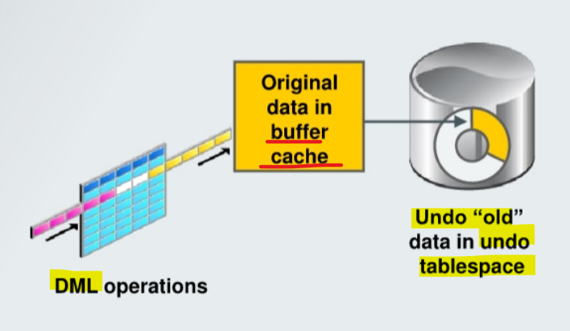
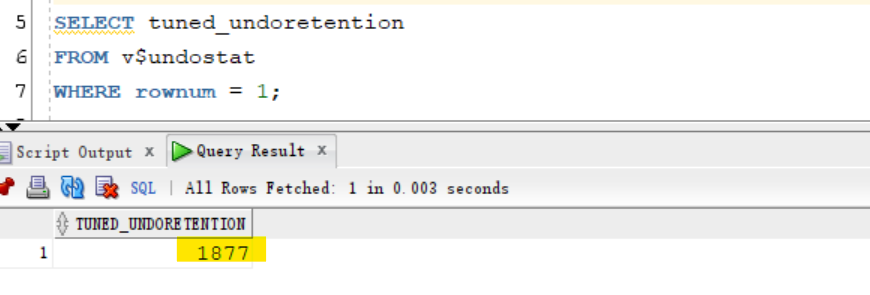
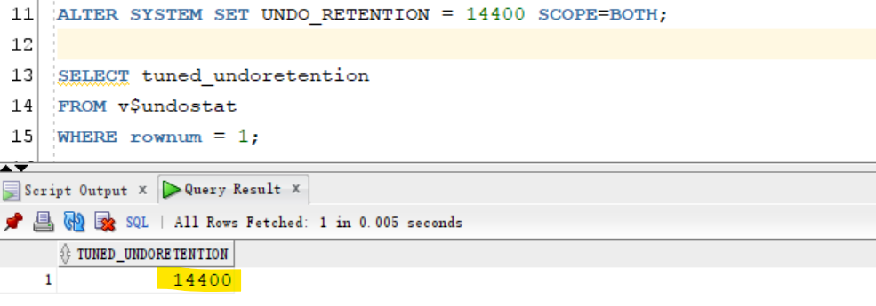
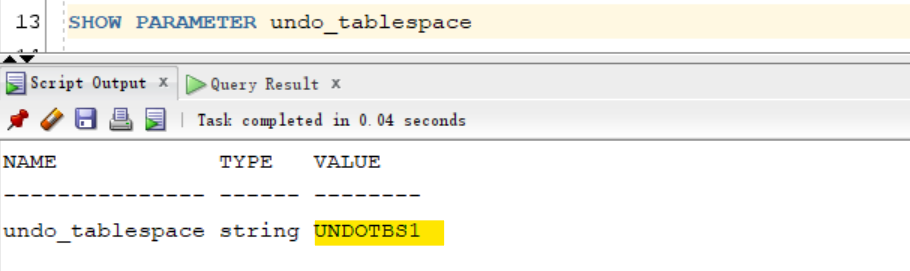
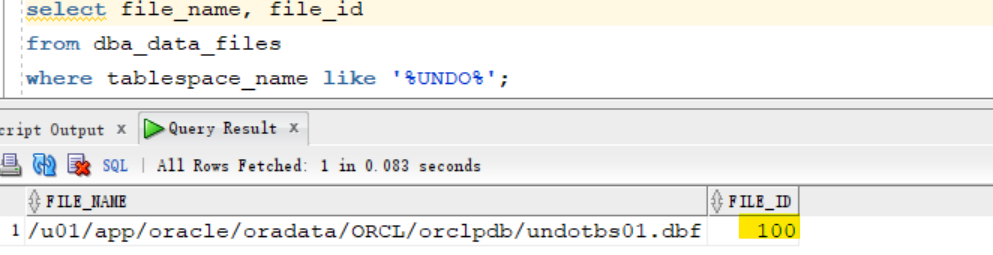
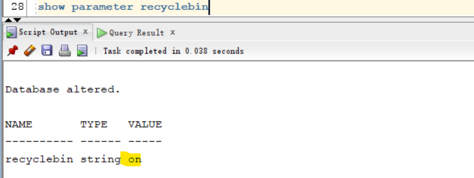

# DBA - Flashback

[Back](../../index.md)

- [DBA - Flashback](#dba---flashback)
  - [Flashback](#flashback)
    - [Error Analysis](#error-analysis)
    - [Error Recovery](#error-recovery)
  - [Review 基础回顾](#review-基础回顾)
    - [Transactions and Undo](#transactions-and-undo)
  - [Best Practices: Undo-Based Flashback Query, Flashback Table](#best-practices-undo-based-flashback-query-flashback-table)
  - [Lab: Preparing to Use Flashback Technologies](#lab-preparing-to-use-flashback-technologies)
    - [Query Undo Data Retention](#query-undo-data-retention)
    - [Set `UNDO_RETENTION` parameters](#set-undo_retention-parameters)
    - [Setup `RETENTION GUARANTEE` of undo tbsp](#setup-retention-guarantee-of-undo-tbsp)
    - [Query whether recycle bin is on](#query-whether-recycle-bin-is-on)

---

## Flashback

- `Flashback` technologies

  - a set of **data recovery solutions** that provide capabilities to **correct human errors** by selectively and efficiently **undoing the effects of a mistake**.
  - can be used when a **logical corruption** occurs in the Oracle database and you need to recover data quickly and easily.
  - supports
    - **viewing past states of data**
    - **winding data** back and forth in time **without** requiring **restoring** the database from backup.

- **Characteristics**:

  - Flashback technologies **support recovery at all levels** including `row`, `transaction`, `table`, and the entire `database`.

- **Benefits**:

  - Flashback makes error recovery much easier by:
    - Enabling you to **view data as of a past point in time**
    - **“Rewinding” unwanted** data changes
    - **Minimizing the time** it takes to correct an error
  - Flashback is **easy** to use and includes simple commands, with no complex procedures.

- **Functionalities**:

  - **Viewing past states** of data
  - **Winding data** back and forth in time
  - Assisting users in **error analysis and recovery**

- Dependencies:
  - Flashback Database: flashback logs
  - Flashback Drop: recycle bin
  - other techniques: undo data

---

### Error Analysis

- `Oracle Flashback Query`:
  - View **all committed data** as it existed at some point in the past.某时间的所有数据
  - `SELECT ... As OF <time_stamp/scn>` clause
- `Oracle Flashback Version Query`:
  - View **committed historical data** for a specific time interval.
  - See all versions of a **row** between two times. 时间段内一行数据的变化
  - See the transactions that changed the row.
  - `SELECT ... VERSIONS BETWEEN` clause
- `Oracle Flashback Transaction Query`:
  - View **changes** made at the **transaction level**.
  - See **all changes** made by a transaction. 某个交易的引起的所有变化

| Scenario Examples                              | Object Level          | Flashback Technology    | Depends On                  |
| ---------------------------------------------- | --------------------- | ----------------------- | --------------------------- |
| Compare current data with data from the past.  | Table                 | Query                   | Undo data                   |
| Compare versions of a row.                     | Table                 | Version Query           | Undo data                   |
| Investigate and back out suspect transactions. | Transaction           | Transaction Query       | Undo/redo from archive logs |
| Audit, compliance, historical reports, ILM     | Table and transaction | Data Archive (Temporal) | Tablespace                  |

---

### Error Recovery

- `Oracle Flashback Database`:
  - **Return the database** to a past time or SCN.
- `Oracle Flashback Table`:
  - **Rewind** one or more **tables** to their contents at a previous time **without affecting other** database objects.
- `Oracle Flashback Drop`:
  - **Reverse the effects of dropping** a table by returning the dropped table from the **recycle bin** to the database along with dependent objects such as indexes and triggers.
- `Oracle Flashback Transaction Backout`:
  - **Roll back** a specific transaction and dependent transactions.

| Scenario Examples                                 | Object Level | Flashback Technology | Depends On     |
| ------------------------------------------------- | ------------ | -------------------- | -------------- |
| Truncate table, undesired multitable changes made | Database     | Database             | Flashback logs |
| Update with the wrong `WHERE` clause.             | Table        | Table                | Undo data      |
| Drop table.                                       | Table        | Drop                 | Recycle bin    |

---

## Review 基础回顾

### Transactions and Undo

该节是回顾 tran 的原理

- query 时, 数据读取到 buffer
- update 时, 会加锁, 旧数据会加载在 undo
  - 当 update 加锁时, 其他用于查询相同数据是, 在 undo 中的旧数据.
- Flashback Technology 则使用 undo 中的数据来恢复到之前某个时间点.

  - undo 中的旧数据都是以往 committed 的数据.
  - Flashback 要求有足够的 undo 空间来存储旧数据.

- When a `transaction` **starts**, it is assigned to an `undo segment`.

  - Throughout the life of the `transaction`, when data is **changed**, the original **“old” values are copied** into the `undo segment`.

- `V$TRANSACTION` view:

  - lists the active transactions in the system.
  - used to view which transactions are assigned to which **undo segments** undo 中的交易

- `Undo segment`

  - specialized **segments** that are automatically created by the instance as needed to **support** `transactions`.
  - Like all segments, `undo segments` are **made up of** `extents`, which, in turn, consist of `undo blocks`.
  - **automatically grow and shrink** as needed, acting as a **circular storage buffer** for their assigned transactions.

- When `transactions` **fill** the `blocks` in their current `undo segment` **extent**, they are assigned another block **in the same** `extent`.
  - If **no free** `blocks` remain in that extent, the transaction acquires a block from the **next** `extent` in the segment.
  - If **all** `extents` are in use, the transaction
    - either wraps around **back into the first** `extent` 要么重新使用第一个
    - or **requests** that a **new** `extent` be allocated to the `undo segment` if by wrapping it would enter an extent containing active undo. 要么要求分配新的



> 1. original data arriving from a `DML` operation
> 2. original data is kept in the `buffer cache` (if not aged out)
> 3. then written to the `undo tablespace`

---

## Best Practices: Undo-Based Flashback Query, Flashback Table

- Use `Undo Advisor` in `Enterprise Manager` to **obtain recommendations** on available **undo retention** for various sizes.
- Use **fixed size undo**:
  - Undo retention is **automatically tuned** for the best possible retention based on `tablespace` **size** and current **system load**.
- Be aware of `DDL` restrictions:
  - Not possible to query in the past if **table structure** is modified.
    - Some `DDL` commands that alter the structure of a table **invalidate** any existing undo data for the table.
    - Commands that drop and modify **columns**, **move tables**, **drop partitions**, and **truncate** table/partition fall into this category.
  - It is **not possible to retrieve** data from a point **before** the execution of these DDL commands.
    - An attempt to do so results in an `ORA-146`6 error.
  - Note that this restriction does **not apply to** `DDL` operations that alter the storage attributes of a table, such as `PCTFREE`, `INITRANS`, and `MAXTRANS`.

---

## Lab: Preparing to Use Flashback Technologies

### Query Undo Data Retention

- Determine **how far** the `undo data` will allow you to flash back transactions in the database.
  - The `V$UNDOSTAT` view contains **up to four days** of statistics, over each 10-minute interval.
  - The first row contains the current (partial) time period statistics.

```sql
sqlplus / as sysdba
ALTER SESSION SET container=orclpdb;
SHOW con_name

SELECT tuned_undoretention
FROM v$undostat
WHERE rownum = 1;
-- Amount of time (in seconds) for which undo will not be recycled from the time it was committed.
```



- Q: What does the value of the TUNED UNDORETENTION time represent?
- A: The **number of seconds** the data is being **retained** in the database at any given time.
  - Default: Undo retention is not guaranteed.
  - If the system needs more space, the Oracle Database server can **overwrite** unexpired undo with more recently generated undo data.

---

### Set `UNDO_RETENTION` parameters

- Set the `UNDO_RETENTION` parameter and `RETENTION GUARANTEE` clause on the undo tablespace to guarantee retention for 24 hours.
  - Change the properties of the tablespace so you will not run out of space in the tablespace.
  - a. Change the `UNDO_RETENTION` parameter to 14400 seconds (4 hours).
  - Note: Increasing the value of `UNDO_RETENTION` to more than a few days can **cause unreasonable growth** of the undo tablespace.

```sql
ALTER SYSTEM SET UNDO_RETENTION = 14400 SCOPE=BOTH;

-- confirm the parameter
SELECT tuned_undoretention
FROM v$undostat
WHERE rownum = 1;
```



- Determine the name of the undo tablespace.

```sql
SHOW PARAMETER undo_tablespace
```



---

### Setup `RETENTION GUARANTEE` of undo tbsp

- Change the `RETENTION GUARANTEE` value of the undo tablespace.

```sql
ALTER TABLESPACE UNDOTBS1 RETENTION GUARANTEE;
```

- Find the names of the data files associated with the UNDOTBS1 tablespace. Note the `FILE_ID` value.

```sql
select file_name, file_id
from dba_data_files
where tablespace_name like '%UNDO%';
```



- Configure the undo tablespace data file to **automatically extend** if more space is needed to keep unexpired undo and active undo records.
  - Use your own `FILE_ID` value instead of `<n>`.

```sql
ALTER DATABASE DATAFILE 100
AUTOEXTEND ON MAXSIZE UNLIMITED;
```

- Q: What happens if undo retention is guaranteed and no more space is available for active undo records (either because the undo tablespace has filled, reached the maximum size, or there is no more space left on the storage device [disk])?
- A: **Transactions fail** due to lack of space in the undo tablespace.

---

### Query whether recycle bin is on

- View the value of the `RECYCLEBIN` parameter, then exit SQL\*Plus.
  Note: ON is the default value.

```sql
show parameter recyclebin
```



---

[TOP](#dba---flashback)
