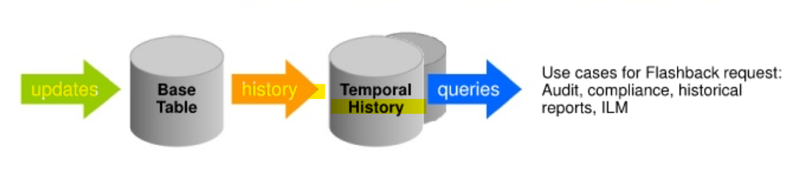
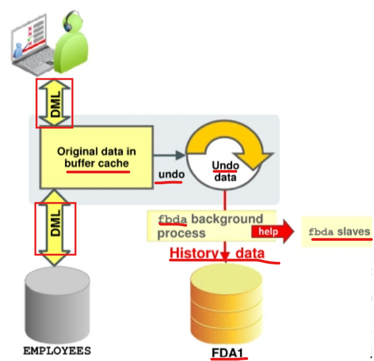
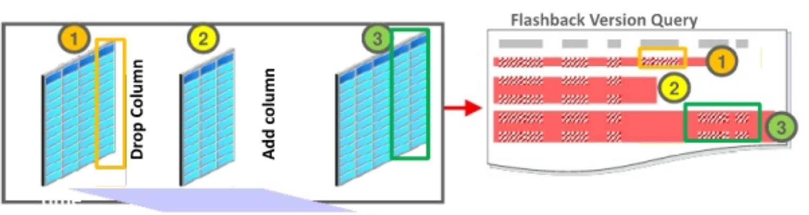
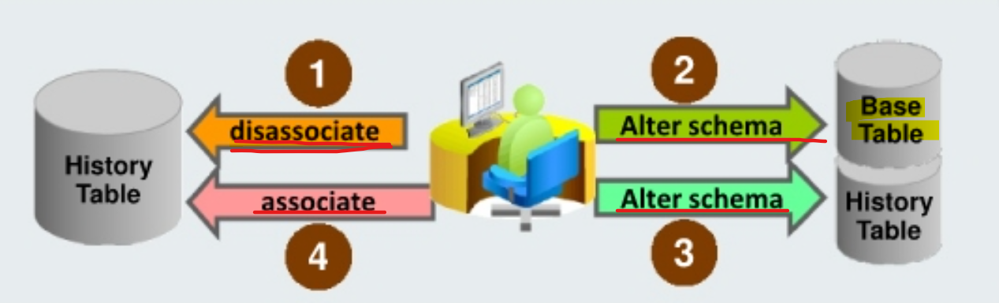
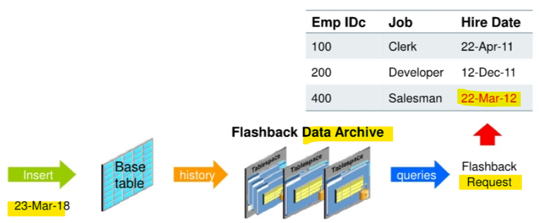
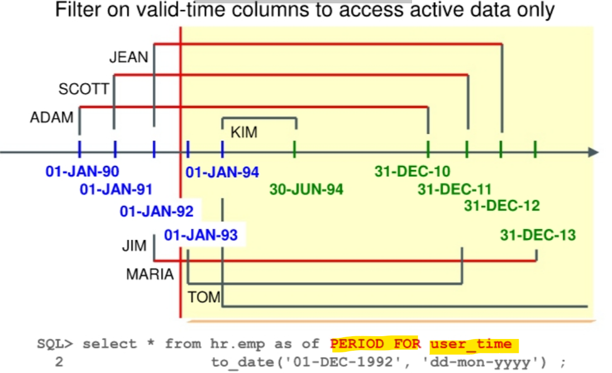
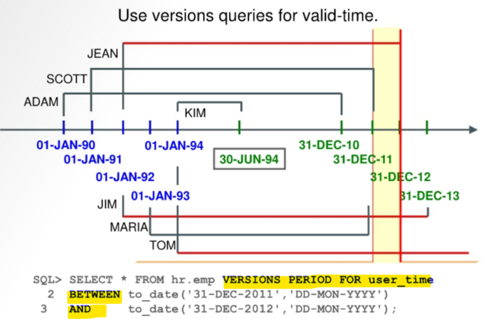

# Flashback - `Flashback Data Archives`

[Back](../../index.md)

- [Flashback - `Flashback Data Archives`](#flashback---flashback-data-archives)
  - [`Flashback Data Archives`](#flashback-data-archives)
    - [Creating a Temporal History and Enabling Archiving](#creating-a-temporal-history-and-enabling-archiving)
    - [How the Flashback Data Archive Works](#how-the-flashback-data-archive-works)
    - [Collecting User Context in Temporal History](#collecting-user-context-in-temporal-history)
  - [Transparent Schema Evolution](#transparent-schema-evolution)
    - [Full Schema Evolution](#full-schema-evolution)
  - [Temporal Validity and History](#temporal-validity-and-history)
    - [Using the PERIOD FOR Clause](#using-the-period-for-clause)
    - [Filtering on Valid-Time Columns](#filtering-on-valid-time-columns)
    - [Using `DBMS_FLASHBACK_ARCHIVE`](#using-dbms_flashback_archive)

---

## `Flashback Data Archives`

Archive 不使用 undo, 而是使用 temporal table/tbsp

- 保留更长的

- `Flashback data archives`:

  - enable to **track and store** all transactional **changes** to a **“tracked” table** over its lifetime.



- Enable at the **table level** with specified **retention period**.

  - Records **older than retention period** are automatically **removed**.

- FDA have **SQL-level access to the versions** of database objects without getting a snapshot-too-old error.

  - All subsequent changes are transparently stored and tamper 干预 proof.

- You can use this technology for **compliance**, **audit reports**, **data analysis**, and **decision-support systems**.
  - It is no longer necessary to build this intelligence into your application.

---

### Creating a Temporal History and Enabling Archiving

- A `flashback data archive` **consists of one or more** `tablespaces`.
- You can have **multiple** `flashback data archives`.
- They are configured with **retention duration**.
  - Based on your **retention duration** requirements, you should **create different archives**
  - e.g.,
    - one for all records that must be kept for two years,
    - another for all records that must be kept for five years.
- The database server will **automatically purge** all historical information on the **day after** the **retention period** expires.

- Steps:

  1. Create a `tablespace` for your `FDA`.
     - The **size** depends on the `base table` and the expected `DML` and `DDL` activity.
  2. Create a `flashback data archive` with **retention time**, by default, with **duplication** and **without compression**.

     - Data archived in FDA is **retained** for the retention time.
     - This task requires the `FLASHBACK ARCHIVE ADMINISTER` **system privilege**.
     - If **different** `retention periods` are needed, **different** `archives` must be created.
     - With the `OPTIMIZE DATA` clause, the flashback data archive is created with **compression** and **deduplication**.

```sql
-- creat a flashback archive named fda1
-- point the fda1 to the tbsp fda_tbs1
-- define a retention as one year
-- use optimize data to enable efficient storage
CREATE FLASHBACK ARCHIVE fda1 TABLESPACE fda_tbs1
OPTIMIZE DATA QUOTA 10M RETENTION 1 YEAR;
```

3. **Enable** the flashback archiving (or disable it) **for a (whole) table**.
   - This task requires the `FLASHBACK ARCHIVE` **object privilege**.
   - By default, flashback archiving is **off** for any table.
   - Although flashback archiving is enabled for a table, some `DDL` statements are **not allowed** on that table.

```sql
-- turn on flashback archive for the table to fda1
ALTER TABLE HR.EMPLOYEES FLASHBACK ARCHIVE fda1;
```

---

### How the Flashback Data Archive Works



- **History data**:

  - Row **captured asynchronously** from `undo` (and `buffer cache`) by the `£dba` background process at self-tuned intervals.
    - default: 5 min
    - The **entire `base table` row** that is **updated** is **stored**, no matter how many columns are updated. 更新的行都会存储
  - **Automatically purged** per `retention policy`

---

- **Storage**:

  - default nonoptimized 没有优化
  - Using `OPTIMIZE DATA` clause:
    - compressed and deduplicated

- `OPTIMIZE DATA` clause:

  - automatically turn on table and LOB **compression** and LOB **deduplication**
  - enable features:
    - Advanced Row table **compression**, SecureFiles Intelligent **Compression**, SecureFiles Intelligent **Deduplication**, and segment-level and row-level ILM **compression**.
    - ILM is enabled to allow new data to be **archived as uncompressed** and over time is **compressed** in the background.
    - Note: If the base table is compressed with **Hybrid Columnar compression**, the table **cannot** be enabled for flashback data archiving.

- FDA `history tables` already compressed and deduplicated in releases **prior to 12.1** are not changed. Their storage **continues** compressed and deduplicated.

- To stop optimization on FDA `history tables`:

  - `ALTER FLASHBACK ARCHIVE flal NO OPTIMIZE DATA;`

---

**Partitions**

- Partitions automatically created based on **time** and **volume** 自动
- `Flashback queries` to the archives **skip unrelated** partitions.

- Each `flashback archive` **partition** is **at least** `1` day and `1 MB` of data, partitioned on `ENDSCN`.

**process** and **slaves**:

- **Up to 10** `flashback archiver` **slaves** can be called upon by the `£bda` process. 最多 10 个
- If the `flashback archive` **process** and **slaves** are too busy, archiving may be performed inline, which significantly **affects the user's response time**.影响客户响应时间

---

### Collecting User Context in Temporal History

- The **user context of a transaction** executed on a table with `Temporal History` is **collected** and **retrievable**.

- `GET SYS CONTEXT (USERENV)` function:
  - get user context of the current session.
- `DBMS_FLASHBACK_ARCHIVE.GET_SYS_CONTEXT` function:
  - used to get **user context**
- `DBMS_FLASHBACK_ARCHIVE.SET_CONTEXT_LEVEL` function:

  - used to set parameter of **user context** collection
  - value:

    - Default: `NONE`, no **user context** is collected.
    - `TYPICAL`: gets **database user ID**, **global user ID**, **client identifier**, **service name**, **module name**, or **host name**.
    - `ALL`

- **Rows** in these tables are **purged** when the **commit time is older than the retention** of the flashback archive with the longest retention.
- Each row of the **user context** can be read **only by the DBA or the owner** of the transaction.

- **Example**:

```sql
EXEC DBMS_FLASHBACK_ARCHIVE.SET_ CONTEXT LEVEL ('TYPICAL')
/
SELECT
    DBMS_FLASHBACK_ARCHIVE.GET_SYS_CONTEXT
    (VERSIONS_XID, 'USERENV', 'SESSION USER'),
    VERSIONS_XID,
    VERSIONS_STARTTIME,
    VERSIONS_ENDTIME,
    employee_id,
    salary
FROM hr.employees VERSIONS BETWEEN SCN MINVALUE
AND MAXVALUE ;
```

---

## Transparent Schema Evolution

- DDL commands supported by `flashback data archives`:

  - Add, drop, rename, and modify **column**
  - Drop and truncate **partition**
  - Rename and truncate **table**

- When a schema has evolved in the above DDL, `Temporal History` technology **automatically keeps track** of the changes.
- `Flashback query` appropriately returns the row or rows **with the corresponding schema**.



---

### Full Schema Evolution

- Disassociate or associate procedures in the `DBMS_FLASHBACK_ARCHIVE` package:

  - **Disable** `Flashback Archive` on specified tables and **allow** more complex `DDL` (upgrades, split tables, and so on).
  - **Enforce schema integrity** during association. (`Base table` and `history table` must be the same schema.)

  - Note: This function should be used with care and with the understanding that the archive **can no longer be guaranteed to be immutable** because the history could have been altered during the time of disassociation.



> 1. If you have the `FLASHBACK ARCHIVE ADMINISTER` privilege, you can **disassociate** the `archive` from the `base table` with the `DTSASSOCTATE_FBA` procedure.
> 2. Make the necessary **changes** to the `base table`.
> 3. Make the necessary **changes** to the corresponding `archive`.
> 4. Then **associate** the `table` with the `archive` within the same schema with the `RESASSOCIATE_FBA` procedure.
>
> - `Temporal History` **validates** that the schemas are the same upon association.

- There is **no transportability** of `history tables`.
- Some DDL statements cause **error** `ORA-55610` when used on a table enabled for FDA.
  - e.g.,
    - ALTER TABLE ...with UPGRADE TABLE clause
    - ALTER TABLE statement that moves or exchanges a partition or subpartition operation
    - DROP TABLE statement

---

## Temporal Validity and History

- Distinguish active from nonactive rows:

  - `Temporal validity`:
  - `Temporal History`: System-managed transaction time in a separate tablespace

- `Temporal validity`:

  - temporal attribute to **annotate 注释 the validity** of a fact recorded in a table with dates or time stamps that are relevant to the underlying business;
    - e.g., the hire date of an employee in HR applications and the effective date of coverage in the insurance industry.
  - User-managed **effective date** in the same table

    - controlled by the **user who defines** the valid-time dimension at table **creation**.创建时定义

  - `Temporal validity` **dates or time stamps** are **different** from the dates or time stamps annotated when the fact **was recorded** in the database.标记的时间不同于录入时间.

- `Temporal History` / `flashback data archive` attributes:

  - The date or time stamp when the fact was recorded in the database
  - system managed.

- Example



> - employee 400 was hired on March 22
> - the row was entered in the HR.EMP table on March 23.
> - 22-MAR-12 is the `valid time temporal` date
> - 23-MAR-12 is the `transaction time temporal` date

- **Benefits**:
  - By using the `valid time temporal` implicit **filter** on the **valid-time dimension**, **queries** can show rows that are **currently valid** or that will be **valid in the future**. 用来过滤时间有效的数据
    - The query is able to **hide** rows whose facts are **not currently valid**.
  - Bi-temporal queries can use both `valid-time temporal` and `transaction time temporal` date.

---

### Using the PERIOD FOR Clause

- `valid-time dimension`:

  - used to keep both **active** and **nonactive** data in the same table.
  - defined at table creation.
  - consists of **two date-time columns**

- `PERIOD FOR` clause

  - **Explicitly define** the two date-time columns.
  - Or **automatic** valid-time columns are created.
    - The database server creates **two hidden columns** using the **name of the valid-time dimension** as a prefix for the names of the two columns.
    - The **valid-time dimension name** is used to drop the dimension if required.
  - To hide valid-time dimension columns, just specify a PERIOD FOR clause name without any date columns.

- Note: A check constraint is automatically added to ensure that the end time is later than the start time. 一个约束会自动生成

- Example

```sql
-- Explicitly define the two date-time columns
CREATE TABLE emp
(
  empno number, salary number, deptid number,
  name VARCHAR2 (100),
  user_time_start DATE, user_time_end DATE,   -- Explicitly define
  PERIOD FOR user_time (user_time_start, user_time_end)
);

-- automatic valid-time columns
CREATE TABLE emp2
(
  empno number, salary number, deptid number,
  name VARCHAR2 (100),
  PERIOD FOR user_time    -- automatic define
  -- name of the valid-time dimension is user_time
  -- USER_TIME is used as the prefix for the two date columns automatically created: USER_TIME_START and USER_TIME_END.
);
```

- Insert rows by **explicitly naming** the valid-time columns.

```sql
-- insert
INSERT INTO emp2
(empno, salary, deptid, name, user_time_start, user_time_end)
VALUES (1,1000,20, 'John', SYSDATE, NULL);

-- query
select EMPNO, user_time_start, user_time_end from emp2;
-- EMPNO  USER_TIME_START                       USER_TIME_END
-- 1      17-AUG-12 09.58.03.000000 AM +00:00
```

---

### Filtering on Valid-Time Columns

- To filter on valid-time columns:

  - Use the `SELECT` statement with the `PERIOD FOR` clause
  - or use the `DBMS_FLASHBACK_ARCHIVE` procedure.

- Return:
  - There is one set of data that is **“valid”** based on its **valid-start** and **valid-end** times and the **query time** (AS OF or undecorated).
  - Alternatively, there is the other set of rows where the **query time falls outside** the **valid-start** and **valid-end times**.
- Both sets of rows data **reside** in the same table.
  - However, by controlling the **visibility of data** to the valid rows, you can **limit** what queries and DMLs affect.
  - Now you can do as-of and **versions queries** for **valid time**. 对有效时间进行版本查询

---

Example:

- Scenario:

  - For each new employee that you inserted in the table, you included the **hire dates**, **valid-time start dates**, and **valid end dates**. The dates represent the activeness of each row. These dates are entered by the application and correspond to valid dates.
  - The time that the rows were **inserted** and **committed** in the table corresponds to the `transaction date`.

---

- Query:
  - You can **filter the active employees** by using the following new `PERIOD FOR` clause.
  - The query displays all active employees who were valid at the **explicit date** of ' 01-DEC-1992", which is the date that belongs to the valid period, that is, between USER_TIME_START and USER_TIME_END.

```sql
select * from hr.emp as of PERIOD FOR user_time
to_date('01-DEC-1992', 'dd-mon-yyyy') ;
```

> 即使用 period for 自动筛选在某个时间点上时间有效的记录.



---

- Query:
  - filter the active employees by using the `VERSIONS PERIOD FOR BETWEEN` clause:

```sql
select * from hr.emp VERSIONS PERIOD FOR user_time
BETWEEN to_date('31-DEC-2011', 'dd-mon-yyyy')
AND to_date('31-DEC-2012', 'dd-mon-yyyy');
```

> The query displays all employees whose `VALID_TIME_START` is less than or equal to '31-DEC-2011'and `VALID_TIME_END` greater than or equal to '31-DEC-2012".



---

- `bi-temporal queries`:

  - mix `valid-time` and `transaction-time` dimensions

- Queries
  - shows rows as of the specified transaction time that are valid now.

```sql
select * from hr.emp
as of period for user time to_date('31-DEC-1992', 'dd-mon-yyyy"')
as of timestamp to_date ('30-mar-2012', 'dd-mon-yyyy');
```

---

### Using `DBMS_FLASHBACK_ARCHIVE`

- Users can **modify visibility** within a session by using the new `DBMS_FLASHBACK_ARCHIVE` **package**.

  - **Visibility control** applies to all SQL `SELECT` and `DML` statements.

- `DDLs` will **default** to getting **full visibility** to the table data.

  - e.g., CTAS, online redefinition, and `ALTER TABLE MOVE` operations will have **full visibility** of the table data.
  - **Hidden columns** are also **visible** to the DDL operations, resulting in preservation of those columns and their data.

- Example:

```sql
-- Set the visibility to data to the full table level, the default temporal table visibility.
DBMS_FLASHBACK_ARCHIVE.ENABLE_AT_VALID_TIME ('ALL')

-- Set the visibility to data valid as of the given time.
-- showing only rows overlapping the given date.
DBMS_FLASHBACK_ARCHIVE.ENABLE_AT_VALID_TIME(
  'ASOF',
  (to_timestamp ('29-SEP-10 05.44.01 PM'))
);

-- Set the visibility to data currently valid within the valid time period at the session level.
DBMS_FLASHBACK_ARCHIVE.ENABLE_AT_VALID_TIME ('CURRENT')

```

[TOP](#flashback---flashback-data-archives)
