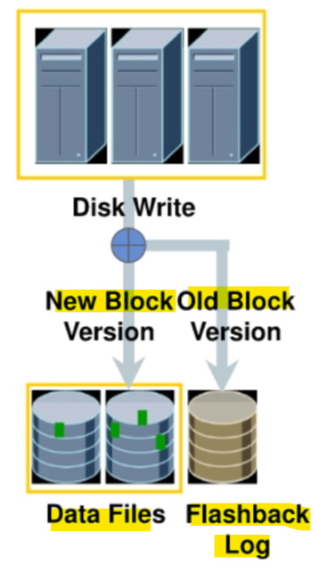
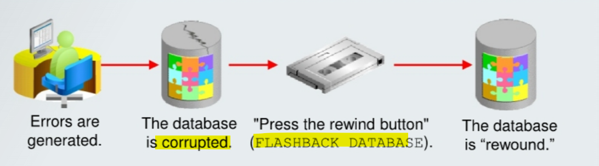
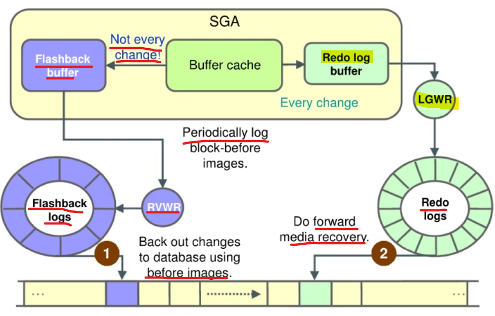
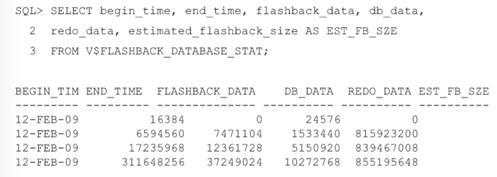
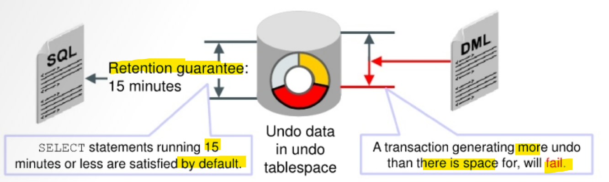
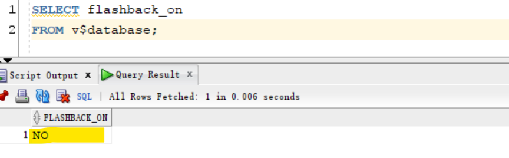
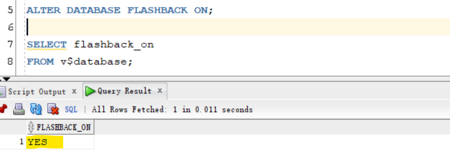
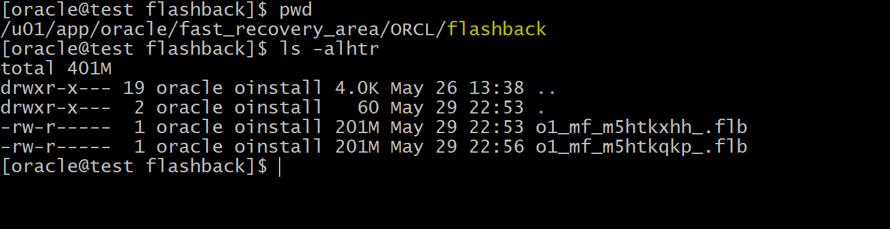
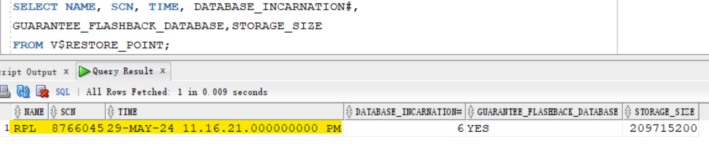

# Flashback - `Flashback Database`

[Back](../../index.md)

- [Flashback - `Flashback Database`](#flashback---flashback-database)
  - [`Flashback Database`](#flashback-database)
    - [Architecture](#architecture)
    - [Flashback CDB and PDB](#flashback-cdb-and-pdb)
    - [Monitoring Flashback Database Information](#monitoring-flashback-database-information)
  - [Configuration for `Flashback Database`](#configuration-for-flashback-database)
    - [Guaranteed retention](#guaranteed-retention)
  - [Enabling Flashback Database](#enabling-flashback-database)
  - [`Guaranteed Restore Points`](#guaranteed-restore-points)
  - [PDB Flashback and Clean Restore Point](#pdb-flashback-and-clean-restore-point)
    - [Normal and Guaranteed Restore Points](#normal-and-guaranteed-restore-points)
    - [Clean Restore Points](#clean-restore-points)
  - [Best Practices](#best-practices)
  - [Lab: Enabling Flashback Logging](#lab-enabling-flashback-logging)
  - [Lab: Performing Flashback Database](#lab-performing-flashback-database)

---

## `Flashback Database`

- `Flashback Database`:

  - a unique database `point-in-time recovery` capability, which enables the **database** to be quickly **“rewound” to a previous point in time**.
  - Flashback Database restores the database **more quickly** than traditional restore and recovery methods, because only the **affected data blocks** are restored and recovered.

- Features:

  - Is a fast **point-in-time recovery** strategy
  - **Eliminates** the need to **restore** a whole database backup
  - Provides **continuous data protection** for the database
  - Optimized: Before-change block **logging**
  - Restores **just changed blocks**
  - **Replays log** to restore the database to the desired time
  - Provides **fast** recovery: Minutes, not hours
  - Requires a single command to restore:
    - e.g., `FLASHBACK DATABASE TO '2:05 PM'`

- `flashback logs`
  - used by `Flashback Database` to record old block versions.



> - When writes are issued to disk and Flashback Database is enabled:
>   - old block version is written to the flashback log
>   - the new block version is written to the data file

- When the `FLASHBACK DATABASE` command is issued, **only the changed blocks are retrieved** from the `flashback logs`.
  - The blocks are then **recovered** with the appropriate `archived logs` to the required point in time.

---



- With Flashback Database, you can quickly bring your database to an earlier point in time **by undoing all the changes** that have taken place since that time.

  - This operation is fast because you **do not need to restore** backups.
  - You can use this feature to undo changes that have **resulted in logical data corruptions**.可以解决逻辑错误

- When you use Flashback Database, Oracle Database server **uses past block images** to back out changes to the database.
  - During normal database operation, Oracle Database server occasionally **logs these block images** in `flashback logs`.
- `Flashback logs` are **written sequentially** and are **not archived**.
- Oracle Database server **automatically** creates, deletes, and resizes `flashback logs` in the `fast recovery area`.

  - You need to be aware of flashback logs only for monitoring **performance** and deciding **how much disk space** to allocate for them in the fast recovery area.需要注意性能和磁碟空间

- The **time it takes to rewind** a database with Flashback Database is **proportional to how far back in time** you need to go and the **amount of database activity** after the target time.
  - The time it would take to restore and recover the whole database could be much longer.
  - The `before images` in the `flashback logs` are **used only to restore** the database to a point in the past, and **forward recovery** is used to bring the database to a consistent state at some time in the past.

---

### Architecture



- When you **enable** `Flashback Database`, the `RVWR (Flashback Writer)` background process is started.

  - This background process sequentially **writes** `Flashback Database` **data** from the `flashback buffer` to the `Flashback Database logs`, which are **circularly reused**.
  - Subsequently, when a `FLASHBACK DATABASE` command is issued, the `flashback logs` are used to **restore** to the blocks’ `before images`, and then `redo data` is used to **roll forward** to the desired flashback time.
  - 左边是 RVWR, 周期性生成 before image; 右边的 redo, 平时与一般 redo 一样.
  - 恢复时, 先恢复 before image, 然后用 redo 前滚
    - 与 restore+recovery 类似, 但由于 before image 是周期性形成,而 redo 中的数据是新近的数据, 所以 flashback 恢复快
    - 但会有开销问题, 因为要周期性生成. 而开销只与写有关, 写越多, 开销越大.

- The **overhead** of enabling Flashback Database depends on the **read/write mix** of the database **workload**.
  - Because **queries** do **not** need to **log** any flashback data, the **more write-intensive** the workload, the **higher** the overhead of turning on Flashback Database. 查询无需记录到闪回; 写越多, 开销越大

---

### Flashback CDB and PDB

**CDB**:

- **cannot** flash back the `CDB root` **without** flashing back the **entire** `CDB`.CDB 整体性

---

**PDB**:

- can flash back a `PDB`.
- **All** `datafiles` belonging to a PDB can be flashed back and recovered **in place**.
- All `undo` application that is needed to make a PDB consistent after flashback is applied **in place**.
- After a `PDB` flashback operation, the **old** backup of the PDB is **still valid**. 闪回后,旧备份还可用.

```sql
CONN sys@pdbl
-- close pdb
ALTER PLUGGABLE DATABASE CLOSE;
-- flashback pdb to a scn
FLASHBACK PLUGGABLE DATABASE pdbl TO SCN 411010;
-- open pdb resetlogs
ALTER PLUGGABLE DATABASE pdbl OPEN RESETLOGS;
```

> - `OPEN RESETLOGS` creates a **new incarnation** for the `PDB`.
> - The `CDB` root **must be opened** when the PDB `OPEN RESETLOGS` is performed, except that recovering a PDB **to a point in time** does **not affect all parts** of the `CDB`. The whole CDB and all other PDBs are opened.
> - After recovering a PDB to a specified point in time, when you open the PDB by using the RESETLOGS option, a new incarnation of the PDB is created.

- PDB RESETLOGS 原理:

  - The PDB `RESETLOGS` option does **not** perform a `RESETLOGS` for the `CDB`.独立性
    - A PDB record in the `control file` is updated.
  - Each `redo log` record carries the `PDB ID` in the **redo header**.头会记录 pdb_ID

    - This is how recovery knows which redo applies to which PDB.
    - Redo logs are shared by all PDBs;
    - redo from **each** PDB is written to a** single set** of **redo logs**.
    - Conceptually, a PDB `OPEN RESETLOGS` is similar to a database `OPEN RESETLOGS`.

  - This is very useful when a **user error** has been issued, for example, a DROP USER.
    - Instead of restoring and recovering the PDB, flashback to the time before the user error had been issued is easy.基于以上原理, 可以容易恢复用户错误.

- `V$PDB_INCARNATION` view:
  - displays information about all PDB incarnations.

---

- Alternative solution

  - In situations where you **cannot use** the `Flashback Database` feature, you **should use** an `incomplete recovery` operation to return the database to a specific time. 如果不能闪回, 则执行 PITR
  - After the Flashback Database operation is complete, you can open the database in read-only mode to verify that the correct target time or SCN was used.
    - If not, you can **flash back the database again** or **perform a recovery to roll forward** the database. 如果只读打开后发现不正确, 可以再次闪回或前滚恢复.

- When the Flashback Database operation **completes**, **open** the database:

  - In **read-only mode**, to **verify** that the correct target time or SCN was used
  - With a `RESETLOGS` operation to allow DML

- **Cannot Flashback when**:
  - The `control file` has been **restored or re-created**.
  - A `tablespace` has been **dropped**.
    - You **cannot** use `Flashback Database` to recover a `data file` that **was dropped** during the span of time you are flashing back.
    - The **dropped data file** is added to the `control file` and marked **offline**, but it is not flashed back.
  - A `data file` has been **reduced in size**. 减少不能
- You can use Flashback Database with `data files` that you have configured for **automatic extension**. 自动扩展可以
- Use the `TO BEFORE RESETLOGS` clause to flash back to before the **last** `RESETLOGS` operation.

- The `flashback retention target` is **not an absolute guarantee** that flashback will be available.
  - If space is needed for required files in the `fast recovery area`, `flashback logs` may be deleted automatically. 如果 fra 空间不足, log 可能被删除

---

### Monitoring Flashback Database Information

- Must **monitor space usage** of the `fast recovery area` to know how well you are meeting your `retention target`. FRA 的空间大小直接影响 retention target

---

- `V$FLASHBACK_DATABASE_LOG` view

  - monitor the Flashback Database retention target:

  - `ESTIMATED_FLASHBACK_SIZE`:

    - uses previously logged flashback data to provide an **estimate of how much disk space is needed in the `fast recovery area`** for flashback logs to meet the current flashback retention target.
    - The estimate is **based on the workload** since the instance was **started** or during the most recent **time interval** equal to the flashback retention target, whichever is **shorter**.

    - `FLASHBACK_SIZE`:
      - gives you the **current size**, in bytes, of the flashback data.

  - `OLDEST_FLASHBACK_SCN` and `OLDEST FLASHBACK_TIME`:
    - display the approximate **lowest SCN and time** to which you can flash back your database.

```sql
-- View the fast recovery area disk quota:
SELECT estimated_flashback_size, flashback_size
FROM V$FLASHBACK_DATABASE_LOG;

-- Determine the current flashback window:
SELECT oldest _flashback_scn, oldest_flashback_time
FROM V$FLASHBACK DATABASE_LOG;
```

---

- `V$FLASHBACK_DATABASE_STAT` view
  - monitor the **overhead of logging** flashback data in the Flashback Database logs.
  - contains **24 hours** of information, with **each row** representing a **one-hour** time interval.
  - You can use this view to determine rate changes in the flashback data generation.

```sql
-- Monitor logging in the Flashback Database logs:
SELECT *
FROM V$FLASHBACK DATABASE_STAT;
```

Example:



- Based on this information, you may need to adjust the `retention time` or the `fast recovery area` size.
- `FLASHBACK_DATA` and `REDO_DATA` represent the number of bytes of **flashback data** and **redo data** written, respectively, **during the time interval**
- `DB_DATA` gives the number of bytes of **data blocks read and written**.
- This view also contains the **estimated flashback space needed** for the interval.

---

- `V$RECOVERY_FILE_DEST` view:
  - display information regarding the fast recovery area.

| Column              | Description                                                                                                                                        |
| ------------------- | -------------------------------------------------------------------------------------------------------------------------------------------------- |
| `NAME`              | Fast recovery area name, indicating **location** string                                                                                            |
| `SPACE_LIMIT`       | Disk limit specified in the `DB_RECOVERY_FILE_DEST_SIZE` **parameter**                                                                             |
| `SPACE_USED`        | **Space used** by fast recovery area files (in bytes)                                                                                              |
| `SPACE_RECLAIMABLE` | Amount of space that **can be reclaimed** by deleting obsolete, redundant, and other **low-priority files** through the space management algorithm |
| `NUMBER_OF_FILES`   | Number of files                                                                                                                                    |

---

## Configuration for `Flashback Database`

- Configuaration to enable flashback features for an application:

  - Grant `FLASHBACK` privileges.
    - Grant **flashback privileges** to **users**, **roles**, or **applications** that need to use flashback features
  - `undo` settings:
    - `UNDO_TABLESPACE='UNDOTBSL1'`: Setup undo tbsp
    - `UNDO_MANAGEMENT='AUTO'`
    - `UNDO_RETENTION=900`: define what is the amount of time to keep data in your undo tablespace
    - Guaranteeing undo retention

- Have an undo tablespace with **enough space** to keep the required data for flashback operations.
  - The **more often** users update the data, the **more space** is required.

---

- Undo retention:

  - - For an automatically extensible undo tablespace (**default**), the Oracle database **retains undo data** to satisfy at a **minimum**: 最小保留期由以下两个决定

  - the **retention periods** needed by **the longest-running query**
  - the **threshold** of `undo retention`, specified by the `UNDO_RETENTION parameter`.

- `V$UNDOSTAT.TUNED_UNDORETENTION`:

  - determine the **amount of time** for which undo is **retained** for the current undo tablespace.

```sql
SELECT TUNED_UNDORETENTION
FROM V$UNDOSTAT
WHERE rownum = 1;
```

- `UNDO_RETENTION` parameter:

  - specifies (in seconds) the low threshold value of undo retention.
  - Default:
    - `900`

```sql
show parameter undo_retention
-- NAME           TYPE    VALUE
-- -------------- ------- -----
-- undo_retention integer 14400

ALTER SYSTEM SET UNDO_RETENTION=900 SCOPE=BOTH;
```

---

### Guaranteed retention

- Setting the `UNDO_RETENTION` parameter **does not guarantee** that unexpired undo data is **not overwritten**.

  - The default undo behavior is to **overwrite committed transactions** that have not yet expired rather than to allow an active **transaction to fail** because of lack of undo space.
  - In case of conflict, transactions have precedence over queries.
    - This behavior can be changed by `guaranteeing retention`.事务优先于查询, 除非保证保留

- `guaranteed retention`:
  - ensure that **unexpired undo data** is not **discarded**.
  - `undo retention` settings are **enforced** even if they cause transactions to fail.
    - So in case of conflict, queries have precedence over transactions. 结果: 查询优先



- By configuring `retention guarantee`, ongoing operations that need undo space in the segments of the tablespace may **fail** due to **lack of space**.
- To satisfy **long retention** requirements, create a `Temporal History`.

- `RETENTION GUARANTEE`:
  - a tablespace attribute rather than an initialization parameter.

```sql
-- Enable guaranteed retention
ALTER TABLESPACE undotbsl RETENTION GUARANTEE;

-- Disable guaranteed retention
ALTER TABLESPACE undotbsl RETENTION NOGUARANTEE;
```

---

## Enabling Flashback Database

- `Flashback Database` Configuration:

  1. Configure the fast recovery area (FRA).
  2. Set the **retention target** with the `DB_FLASHBACK_RETENTION_TARGET` initialization parameter.

     - can **specify an upper limit**, in **minutes**, on **how far back** you want to be able to flash back the database.
     - This parameter is only a target and does not provide any guarantee.
     - The `flashback time interval` **depends on** how much flashback data has been kept in the `fast recovery area`.

     ```sql
     -- uses 2,880 minutes, which is equivalent to two days.
     ALTER SYSTEM
     SET DB_FLASHBACK_RETENTION_TARGET=2880 SCOPE=BOTH;
     ```

  3. Enable Flashback Database

     ```sql
     -- enable flashback database
     ALTER DATABASE FLASHBACK ON;

     -- disable flashback database
     ALTER DATABASE FLASHBACK OFF;

     -- query whether Flashback Database is enabled
     SELECT flashback_on
     FROM v$database;
     ```

---

- `FLASHBACK DATABASE` command:

  - to execute the Flashback Database operation.

- RMAN Command:
  - `SEQUENCE` and `THREAD` option:
    - to specify a `redo log sequence` number and `thread` as a **lower limit**.
    - RMAN selects only files that can be used to flash back to, but **not including**, the specified sequence number.

```sql
-- rman, moun the database
-- to time
FLASHBACK DATABASE TO TIME = "TO_DATE('2009-05-27 16:00:00", 'YYYY-MM-DD HH24:MI:SS')";
-- to scn
FLASHBACK DATABASE TO SCN=23565;
-- to sequence and thread
FLASHBACK DATABASE TO SEQUENCE=223 THREAD=1;
```

- SQL Command:

```sql
-- sql
-- to timestampe
FLASHBACK DATABASE TO TIMESTAMP (SYSDATE-1/24) ;
-- to scn
FLASHBACK DATABASE TO SCN 53943;
--  to restore point
FLASHBACK DATABASE TO RESTORE POINT bd_load;

-- To review changes: Open in read-only mode.
-- To finalize: Open in read/write mode with RESETLOGS.
```

---

## `Guaranteed Restore Points`

- `Guaranteed Restore Points`:

  - An **aliases** for SCNs in recovery operations.
  - used to ensure that you can perform a FLASHBACK DATABASE command to that SCN at any time.

- `restore points` vs `guaranteed restore points`:

  - Both alias
  - Difference:
    - `guaranteed restore points` **never age out** of the `control file` 不会自动过期
    - `guaranteed restore points` must be **explicitly dropped**. 必须显示删除

- Creating a `guaranteed restore` point at a particular SCN **enforces the requirement**强制要求 that you can perform a Flashback Database operation to return your database to its state at that SCN, even if `flashback logging` is **not enabled** for your database. 即使没有 logging, 都强制要求可以闪回到那个点.

  - If `flashback logging` is **enabled**, creating a `guaranteed restore point` enforces the retention of `flashback logs` required for Flashback Database **back to any point in time after** the creation of the **earliest** g`uaranteed restore point`.可以返回最早返回点之后任意时间点.

- A `guaranteed restore point` can be used to **revert** a whole database to a known good state days or weeks ago, as long as there is **enough disk space** in the `fast recovery area` to store the needed logs.只要空间足够, 可以长达数周
- As with normal `restore points`, `guaranteed restore points` can be used to specify a point in time for `RECOVER DATABASE` operations. 可以用作恢复点

- Limitations that apply to Flashback Database also apply to guaranteed restore points.
  - For example, shrinking a data file or dropping a tablespace can prevent flashing back the affected data files to the guaranteed restore point. 闪回的适用性前置与恢复点.

```sql
CREATE RESTORE POINT before upgrade
GUARANTEE FLASHBACK DATABASE;
```

---

- Prerequisites to use guaranteed restore points:

  - The database must be in `ARCHIVELOG` mode.
  - `FLASHBACK DATABASE` requires the **use** of `archived redo logs` starting from the time of the restore point.
  - A `fast recovery area` must be configured.
    - because Oracle Database server stores the required logs in the fast recovery area.

- When creating the **first** `guaranteed restore point` (or if all previously created guaranteed restore points have been dropped) and Flashback Database is not enabled

  - the database must be **mounted, not open**.

- `Logging` for Flashback Database and `guaranteed restore points` involves capturing **images** of `data file blocks` before changes are applied.
  - The FLASHBACK DATABASE command can **use these images to return the data files** to their previous state.
- The main **difference** between **normal** `flashback logging` and **logging** for `guaranteed restore points` is **whether the logs can be deleted** in response to **space pressure in the fast recovery area**. 普通的闪回 logging 会被删除; 保证恢复点的 logging 不会, 即使 fra 空间不够.

  - This difference affects space usage for logs and database performance.

- If you **enable** Flashback Database and **define** one or more `guaranteed restore points`, then the database performs **normal** `flashback logging`.
  - In this case, the recovery area **retains** the `flashback logs` required to flash back to any arbitrary time between the **present** and the **earliest currently defined** `guaranteed restore point`.
  - `Flashback logs` are **not deleted** in response to space pressure if they are required to satisfy the guarantee.

---

## PDB Flashback and Clean Restore Point

### Normal and Guaranteed Restore Points

- `PDB` **normal** and `guaranteed restore points` are **restore points** that pertain to only a specific PDB and are visible within the PDB only. 只作用于 PDB

  - **Normal** `PDB restore point` is essentially a **bookmark** for a past point for that PDB.
  - `guaranteed PDB restore point` **guarantees** a PDB flashback to that restore point.

- `PDB flashback` uses `PDB point-in-time recovery` to **recover** the `shared undo`.
- RMAN **automatically** **restores** the `shared undo` and certain tablespaces in a clone instance and **recovers** the data to the same point in time.

---

### Clean Restore Points

- `clean PDB restore point`:

  - can be created after a PDB is **closed** with no outstanding transactions and **ONLY** in `shared undo` mode.
    - Thus, flashing back a PDB to a `clean restore point` is **faster** than other types of flashback
    - because it does **not require restoring** backups or creating a clone instance.
    - e.g., a DBA expecting to roll back an application upgrade should consider **creating a clean PDB guaranteed restore point before** the application upgrade.

- Benefits:

  - **Faster** than other types of PDB flashback
    - No restore of any backup
    - No clone instance created
  - No need to take a new backup

- `CDB restore point`:

  - A restore point that is created while being **connected to the CDB root without** specifying the new `FOR PLUGGABLE DATABASE` clause.

- If the `PDB` is the **application root of an application container**, all `restore points` are “clean” with **local undo**

  - because the availability of local undo means that the **effects of active transactions** at the time of the restore point **can be undone**.

- Caution: `PDB guaranteed restore points` can potentially result in Oracle **running out of space** in the FRA. The DBA should **remove** PDB guaranteed restore points when the PDB flashback operations are completed. 必须在恢复后删除保证点

- Example:

```sql
-- sql
CONNECT / AS SYSDBA
ALTER PLUGGABLE DATABASE pdbl CLOSE;
-- create clean restore point
CREATE CLEAN RESTORE POINT start_stepl
FOR PLUGGABLE DATABASE pdbl
GUARANTEE FLASHBACK DATABASE;

ALTER PLUGGABLE DATABASE pdbl OPEN;
/*
some issues
*/
ALTER PLUGGABLE DATABASE pdbl CLOSE;

-- rman
rman target /
FLASHBACK PLUGGABLE DATABASE pdbl TO RESTORE POINT start_stepl;
ALTER PLUGGABLE DATABASE pdbl OPEN RESETLOGS:
```

---

## Best Practices

- Tune `fast recovery area` storage.
  - Use `ASM`, configure enough disk **spindles**, and so forth.
- Use **physical standby database** to test flashback logging.
- Use `V$FLASHBACK_DATABASE_LOG` to **size log space**, after running workload that runs longer than the flashback retention period.
- Create `guaranteed restore point (GRP)` **without** enabling flashback logging.

  - It **saves disk space** for workloads where the same blocks are repeatedly updated.
  - **Drop** GRP to immediately reclaim space.

- To achieve good **performance** for large production databases by using Flashback Database, Oracle recommends the following:

  - Use a **fast file system** for your `fast recovery area`, preferably **without operating system file caching**.
    - Files that are stored in the `fast recovery area`, including `flashback logs`, are typically **large**.
    - **Operating system file caching** is typically **not effective** for these files and may actually add CPU **overhead** due to reading from and writing to these files.
    - Use a file system such as ASM.
  - Configure enough **disk spindles 纺锤** for the file system that will hold the fast recovery area.
    - **Multiple** disk spindles may be needed to support the disk throughput required for Oracle
      Database server to **write** the flashback logs effectively.
  - If the **storage system** used to hold the `fast recovery area` does **not** have **nonvolatile RAM**, try to configure the file system on top of striped storage volumes with a relatively small stripe size such as 128 K.
    - This enables each **write** to the `flashback logs` to be spread across multiple spindles, thereby improving performance.
  - Set the `LOG_BUFFER` initialization **parameter** to at **least 8 MB**.
    - This ensures that Oracle Database server allocates the **maximum amount of memory** (typically 16 MB) for writing `flashback database logs`.

- `Flashback retention` should be set to **at least 60 minutes**.

  - Oracle Database server writes a **metadata marker** into the flashback logs approximately **every 30 minutes**.
    - If the flashback retention is set to **less than 60 minutes**, a needed marker could be **deleted** if there is space pressure in the flashback log.

- A `restore point` is a **user-defined name** that is associated with a database point in time.
  - It is used with **Flashback Database**, **Flashback Table**, and **RMAN**.
- A `guaranteed restore point (GRP)` is a special type of `restore point` that ensures `flashback logs` are **kept until** the restore point is used or deleted.
  - When flashback logging is **enabled**, `flashback logs` are generally created **in proportion to** `archived redo logs` generated during the same retention period.
  - When flashback logging is disabled and a `GRP` is created, each **changed block** is **logged only once** to maintain the GRP.
  - There is **continuous logging of blocks** when flashback logging is **enabled**.
  - To save space, you can create a `GRP` for fast recovery of a specific set of transactions such as a batch job and then delete the GRP to reclaim the space.

---

## Lab: Enabling Flashback Logging

- Query whether flashback logging is enabled

```sql
sqlplus / as sysdba

SELECT flashback_on
FROM v$database;
```



- Enable flashback logging and verify
  - files are created in FRA

```sql
sqlplus / as sysdba
-- enable flashback
ALTER DATABASE FLASHBACK ON;

-- query
SELECT flashback_on
FROM v$database;
```




- back up your orclpdb database, remove obsolete backups, and ensure that no failures are listed. Then exit RMAN.

```sql
rman target "'/ as sysbackup'"

BACKUP DATABASE PLUS ARCHIVELOG DELETE INPUT;
delete noprompt obsolete;

list failure;
exit
```

- create a guaranteed restore point

```sql
-- create guarenteed restore point
CREATE RESTORE POINT rpl GUARANTEE FLASHBACK DATABASE;

-- confirm
SELECT NAME, SCN, TIME, DATABASE_INCARNATION#,
GUARANTEE_FLASHBACK_DATABASE,STORAGE_SIZE
FROM V$RESTORE_POINT;
```



---

## Lab: Performing Flashback Database

- perform flash back pluggable database after some incorrect updates to the database.

---

- Get the current SCN

```sql
sqlplus / as sysdba

ALTER SESSION set container=orclpdb;

SELECT current_scn
FROM v$database;
-- 8767254
```

- Query column before lab

```sql
SELECT sum (salary)
FROM hr.employees;

SELECT count (*)
FROM hr.employees
WHERE department_id=90;
```

- Update tables in the HR schema.

```sql
update hr.employees
set department_id = 90
where job_id = 'IT_PROG';
-- 5 rows updated.

update hr.employees e
set salary = least(e.salary,
(select (min_salary + max_salary)/2 * 1.10
from hr.jobs j
where j.job_id = e.job_id))
where job_id not like 'AD_%';
-- 103 rows updated.

COMMIT;

SELECT current_scn
FROM v$database;
-- 8767447
```

- Query after transactions

```sql
SELECT sum(salary)
FROM hr.employees;
-- 679092.4

SELECT count(*)
FROM hr.employees
WHERE department_id=90;
-- 8
```

- Close pdb

```sql
ALTER SESSION set container=cdb$root;

ALTER PLUGGABLE DATABASE orclpdb CLOSE;
```

- Flashback database

```sql
FLASHBACK PLUGGABLE DATABASE orclpdb TO SCN 8767254;
```

- Open pluggable database

```sql
-- Attempt to open the pluggable database orclpdbl.
ALTER PLUGGABLE DATABASE orclpdb OPEN;
/* Error starting at line : 87 in command -
ALTER PLUGGABLE DATABASE orclpdb OPEN
Error report -
ORA-01113: file 109 needs media recovery
ORA-01110: data file 109: '/u01/app/oracle/oradata/ORCL/orclpdb/bctbs01.dbf'
01113. 00000 -  "file %s needs media recovery"
*Cause:    An attempt was made to online or open a database with a file that
           is in need of media recovery.
*Action:   First apply media recovery to the file. */


-- optional: open in read-only mode to verify
ALTER PLUGGABLE DATABASE orclpdb OPEN READ ONLY;
ALTER SESSION set container=orclpdb;
-- do som query to verify

-- Open the pluggable database orclpdbl using the reset logs option.
ALTER PLUGGABLE DATABASE orclpdb OPEN RESETLOGS;
```

- Verify data to confirm flashback

```sql
ALTER SESSION set container = orclpdb;
show con_name

SELECT sum(salary)
FROM hr.employees;
-- 691416

SELECT count(*)
FROM hr.employees
WHERE department_id=90;
-- 3
```

- Cleanup
  - drop grp

```sql
ALTER SESSION set container=cdb$root;

-- drop restore point
DROP RESTORE POINT rpl;
-- note: rpl is in cdb root.

-- confirm
SELECT NAME, SCN, TIME, DATABASE_INCARNATION#,
GUARANTEE_FLASHBACK_DATABASE,STORAGE_SIZE
FROM V$RESTORE_POINT;
```
