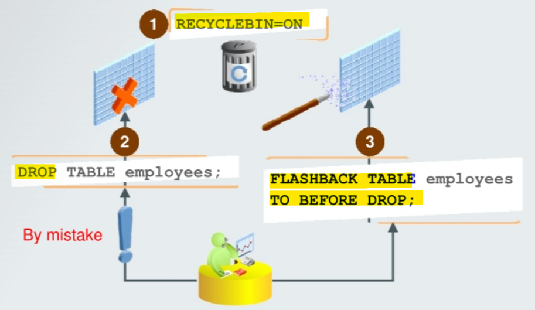
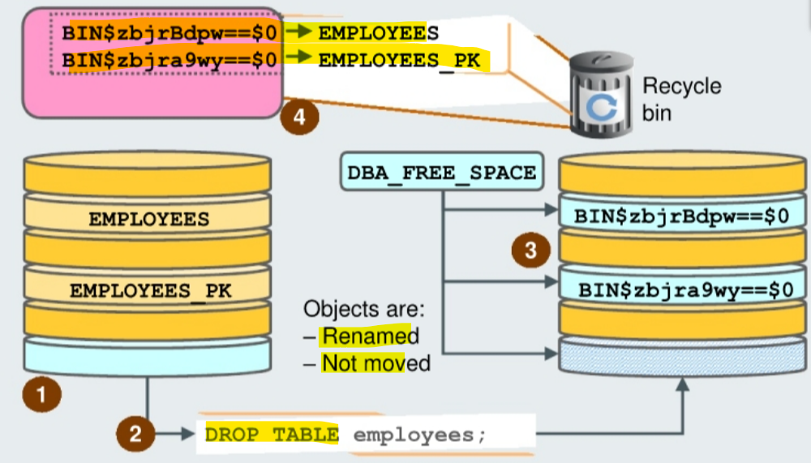

# Flashback - `Flashback Drop`

[Back](../../index.md)

- [Flashback - `Flashback Drop`](#flashback---flashback-drop)
  - [`Flashback Drop`](#flashback-drop)
  - [Recycle Bin](#recycle-bin)
  - [Bypassing the Recycle Bin](#bypassing-the-recycle-bin)
    - [Disable `Recycle Bin`](#disable-recycle-bin)

---

## `Flashback Drop`

- `Flashback Drop`:

  - can undo the effects of a `DROP TABLE` statement without having to use point-in-time recovery



- `RECYCLEBIN` initialization parameter:

  - used to control whether the `Flashback Drop` capability is turned on or OF.
  - Value:
    - `ON`: Default, dropped tables go into the recycle bin and can be recovered.
    - `OFF`: dropped tables do not go into the recycle bin.

- `FLASHBACK TABLE ..TO BEFORE DROP` command

---

## Recycle Bin

- If the `recycle bin` is **not enabled** and you **drop** a table, the **space** can **immediately be used** for other objects.
- If the `recycle bin` is **enabled** and you **drop** a table, the **space** associated with the table and its dependent objects is **not immediately reclaimable**, even though it does appear in `DBA_FREE_SPACE`.

  - Instead, the **dropped objects are referenced** in the `recycle bin` and **still belong to** their owner.
  - The space used by `recycle bin` objects is **never automatically reclaimed** unless there is space pressure. This enables you to recover `recycle bin` objects for the maximum possible duration.

- When a **dropped table is “moved”** to the `recycle bin`, the table and its associated **objects and constraints** are **renamed** using **system-generated names**.

  - The renaming convention is: `BINS$unique_id$version`, where unique id is a 26-character globally unique identifier for this object making the `recycle bin` name **unique** across all databases and version is a version number assigned by the database.

- The `recycle bin` itself is a **data dictionary table** that maintains the relationships between the **original names of dropped objects** and their **system-generated names**. 回收站本质上是数据字典来维护被删除对象的原来名和系统生成名.

- `DBA_RECYCLEBIN` view:
  - displays information about all recycle bins in the database.



> 1.  You have created a table called EMPLOYEES in your tablespace.
> 2.  You drop the EMPLOYEES table.
> 3.  The extents occupied by EMPLOYEES are now considered as free space.
> 4.  EMPLOYEES is **renamed** and the **new name is recorded into** the recycle bin.

---

## Bypassing the Recycle Bin

- `DROP TABLE PURGE` command:

  - permanently **drop** a table and **its dependent objects** from the database. 及其依赖对象
  - the corresponding objects are **not moved to the recycle bin**.

- `DROP TABLESPACE ... INCLUDING CONTENTS` command:

  - the objects in the tablespace are **not placed** in the `recycle bin`. 表空间会被直接删除
  - objects in the `recycle bin` belonging to the tablespace are purged. 该表空间相关的在回收站的对象也会被删除.

- `DROP TABLESPACE` command:

  - the tablespace must be empty for the command to succeed. 表空间必须是空
  - there can be objects belonging to the tablespace in the `recycle bin`. 表空间可以包含在回收站的对象
    - In this case, these objects are purged. 回收站的对象会被删除

- `DROP USER ... CASCADE` command
  - the `user` and **all the objects owned** by the user are **permanently dropped** from the database.
  - Any objects in the `recycle bin` belonging to the dropped user are purged. 回收站中的关联对象会被删除.

---

### Disable `Recycle Bin`

- Security considerations for the recycle bin:

  - e.g., if the current object is **encrypted**, but the **dropped object** is in clear text, potentially showing sensitive. 对象被加密, 但回收站的对象没有加密, 则可以不启用回收站.

- Steps:

```sql
sqlplus / as sysdba

-- View the recycle bin status
SHOW PARAMETER RECYCLEBIN
-- Disable the use of the recycle bin
ALTER SYSTEM SET RECYCLEBIN=OFF SCOPE=SPFILE;

-- restart the database
SHUTDOWN IMMEDIATE
STARTUP
```

---

[TOP](#flashback---flashback-drop)
