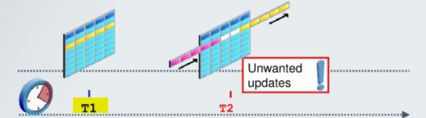

# Flashback - `Flashback Query`

[Back](../../index.md)

- [Flashback - `Flashback Query`](#flashback---flashback-query)
  - [`Flashback Query`](#flashback-query)

---

## `Flashback Query`

- `Flashback Query`:

  - Query **all data** as it existed at **a specific point in time**.
  - useful for analyzing a data discrepancy 差异.

- `SELECT ... AS OF <time_stamp/SCN>`

- **Common Function**:

  - `SCN_TO_TIMESTAMP`: Returns the **approximate timestamp** associated with a specified `SCN`
  - `TIMESTAMP_TO_SCN`: Returns the approximate `system change number (SCN)` associated with a specified **timestamp**

- **Example:**



```sql
SELECT employee_id, salary FROM employees
AS OF TIMESTAMP <T1>
WHERE employee_id = 200
```

---

[TOP](#flashback---flashback-query)
