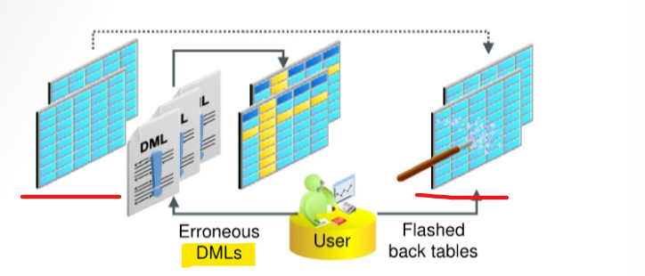
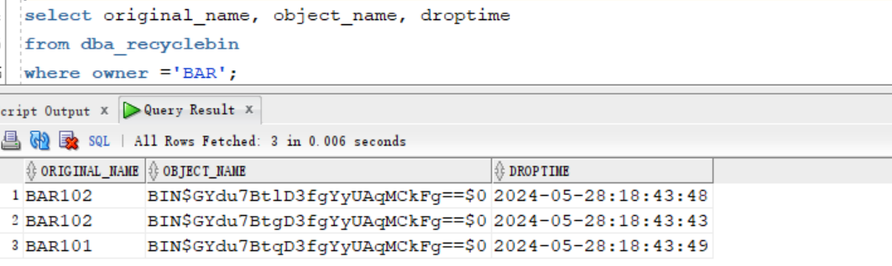
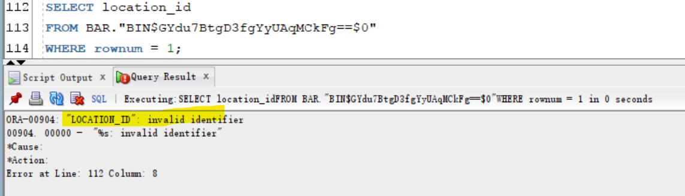
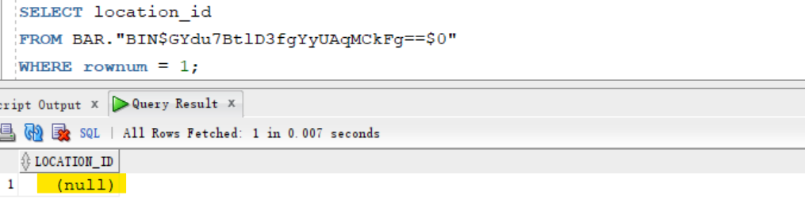
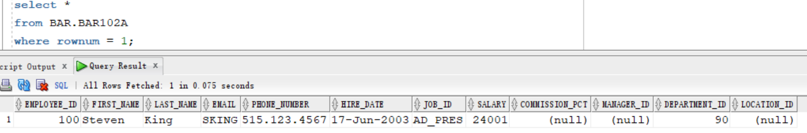

# Flashback - `Flashback Table`

[Back](../../index.md)

- [Flashback - `Flashback Table`](#flashback---flashback-table)
  - [`Flashback Table`](#flashback-table)
  - [Lab: Restoring a Dropped Table](#lab-restoring-a-dropped-table)
    - [Setup Environment](#setup-environment)
    - [Flashback dropped table](#flashback-dropped-table)
    - [Clean up](#clean-up)

---

## `Flashback Table`

- `Flashback Table`:

  - can **recover** a set of **tables** to a **specific point in time** **without** having to perform traditional `point-in-time recovery` operations.

- **Prerequisite**

  - **must enable** `row movement` on a **table** to be able to flash back the table.
    - When you **enable** `row movement`, the Oracle server can **move a row** in the table.

- **Characteristics:**

  - Using data from the `undo tablespace`从 undo tbsp 去回数据
  - the data in `tables` and their **associated objects** (`indexes`, `constraints`, `triggers`, and so on) is **restored**. 恢复相关对象
  - Flashback Table is an in-place operation.就地操作, 即无需离线
    - The database stays online.保持在线.
    - by **rolling back only the changes** that are made to the given tables and their **dependent** objects. 只回滚改变及其依赖.
  - A Flashback Table **statement** is executed as a **single transaction**.视作单一操作.
    - **All tables** must be flashed back successfully, or the **entire transaction** is rolled back.

- Method to **determine** the appropriate **flashback time**:
  - `Flashback Version Query`
  - `Flashback Transaction Query`



- Can recover from accidental modifications **without a database administrator's involvement**.

  - DBA must **grant** the `FLASHBACK TABLE` or `FLASHBACK ANY TABLE` **system privilege** to any **user** that uses the Flashback Table feature.
  - DBA must **grant** the `SELECT`, `INSERT`, `DELETE`, and `ALTER` **object privileges** to the **user**.

- Example:

```sql
FLASHBACK TABLE hr.departments
TO_TIMESTAMP ('2019-01-25 21:00:00', 'YYYY-MM-DD HH24:MI:SS');
```

---

- The `FLASHBACK TABLE` command executes **as a single transaction**
  - **All** or **none** of the specified tables are flashed back.
  - acquires exclusive `data manipulation language (DML) locks` on all tables that are specified in the statement **over the period of time the operation** is in progress.
- **Statistics** of impacted objects are **not** flashed back.
- Current `indexes` and **dependent objects** are maintained.
  - All **existing** `indexes` are maintained.
  - **Dropped** `indexes` are not re-created.
  - Dependent on-commit `materialized views` are also **maintained automatically**.
  - If any `constraints` are **violated** during flashback execution, the operation is **aborted** and the `tables` are left in the same state as they were just **before** the `FLASHBACK TABLE` statement invocation. 闪回不能违反约束
- Flashback Table operations:
  - **cannot** be performed on `system tables`, `remote tables`, and `fixed tables`.
  - **Cannot** span `DDL` operations
    - **cannot** perform `Flashback Table` to a **particular time that is older than** the time of the execution of a `data definition language (DDL)` operation that altered the structure of or shrunk a table that would be involved in the flashback operation.
    - This restriction **does not apply** to DDL statements that **only change storage attributes** of the tables.
  - **Generate** `undo` and `redo` data

---

## Lab: Restoring a Dropped Table

### Setup Environment

```sql
sqlplus / as sysdba
ALTER SESSION SET container=orclpdb;

-- CLEANUP from previous run
DROP USER bar CASCADE;
DROP TABLESPACE bartbs INCLUDING CONTENTS AND DATAFILES;

-- Create tablespace
CREATE TABLESPACE bartbs
DATAFILE '/u01/app/oracle/oradata/ORCL/orclpdb/bartbs1.dbf' SIZE 10M REUSE
SEGMENT SPACE MANAGEMENT MANUAL;

-- Create user
CREATE USER BAR IDENTIFIED BY pass4BAR
DEFAULT TABLESPACE bartbs
QUOTA UNLIMITED ON bartbs;

GRANT CREATE SESSION TO BAR;

-- create table and populate
-- be sure table is at least 2 blocks long
CREATE TABLE BAR.barcopy
TABLESPACE bartbs
AS SELECT * FROM HR.EMPLOYEES;

INSERT INTO BAR.BARCOPY
SELECT * FROM BAR.BARCOPY;

INSERT INTO BAR.BARCOPY
SELECT * FROM BAR.BARCOPY;
```

- Create backup

```sql
#-- Create backup of the bartbs tablespace
rman target /
BACKUP AS COPY TABLESPACE orclpdb:bartbs;
```

- Update tb

```sql
#-- update the table
sqlplus / as sysdba
ALTER SESSION set container=orclpdb;

UPDATE BAR.BARCOPY SET salary = salary+1;
COMMIT;
```

- Create table

```sql
sqlplus / as sysdba

alter session set container=orclpdb;

-- create tb bar101
create table bar.bar101
as select * from BAR.BARCOPY;

ALTER TABLE BAR.BAR101
add (address_line1 VARCHAR2(200), address_line2 VARCHAR2(200));

-- create tb bar102
create table bar.bar102
as select * from BAR.BARCOPY;

ALTER TABLE BAR.BAR102
add (address_line1i VARCHAR2(200), address_line2 VARCHAR2(200));

-- drop tb bar102
drop table BAR.BAR102;

-- create new tb bar102
create table bar.bar102
as select * from BAR.BARCOPY;

ALTER TABLE BAR.BAR102
add (location_id NUMBER(12));

-- drop tb bar102
drop table bar.bar102;

-- drop tb bar101
drop table bar.bar101;

-- create new tb bar102
create table bar.bar102
as select * from BAR.BARCOPY;

ALTER TABLE BAR.BAR102 add (photo BLOB);
```

---

### Flashback dropped table

Requirement:

- A developer, who has been using the BAR Oracle user account comes to you and asks you to restore a table that was dropped.
- This table has had several iterations but the **one the developer needs was named EAR102 in the BAR schema.** It should have 12 columns, **one of which was named LOCATION ID**.
- There is currently a BAR102 table in the BAR schema.
- **Restore** the requested table to **BAR102A**. |

---

- Attempt to use the `SHOW RECYCLEBIN` command to view the contents of the recycle bin for orclpdbl.

```sql
sqlplus sys@orclpdb as sysdba;

SHOW RECYCLEBIN
-- return none
```

> Note: The `SHOW RECYCLEBIN` command shows only those objects that belong to the current user. Because you are logged in as the sys user, the `SHOW RECYCLEBIN` command does not show the dropped tables you are interested in restoring.

- Examine the objects in the `DBA_RECYCLEBIN` view.

```sql
select original_name, object_name, droptime
from dba_recyclebin
where owner ='BAR';
```



- Determine which object contains the column of interest.
  - Select the column from the tables, the one which **does not report an error** is the one you want.
  - The object name from the recycle bin must be in **double quotation marks** because it may contain special characters.

```sql
-- find the correct object with experted column
SELECT location_id
FROM BAR."BIN$GYdu7BtlD3fgYyUAqMCkFg==$0"
WHERE rownum = 1;
```





- Restore the object that has the correct columns.

```sql
FLASHBACK TABLE BAR."BIN$GYdu7BtlD3fgYyUAqMCkFg==$0"
TO BEFORE DROP
RENAME TO BAR102A;
-- Flashback succeeded.
```

- Confirm that the BAR. BAR102A table has been restored by selecting the first row.

```sql
select *
from BAR.BAR102A
where rownum = 1;
```



---

### Clean up

- Delete tbsp backup

```sql
rman target /
delete NOPROMPT copy of tablespace orclpdb:bartbs;
exit;
```

- Clean up user and tbsp

```sql
sqlplus / as sysdba

ALTER SESSION set container=orclpdb;

-- CLEANUP from previous run
DROP USER bar CASCADE;
DROP TABLESPACE bartbs INCLUDING CONTENTS AND DATAFILES;
PURGE DBA_RECYCLEBIN;
```

---

[TOP](#flashback---flashback-table)
