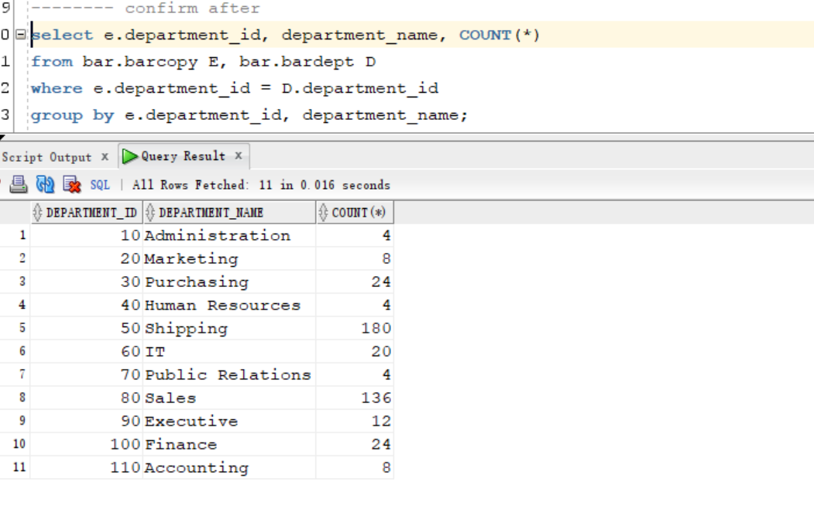

# Flashback - `Flashback Transaction Backout`

[Back](../../index.md)

- [Flashback - `Flashback Transaction Backout`](#flashback---flashback-transaction-backout)
  - [`Flashback Transaction Backout`](#flashback-transaction-backout)
  - [Lab: Flashback table to reverse a transaction](#lab-flashback-table-to-reverse-a-transaction)
    - [Setup Environment](#setup-environment)
    - [Flashback Transaction](#flashback-transaction)
    - [Clean up](#clean-up)

---

## `Flashback Transaction Backout`

- `Flashback Transaction Backout`:

  - **reverse** a transaction and dependent transactions.

- **Prerequisite:**

  - To flash back or back out a transaction—that is, to create a **compensating transaction**—you must have the `SELECT`, `FLASHBACK`, and `DML` privileges on all affected tables.

- Oracle Database **determines the dependencies** between transactions and, in effect, **creates a compensating transaction** that reverses the unwanted changes. 原理是产生补偿交易来逆向.

  - The database **rewinds** to a state **as if** the transaction, and any transactions that could be dependent on it, **never occurred**.

- Supplemental logging must be enabled.

- procedure `DBMS_FLASHBACK`.`TRANSACTION_BACKOUT`:

  - Used to back out a set of transactions.
  - If the PL/SQL call finishes successfully, it means that the transaction does **not have any dependencies** and a **single** transaction is backed out successfully.
  - `NOCASCADE` option:
    - No dependency is expected.
    - If a dependency is found, this raises an error, with the first dependent transaction provided in the report.
  - Note:
    - Transaction back-out is **not** supported across **conflicting DDL**.
    - Transaction back-out **inherits data type** support from LogMiner.
    - When you discover the need for transaction back-out, performance is better if you **start** the back-out operation **sooner**. 尽快闪回
      - **Large** `redo logs` and high transaction rates result in **slower** transaction back-out operations.
    - Provide a **transaction name** for the back-out operation to facilitate later auditing.最好提供交易名, 方便审计
      - If you do not provide a transaction name, it will be **automatically generated** for you. 如果不提供,交易名自动生成.

- **After** choosing your back-out option, the dependency report is generated in the `DBA_FLASHBACK_TXN_STATE` and `DBA_FLASHBACK_TXN_REPORT` Views.

  - `DBA_FLASHBACK_TXN_STATE` view:

    - contains the **current state** of a transaction—whether it is alive in the system or effectively backed out.
    - This table is atomically maintained with the **compensating transaction**.
    - For each **compensating transaction**, there could be multiple rows, where each row provides the dependency relationship between the transactions that have been compensated by the **compensating transaction**.

  - `DBA_FLASHBACK_TXN_REPORT` view:
    - provides detailed information about all **compensating transactions** that have been committed in the database.
    - Each row in this view is associated with one **compensating transaction**.

- **Review** the **dependency report** that shows all transactions that were backed out.
  - Commit the changes to make them permanent.
  - Or, Roll back to discard the changes.

---

## Lab: Flashback table to reverse a transaction

### Setup Environment

```sql
sqlplus / as sysdba

ALTER SESSION set container=orclpdb;

-- CLEANUP from previous run
DROP USER bar CASCADE;
DROP TABLESPACE bartbs INCLUDING CONTENTS AND DATAFILES;

-- Create tablespace
CREATE TABLESPACE bartbs
DATAFILE '/u01/app/oracle/oradata/ORCL/orclpdb/bartbs1.dbf' SIZE 10M REUSE
SEGMENT SPACE MANAGEMENT MANUAL;

-- Create user
CREATE USER BAR IDENTIFIED BY pass4BAR
DEFAULT TABLESPACE bartbs
QUOTA UNLIMITED ON bartbs;

GRANT CREATE SESSION TO BAR;

-- create table and populate
-- be sure table is at least 2 blocks long
CREATE TABLE BAR.barcopy
TABLESPACE bartbs
AS SELECT * FROM HR.EMPLOYEES;

INSERT INTO BAR.BARCOPY
SELECT * FROM BAR.BARCOPY;

INSERT INTO BAR.BARCOPY
SELECT * FROM BAR.BARCOPY;

-- Create an table with a FK relationship
CREATE TABLE BAR.BARDEPT
TABLESPACE BARTBS
AS SELECT * from HR.DEPARTMENTS;

ALTER TABLE BAR.BARDEPT
ADD CONSTRAINT PK_BARDEPT PRIMARY KEY (DEPARTMENT_ID);

ALTER TABLE BAR.BARCOPY
ADD CONSTRAINT dept_id_FK FOREIGN KEY (department_id)
REFERENCES BAR.BARDEPT;
```

- Backup tbsp

```sql
#-- Create backup of the bartbs tablespace
rman target /

BACKUP AS COPY TABLESPACE orclpdb:bartbs;
```

- Update tb

```sql
#-- update the table
sqlplus / as sysdba
ALTER SESSION set container=orclpdb;

UPDATE BAR.BARCOPY SET salary = salary+1;
COMMIT;
```

---

- Determine the current time to the nearest second.
  - Record this as `T1`.

```sql
sqlplus sys@orclpdb as sysdba

select to_char(sysdate, 'yyyy-mm-dd:hh24:mi:ss')
from dual;
-- 2024-05-29:00:38:27
```


---

- **Simulates a transaction** that scrambles the data in the BARCOPY and BARDEPT tables.
  - There is a foreign key constraint between BARCOPY and BARDEPT.

```sql
sqlplus / as sysdba

ALTER SESSION set container=orclpdb;

UPDATE BAR.BARDEPT SET DEPARTMENT_NAME = 'ADMIRATION'
WHERE DEPARTMENT_ID = 10;

UPDATE BAR.BARDEPT SET DEPARTMENT_NAME = 'MACAROONS'
WHERE DEPARTMENT_ID = 20;

UPDATE BAR.BARDEPT SET DEPARTMENT_NAME = 'PUSHBROOMS'
WHERE DEPARTMENT_ID = 30;

UPDATE BAR.BARDEPT SET DEPARTMENT_NAME = 'HUMAN REPRISAL'
WHERE DEPARTMENT_ID = 40;

UPDATE BAR.BARDEPT SET DEPARTMENT_NAME = 'SCHLEPPING'
WHERE DEPARTMENT_ID = 50;

UPDATE BAR.BARDEPT SET DEPARTMENT_NAME = 'INFORMATION MANAGLING'
WHERE DEPARTMENT_ID = 60;

UPDATE BAR.BARDEPT SET DEPARTMENT_NAME = 'PUBLIC REVULSION'
WHERE DEPARTMENT_ID = 70;

UPDATE BAR.BARDEPT SET DEPARTMENT_NAME = 'SAILORS'
WHERE DEPARTMENT_ID = 80;

UPDATE BAR.BARDEPT SET DEPARTMENT_NAME = 'EXECUTION'
WHERE DEPARTMENT_ID = 90;

UPDATE BAR.BARDEPT SET DEPARTMENT_NAME = 'FRUSTRATION'
WHERE DEPARTMENT_ID = 100;

UPDATE BAR.BARDEPT SET DEPARTMENT_NAME = 'BEAN COUNTING'
WHERE DEPARTMENT_ID = 110;

UPDATE BAR.BARDEPT SET DEPARTMENT_NAME = 'PIGGY BANK'
WHERE DEPARTMENT_ID = 120;

UPDATE BAR.BARDEPT SET DEPARTMENT_NAME = 'DUCKING'
WHERE DEPARTMENT_ID = 130;

UPDATE BAR.BARDEPT SET DEPARTMENT_NAME = 'CORRUPTION'
WHERE DEPARTMENT_ID = 140;

UPDATE BAR.BARDEPT SET DEPARTMENT_NAME = 'LIVESTOCK'
WHERE DEPARTMENT_ID = 150;

UPDATE BAR.BARDEPT SET DEPARTMENT_NAME = 'BODKIN'
WHERE DEPARTMENT_ID = 160;

UPDATE BAR.BARDEPT SET DEPARTMENT_NAME = 'MISCHIEF'
WHERE DEPARTMENT_ID = 170;

UPDATE BAR.BARDEPT SET DEPARTMENT_NAME = 'CONFUSION'
WHERE DEPARTMENT_ID = 180;

UPDATE BAR.BARDEPT SET DEPARTMENT_NAME = 'PAPER PUSHING'
WHERE DEPARTMENT_ID = 190;

UPDATE BAR.BARDEPT SET DEPARTMENT_NAME = 'SURGERY'
WHERE DEPARTMENT_ID = 200;

UPDATE BAR.BARDEPT SET DEPARTMENT_NAME = 'IT SUPPRESSION'
WHERE DEPARTMENT_ID = 210;

UPDATE BAR.BARDEPT SET DEPARTMENT_NAME = 'NO OBVIOUS CLUE'
WHERE DEPARTMENT_ID = 220;

UPDATE BAR.BARDEPT SET DEPARTMENT_NAME = 'OBFUSCATION'
WHERE DEPARTMENT_ID = 230;

UPDATE BAR.BARDEPT SET DEPARTMENT_NAME = 'EXTORTION'
WHERE DEPARTMENT_ID = 240;

UPDATE BAR.BARDEPT SET DEPARTMENT_NAME = 'SCALPING'
WHERE DEPARTMENT_ID = 250;

UPDATE BAR.BARDEPT SET DEPARTMENT_NAME = 'PROCUREMENT'
WHERE DEPARTMENT_ID = 260;

UPDATE BAR.BARDEPT SET DEPARTMENT_NAME = 'PUNISHMENT'
WHERE DEPARTMENT_ID = 270;

/
DECLARE
   CURSOR C1 is
	SELECT * FROM BAR.BARCOPY FOR UPDATE;
BEGIN

FOR C1_row IN C1 LOOP
  UPDATE BAR.BARCOPY
  SET DEPARTMENT_ID = (SELECT TRUNC(DBMS_RANDOM.VALUE(10,270),-1) FROM DUAL)
  WHERE CURRENT OF C1;
END LOOP;

END;
/

COMMIT;
```

---

### Flashback Transaction

Requirement:

- The HR representative reports that an employee has incorrectly changed the names of the departments, and scrambled which employees are assigned to which departments.
  - The tables were correct at time T1 and no authorized changes have been made since that time.
  - The tables involved are BAR.BARCOPY and BAR.DEPT.
- Restore the tables to the state they were at T1.

  - Because there is a foreign-key relationship, both tables must be restored.

---

- Query statistics before flashback

```sql
-- query before flashback
select e.department_id, department_name, COUNT(*)
from bar.barcopy E, bar.bardept D
where e.department_id = D.department_id
group by e.department_id, department_name;
```


- `ENABLE ROW MOVEMENT`:
  - moves rows between existing blocks to compact the data

```sql
-- query whether row movement is enabled
SELECT owner, table_name, row_movement
FROM   dba_tables
WHERE  table_name IN ('BARDEPT','BARCOPY')
AND owner = UPPER('bar');
-- BAR	BARCOPY	DISABLED
-- BAR	BARDEPT	DISABLED

ALTER TABLE BAR.BARDEPT
ENABLE ROW MOVEMENT;

ALTER TABLE BAR.BARCOPY
ENABLE ROW MOVEMENT;

-- Confimr row movement is enabled
SELECT owner, table_name, row_movement
FROM   dba_tables
WHERE  table_name IN ('BARDEPT','BARCOPY')
AND owner = UPPER('bar');
```


- Flashback to T1

```sql
FLASHBACK TABLE BAR.BARDEPT TO TIMESTAMP
TO_TIMESTAMP ('2024-05-29:00:38:27', 'YYYY-MM-DD:HH24:MI:SS');

FLASHBACK TABLE BAR.BARCOPY TO TIMESTAMP
TO_TIMESTAMP ('2024-05-29:00:38:27', 'YYYY-MM-DD:HH24:MI:SS');
```

- Confirm after flashback

```sql
select e.department_id, department_name, COUNT(*)
from bar.barcopy E, bar.bardept D
where e.department_id = D.department_id
group by e.department_id, department_name
```



---

### Clean up

- delete backup

```sql
rman target /
delete NOPROMPT copy of tablespace orclpdb:bartbs;
exit;
```

```sql
sqlplus / as sysdba

ALTER SESSION set container=orclpdb;

-- CLEANUP from previous run
DROP USER bar CASCADE;
DROP TABLESPACE bartbs INCLUDING CONTENTS AND DATAFILES;

-- purge recyclebin
PURGE DBA_RECYCLEBIN;

-- Reset undo parameter
ALTER SESSION set container=cdb$root;

ALTER TABLESPACE UNDOTBS1 RETENTION NOGUARANTEE;
ALTER SYSTEM set UNDO_RETENTION = 900 SCOPE=BOTH;

-- confirm reset
show parameter UNDO_RETENTION
```


---

[TOP](#flashback---flashback-transaction-backout)
