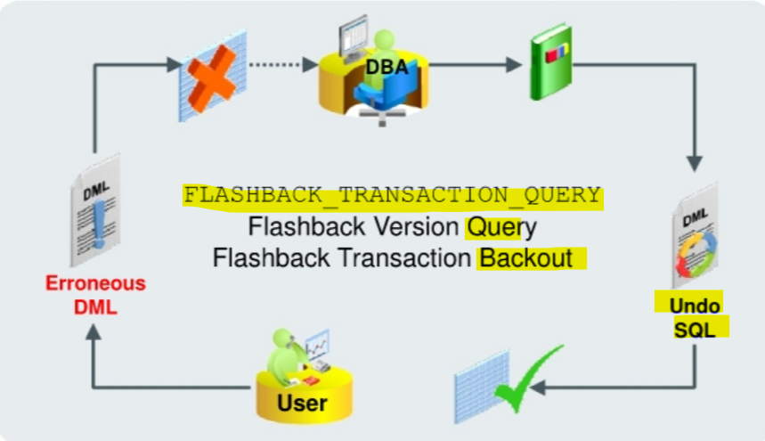

# Flashback - `Flashback Transaction Query`

[Back](../../index.md)

- [Flashback - `Flashback Transaction Query`](#flashback---flashback-transaction-query)
  - [`Flashback Transaction Query`](#flashback-transaction-query)

---

## `Flashback Transaction Query`

- `Flashback Transaction Query`:

  - a **diagnostic tool** that you can use to **view changes** made to the database **at the transaction level**.
  - enables you to **diagnose problems** in your database and **perform analysis** and **audits** of transactions

- view `FLASHBACK_TRANSACTION_QUERY`:
  - used to **determine** all the necessary SQL statements that can be used to **undo the changes** made either by a specific transaction or during a specific period of time.

---

- DDL commands are seen as dictionary updates.

  - **DDL operations** are a series of **space management operations** and **changes** to the `data dictionary`.
  - `Flashback Transaction Query` on a transaction underlying a DDL command **displays the changes** made to the `data dictionary`. 一条 DDL 命令的 tran query 体现字典的改变

- **Dropped objects** appear as **object numbers**.

  - When Flashback Transaction Query involves tables that have been dropped from the database, the **table names** are **not** reflected. Instead, **object numbers** are used. 如果查询的对象被删除了, 则只会显示对象数字
  - 所以查询时, 如果对象返回的是数字,则该对象已被删除.

- **Dropped users** appear as **user identifiers**.
  - If the **user** who executed a transaction is **dropped**, Flashback Transaction Query of that transaction displays the corresponding `user ID` only, and **not the username**.如果执行交易的用户被删除了, 只会显示用户 ID 而不是用户名.
  - 所以如果查询时用户不是显示用户名而是 ID, 则该用户已被删除.

---

[TOP](#flashback---flashback-transaction-query)
