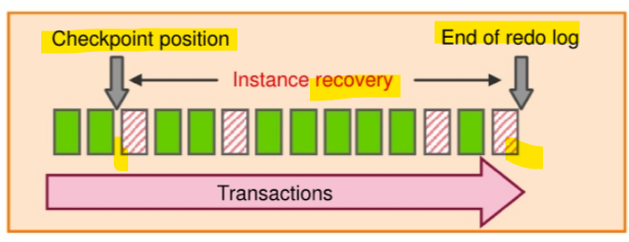

# DBA - Fundamemtal

[Back](../index.md)

- [DBA - Fundamemtal](#dba---fundamemtal)
  - [DBA Responsibilities](#dba-responsibilities)
  - [Categories of Failure](#categories-of-failure)
    - [Statement Failure](#statement-failure)
    - [User Process Failure](#user-process-failure)
    - [Network Failure](#network-failure)
    - [User Error](#user-error)
    - [Instance Failure](#instance-failure)
    - [Media Failure](#media-failure)
    - [Data Failures](#data-failures)
  - [Instance Recovery](#instance-recovery)
    - [The Checkpoint (CKPT) Process](#the-checkpoint-ckpt-process)
    - [Redo Log Files and the Log Writer (LGWR) Process](#redo-log-files-and-the-log-writer-lgwr-process)
    - [Database Log Mode](#database-log-mode)
    - [Automatic Instance Recovery or Crash Recovery](#automatic-instance-recovery-or-crash-recovery)
    - [Phases of Instance Recovery](#phases-of-instance-recovery)
    - [Tuning Instance Recovery](#tuning-instance-recovery)
    - [Using the MTTR Advisor](#using-the-mttr-advisor)
  - [Restoring and Recovering](#restoring-and-recovering)
  - [Comparing Complete and Incomplete Recovery](#comparing-complete-and-incomplete-recovery)
    - [The Complete Recovery Process](#the-complete-recovery-process)
    - [The Point-in-Time Recovery Process](#the-point-in-time-recovery-process)
  - [Oracle Data Protection Solutions](#oracle-data-protection-solutions)
  - [Flashback Technology](#flashback-technology)

---

## DBA Responsibilities

- The database administrator (DBA) is typically responsible for ensuring that the database is open and available when users need it. To achieve that goal, the DBA (working with the system administrator):

  - **Protect the database from failure** wherever possible.
  - Protect critical components by **using redundancy**.
  - Minimize the loss of data.
    - Entities:
      - Archive log files (discussed later in this lesson)
      - Flashback technology
      - Standby databases and Oracle Data Guard
  - Increase the `mean time between failures` (`MTBF`).

    - advanced configuration options to increase MTBF:
      - `Real Application Clusters`
      - `Oracle Data Guard`

  - Decrease the `mean time to recover` (`MTTR`).

    - by **practicing recovery procedures** in advance and **configuring backups** so that they are readily available when needed

- **Separation** of DBA Duties

  - The `SYSBACKUP` administrative **privilege**:

    - Includes permissions for backup and recovery (connecting to a closed database)
    - Does **not include data access privileges** such as `SELECT ANY TABLE`
    - Is granted to the `SYSBACKUP` user that is created during database installation
    - Can be explicitly used in `RMAN` connections by a `SYSBACKUP` privileged user

```sh
# Explicitly connect with the SYSDBA role:
$ rman target "'/ as sysbackup'"
# connected to target database: ORCL (DBID=1297344416)

# For backward compatibility
rman target / connects as SYSDBA.
```

- Identify and prioritize critical data. 需求+错误类型

  - Base recovery requirements on data criticality.(first determine how critical a database that is lost or unavailable is to your business.)

    - `Recovery Point Objective` (`RPO`):
      - Tolerance for `data loss`
      - How frequently should backups be taken?
      - Is point-in-time recovery required?
      - example: a company has a large `data warehousing` reporting system that can tolerate 12 hours worth of lost data, because batch loads can be rerun with a few hours of downtime that is acceptable to the user community. A disk and tape backup strategy may be appropriate for this type of system.
    - `Recovery Time Objective` (`RTO`):

      - Tolerance for **down time**
      - Downtime: Problem identification + recovery planning + systems recovery
      - Tiered RTO per level of granularity (database, tablespace, table, row)
      - Example: A company has a critical OLTP system that can tolerate no more than a few minutes worth of lost data and several minutes of acceptable down time, because a down database translates into $100,000 per hour of lost revenue. For this system, a traditional backup and recovery solution will not suffice. The company needs to consider a "**minimal downtime solution**" such as `Oracle Data Guard`.

    - Determine `backup retention policy` for on-site, off-site, and long-term backups.

  - Assess data protection requirements.
    - determine **which failures** you need to protect against.
    - Physical: Disasters, outages, failures, corruptions
    - Logical: Human errors, application errors

---

## Categories of Failure

**Failures** can generally be divided into the following categories:

- Statement failure
  - A **single database operation** (select, insert, update, or delete) fails.
- User process failure
  - A single database **session fails**.
- Network failure
  - Connectivity to the database is lost.
- User error
  - A user successfully completes an operation, but the **operation** (dropping a table or entering bad data) is **incorrect**.
- Instance failure
  - The database instance **shuts down unexpectedly**.
- Media failure
  - A **loss of any file** that is needed for database operation (that is, the files have been deleted or the disk has failed).

---

### Statement Failure

| Typical Problems                                                | Possible Solutions                                                                    |
| --------------------------------------------------------------- | ------------------------------------------------------------------------------------- |
| Attempts to **enter invalid data** into a table                 | Work with users to **validate** and correct data.                                     |
| Attempts to perform operations with **insufficient privileges** | Provide the appropriate object or system privileges.                                  |
| Attempts to **allocate space** that fails                       | Enable resumable space allocation. Increase owner quota. Add space to the tablespace. |
| **Logic errors** in applications                                | Work with developers to correct program errors.                                       |

---

### User Process Failure

| Typical Problems                                                    | Possible Solutions                                                                       |
| ------------------------------------------------------------------- | ---------------------------------------------------------------------------------------- |
| A user performs an **abnormal disconnect**.                         | A DBA's action is not usually needed to resolve user process failures.                   |
| A user's **session is abnormally terminated**.                      | Instance `background processes` **roll back** uncommitted changes and **release locks**. |
| A user experiences a **program error** that terminates the session. | The DBA should watch for trends.                                                         |

- `User processes` that abnormally disconnect from the instance may have uncommitted work in progress that needs to be **rolled back**.
- The `Process Monitor (PMON)` background process **periodically polls** server processes to ensure that their sessions are still connected.

  - If PMON finds a server process whose user is no longer connected, PMON recovers from any ongoing transactions; it also **rolls back uncommitted changes** and **releases any locks** that are held by the failed session.

- A DBA's intervention should **not be required** to recover from user process failure, but the administrator must watch for trends.

  - One or two users disconnecting abnormally is not a cause for concern. A small percentage of user process failures may occur from time to time.

- But consistent and systemic failures indicate other problems.
  - A large percentage of abnormal disconnects may indicate a need for user training (which includes teaching users to log out rather than just terminate their programs). It may also be indicative of network or application problems.

---

### Network Failure

| Typical Problems                   | Possible Solutions                                     |
| ---------------------------------- | ------------------------------------------------------ |
| Listener fails                     | Configure a backup listener and connect-time failover. |
| Network interface card (NIC) fails | Configure multiple network cards.                      |
| Network connection fails           | Configure a backup network connection.                 |

- best solution: provide redundant paths for network connections.
  - **Backup** `listeners`, `network connections`, and `network interface cards` reduce the chance that network failures will affect system availability.

---

### User Error

| Typical Problems                                    | Possible Solutions                                                     |
| --------------------------------------------------- | ---------------------------------------------------------------------- |
| User inadvertently(疏忽地) deletes or modifies data | Roll back a transaction and dependent transactions or rewind the table |
| User drops a table                                  | Recover the table from recycle bin; Recover the table from a backup    |

- Users may inadvertently(疏忽地) delete or modify data.
  - If they have not yet committed or exited their program, they can simply roll back.
  - can use `Oracle LogMiner` to query your `online redo logs` and `archived redo logs` through an `Enterprise Manager` or `SQL` interface.
  - Transaction data may persist in `online redo logs` **longer than** it persists in `undo segments`; if you have configured archiving of redo information, redo persists until you delete the archived files.
- Users who drop a table can recover it from the `recycle bin` by **flashing back the table** to before the drop. 回收垃圾箱

  - If the recycle bin has already been purged, or if the user dropped the table with the `PURGE` option, the dropped table can still be recovered by using `point-in-time recovery` (`PITR`) if the database has been properly configured. 也可以用 PITR
  - `RMAN` enables you to recover one or more tables or table partitions to a specified point in time
    **without affecting the remaining** database objects.

- 疏忽删除数据, 恢复数据方法
  - 没有 commited, rollback
  - query redo, `LogMiner`
  - flash back from recycle bin
  - PITR, rman

---

### Instance Failure

- `Instance failure`

  - occurs when the database instance is **shut down before synchronizing** all database files.

- Typical Causes

  - Power outage
  - Hardware failure
  - Failure of one of the critical background processes
  - Emergency shutdown procedures(`SHUTDOWN ABORT` and `STARTUP FORCE`)

- Possible Solutions

  - Restart the instance by using the `STARTUP` command. Recovering from instance failure is **automatic**, including rolling forward changes in the redo logs and then rolling back any uncommitted transactions.
  - Investigate the causes of failure by using the `alert log`, `trace files`, and `Enterprise Manager`.

- Administrator involvement in recovering from instance failure is **rarely required** if **Oracle Restart** is enabled and is monitoring your database.
  - Oracle Restart attempts to restart your database instance as soon as it fails.
  - If manual intervention is required, then there may be a more serious problem that prevents the instance from restarting, such as a memory CPU failure.

---

### Media Failure

- `media failure`

  - any failure that results in the loss or corruption of one or more database **files** (data, control, or redo log file).
  - Recovering from media failure requires that you **restore** and **recover** the missing files.

- Typical Causes:

  - Failure of a **disk drive**
  - Failure of a **disk controller** -
  - **Deletion or corruption of a file** needed for a database operation
  - **Storage** network failure
  - Solid state storage **corruption**

- Possible Solution

  - 1. **Restore** the affected file from backup.
  - 2. Inform the database server of a **new file location** (if necessary).
  - 3. **Recover** the file by applying `redo` information (if necessary).

---

### Data Failures

- **Inaccessible components**:
  - **Missing data files** at the OS level, incorrect access **permissions**, **offline** tablespace
- **Physical corruptions**:
  - Block checksum failures, invalid block header field values
- **Logical corruptions**:
  - Inconsistent dictionary, corrupt row piece, index entry, or transaction
- **Inconsistencies**:
  - Control file older or newer than the data files and online redo logs
- **I/O failures**:
  - Limit on the number of open files exceeded, inaccessible channels, network or I/O error

---

## Instance Recovery

- You can understand instance recovery by becoming familiar with the following concepts and procedures:
  - The `checkpoint` (`CKPT`) procoss
  - `Rodo log files` and the `Log Writer` (`LGWR`) process
  - Automatic instance or crash recovery
  - Phases of instance recovery
  - Tuning instance recovery
  - Using the MTTR Advisor

---

### The Checkpoint (CKPT) Process


- `CKPT` is responsible for:

  - Updating `data file headers` with checkpoint information
  - Updating `control files` with checkpoint information
  - Signaling `DBWn` at full checkpoints

- `incremental checkpoint`:

  - Every **three seconds** (or more frequently), the `CKPT` process stores data in a `control file` to **document the modified data blocks** that `DBWn` has written **from the `SGA` to disk**.
  - The purpose of a `checkpoint` is to **identify that place** in the `online redo log file` where instance recovery is to begin(`checkpoint position`).

  - In the event of a `log switch`, the `CKPT` process also **writes** this checkpoint information to the **headers of data files**.

- Checkpoints exist for the following reasons:

  - To ensure that **modified data blocks** in memory are **written to the disk** regularly so that data is not lost in case of a system or database failure
  - To **reduce the time** required for instance recovery (only the `online redo log file` entries following the last checkpoint need to be processed for recovery)
  - To ensure that all committed data has been **written to data files** during shutdown

- The `checkpoint information` written by the `CKPT` process includes:

  - **checkpoint position**,
  - **`system change number` (`SCN`)**,
  - **location** in the `online redo log file` to begin recovery,
  - information about logs,
  - and so on.

- Note: The `CKPT` process does **not write** data blocks to the disk or redo blocks to the online redo log files.

---

### Redo Log Files and the Log Writer (LGWR) Process

- `Redo log files`

  - **record changes** to the database as a result of `transactions` and internal Oracle server actions.
    - `transaction`: a logical unit of work consisting of one or more SQL statements.
  - protect the database **from loss of integrity** because of system failures caused by power outages,
    disk failures, and so on.
  - should be **multiplexed** to ensure that the information stored in them is not lost in the event of a disk failure.

- `Log Writer` (`LGWR`) writes:

  - At commit
  - When the redo log buffer is one-third full
  - Every three seconds
  - Before `DBWn` writes
  - Before clean shutdowns

- `redo log` consists of **groups of** `redo log files`.

  - A **group** consists of a `redo log file` and its **multiplexed copies**.
    - identified by a number.
    - **Each identical copy** is said to be **a member** of that group

- `Log Writer` (`LGWR`) process

  - **writes redo records** from the `redo log buffer` to **all members** of **a** `redo log group` until the files are filled or a `log switch` operation is requested.一个组一个组地写入, 写入一个组中的所有文件
  - It then switches and writes to the files **in the next group**.
  - Redo log groups are used in a **circular fashion.**

- Best practice tip: If possible, multiplexed redo log files should reside on different disks.


---

### Database Log Mode

- As modifications are made to data in the database, the "old" data is stored in the `undo tablespace`
  and the new change details in `online redo log` files (as shown in the graphic).

  - The undo is also in the redo stream.
  - Contents of the online redo log include uncommitted transactions and schema and object management statements.

- The database maintains online redo log files **to protect against data loss**.

  - Specifically, after an instance failure the online redo log files enable Oracle Database to **recover committed data** that it has not yet written to the data files.未写入的 committed data 可以从 redo log file 恢复.

- Because the `online redo log files` are reused in a circular fashion, there is a protocol for controlling when one is allowed to be **reused**.

  - In `ARCHIVELOG` mode, the database only begins writing to an `online redo log file` if it has been **archived**.This ensures that every redo log file has a chance to be archived.

  - It is possible to perform any type of backup (full or incremental) of a database that is in `NOARCHIVELOG` mode-if, of course, the database is **not open**.
  - When the database is in `NOARCHIVELOG` mode, you **must restore** all `data files` before executing a recovery operation.
    - Note also that recovery is **limited to the time of the last backup**.
    - The database can be recovered to the **last committed transaction** only when the database is in `ARCHIVELOG` mode.

- Use cases

| NOARCHIVELOG mode                                                                          | ARCHIVELOG mode                            |
| ------------------------------------------------------------------------------------------ | ------------------------------------------ |
| **Closed** database                                                                        | **Open** database                          |
| Recovery to the **last backup**                                                            | Recovery to **last committed** transaction |
| Suitable for **training and test** environments, for data warehouses with infrequent loads | Suitable for **production** environments   |


---

### Automatic Instance Recovery or Crash Recovery

- Is caused by attempts to open a database whose files are not synchronized on shutdown
- Uses information stored in redo log groups to synchronize files
- Involves two distinct operations:

  - **Rolling forward**: Redo log changes (both **committed and uncommitted**) are applied to data files.
  - **Rolling back**: Changes that are made but **not committed** are returned to their original state.

- The Oracle Database server **automatically recovers** from instance failure.
  - when the instance to be started normally.
  - The instance **mounts** the `control files` and then attempts to **open** the `data files`.
- When it discovers that the data files have **not been synchronized during shutdown**, the instance uses information contained in the `redo log groups` to roll the `data files` **forward** to the time of shutdown.

  - Then the database is **opened**, and any uncommitted transactions are **rolled back**.

- `Crash recovery`
  - The **automatic application** of `online redo records` to a database after either a single instance database crashes or all instances of an `Oracle Real Applications Cluster` configuration crash.
  - only requires `redo` from the `online logs`; 只需要 online redo
  - `archived redo logs` are **not required**.
  - Often this is referred to as "instance recovery."
- `Instance recovery`:
  - In an `Oracle RAC` configuration, the **application** of `redo data` to an open database by an instance when this instance discovers that another instance has crashed

---

### Phases of Instance Recovery

1. Instance startup (data files are out of sync)
2. Roll forward (**redo**)
3. Committed and uncommitted data in files
4. Database opened
5. Roll back (undo)
6. Committed data in files


- For an instance to open a data file, the `system change number` (`SCN`) contained **in the data file's header** must **match** the `current SCN` that is stored in the database's `control files`.

  - If the numbers **do not match**, the instance applies redo data from the `online redo logs`, sequentially "redoing" transactions **until the `data files` are up-to-date**.
    - When redo logs are applied, **all** transactions are applied to bring the database up **to the state as of the time of failure**. This usually includes transactions that are in progress but have not yet been committed.
  - After all `data files` have been synchronized with the `control files`, the database is **opened**, and users can log in.
    - After the database has been opened, those **uncommitted** transactions are **rolled back**.
    - Blocks from **uncommitted** transactions remain **locked** until the undo has been applied and committed.
  - At the end of the rollback phase of instance recovery, the data files contain only committed data.

- unmatch -> redo -> open -> rollback -> committed data

---

### Tuning Instance Recovery

- During instance recovery, the transactions between **the `checkpoint` position** and **the end of the `redo log`** must be applied to `data files`.
- You tune instance recovery by **controlling the difference** between the `checkpoint position` and the **end** of the `redo log`.

- `Transaction information`

  - is recorded in the `redo log groups` before the instance returns "commit complete" for a transaction.先于返回信息
  - in the `redo log groups` guarantees that the transaction can be recovered in case of a failure.在 redo log 中的信息保证可以恢复
  - must also be written to the `data file`.

    - The **data file write** usually happens at some time after the information is recorded in `redo log groups`
      - because the `data file write` process is much slower than the `redo writes`.
      - **Random writes** for data files are slower than **serial writes** for redo log files.

  - 交易信息先记录在 redo log => 因此可以凭 redo log 信息恢复
  - 交易信息最终会写入 data file; 但后于写入 redo log, 因为 df 写入是随机写入, redo 写入是连续写入.

- Every three seconds, the `checkpoint process` records information in the `control file` about the `checkpoint position` in the `redo log`.
  - Therefore, the Oracle Database server knows that all redo log entries recorded **before this point are not necessary for database recovery**.



- In the graphic in the slide, the striped blocks have not yet been written to the disk.
- The **time required for `instance recovery`** is the **time required to bring `data files`** from their **last `checkpoint`** to the **latest `SCN` recorded** in the `control file`.

- The administrator controls that time by setting an `MTTR` target (in seconds) and through the sizing of redo log groups.
  - For example, for two redo groups, the distance between the checkpoint position and the end of the redo log group cannot
    be more than 90% of the smallest redo log group.

---

### Using the MTTR Advisor

- Specify the **desired time** in seconds or minutes.
- The default value is `0` (disabled).
- The **maximum** value is `3,600` seconds (one hour).

- The `FAST_START_MTTR_TARGET` initialization parameter simplifies the configuration of **recovery
  time** from instance or system failure.
- The `MTTR Advisor` converts the `FAST_START_MTTR_TARGET` value into several parameters to enable instance recovery in the desired time (or as close to it as possible).

  - explicitly setting the `FAST_START_MTTR_TARGET` parameter to `0` **disables** the `MTTR Advisor`.

- The `FAST_START_MTTR_TARGET` parameter must be set to a value that supports the service level agreement for your system.
  - A **small** value for the MTTR target **increases** **I/O overhead**
    - because of additional data file writes (affecting the performance).
  - if set the MTTR target **too large**, the instance **takes longer to recover** after a crash.
  - For assistance in setting the MTTR target by using `Enterprise Manager Cloud Control`, navigate as follows:
    - Performance > Advisors Home > MTTR Advisor
    - Availability > Backup & Recovery > Recovery Settings

---

## Restoring and Recovering

- The `recovery unit` includes two major types of activities: `restoring` and `recovering`.
- In the database industry, these two operations are often referred to, collectively, with the single term "recovery."


- `Restoring` a file:

  - the process of **copying a backup** into place to be used by the database.
  - e.g.:
    - when a file is damaged because the physical disk it is on fails.
    - when due to hardware problems, such as disk write errors or controller failure, a backup of the file needs to be copied on to a new (or repaired) disk.
  - RMAN:
    - `RMAN` uses the records of available `backup sets` or `image copies` in the RMAN repository to **select the best** available backups. - If two backups are from the **same** `point in time`, then RMAN prefers `image copies` over backup sets because RMAN can restore them more **quickly** (similar for disk versus tape). -
    - `RMAN` **automatically** uses restore failover to **skip corrupted or inaccessible backups** and look for usable backups.
    - By default, `RMAN` **skips** restoring a data file if the file is present in the correct location and its header contains the expected information, and so on.

- `Recovering` the file entails **applying redo** such that the state of the file is brought forward in time, to whatever point you want.
  - That point is usually as close to the time of failure as possible.

---

## Comparing Complete and Incomplete Recovery


- `Recovery` can have two kinds of scope:

  - `Complete recovery`:
    - Brings the `database` or `tablespace` **up to the present**, including **all committed data changes** made to the point in time when the recovery was requested
  - `Incomplete` or `point-in-time recovery` (`PITR`):
    - Brings the `database` or `tablespace` **up to a specified point** in time in the past, before the recovery operation was requested
    - It means there are missing transactions:
      - any data modifications done between **the recovery destination time** and **the present are lost**.
    - Recovering to a point in the past is a way to **remove the unwanted changes**.

---

### The Complete Recovery Process


The following steps describe what takes place during complete recovery:

1. Damaged or missing files are **restored** from a backup.
2. **Changes** from `incremental backups`, `archived redo log files`, and `online redo log files` are applied as necessary.
   - The `redo log` changes are applied to the `data files` until the current online log is reached and the most recent changes have been reapplied.
   - `Undo blocks` are generated during this entire process.
   - This is referred to as `rolling forward` or `cache recovery`.
3. The **restored** `data files` may now contain **committed** and **uncommitted** changes.
4. The `undo blocks` are used to **roll back** any uncommitted changes.
   - This is sometimes referred to as `transaction recovery`.
5. The `data files` are now **in a `recovered state`** and are **consistent with the other** `data files` in the database.

---

### The Point-in-Time Recovery Process

- `Incomplete recovery`, or `database point-in-time recovery (DBPITR)`

  - uses a backup to **produce a noncurrent version of the database**.
  - do **not apply all** the `redo` records generated after the most recent backup.
  - Perform this type of recovery **only when absolutely necessary**.

- To perform `point-in-time recovery`, you need:

  - A valid **offline** or **online** `backup` of **all** the `data files` made before the recovery point
  - All `archived logs` from the time of the backup **until the specified time** of recovery


- The steps to perform a point-in-time recovery are as follows:

  1. **Restore** the `data files` from backup:

     - The backup that is used must be from **before** your target recovery point.
     - This entails either copying files using `OS commands` or using the `RMAN RESTORE` command.

  2. Use the `RECOVER` command:

     - **Apply** `redo` from the `archived redo log files`, including as many as necessary to **reach the restore point destination**.

  3. **State of over-recovery**:

     - Now the data files contain some **committed** and some **uncommitted** transactions because the redo can contain uncommitted data.

  4. Use the `ALTER DATABASE OPEN` command:

     - The database is **opened** before undo is applied.
     - This is to provide higher availability.

  5. **Apply** `undo` data:

     - While the redo was being applied, redo supporting the undo data files was also applied. So the undo is available to be applied to the data files in order to **undo any uncommitted transactions**.

  6. Process complete:

     - The data files are now recovered to the point in time that you chose.

- `Oracle Flashback Database` is the most efficient **alternative** to `DBPITR`.
  - Unlike the other flashback features, it operates **at a physical level** and **reverts** the current `data files` to their contents at a past time
  - The result is like the result of a `DBPIIR`, including the `OPEN RESETLOGS`,
  - but `Flashback Database` is typically **faster**
    - because it does **not require you to restore** `data files` and requires **only limited application** of `redo` compared to media recovery.

---

## Oracle Data Protection Solutions

| Backup and Recovery Objective | Recovery Time Objective (RTO)                                   | Oracle Solution                        |
| ----------------------------- | --------------------------------------------------------------- | -------------------------------------- |
| Physical data protection      | Hours/Days                                                      | Recovery Manager; Oracle Secure Backup |
| Logical data protection       | Minutes/Hours                                                   | Flashback Technologies                 |
| Recovery analysis             | Minimize time for problem; identification and recovery planning | Data Recovery Advisor                  |

| Disaster Recovery Objective | Recovery Time Objective (RTO) | Oracle Solution              |
| --------------------------- | ----------------------------- | ---------------------------- |
| Physical data protection    | Seconds/Minutes               | Data Guard;Active Data Guard |

- Oracle provides an appropriate data protection solution depending on your **backup and recovery
  objective** and `RTO`:
  - `Oracle Recovery Manager (RMAN)`
    - the core Oracle Database **software component** that manages database backup, restore, and recovery processes.
  - `Oracle Secure Backup (OSB)`:
    - Oracle's enterprise-grade **tape backup management solution** for both **database** and **file system data**.
  - `Oracle Database Flashback` technologies:
    - a set of data **recovery solutions** that enable human errors to be reversed by selectively and efficiently undoing the effects of a mistake.
  - `Data Recovery Advisor`:
    - provides **intelligent** database problem identification and **recovery** capabilities.
  - `Data Guard` and `Active Data Guard`:
    - enable physical `standby databases` to be open for read access while being kept synchronized with the production database through `media recovery`.

---

## Flashback Technology

- `Oracle Flashback technology`:

  - a group of features that support **viewing past states** of data and **winding data back and forth** in time, without requiring the restoration of the database from backup.
  - With this technology, you help users **analyze** and **recover** from errors.

- Use `Flashback` technology for:

  - Viewing past states of data
  - Winding data back and forth in time
  - Assisting users in **error analysis** and **recovery**

---

- For error **analysis**:

  - Oracle Flashback **Query**
  - Oracle Flashback **Versions Query**
  - Oracle Flashback **Transaction Query**

- For users who have committed erroneous changes, use the following to **analyze the errors**:

  - `Flashback Query`:
    - **View committed data** as it existed at some point in the past.
    - The `SELECT` command with the `AS OF` clause references a time in the past through a **time stamp** or `system change number (SCN)`.
  - `Flashback Version Query`:
    - **View committed historical data** for a specific **time interval**.
    - Use the `VERSIONS BETWEEN` clause of the `SELECT` command (for performance reasons with existing indexes).
  - `Flashback Transaction Query`:
    - View all database changes made **at the transaction level**.

---

- For error recovery:

  - Oracle Flashback **Transaction Backout**
  - Oracle Flashback **Table**
  - Oracle Flashback **Drop**
  - Oracle Flashback **Database**

- Possible solutions to recover from user error:
  - `Flashback Transaction Backout`:
    - Rolls back a **specific transaction** and **dependent transactions**
  - `Flashback Table`:
    - Rewinds **one or more tables** to their contents at a previous time without affecting other database objects

---

[TOP](#dba---fundamemtal)
