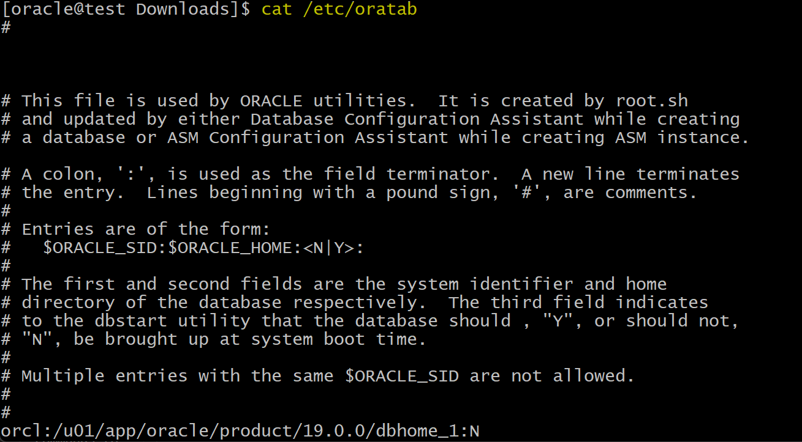
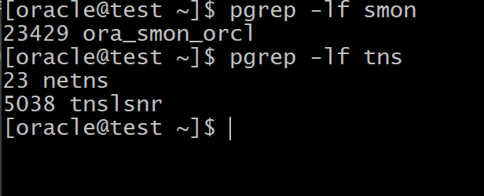

[Back](../index.md)

- The `oraenv` and `coraenv` scripts:

  - **created** during installation.
  - set environment variables based on the contents of the `oratab` file and provide:
    - A central means of **updating all user accounts** with database changes
    - A mechanism for **switching between databases** specified in the `oratab` file

- DBA can use the `oraenv` or `coraenv` script to ensure that **user accounts are updated** and to **switch between databases**.

- file location: `/usr/local/bin/oraenv`

```sh
. oraenv

# or
. /usr/local/bin/oraenv
```

- The `oratab` file resides in different locations based on the host operating system

| Host operating system | File location          |
| --------------------- | ---------------------- |
| Linux                 | /etc/oratab            |
| Solaris               | /var/opt/oracle/oratab |
| IBM AIX               | /etc/oratab            |



---

Linux command to return process of Oracle

| Command          | Description                                                       |
| ---------------- | ----------------------------------------------------------------- |
| `pgrep -lf smon` | search for process like smon to verify the database is started    |
| `pgrep -lf tns`  | search for tns process like tns to verify the listener is started |




--- 

archive log view:

Also note that the VSARCHIVED LOG view contains historic information of prior database
incarnations. The NAME column of the active database incarnation contains the path and
name of the archive log; historic incarnations have a null value. The status A is for archived
logs, D is for deleted ones.