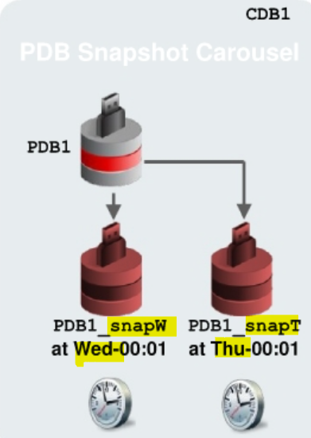
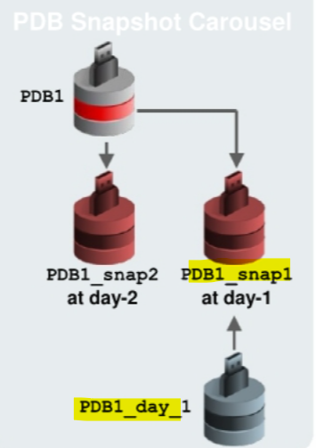
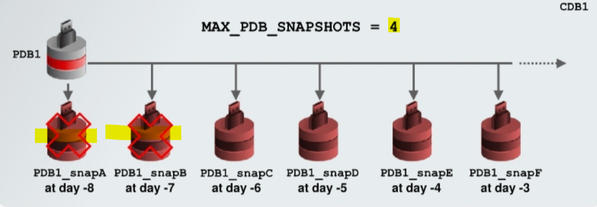
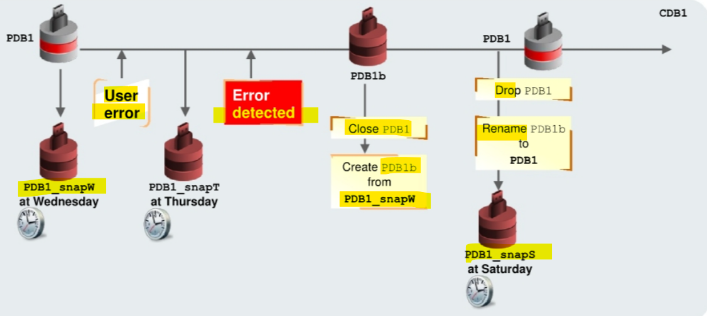

# DBA2 - PDB Snapshot Carousel

[Back](../../index.md)

- [DBA2 - PDB Snapshot Carousel](#dba2---pdb-snapshot-carousel)
  - [PDB Snapshot Carousel](#pdb-snapshot-carousel)
  - [Creating PDB Snapshots](#creating-pdb-snapshots)
    - [Enable Snapshots](#enable-snapshots)
    - [Create manual PDB snapshots](#create-manual-pdb-snapshots)
    - [Disable snapshot creation for a PDB](#disable-snapshot-creation-for-a-pdb)
  - [Creating PDBs by Using PDB Snapshots](#creating-pdbs-by-using-pdb-snapshots)
  - [Dropping PDB Snapshots](#dropping-pdb-snapshots)
  - [Flashing Back PDBs by Using PDB Snapshots](#flashing-back-pdbs-by-using-pdb-snapshots)

---

## PDB Snapshot Carousel

- `PDB Snapshot Carousel`

  - a library of PDB snapshots.

- `PDB Snapshot`:

  - a **named copy** of a PDB at **a specific point in time**.
  - an **archive file** (`.pdb`) containing the contents of the copy of the PDB at snapshot creation.
  - allow the recovery of PDBs back to the oldest PDB snapshot available for a PDB.
  - By default, is enabled.

- Every `PDB snapshot` is associated with a **snapshot name** and the **SCN** and **timestamp** at snapshot creation.

- It **extends the recovery** beyond the `flashback retention` period that necessitates database flashback enabled.
- Use case:
  - reporting on historical data.
  - e.g.,:
    - You might create a snapshot of a sales PDB at the end of the financial quarter.
    - You could then **create a PDB based on this snapshot** so as to generate reports from the historical data.
- **Storage-efficient** snapshot clones taken on **periodic** basis

- `MAX_PDB_SNAPSHOTS` database property:
  - sets the **maximum number** of PDB snapshots for **each** PDB.
  - Default: 8. Maximum of **eight snapshots** for CDB and each PDB
  - When the **maximum number is reached** for a PDB, and an attempt is made to create a new PDB snapshot, the **oldest** PDB snapshot is **purged**.
    - If the **oldest** PDB snapshot **cannot** be dropped because it is open, an **error** is raised.
    - If you want to **drop all** PDB snapshots, you can set the limit to `0`.



> - On Friday, need to recover PDB1 back to Wednesday:
> - Restore PDB1_snapW.

---

## Creating PDB Snapshots

### Enable Snapshots

- By default, a PDB is **enabled** for PDB snapshots.
- There are two ways to define PDBs enabled for PDB snapshot creation:

  - **Manually**:

  ```sql
  -- Enable the PDB for PDB snapshots.
  CREATE PLUGGABLE DATABASE pdbl ...
  SNAPSHOT MODE MANUAL;
  ```

  - **Automatically after a given interval of time**:

    - When the amount of time is expressed in **minutes**, it must be less than **3000**.
    - When the amount of time is expressed in **hours**, it must be less than **2000**.

    ```sql
    -- pecifies that a PDB snapshot is created automatically every 24 hours.
    ALTER PLUGGABLE DATABASE pdbl
    SNAPSHOT MODE EVERY 24 HOURS;
    ```

---

### Create manual PDB snapshots

- can **specify a name** for a PDB snapshot.
  - can manually create PDB snapshots with a custom name.
  - If PDB snapshots are created automatically, the system generates a name.

```sql
-- mannually create a pdb snapshot with a custom name
ALTER PLUGGABLE DATABASE pdbl
SNAPSHOT pdbl_first_snap;

ALTER PLUGGABLE DATABASE pdbl
SNAPSHOT pdbl_second_snap;
```

---

### Disable snapshot creation for a PDB

```sql
ALTER PLUGGABLE DATABASE pdbl SNAPSHOT MODE NONE;
```

---

## Creating PDBs by Using PDB Snapshots

- You can **create a new PDB** from an existing PDB snapshot by using the `USING SNAPSHO`T claus Provide any of the following:
  - The snapshot name
  - The snapshot `SCN` at which the snapshot was created
  - The snapshot time at which the snapshot was created

```sql
CREATE PLUGGABLE DATABASE pdbl_day 1 FROM pdbl
USING SNAPSHOT <snapshot_ name>;

CREATE PLUGGABLE DATABASE pdbl_day 2 FROM pdbl
USING SNAPSHOT AT SCN <snapshot SCN>;
```



---

## Dropping PDB Snapshots

- Automatic PDB snapshot deletion when MAX PDB SNAPSHOTS limit is reached
  - There is no need to materialize a PDB snapshot in carousel, because PDB snapshots are all **full clone**.
  - Be aware that if the `SNAPSHOT COPY` clause is used with the `USING SNAPSHOT` clause, the `SNAPSHOT COPY` clause is simply ignored.



- You can **manually drop** the PDB snapshots by altering the PDB for which the PDB snapshots were created and by using the `DROP SNAPSHOT` clause.

```sql
ALTER PLUGGABLE DATABASE pdbl
DROP SNAPSHOT pdbl_first_snap;
```

---

## Flashing Back PDBs by Using PDB Snapshots

- `PDB snapshots` enable the recovery of PDBs back to the oldest PDB snapshot available for a PDB.

- Example:
  - detect an error that happened between PDB1_SNAPW and PDB1_SNAPT creation.
  - To recover, perform the following steps:
    1. **Close** PDB1.
    2. **Create** PDB1b from the PDB1_SNAPW snapshot created **before the user error**.
    3. **Drop** PDB1.
    4. **Rename** PDB1b to PDB1.
    5. **Open** PDB1 and create a new **snapshot**.



---

[TOP](#dba2---pdb-snapshot-carousel)
