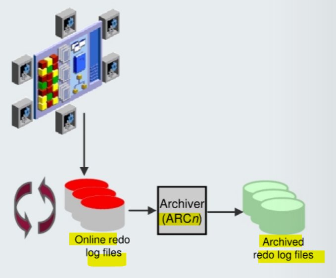

# DBA2 - Creating `Archived Redo Log Files`

[Back](../index.md)

- [DBA2 - Creating `Archived Redo Log Files`](#dba2---creating-archived-redo-log-files)
  - [Creating `Archived Redo Log Files`](#creating-archived-redo-log-files)
    - [`Archiver (ARCn)` Process](#archiver-arcn-process)
    - [Archived Redo Log Files: Naming and Destinations](#archived-redo-log-files-naming-and-destinations)
  - [Configuring `ARCHIVELOG` Mode](#configuring-archivelog-mode)

---

## Creating `Archived Redo Log Files`



- The Oracle Database server treats the `online redo log groups` as a **circular buffer** in which to store transaction information, **filling** one group and then **moving** on to the next.

  - After **all** groups have been **written** to, the Oracle Database server **begins overwriting** information in **the first** `log group`.

- `archived redo log files`

  - a **copy** of the `online redo log group` before allowing it to be overwritten.

- To facilitate the creation of `archived redo log files`:

  1. Specify a **naming convention** for your `archived redo log files`.
  2. Specify a **destination** or destinations for storing your archived redo log files.
  3. Place the database in `ARCHIVELOG` mode.

  - Note: Steps 1 and 2 are not necessary if you are using a `fast recovery area`.

- The **destination should exist** before placing the database in `ARCHIVELOG` mode. When a directory is specified as a destination, there should be a **slash** at the end of the **directory name**.

---

### `Archiver (ARCn)` Process

- `log switch`:

  - When an `online redo log group` **gets filled**, the Oracle Database server begins writing to **the next** `online redo log` group.
  - the process of **switching from one** `online redo log group` to **another**

- `Archiver (ARCn)`:

  - Automatically **archives** `online redo log files` when the database is in `ARCHIVELOG` mode
  - **Preserves** a record of **all changes** made to the database

- The `ARCn` process **initiates archiving** of the filled log group at every `log switch`.

  - It automatically archives the `online redo log group` **before the log group can be reused** so that **all the changes** made to the database are **preserved**.
  - This **enables recovery** of the database to the **point of failure** even if a disk drive is damaged.

- One of the important decisions that a DBA must make is whether to configure the database to operate in `ARCHIVELOG` mode or in `NOARCHIVELOG` mode.

  - In `NOARCHIVELOG` mode, the `online redo log files` are **overwritten** each time a `log switch` occurs.
  - In `ARCHIVELOG` mode, inactive groups of filled `online redo log files` must be **archived before they can be used** again.

- Notes:
  - `ARCHIVELOG` mode is essential for most backup strategies.
  - If the `archived redo log file` **destination fills up** or cannot be written to, the `database` will eventually come to a **halt**停机.
    - **Remove** `archived redo log files` from the archived redo log file **destination** and the database will **resume** operations.移除存档

---

### Archived Redo Log Files: Naming and Destinations

- Destination:

  - single destination:
    - parameter`LOG_ARCHIVE_DEST`
  - Multiple destination:
    - parameters `LOG_ARCHIVE_DEST_n`
    - can be `31` **different destinations**.
    - may be **local** (a directory) or **remote** (an Oracle Net alias for a standby database).
  - If using `file system storage`, it is recommended that you add multiple locations **across different disks**. 分散分布
  - If the `fast recovery area` is enabled, by default the `USE_DB_RECOVERY_FILE_DEST` is specified as an archived redo log file destination.

- Naming:

  - Each `archived redo log file` must have a **unique name** to **avoid overwriting** older log files.
  - To help create unique file names, Oracle Database allows several wildcard characters in the **name format**:

    - `%s`: Includes the **log sequence number** as part of the file name
    - `%t`: Includes the **thread number** as part of the file name
    - `%r`: Includes the **resetlogs ID** to ensure that the archive log file name remains unique (even after certain advanced recovery techniques that reset log sequence numbers)
    - `%d`: Includes the **database ID** as part of the file name

  - **best practice**:
    - should include `%s`, `%t`, and` %r` as .
    - `%d` can also be included if **multiple databases** share the **same** archive log **destination**.

---

## Configuring `ARCHIVELOG` Mode

- Using SQL commands:

  - 1. **Shut down** the database instance if it is open.
  - 2. **Mount** the database.
  - 3. Issue the `ALTER DATABASE ARCHIVELOG` command.
  - 4. **Open** the database.

```sql
shutdown immediate
startup mount
alter database archivelog;
alter database open;
```

- can use `Enterprise Manager Cloud Control` to place the database in `ARCHIVELOG` mode.

- `ARCHIVELOG` mode:

  - prevents redo logs from being overwritten until they have been archived.
  - To put the database in `ARCHIVELOG` mode, the database must be in `MOUNT` mode.
    - If the database is currently **open**, you must **shut it down** cleanly (not abort) and then **mount** it.
  - recovery is possible **until** the time of the **last commit**.
  - Most **production** databases are operated in `ARCHIVELOG` mode.
  - **Back up** your database after switching to `ARCHIVELOG` mode because your database is **recoverable only from the first backup taken in that mode**. 模式转变后,必须备份一次; 从转变后第一次备份开始可恢复性.

- `NOARCHIVELOG` mode

  - **Default** mode
  - **recovery** is possible **only** until the time of the **last backup**.
    - All transactions made **after** that backup are **lost**.

---

[TOP](#dba2---creating-archived-redo-log-files)
