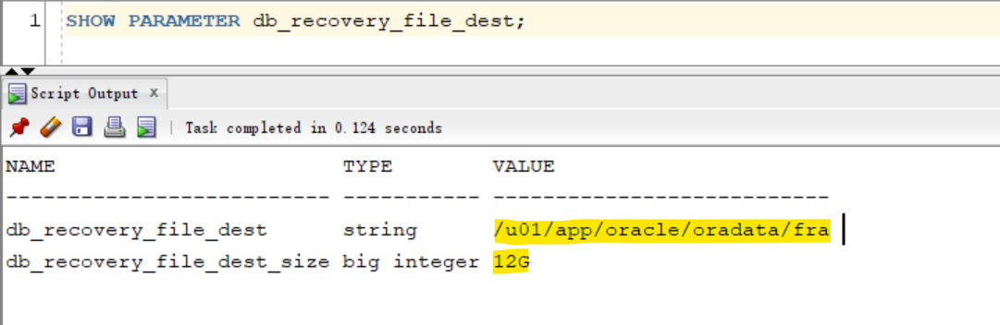
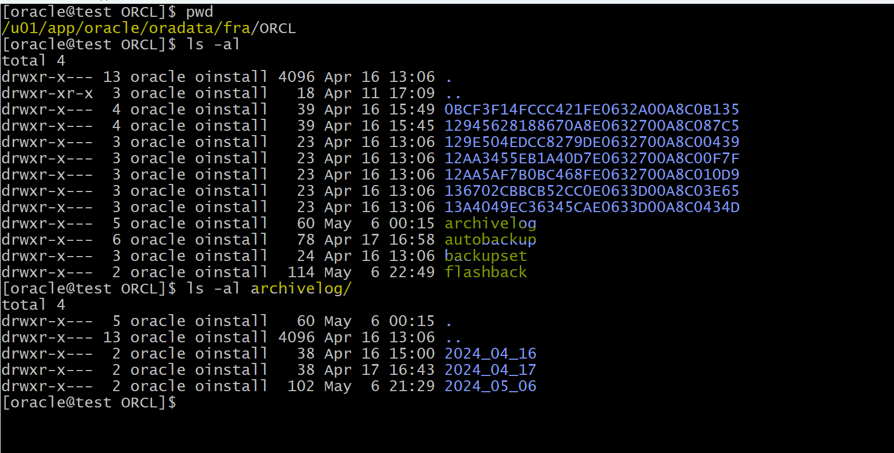
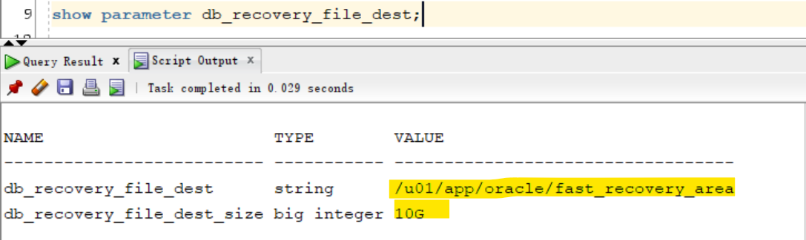

# DBA2 - `Fast Recovery Area`

[Back](../../index.md)

- [DBA2 - `Fast Recovery Area`](#dba2---fast-recovery-area)
  - [`Fast Recovery Area`](#fast-recovery-area)
    - [Configuring the `Fast Recovery Area`](#configuring-the-fast-recovery-area)
    - [Monitoring the Fast Recovery Area](#monitoring-the-fast-recovery-area)
  - [Lab: Query current info of FRA](#lab-query-current-info-of-fra)
  - [Lab: Alter the destination and size of fra](#lab-alter-the-destination-and-size-of-fra)

---

## `Fast Recovery Area`

### Configuring the `Fast Recovery Area`

- `Fast recovery area`:

  - space that is set aside on disk to contain

    - `archived logs`,
    - `backups`,
    - `flashback logs`,
    - multiplexed `control files`,
    - and multiplexed `redo logs`.

  - simplifies **backup storage management** and is strongly recommended.
  - should be placed on storage space that is **separate from** the location of your database `data files`, primary `online log files`, and `control file`.

- The **amount of disk space** to allocate for the `fast recovery area` depends on the **size** and **activity levels** of your database.

  - As a general rule, **the larger** the fast recovery area, **the more useful** it is.
  - Ideally, the fast recovery area should be large enough for copies of your `data` and `control files` and for `flashback`, `online redo`, and `archived logs` needed to recover the database with the backups kept based on the **retention policy**.
  - In short, the fast recovery area should be **at least twice the size** of the database so that it can hold one backup and several archived logs.
  - Location specified by the `DB_RECOVERY_FILE_DEST` parameter
  - Size specified by the `DB_RECOVERY_FILE_DEST_SIZE` parameter

- **Space management** in the fast recovery area is **governed by a backup `retention policy`**.

  - A `retention policy` determines when files are **obsolete**, which means that they are **no longer needed** to meet your data recovery objectives.
  - The Oracle Database server **automatically manages** this storage by **deleting files that are no longer needed.**

- Configuration of the fast recovery area includes specifying the location, size, and retention policy.

```sql
ALTER SYSTEM SET db_recovery_file_dest = directory | disk group
ALTER SYSTEM SET db_recovery_file_destsize = integer [K | M | G]
```

---

### Monitoring the Fast Recovery Area

- Monitor the fast recovery area to **ensure that it does not reach its capacity**.

- If the `instance` is unable to create an archived log because of **lack of space**, it **pauses** until the administrator corrects the situation.

  - Query the `V$RECOVERY_FILE_DEST` view to determine the current **location**, disk **quota**, **space** in use, **space** reclaimable by deleting files, and total **number of files** in the `fast recovery aroa`.
  - Query the `V$RECOVERY_AREA_USAGE` view to determine the **percentage** of the total disk quota used by different types of files.
  - You can also use `GUI` tools such as `Enterprise Manager Cloud Control` to monitor the space usago.

- The **retention time** determines when files are **obsolete** (that is, when they are no longer needed to meet your data recovery objectives).

  - The Oracle Database server **automatically manages this storage**, **deleting** files that are no longer needed.自动管理, 自动删除

- You **can back up** the `recovery area` so that `Oracle Recovery Manager (RMAN)` can **fail over** to other archived redo log destinations if the archived redo log in the fast recovery area is inaccessible or corrupted.可以备份该区域

  - **Periodically copying** backups to tape **frees space** in the `fast recovery area` for other files, but retrieving files from tape causes **longer** database restoration and recovery times.

- Parameters:

  - If the `DB_RECOVERY_FILE_DEST` and `DB_RECOVERY_FILE_DEST_SIZE` parameters values are **not null**, the `fast recovery area` is enabled.
  - Specifying `DB_RECOVERY_FILE_DEST` parameter without also specifying the `DB_RECOVERY_FILE_DEST_SIZE` initialization parameter is not allowed. 必须两个同时设置
  - The change of the `fast recovery area`'s size do not require to restart the database because the `DB_RECOVERY_FILE_DEST_SIZE` parameter is **dynamic**.

| Parameters                   | Description                                        |
| ---------------------------- | -------------------------------------------------- |
| `DB_RECOVERY_FILE_DEST`      | null,Default location for the flash recovery area. |
| `DB_RECOVERY_FILE_DEST_SIZE` | null, size of flash recovery area.                 |

---

## Lab: Query current info of FRA

```sql
-- View the current FRA
show parameter db_recovery_file_dest;
-- NAME                       TYPE        VALUE
-- -------------------------- ----------- ---------------------------
-- db_recovery_file_dest      string      /u01/app/oracle/oradata/fra
-- db_recovery_file_dest_size big integer 10G
```



- Location of FRA



---

## Lab: Alter the destination and size of fra

```sql
-- View the current FRA
show parameter db_recovery_file_dest;

-- alter system to change the path of fra
ALTER SYSTEM SET db_recovery_file_dest='/u01/app/oracle/fast_recovery_area' SCOPE=both;
ALTER SYSTEM SET db_recovery_file_dest_size=10G SCOPE=both;

-- Confirm the current FRA
show parameter db_recovery_file_dest;
```



```sh
# copy all files and dir from old fra to the new fra
cp -Rf /u01/app/oracle/oradata/fra/ORCL/. /u01/app/oracle/fast_recovery_area/ORCL/
```

---

[TOP](#dba2---fast-recovery-area)
