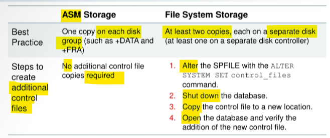
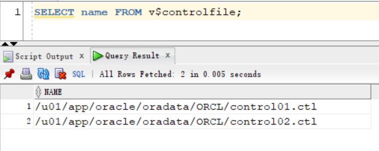
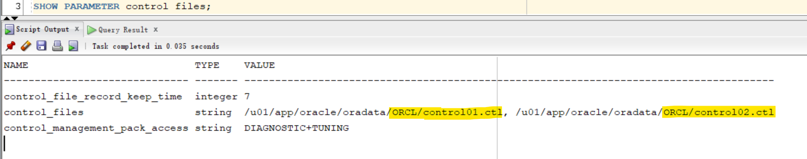
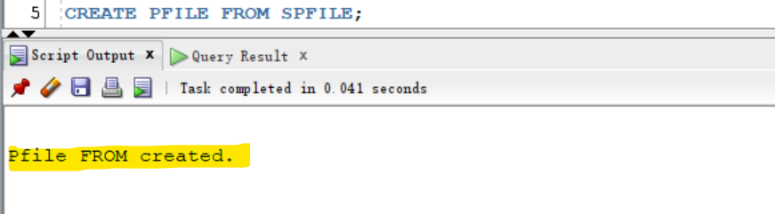
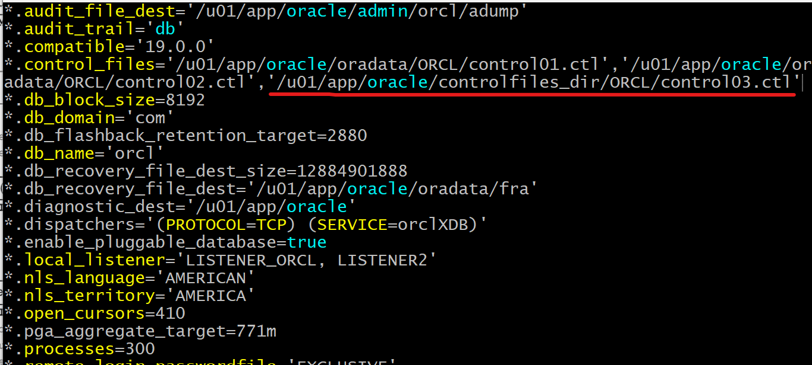
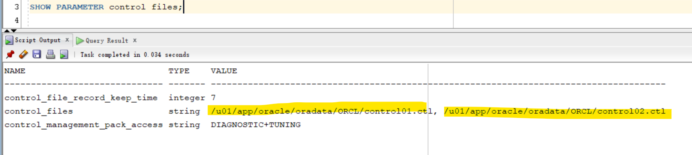
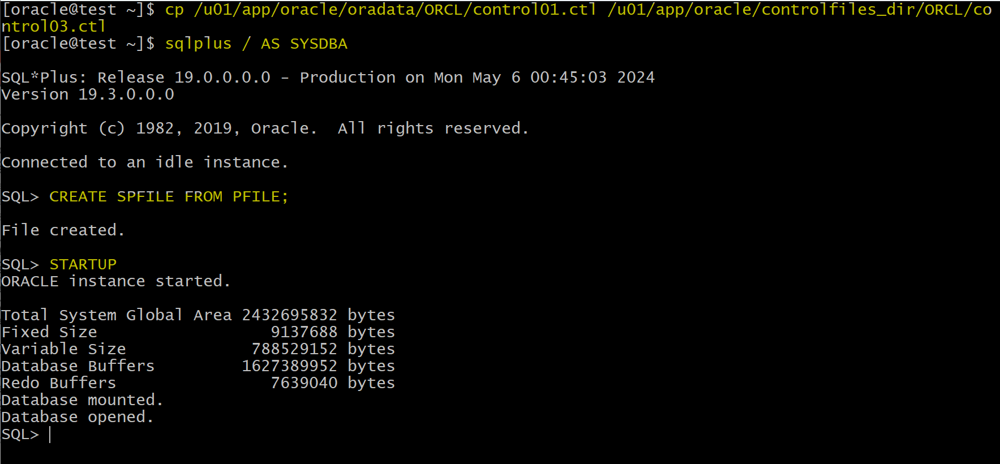
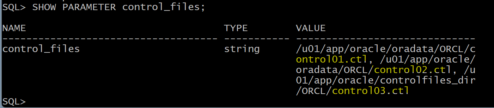
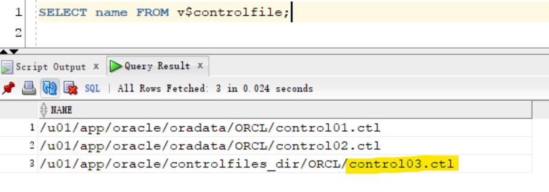

# DBA2 - Multiplexing `Control Files`

[Back](../index.md)

- [DBA2 - Multiplexing `Control Files`](#dba2---multiplexing-control-files)
  - [Multiplexing `Control Files`](#multiplexing-control-files)
    - [Adding a Control File](#adding-a-control-file)
  - [Lab: Muliplexing Control File](#lab-muliplexing-control-file)
    - [Query control file](#query-control-file)
    - [Multiplexing Control File](#multiplexing-control-file)

---

## Multiplexing `Control Files`

To protect against database failure, your database should have **multiple copies** of the `control file`.



- `control file`

  - a binary file that **describes the structure of the database**.
  - It **must be available** for writing by the Oracle server whenever the database is **mounted** or **opened**.
  - **Without** this file, the database **cannot be mounted**
  - **recovery** or **re-creation** of the control file is required.

- Database **should have a minimum of two** `control files` on different storage devices to minimize the impact of a loss of one control file.
  - The **loss** of a single control file causes the `instance` to **fail** because all control files must be available at all times.
  - However, recovery can be a simple matter of **copying** one of the other control files.
  - The loss of all control files is slightly more difficult to recover from but is **not usually catastrophic**.

---

### Adding a Control File

- In a database using regular `file system storage`, adding a control file is a **manual** operation:

  1. Alter the SPFILE with the following command specifying the appropriate location of your files:

  ```sql
  ALTER SYSTEM SET control files =
  '/u0l/app/oracle/oradata/orcl/controlOl.ctl"' ,
  '/u02/app/oracle/oradata/orcl/control02.ctl"' ,
  '/u03/app/oracle/oradata/orcl/control03.ctl' SCOPE=SPFILE;
  ```

  2. **Shut down** the database instance.
  3. Use an **operating system command to copy** an existing control file to the location you select for your new file.
  4. **Open** the database.

---

- If you are using `ASM` as your storage technique, then as long as you have two control files, one in each disk group (such as `+DATA` and `+FRA`), you should **not require further multiplexing**.
- In a database using `Oracle Managed Files (OMF)`—such as a database using ASM storage—all additional control files must be created as **part of a recovery process** using `RMAN` (or using `Enterprise Manager`).

---

## Lab: Muliplexing Control File

### Query control file

```sql
sqlplus / AS SYSDBA
SELECT name FROM v$controlfile;
```

- When the `CDB` was created, `DBCA` created two `control files`.
- When you use the `CREATE DATABASE` command in `SQL*Plus` to create a database, you configure the `CONTROL_FILES` parameter to generate **two** `control files` and set their names.



```sql
SHOW PARAMETER control files;
```



---

### Multiplexing Control File

- Create a parameter file (PFILE) from the server parameter file (SPFILE).
  - Becuase multiplexing the cf needs to edit the pf.

```sql
CREATE PFILE FROM SPFILE;
```



---

- Shut down the database instance in `IMMEDIATE` mode.

```sql
SHUTDOWN IMMEDIATE
EXIT
```

- Copy cf

```sh
# Create a directory for the new control file.
mkdir -p /u01/app/oracle/controlfiles_dir/ORCL

# copy one of control file to directory
cp /u0l/app/oracle/oradata/ORCL/control0l.ctl /u01/app/oracle/controlfiles_dir/ORCL/control03.ctl
```

- Edit pfile to add the new control file
  - `control_files=`

```sh
# Backup pfile
cp $ORACLE_HOME/dbs/initorcl.ora $ORACLE_HOME/dbs/backup_initorcl.ora

vi $ORACLE_HOME/dbs/initorcl.ora
# add ,'/u01/app/oracle/controlfiles_dir/ORCL/control03.ctl'
```



---

- 注意, 该处是对比步骤
- Start instance

```sql
sqlplus / AS SYSDBA

STARTUP
-- view parameter
SHOW PARAMETER control_files
```

Note:

- Why does the CONTROL_FILES parameter still show only two control files?
- By default, the database instance starts up with the `SPFILE`.
  - If an `SPFILE` does not exist, then the instance starts up with a `PFILE`.
  - In this case, both an `SPFILE` and `PFILE` are present, so the `SPFILE` takes precedence.
  - You configured the `PFILE`, not the The `SPFILE` still contains only two references.
  - SPFILE 与 PFILE 同时存在情况下, SPFILE 优先. 以上步骤只修改 PFILE.所以还是显示 2 个 CF



---

- Re-Create CF, because the CF is in the new version after startup

```sql
SHUTDOWN IMMEDIATE
EXIT
```

```sh
# re-create cf
cp /u01/app/oracle/oradata/ORCL/control01.ctl /u01/app/oracle/controlfiles_dir/ORCL/control03.ctl
```

```sql
sqlplus / AS SYSDBA

-- create a spfile from pfile before startup
CREATE SPFILE FROM PFILE;

STARTUP

SHOW PARAMETER control_files;

SELECT name FROM v$controlfiles
```







---

- Clean up

```sh
sqlplus -s / as sysdba <<EOF
-- Starting the Oracle instance
STARTUP;
-- Querying the Oracle instance version
SELECT 'Oracle Database Version: ' || banner FROM v\$version WHERE banner LIKE 'Oracle%';
-- Exiting SQL*Plus
EXIT;
EOF
```

---

[TOP](#dba2---multiplexing-control-files)
