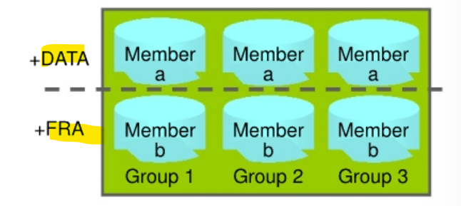

# DBA2 - Multiplexing `Redo Log Files`

[Back](../index.md)

- [DBA2 - Multiplexing `Redo Log Files`](#dba2---multiplexing-redo-log-files)
  - [Multiplexing `Redo Log Files`](#multiplexing-redo-log-files)
  - [Multiplexing `Redo Log Files`](#multiplexing-redo-log-files-1)

---

## Multiplexing `Redo Log Files`

## Multiplexing `Redo Log Files`

- `Redo log groups`

  - made up of one or more `redo log files`.
  - Each `log file` in a group is a **duplicate of the others**.

- Multiplex `redo log groups` to protect against **media failure** and **loss of data**.
  - This increases database I/O.
- It is suggested that redo log groups have:

  - At least **two members (files)** per group 每组至少两个
  - Each member:
    - On a **separate disk** or controller if using `file system storage`
      - If you are using `file system storage`, then each member should be **distributed on separate disks or controllers** so that no single equipment failure impacts an entire log group. 成员分散分布
    - Ina separate **disk group** (such as +DATA and +FRA) if using `ASM`
      - If you are using `ASM` storage, then each member should be **in a separate disk group**, such as `+DATA` and `+FRA`.



- Impact of loss:

  - The loss of an **entire current log group** is one of the most serious `media failures` because it can result in **loss of data**. 全组丢失造成数据丢失

    - Recovery from the **loss of an entire log group** requires advanced recovery techniques and is discussed in the course titled Oracle Database 18c: Backup and Recovery Workshop.

  - The **loss of a single member** of a multiple-member log group is trivial and **does not affect** database operation (other than causing an alert to be published in the alert log).个别成员丢失不影响.

- Note: Multiplexing redo logs may **impact overall database performance**.
  - Remember that multiplexing redo logs may **heavily influence database performance** because a commit **cannot complete until** the transaction information has been **written to the logs**. 多重 redo log 会影响性能, 因为需要等待写入人 log
  - You must place your `redo log files` on your **fastest disks** served by your fastest controllers.
  - If possible, do **not place any other** `database files` on the same disks as your redo log files (unless you are using ASM). Because only one group is written to at a given time, there is no performance impact in having members from several groups on the same disk.
  - For information about file placement in a Database Cloud Service database deployment, see “Characteristics of a Newly Created Deployment” in Administering Oracle Database Cloud Service.

---

- Add a member to an exstng `log group`:

  - Navigate to the `Redo Log Groups` page in `Enterprise Manager Database Express`

    - 1. Select Storage > Redo Log Groups.
    - 2. Select a group and click Add Member.
      - The Add Member page appears.
    - 3. For File System storage, enter the file name and the file directory. Click OK.
    - Repeat these steps for every existing group that you want to multiplex.

- Use the `ALTER DATABASE` command:

  ```sql
  ALTER DATABASE
  ADD LOGFILE MEMBER '/u0l/app/oracle/oradata/orcl/redola.log'
  TO GROUP 1;
  ```

- When you add the **redo log member** to a **group**, the **member's status** is marked as `INVALID` (as can be seen in the `V$LOGFILE` view). 添加后可能显示 invalid, 直到 switch
  - This is the expected state because the new member of the group has **not yet been written to**.
  - When a **log switch occurs** and the group containing the new member becomes `CURRENT`, the member's status changes to `null`.

---

[Top](#dba2---multiplexing-redo-log-files)
