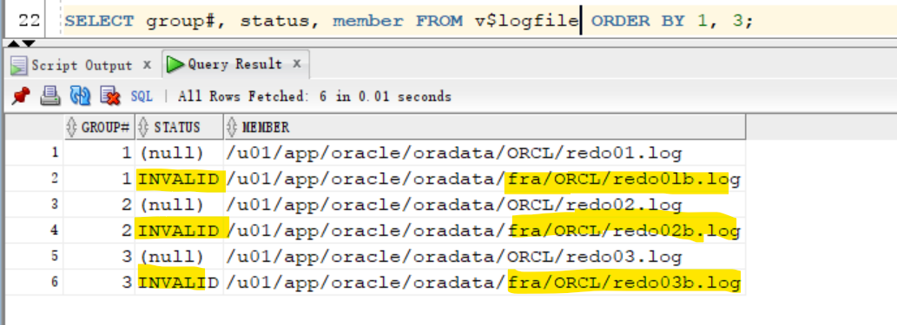

# DBA2 - Multiplexing `Redo Log Files`

[Back](../../index.md)

- [DBA2 - Multiplexing `Redo Log Files`](#dba2---multiplexing-redo-log-files)
  - [Multiplexing `Redo Log Files`](#multiplexing-redo-log-files)
  - [Lab: Multiplexing Redo Log File](#lab-multiplexing-redo-log-file)
    - [Query `Redo Log Group`](#query-redo-log-group)
    - [Add another member to `redo log group`.](#add-another-member-to-redo-log-group)
    - [Switch Logfile and Log Group status](#switch-logfile-and-log-group-status)
    - [Drop redo file group member](#drop-redo-file-group-member)

---

## Multiplexing `Redo Log Files`

- Ensure that there are at **least two** `redo log members` in each group.

  - If a r`edo log member` is damaged or lost, recovery is easier when you have an additional member in the group.

- `Redo log groups`

  - made up of one or more `redo log files`.
  - Each `log file` in a group is a **duplicate of the others**.

- Multiplex `redo log groups` to protect against **media failure** and **loss of data**.
  - This increases database I/O.
- It is suggested that redo log groups have:

  - At least **two members (files)** per group 每组至少两个
  - Each member:
    - On a **separate disk** or controller if using `file system storage`
      - If you are using `file system storage`, then each member should be **distributed on separate disks or controllers** so that no single equipment failure impacts an entire log group. 成员分散分布
    - Ina separate **disk group** (such as +DATA and +FRA) if using `ASM`
      - If you are using `ASM` storage, then each member should be **in a separate disk group**, such as `+DATA` and `+FRA`.


- Impact of loss:

  - The loss of an **entire current log group** is one of the most serious `media failures` because it can result in **loss of data**. 全组丢失造成数据丢失

    - Recovery from the **loss of an entire log group** requires advanced recovery techniques and is discussed in the course titled Oracle Database 18c: Backup and Recovery Workshop.

  - The **loss of a single member** of a multiple-member log group is trivial and **does not affect** database operation (other than causing an alert to be published in the alert log).个别成员丢失不影响.

- Note: Multiplexing redo logs may **impact overall database performance**.
  - Remember that multiplexing redo logs may **heavily influence database performance** because a commit **cannot complete until** the transaction information has been **written to the logs**. 多重 redo log 会影响性能, 因为需要等待写入人 log
  - You must place your `redo log files` on your **fastest disks** served by your fastest controllers.
  - If possible, do **not place any other** `database files` on the same disks as your redo log files (unless you are using ASM). Because only one group is written to at a given time, there is no performance impact in having members from several groups on the same disk.
  - For information about file placement in a Database Cloud Service database deployment, see “Characteristics of a Newly Created Deployment” in Administering Oracle Database Cloud Service.

---

- Add a member to an exstng `log group`:

  - Navigate to the `Redo Log Groups` page in `Enterprise Manager Database Express`

    - 1. Select Storage > Redo Log Groups.
    - 2. Select a group and click Add Member.
      - The Add Member page appears.
    - 3. For File System storage, enter the file name and the file directory. Click OK.
    - Repeat these steps for every existing group that you want to multiplex.

- Use the `ALTER DATABASE` command:

  ```sql
  ALTER DATABASE
  ADD LOGFILE MEMBER '/u0l/app/oracle/oradata/orcl/redola.log'
  TO GROUP 1;
  ```

- When you add the **redo log member** to a **group**, the **member's status** is marked as `INVALID` (as can be seen in the `V$LOGFILE` view). 添加后可能显示 invalid, 直到 switch
  - This is the expected state because the new member of the group has **not yet been written to**.
  - When a **log switch occurs** and the group containing the new member becomes `CURRENT`, the member's status changes to `null`.

---

- Question: Why is it recommended to have three groups when two would be sufficient?
- Answer: The Oracle Database server treats the online redo log groups as a **circular buffer** in which to store transaction information, **filling** one group and then **moving** on to the next. After all groups have been written to, the Oracle Database server begins overwriting information in the first log group.
  - If the database is configured in `ARCHIVELOG` mode, the `LGWR` cannot overwrite data in the first log group if it has not been archived.
  - 为何两个组足够, 但仍然需要 3 个组.
    - archivelog 模式下, 前一个组写完后需要 archived 后才能重用, 此时在 archive 完成前, 则只有一个组, 是一个风险.所以需要至少 3 个.

---

- Question: Can multiplexing redo logs impact database performance?
- Answer: Multiplexing redo logs may **heavily influence** database performance because a **commit** **cannot complete** until the transaction information has been **written to the logs** by `LGWR`.
  - DBA must place `redo log files` on **fastest disks** served by fastest
    **controllers**.
  - If possible, do not place any other `database files` on the same disks as your `redo log files`. Because only one group is written to at a given time, there is no performance impact in having members from several groups on the same disk.
  - df 不建议与 redo log 一起放置.

---

## Lab: Multiplexing Redo Log File

### Query `Redo Log Group`

- Query `V$LOGFILE` to determine the configuration (number of members) for each redo log group.
  - The result shows that there are currently three log groups (1, 2, and 3) and only one member in each group.

```sql
SELECT group#, status, member FROM v$logfile
order by 1;
```


---

### Add another member to `redo log group`.

- 只能一个一个添加

```sql
ALTER DATABASE ADD LOGFILE MEMBER
'/u01/app/oracle/oradata/fra/ORCL/redo0lb.log'
TO GROUP 1;

ALTER DATABASE ADD LOGFILE MEMBER
'/u01/app/oracle/oradata/fra/ORCL/redo02b.log'
TO GROUP 2;

ALTER DATABASE ADD LOGFILE MEMBER
'/u01/app/oracle/oradata/fra/ORCL/redo03b.log'
TO GROUP 3;
```


- Verify that the `redo log files` are now **multiplexed**.
  - The query result shows that each grouphas **two** members, and therefore, the `redo log files` are multiplexed.
  - Observe the `INVALID` status of the newly added redo log members.
    - This status is expected because the new members **have not yet been written to** by `LGWR`.
    - When a `log switch` occurs and the group containing the new member becomes `CURRENT`, the new member's status will change to null.

```sql
SELECT group#, status, member FROM v$logfile ORDER BY 1, 3;
```




---

- Switch log file to update the status of the log file.
  - At last, the status of logfiles are null

```sql
-- query log status
SELECT group#, members, status FROM v$log;

-- switch logfile 3 times, so the switch covers 3 groups.
ALTER SYSTEM SWITCH LOGFILE;
ALTER SYSTEM SWITCH LOGFILE;
ALTER SYSTEM SWITCH LOGFILE;

-- query logfile
SELECT group#, status, member FROM v$logfile ORDER BY 1, 3;
```


---

### Switch Logfile and Log Group status

- Switch logfile to view the status of log
  - `INACTIVE`: the `log group` is **no longer needed** for database instance **recovery**.
  - `ACTIVE`: the `log group` is active but not the **current** log group. It is needed for **crash recovery**. It may be in use for **block recovery**.
  -

```sql
SELECT group#, members, status FROM v$log;
ALTER SYSTEM SWITCH LOGFILE;

SELECT group#, members, status FROM v$log;
ALTER SYSTEM SWITCH LOGFILE;

SELECT group#, members, status FROM v$log;
```


---

- Question: Can the `LGWR` background process write to **only one member** of the `CURRENT` group in case the other members are missing or damaged?
- Answer: **Yes**, it can. As long as there is one member left in the `CURRENT` group, LGWR can work.

- 即 LGWR 需要当前组有至少有一个成员.

---

### Drop redo file group member

- query the current redo log group

```sql
SELECT group#, members, status FROM v$log;
-- 1	2	ACTIVE
-- 2	2	CURRENT
-- 3	2	INACTIVE
```

- Drop the log file member from an non-current group
  - Then switch logfile to move to the next group

```sql
ALTER DATABASE DROP LOGFILE MEMBER
'/u01/app/oracle/oradata/fra/ORCL/redo0lb.log';

ALTER SYSTEM SWITCH LOGFILE;

ALTER DATABASE DROP LOGFILE MEMBER
'/u01/app/oracle/oradata/fra/ORCL/redo02b.log';

ALTER SYSTEM SWITCH LOGFILE;

ALTER DATABASE DROP LOGFILE MEMBER
'/u01/app/oracle/oradata/fra/ORCL/redo03b.log';

ALTER SYSTEM SWITCH LOGFILE;
```


- Verify that each group now has only one member.

```sql
SELECT group#, members, status FROM v$log;
```


---

Clean up

```sh
rm /u01/app/oracle/oradata/fra/ORCL/redo*.log

ls /u01/app/oracle/oradata/fra/ORCL
```

---

[Top](#dba2---multiplexing-redo-log-files)
