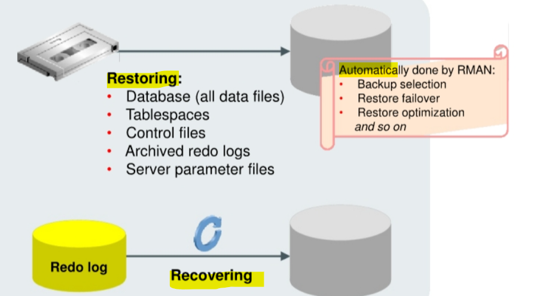

# Restore and Recovery

[Back](../../index.md)

- [Restore and Recovery](#restore-and-recovery)
  - [Data Repair Techniques](#data-repair-techniques)
  - [Restoring and Recovering](#restoring-and-recovering)
    - [Restoring a file](#restoring-a-file)
    - [Recovering the file](#recovering-the-file)
    - [Syntax](#syntax)
  - [Best Practices: to Restore and Recovery Performance](#best-practices-to-restore-and-recovery-performance)

---

## Data Repair Techniques

- To respond to potential **data loss**:
  - **Physical failure** (missing or corrupted `data file`):
    - `Data Recovery Advisor`:
      - diagnose failures and advise you on how to respond to them, and repair the failures automatically.
    - `Data File Media Recovery`:
      - the **most general-purpose** form of recovery and can protect against both **physical** and **logical** failures.
      - enables you to **restore** `data file` backups and **apply** `archived redo logs` or `incremental backups` to **recover** lost changes.
      - can recover either a **whole** database or a **subset** of the database.
    - `Block Recovery`
      - a form of **media recovery** that enables you to **recover individual blocks** within a data file rather than the whole data file.
  - **Logical failure** (application or user error):
    - `Logical Flashback` Features:
      - enable you to **view or rewind** individual database objects or transactions **to a past time**.
      - do not require the use of RMAN.
    - `Oracle Flashback` Database:
      - a **block-level recovery** mechanism
      - does not require a backup to be restored
      - must have a `fast recovery area` configured for logging for flashback database or guaranteed restore points.
    - `Point-in-Time Recovery` / `incomplete recovery`: recover to a **noncurrent time**
      - `Database Point-in-Time Recovery (DBPITR)`:
        - **restores the database** from backups before the target time for recovery and then uses `incremental backups` and `redo` to roll the database forward to the target time.
      - `Tablespace Point-in-Time Recovery (TSPITR)`:
        - **recovers a tablespace** to a time earlier than the rest of the database.
        - use auxiliary database
      - `Table Point-in-Time Recovery (TPITR)`
        - **recovers a table** to an earlier point in time.
        - use auxiliary database

---

## Restoring and Recovering



---

### Restoring a file

- `Restoring a file`:
  - the process of **copying a backup into a new (or repaired) disk** to be used by the database.
  - **retrieving a copy** of the `data file` from a backup
  - It is necessary when a file is damaged as a result of physical disk's failure, caused by hardware problems.
- The file types that can be restored:

  - Database (all `data files`)
  - Tablespaces
  - `Control files`
  - `Archived redo logs`
  - `Server parameter files`

- RMAN:

  - uses the records of available `backup sets` or `image copies` in the RMAN repository **to select the best available backup**s.
    - If **two** backups are from the same point in time, then RMAN **prefers** `image copies` over backup sets because RMAN can restore them more quickly 复制映像优先
  - **automatically** uses restore failover to **skip corrupted or inaccessible backups** and look for usable backups. 自动跳过错误文件
  - By default, RMAN **skips** restoring a data file if the file is **present in the correct location** and its **header** contains the expected information, and so on.自动略过正确文件

- If backups are stored on a `media manager`, **channels** must be configured or allocated for use in accessing backups stored there.

---

### Recovering the file

- `Recovering the file`
  - entails **applying redo** such that the state of the file is brought forward in time, to whatever point you want.
  - **reapplying changes** to the file **since the backup** from the `archived` and `online redo logs`, to bring the database to the desired SCN (usually the most recent one).

---

### Syntax

- `RESTORE` command:
  - **Restores database files** from backup
- `RECOVER` command:
  - Recovers the restored files by **applying changes recorded** in `incremental backups` and redo `log files`

```sql
RESTORE {DATABASE | TABLESPACE name [,name]... | DATAFILE name [,name] }...

RECOVER {DATABASE | TABLESPACE name [,name]... | DATAFILE name [,name] }...

ALTER TABLESPACE inv_tbs OFFLINE IMMEDIATE;
RESTORE TABLESPACE inv_tbs;
RECOVER TABLESPACE inv_tbs;
ALTER TABLESPACE inv_tbs ONLINE;

```

- The `Enterprise Manager Cloud Control Recovery Wizard` creates and runs an RMAN script to perform the recovery.

---

## Best Practices: to Restore and Recovery Performance

- using `incremental backups` to **Minimize the number** of `archive logs` to be applied:

  - **`Cumulative incremental backups`**:

    - **Only the most recent** `cumulative incremental backup` must be applied. This reduces tape library requests for media backups. 只适用于最近
    - recommened when the speed of recovery is concerned.

  - **`Differential incremental backups`**:
    - **All** `differential incremental level 1 backups` since the restored data file backup must be applied. 所有
    - recommened when the space of backup is concerned.

- Use `block media recovery` for **isolated** `block corruptions`.
- Keep an adequate number of `archived logs` **on disk**.
- **Increase** RMAN buffer **memory** usage.
- Tune the database for `I/O`, DBWR performance, and CPU utilization. |

---

[TOP](#restore-and-recovery)
