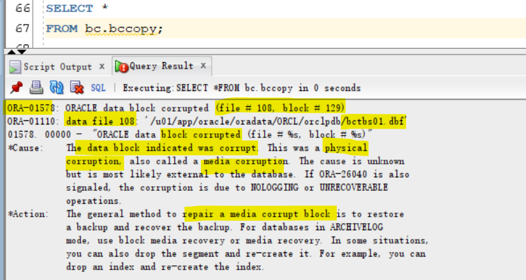

# Recovery - Block Corruption & Block Media Recovery

[Back](../../index.md)

- [Recovery - Block Corruption \& Block Media Recovery](#recovery---block-corruption--block-media-recovery)
  - [Block Corruption](#block-corruption)
    - [`ORA-01578 error`](#ora-01578-error)
  - [Corruption Handling](#corruption-handling)
    - [Parameters to Detect Corruption](#parameters-to-detect-corruption)
  - [Block Media Recovery](#block-media-recovery)
    - [Prerequisites](#prerequisites)
    - [Recovering Individual Blocks](#recovering-individual-blocks)
  - [Lab: Block Media Recovery](#lab-block-media-recovery)
    - [Setup Environment](#setup-environment)
    - [Query Block Corruption](#query-block-corruption)
    - [Clean up](#clean-up)
  - [Best Practice: Proactive Checks](#best-practice-proactive-checks)
  - [Lab: Validate the database](#lab-validate-the-database)

---

## Block Corruption

- `Corrupted data block`:

  - a block
    - that is **not in a recognized Oracle format**
    - whose contents are **not internally consistent**.
    - **caused** by: 原因: 硬件/OS
      - faulty **hardware**
      - **operating system** problems.

- types of curroptions:

  - `Physical/Media corruption`
  - `Logical/Software corruption`

- `Corrupt blocks` are discovered 被发现的时间

  - when they are **accessed**
  - during a `validation check`.
    - consists of checking **all blocks** in the object that have **not previously been marked corrupt**.只检查未被标记的块
    - For each block, the **transaction** and **data layer portions** are checked for **self-consistency**.
    - During `CHECK_OBJECT`, if a block is encountered that **has a corrupt buffer cache header**, then that block is **skipped**.

- Whenever a block is **read or written**, a **consistency check** is performed:

  - Block version
  - DBA (data block address) value in cache as compared to the DBA value in the block buffer
  - Block-checksum, if enabled

- the database **marks** a block as **media corrupt** and then **writes it to disk** 标记并写入磁碟

  - when the corruption is first encountered. 第一次碰到时
  - **No subsequent read** of the block will be **successful** until the block is recovered. 一旦标记, 无法被读取.

---

- `Physical/Media corruption`:

  - the **block format** is not correct
    - the information in the block does **not make any sense** after being read from disk.
  - the block that the database **does not recognize**.不能被识别
    - the **checksum** is invalid,
    - the block contains **all zeros**
    - the block **header** is fractured.
  - by **default**, `Physical corruption checking` is **enabled**.默认会检查
  - **repaired by**:修复
    - **recovering** the block
    - **dropping** the database object that contains the corrupt block
    - If `media corruption` is due to faulty **hardware**
      - the problem will not be completely resolved **until the hardware fault is corrected**.

- `Logical/Software corruption`:

  - The block **has a valid checksum**, the header and footer **match**, but the **contents are inconsistent**. 能被识别, 但对象不能对齐.
    - marked corrupt by the **Oracle database** after it detects the inconsistency.检查到不对齐会标记
    - raises an **Oracle internal error**. 不对齐会引发内部错误
  - by default, `Logical corruption checking` is **disabled**. 默认不会检查
  - `CHECK LOGICAL` option to check for logical corruption.
  - **cannot be repaired** by `Block media recovery`

- `Block corruptions` can be divided into `interblock corruption` and `intrablock corruption`.

  - `intrablock corruption`:
    - the corruption occurs **within the block itself**
    - can be either `physical or logical corruption`. 可以是物理或逻辑
  - `interblock corruption`:
    - the corruption occurs **between blocks**
    - can be **only** `logical corruption`. 只能是逻辑

---

### `ORA-01578 error`

- `ORA-01578 error`

  - `"ORACLE data block corrupted (file # %s, block # %s)"`
  - generated when a corrupted data block is found
  - 返回:
    - returned **to the session that issued the query** being performed when the corruption was discovered 当前 session
    - Appears in the `alert.log` file

- Always returns the tablespace **relative file number** and **block number**错误信息

  - `ORA-01578` returns the **tablespace relative file number**相对文件编号
  - the accompanying `OR2-01110 error` displays the **absolute file number**. 绝对文件编号

- Usually, the result of a **hardware** problem. 问题诊断
  - If the `ORA-01578 error` is **always** returned with the **same** arguments, it is **most likely** a `media corrupt block`.
  - If the arguments **change** each time, there **may** be a **hardware** problem, and you should have the memory and page space checked and the I/O subsystem checked for bad controllers.

---

## Corruption Handling

- **Diagnosis**:

  - Check the `alert log` and `operating system log` file.
  - Use available diagnostic tools to **find out the type of corruption**.
  - To determine whether the error **persists**, run **checks multiple times** by:
    - `ANALYZE` command:
      - `ANALYZE TABLE emp VALIDATE STRUCTURE CASCADE ONLINE;`
    - if possible, perform a **shutdown** and a **startup** and **try again to perform the operation** that failed earlier.

- **Recovery:**

  - Recover data from the corrupted object if necessary.
  - Recover or restore data from the corrupt object if necessary.
  - Resolve any hardware issues:

    - Memory boards
    - Disk controllers
    - Disks

  - Find out whether there are **more corruptions**.

  - If you encounter one, there may be other corrupted blocks as well.

- `Hardware failures` should be **addressed immediately**.
  - When you encounter hardware problems, the vendor should be contacted and the machine should be checked and fixed before continuing.
  - A full hardware diagnostics session should be run.

---

### Parameters to Detect Corruption

| Parameter           | Use                                 |
| ------------------- | ----------------------------------- |
| `DB_BLOCK_CHECKING` | Prevent memory and data corruption  |
| `DB_BLOCK_CHECKSUM` | Detect I/O storage, disk corruption |

Recommended generic block-corruption **parameters**:

- `DB_BLOCK_CHECKING`

  - **initiates checking** of `database blocks`.
  - used to **prevent memory and data corruption**.
  - Default: `FALSE`
  - recommended: `FULL` or `MEDIUM`

- `DB_BLOCK_CHECKSUM`:

  - **initiates the calculation and storage of a checksum** in the `cache header` of every data block when **writing** it to disk.
  - `Checksums`
    - **assist in detecting corruption** caused by underlying disks, storage systems, or I/O systems.
  - Default: `TYPICAL`
  - recommended: `FULL`

- Each of the parameters set to detect corruption **impacts performance** to varying degrees and thus requires testing before production use.

---

## Block Media Recovery

- `Block media recovery`:

  - recover only on blocks that are **marked corrupt** or **fail a `corruption check`**.

  - By default, RMAN **searches**

    - for **good copies of the blocks** in the `flashback logs`
      - When RMAN finds **good copies**, it **restores** them and performs `media recovery` **on the blocks**. 映像备份优先
      - `Block media recovery` can **use only** `redo logs` for media recovery, not incremental backups. 只使用 redo logs
    - then for the **blocks** in `full or level 0 incremental backups`.

- Benefits

  - Lowers the `mean time to recover (MTTR)`
  - Increases **availability** during media recovery
    - The data file **remains online** during recovery.
    - Only **blocks being recovered** are **inaccessible**.

- **Syntax**:

```sql
-- Recover a single block
RECOVER DATAFILE 6 BLOCK 3;

-- Recover multiple blocks in multiple data files
RECOVER
DATAFILE 2 BLOCK 43
DATAFILE 2 BLOCK 79
DATAFILE 6 BLOCK 183;

-- Recover all blocks logged in V$DATABASE_BLOCK_CORRUPTION
RECOVER CORRUPTION LIST;
```

- `V$DATABASE_BLOCK_CORRUPTION` View:

  - view to display blocks marked corrupt.
  - including both `Physical/Media corruption` and `Logical corruption`

---

**Example**:

- the following messages in a user trace file:

```txt
ORA-01578: ORACLE data block corrupted (file # 7, block # 3)
ORA-01110: data file 7: '/oracle/oradata/orcl/tools01l.dbf’
ORA-01578: ORACLE data block corrupted (file # 2, block # 235)
ORA-01110: data file 2: '/oracle/oradata/orcl/undotbsOl.dbf’'
```

- Command to recovery
  - the error message indicates multiple errors in multiple files.

```sql
RECOVER
DATAFILE 7 BLOCK 3
DATAFILE 2 BLOCK 235;
```

---

### Prerequisites

- The target database must run in `ARCHIVELOG` mode and be **open or mounted** with a current control file.
- **not** `proxy copies`:
  - The **backups** of the data files containing the `corrupt blocks` must be `full or level 0 backups`. 包含在全备份中
- `Proxy copies`:
  - must be restored to a **nondefault location** on disk, in which case RMAN considers them data file copies and
    searches them for blocks during block media recovery. 即不能在默认路径中直接使用
- RMAN can use **only** `archived redo logs` for the recovery.
  - **cannot** use `level 1 incremental backups`.
  - `Block media recovery` **cannot** survive a **missing or inaccessible** `archived redo log`, although it can sometimes survive missing redo records.
- To enable RMAN to search the `flashback logs` for good copies of corrupt blocks, `Flashback Database` must be **enabled**.
  - If `flashback logging` is **enabled** and contains older, uncorrupted versions of the corrupt blocks, then RMAN can use these blocks, possibly **speeding up the recovery**. flashback logging 可以提高效率, 但前提是启动 flashback.

---

### Recovering Individual Blocks

- `RECOVER. . . BLOCK` command:

  - **Identifies** the **backups containing the blocks** to recover
  - **Reads** the backups and **accumulates requested blocks** into in-memory buffers
  - Manages the block media recovery session by **reading** the `archive logs from backup` if necessary

- must **identify** the `corrupt blocks` **before** block recovery can take place
- method to get information of corrupt blocks:

  - Results of the `LIST FAILURE`, `VALIDATE`, or `BACKUP ... VALIDATE` command
  - `V$DATABASE_BLOCK_CORRUPTION` view
  - **Error messages** in standard output
  - The `alert log` and user `trace files` (identified in the `V$DIAG_INFO` view)
  - Results of the `SQL ANALYZE TABLE` and `ANALYZE INDEX` commands
  - Results of the `DBVERIFY` utility

---

## Lab: Block Media Recovery

### Setup Environment

- create the `BC` user, the `BCTBS` tablespace, and the `BCCOPY` table.

```sql
sqlplus / as sysdba

ALTER SESSION SET container=orclpdb;
show con_name
ALTER DATABASE open;
show pdbs

-- CLEANUP from previous run
DROP USER bc CASCADE;
DROP TABLESPACE bctbs INCLUDING CONTENTS AND DATAFILES;

-- Create tablespace
CREATE TABLESPACE bctbs
DATAFILE '/u01/app/oracle/oradata/ORCL/orclpdb/bctbs01.dbf'
SIZE 10M REUSE
SEGMENT SPACE MANAGEMENT MANUAL;

-- Create user
CREATE USER bc IDENTIFIED BY pass4BC
DEFAULT TABLESPACE bctbs
QUOTA UNLIMITED ON bctbs;

GRANT CREATE SESSION TO bc;

-- create table and populate
-- be sure table is at least 2 blocks long
CREATE TABLE bc.bccopy
TABLESPACE bctbs
AS SELECT * FROM HR.EMPLOYEES;

INSERT INTO bc.bccopy
SELECT * FROM bc.bccopy;

INSERT INTO bc.bccopy
SELECT * FROM bc.bccopy;

--  confirm table has been created
SELECT salary
FROM bc.bccopy
WHERE rownum = 1;
```


- Create backup of the bctbs tablespace

```sql
rman target "'sys@orclpdb as sysdba'"
-- backup tbsp
BACKUP AS COPY TABLESPACE bctbs;

EXIT
```


- update the table

```sql
sqlplus / as sysdba

ALTER SESSION SET container=orclpdb;
show con_name
UPDATE bc.bccopy SET salary = salary+1;
COMMIT;

-- confirm updated
SELECT salary
FROM bc.bccopy
WHERE rownum = 1;
```


- Corrupt a data file created

  - The corrupt block error is expected. The script performs a query against the `Bccopy` table to force the corrupt block to be discovered.

```sql
sqlplus / as sysdba

ALTER SESSION SET container=orclpdb;
-- Find the file and block numbers
SELECT DISTINCT
   MIN(DBMS_ROWID.ROWID_RELATIVE_FNO(rowid)) as FILE_NO,
   MIN(DBMS_ROWID.ROWID_BLOCK_NUMBER(rowid)) as BLOCK_NO
FROM bc.bccopy;
-- FILE_NO  BLOCK_NO
-- 108	    129

ALTER SYSTEM FLUSH BUFFER_CACHE;
```


- When prompted, enter the block number that is displayed in the `BLOCK_NO` column.

```sh
# linux bash command
# Corrupts 2 consecutive blocks.
# make sure the table is in 2 consequetive blocks
# the location of data file
FILE='/u01/app/oracle/oradata/ORCL/orclpdb/bctbs01.dbf'
# block_no
BLOCK=129
# the block size
BLOCKSIZE=8196

# write the content to the block
dd of=$FILE bs=$BLOCKSIZE conv=notrunc seek=$BLOCK <<EOF
the content is written to block
EOF

dd of=$FILE bs=$BLOCKSIZE conv=notrunc seek=`expr 1 + $BLOCK` <<EOF
the content is written to the next block
EOF
```


- Query the table after corruption.

```sql
SELECT *
FROM bc.bccopy;

/*
ORA-01578: ORACLE data block corrupted (file # 106, block # 129)
ORA-01110: data file 106: '/u01/app/oracle/oradata/ORCL/orclpdb/bctbs01.dbf'
01578. 00000 -  "ORACLE data block corrupted (file # %s, block # %s)"
*Cause:    The data block indicated was corrupt. This was a physical
           corruption, also called a media corruption. The cause is unknown
           but is most likely external to the database. If ORA-26040 is also
           signaled, the corruption is due to NOLOGGING or UNRECOVERABLE
           operations.
*Action:   The general method to repair a media corrupt block is to restore
           a backup and recover the backup. For databases in ARCHIVELOG
           mode, use block media recovery or media recovery. In some situations,
           you can also drop the segment and re-create it. For example, you can
           drop an index and re-create the index
*/

```



---

### Query Block Corruption

- Query view

```sql
SELECT *
FROM V$DATABASE_BLOCK_CORRUPTION;
-- 108	129	2	0	CHECKSUM	3
```


- Use rman to check and advice failure

```sql
rman target "'/ as sysbackup'"

-- Check failures
LIST FAILURE;
-- view suggested repair strategy.
ADVISE FAILURE;

-- preview the recovery script
REPAIR FAILURE PREVIEW;
-- # block media recovery for multiple blocks
-- recover datafile 108 block 129 to 130;

-- recover the corrupted blocks.
REPAIR FAILURE;
-- Confirm the recovery
LIST FAILURE;

EXIT
```


- Confirm the block recovery by querying table

```sql
$ sqlplus / as sysdba

alter session set container = orclpdb;
-- query after recovery
SELECT salary
FROM BC.BCCOPY
WHERE rownum = 1;

exit
```


---

### Clean up

- cleanup backup copy

```sql
rman target "'sys@orclpdb as sysdba'"
DELETE NOPROMPT copy of tablespace bctbs;
exit;
```


- cleanup tablespace and user

```sql
sqlplus / as sysdba

ALTER SESSION SET container=orclpdb;
DROP USER bc CASCADE;
DROP TABLESPACE bctbs INCLUDING CONTENTS AND DATAFILES;

EXIT;
```

---

## Best Practice: Proactive Checks

- `proactive health checks`: 主动防御, 周期性检查

  - possibly **daily** during **low peak interval periods**
  - can schedule `periodic health checks` through
    - the `Health Monitor`
    - the RMAN `VALIDATE` command.
  - can turn on parameter to check for logical and physical corruption.
  - Can check the findings logged in the ADR.

- In general, when a `reactive check` detects failure(s) in a database component, you may want to execute a more **complete check** of the affected component. 被动检查出失败, 则需要全面检查.

---

- `VALIDATE` command:

  - **Scans** the specified files and **verifies** their contents
    - **Confirms** that the data files **exist** and are in the **correct location**检查文件是否存在在正确路径
    - **Checks** for `corrupt data blocks`
    - **Skips** `never-used blocks`
    - Can check **individual** `backup sets` and `data blocks`可以检查个别备份和数据文件
  - **Displays** failures and **logs** them in the `ADR`
    - can use the `LIST FAILURE` command to view all failures recorded in the repository.
  - By default, the VALIDATE command checks for `physical corruption` **only**. 默认只检查物理坏块
    - can specify `CHECK LOGICAL` to check for logical corruption as well.
  - checks for `intrablock corruptions` only.

- `VALIDATE DATABASE` command

  - used to **invoke health checks** for the database and its components.
  - extends the existing `VALIDATE BACKUPSET` command.
  - displays Any problem detected during validation.
  - Problems initiate the execution of a **failure assessment**.
  - If a failure is **detected**, it is logged into `ADR` as a finding.

---

## Lab: Validate the database

- outputs the same information you would see during a backup,
  - but **no backup is created**.
  - Any block corruptions are visible in the `V$DATABASE_BLOCK_CORRUPTION` view, as well as in the R**MAN output**.

```sql
rman target /

-- alidate the database
BACKUP VALIDATE DATABASE ARCHIVELOG ALL;

LIST BACKUP;
-- no backup was created
```


- By default the command only checks for `physical corruption`.
  - Add the `CHECK LOGICAL` clause to include checks for `logical corruption`.

```sql
BACKUP VALIDATE CHECK LOGICAL DATABASE ARCHIVELOG ALL;
```


---

[TOP](#recovery---block-corruption--block-media-recovery)
