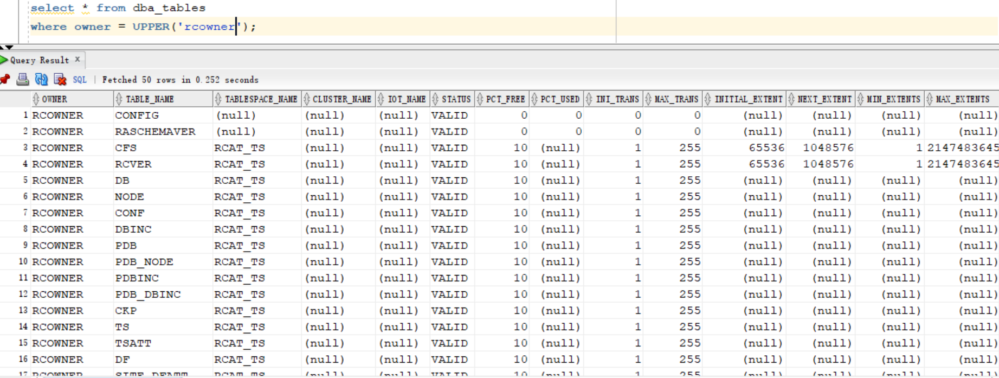
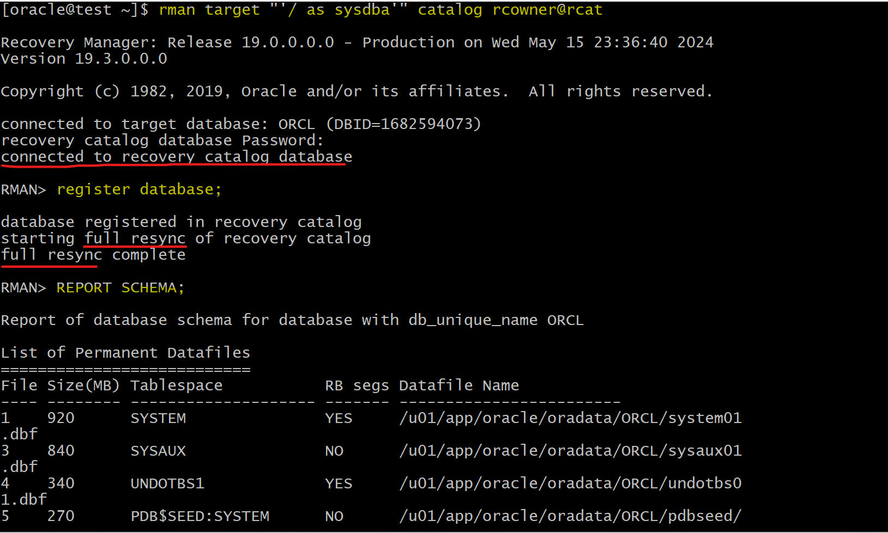
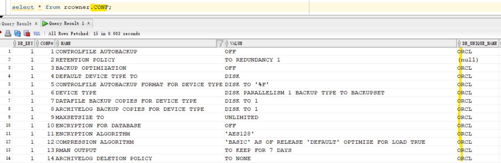
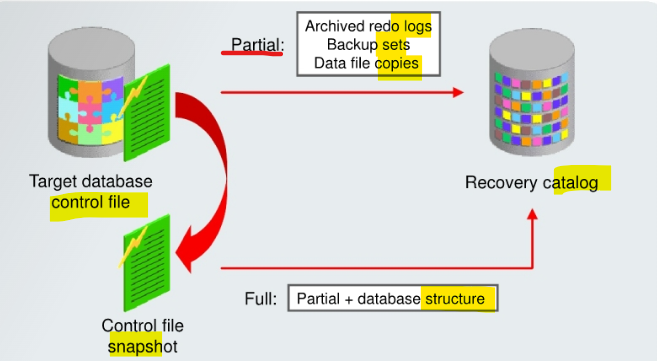
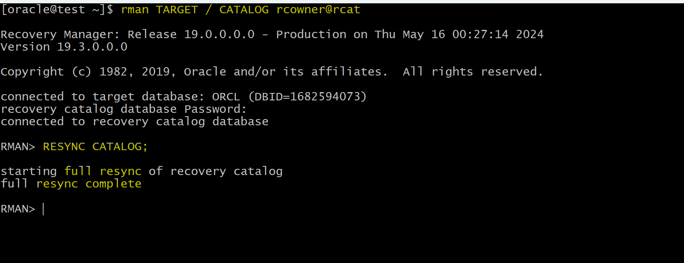

# Recovery - Catalog

[Back](../../index.md)

- [Recovery - Catalog](#recovery---catalog)
  - [Recovery Catalog](#recovery-catalog)
    - [Pros and Cons](#pros-and-cons)
    - [`Control File` vs `Catalog`](#control-file-vs-catalog)
  - [Creating a Recovery Catalog](#creating-a-recovery-catalog)
    - [Configuring the Recovery Catalog Database](#configuring-the-recovery-catalog-database)
    - [Creating the Recovery Catalog Owner](#creating-the-recovery-catalog-owner)
    - [Creating the Recovery Catalog](#creating-the-recovery-catalog)
    - [Lab: Create a Recovery Catalog](#lab-create-a-recovery-catalog)
    - [Lab: Configuring the Recovery Catalog](#lab-configuring-the-recovery-catalog)
  - [Registering a Target Database](#registering-a-target-database)
    - [Lab: Registering a Database](#lab-registering-a-database)
  - [Unregistering a Target Database](#unregistering-a-target-database)
  - [Recovery Catalog Resynchronization](#recovery-catalog-resynchronization)
    - [Manually Resynchronizing](#manually-resynchronizing)
    - [Lab: Manually Resynchronizing](#lab-manually-resynchronizing)

---

## Recovery Catalog

- The RMAN repository data is

  - always stored in the `control file` of the target database.
  - can also, additionally, be stored in a **separate database** in a `recovery catalog`.

---

- `recovery catalog`

  - preserves **backup information** in a separate database, which is useful in the event of a lost control file.


- **RMAN** propagates information about target database into the `recovery catalog` from the target database's `control file` after any operation that updates the repository and also before certain operations, including:

  - `database structure`,
  - `archived redo logs`,
  - `backup sets`,
  - `data file copies`

- 是 RMAN 更新目标信息; 从 cf 提取; 时机:任何更新之后; 文件: 结构, log, bs, copy

- **Prerequisites**: 前设:同时连接两个实例
  - For information propagation to take place, the RMAN client must be connected to both
    - the `target database instance`
    - the `catalog database instance`

---

### Pros and Cons

Benefits

- Stores **more historical information** than the `control file`
  - `CF` has finite space for records of backup activities.
  - enables you to perform a **recovery that goes back further** in time than the history in the control file.
- Enables you to use RMAN-stored **scripts**
- Enables you to **create customized reports** for all registered targets
  - A **single** `recovery catalog` is able to store information for **multiple** target databases. 一对多
  - the backup and recovery information for all registered targets is contained in one place, allowing you to create customized reports by connecting as the recovery catalog owner and querying the various RC views.
  - Note: `Enterprise Manager Cloud Control` also enables you to view backup information for **multiple** databases **without** the use of a recovery catalog.
- Enables you to use the `KEEP FOREVER` clause of the `BACKUP` command
  - Usage of `KEEP FOREVER` clause can create a backup that is retained for a different period of time from that specified by the configured `retention policy`.
- Allows you to **list** the `data files` and `tablespaces` that are or were in the target database at a given time
  - The `REPORT SCHEMA` command **lists** the tablespaces and data files in the target database.
  - If you add the option of `AT [time |scn|logseq]`, you can see the information at some time in the past.
  - You can use the `AT` option **only** if you are using a recovery catalog.
- Enables you to restore and recover following the **loss** of the `control file` because it preserves RMAN repository **metadata**

Disadvantage of `recovery catalog`

- need to manage and back up **another database**

---

### `Control File` vs `Catalog`

- `Control File`:
  - Default
  - Simpler administration
  - simple backup management requirements
- `recovery catalog`:
  - longer backup retention.
  - when you use RMAN in a Data Guard configuration
  - **Replicates** `control file` data
  - Stores more backup **history**
  - Services **many** targets
  - Stores RMAN **scripts**
  - Provides more **protection** options for **metadata**

---

## Creating a Recovery Catalog

To create a recovery catalog, perform the following three steps:

1. Configure the **database** in which you want to store the recovery catalog.
2. Create the recovery catalog **owner**.
3. Create the **recovery catalog**.


---

### Configuring the Recovery Catalog Database

- Allocate space for the recovery catalog.

  - Consider:
    - **Number of databases** supported by the recovery catalog
      - amount of **space** required by the recovery catalog schema depends on the number of databases monitored by the catalog.
    - **Number** of `archived redo log files` and **backups recorded**
      - The space increases as the number of archived redo log files and backups for each database increases.
    - Use of RMAN-stored scripts
      - space must be allocated for those scripts.

- Create a `tablespace` for the `recovery catalog`, which will be designated as the **default** tablespace for the **recovery catalog owner**.

```sql
-- request 15 MB for each database registered in the recovery catalog.
CREATE TABLESPACE rcat_ts DATAFILE <data file name> SIZE 15M;
```

---

### Creating the Recovery Catalog Owner

- Create the recovery catalog **owner**.
  - user as the recovery catalog owner
  - Set the default `tablespace` for this user to the tablespace you created for the recovery catalog.
  - provide `UNLIMITED` **quota** on this tablespace for the user.
- Grant the `RECOVERY_CATALOG_OWNER` **role**.
  - `RECOVERY_CATALOG_OWNER` role:
    - provides privileges for the owner of the recovery catalog.
    - includes:
      - `CREATE SESSION`
      - `ALTER SESSION`
      - `CREATE CLUSTER`
      - `CREATE DATABASE LINK`
      - `CREATE PROCEDURE`
      - `CREATE SEQUENCE`
      - `CREATE SYNONYM`
      - `CREATE TRIGGER`
      - `CREATE TYPE`
      - `CREATE TABLE`
      - `CREATE VIEW`

```sql
CREATE USER rcowner IDENTIFIED BY rcpass
TEMPORARY TABLESPACE temp
DEFAULT TABLESPACE rcat_ts
QUOTA UNLIMITED ON rcat_ts;

GRANT recovery_catalog_owner TO rcowner;
```

---

### Creating the Recovery Catalog

- After creating the catalog owner, use the RMAN `CREATE CATALOG` command to **create the catalog tables** in the **default** `tablespace` of the `catalog owner`.

Note: As with any database, if the `ORACLE_SID` environment variable is set to the `SID` for the `recovery catalog database`, there is no need to supply the service name in the `CONNECT` statement.

```sql
-- Connect to the recovery catalog database as the catalog owner:
-- rman
CONNECT CATALOG username/password@net_service_name

-- Execute the CREATE CATALOG command:
CREATE CATALOG;
```

---

### Lab: Create a Recovery Catalog

- In this lab, it should use a differenct database instance that has a different ORACLE_SID, as the recovery catalog.
  - to make it simple, this lab uses only one database instance but different pdb.

```sql
-- create a pdb as a rcat
CREATE PLUGGABLE DATABASE rcat
  ADMIN USER rcatadmin IDENTIFIED BY welcome
  ROLES = (dba)
  DEFAULT TABLESPACE users
  DATAFILE '/u01/app/oracle/oradata/ORCL/RCAT/users01.dbf'
  SIZE 250M
  AUTOEXTEND ON
  FILE_NAME_CONVERT = ('/u01/app/oracle/oradata/ORCL/pdbseed/',
                       '/u01/app/oracle/oradata/ORCL/RCAT/');

-- update tnsname
```

- create tbsp and user

```sql
-- Connect to rcat
CONNECT sys@rcat as sysdba;

-- Create default tbsp for rcat
CREATE TABLESPACE rcat_ts
DATAFILE '/u01/app/oracle/oradata/ORCL/RCAT/rcat01.dbf'
SIZE 15M
REUSE;

-- create user
CREATE USER rcowner IDENTIFIED BY welcome
DEFAULT TABLESPACE rcat_ts
TEMPORARY TABLESPACE temp
QUOTA UNLIMITED ON rcat_ts;

-- grant role
GRANT recovery_catalog_owner TO rcowner;
```

- Connect with RMAN

```sql
-- connect with catalog
CONNECT CATALOG rcowner@rcat

-- build catalog
CREATE CATALOG;
```


- Tables created in catalog:



---

### Lab: Configuring the Recovery Catalog

- 该 lab 使用 rman 设置 catalog 的备份, 即备份 catelog; 也涉及启用 archivelog mode(略);
- configure the `retention policy`

```sql
-- Note: login using the rcat sid, not the target db sid
rman target sys

-- show current policy
show retention policy;

-- update policy
configure retention policy to redundancy 2;
```

- configure the `fast recovery area` for `Recovery Catalog`, enable archive log mode, and back up.

```sql
-- Note: login using the rcat sid, not the target db sid
sqlplus / as sysdba

ALTER SYSTEM SET db_recovery_file_dest_size=12G SCOPE=BOTH;
```

---

## Registering a Target Database

- When a database is registered:

  - **Creates rows** in the `recovery catalog tables` for the target database
  - **Copies data** from the target database `control file` to the recovery catalog tables
  - **Full Synchronizes** the recovery catalog with the control file

- Steps to register database in the Recovery Catalog:
  - 1. Ensure that the target database is mounted or open.
  - 2. Connect to the `recovery catalog database` and to the `target database`:

```sql
-- connect
rman TARGET / CATALOG rman/rman@reccatdb

-- register
REGISTER DATABASE;
```

- Register a database with `Enterprise Manager`:

  - even if you have previously executed the RMAN `REGISTER DATABASE` command, you must

    - first add the `recovery catalog` to the `Enterprise Manager configuration`.
    - select that `recovery catalog` to be the recovery catalog for the `target database`.

---

### Lab: Registering a Database

```sql
-- Connect
rman target "'/ as sysbackup'" catalog rcat_owner@rcat_service

-- register target database
register database;

-- list all of the data files associated with the target database that have registered in the recovery catalog.
REPORT SCHEMA;
```



- The target database updates to catalog



---

## Unregistering a Target Database

- Typically, you would **unregister** a `target database` **only if** you **no longer** want to use the recovery catalog for that database or the database **no longer** exists.

- When you **unregister** a database from the recovery catalog, **all RMAN repository records** in the recovery catalog are **lost**.
- You can **re-register** the database.

  - The **recovery catalog records** for that database are then based on the contents of the `control file` **at the time of re-registration**.

- Note: If you have used `Enterprise Manager Cloud Control` to register your database, you must use it again to unregister your database.

```sql
rman TARGET / CATALOG username/password@rcat_service
UNREGISTER DATABASE;
```

---

## Recovery Catalog Resynchronization



- `resynchronization`

  - RMAN **updates** the `recovery catalog` by comparing to
    - either the **current** `control file` of the `target database`
    - or a **backup/standby** `control file`

- Two types of resynchronization: `partial` and `full`.

- `partial resynchronization`

  - RMAN **compares** the `control file` to the `recovery catalog` and **updates** the `recovery catalog` with any **metadata** concerning `backups`, `archived redo logs`, `data file copies`, and so on.
  - 只着重于三种文件, 不产生 snapshot

- `full synchronization`,

  - RMAN first **creates** a `control file` **snapshot**, which is simply a **temporary copy** of the `control file`.
  - It uses the **snapshot** to make the comparison to the `recovery catalog`.
  - It compares and updates the **same data** as a `partial resynchronization`, but it also **includes** any **database structure changes**.
    - e.g., **database schema changes** or new **tablespaces** are included in a full resynchronization.
  - snapshot + 3 文件 + structure change

---

- `SNAPSHOT CONTROLFILE NAME` configuration setting

  - specify the **location** for the snapshot control file
  - default value: Oracle home of each target database
  - In an `Oracle RAC` configuration, the snapshot control file needs to be **globally available** to all instances in the RAC configuration.

- `CONTROL_FILE_RECORD_KEEP_TIME` initialization parameter
  - determines the **minimum number of days** that **records are retained** in the `control file` before they are candidates for being **overwritten**.
  - Ensure its value is **longer than** the interval between `resynchronizations`.
    - If less than this interval, control file records could be **reused** before they are propagated to the recovery catalog.

---

### Manually Resynchronizing

- Situations for manual resynchronization:
  - If the `recovery catalog` was **unavailable** when you issued RMAN commands that cause a `partial resynchronization`
  - If you perform **infrequent backups** of your target database because the recovery catalog is **not updated automatically** when a `redo log` **switch** occurs or when a `redo log` is **archived**
  - After making any **change** to the **physical structure** of the `target database`

```sql
RESYNC CATALOG;
```

---

### Lab: Manually Resynchronizing

```sql
-- connect
rman TARGET / CATALOG username/password@rcat_service

-- resync
RESYNC CATALOG;
-- automatically full resync
```



---

[TOP](#recovery---catalog)
