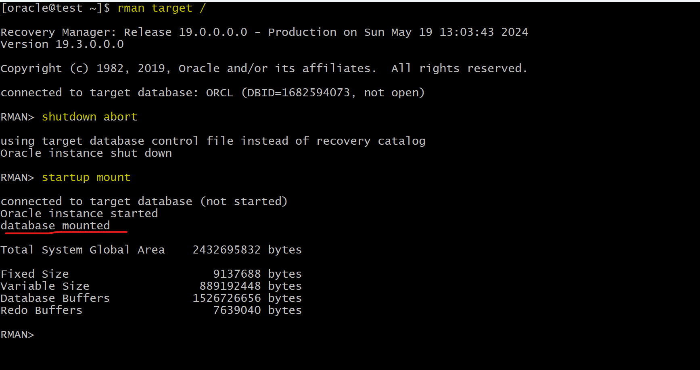

# Recovery - `Complete Recovery`: `ARCHIVELOG` Mode - CDB

[Back](../../index.md)

- [Recovery - `Complete Recovery`: `ARCHIVELOG` Mode - CDB](#recovery---complete-recovery-archivelog-mode---cdb)
  - [Loss of a noncritical data file](#loss-of-a-noncritical-data-file)
    - [Lab: Recover from the loss of `SYSTEM` datafile in CDB](#lab-recover-from-the-loss-of-system-datafile-in-cdb)
      - [Solution: Complete Recovery using RMAN](#solution-complete-recovery-using-rman)
      - [Solution: Complete Recovery using DRA](#solution-complete-recovery-using-dra)
  - [Loss of a critical data file](#loss-of-a-critical-data-file)
    - [Lab: Recover from the loss of non-critical datafile in CDB](#lab-recover-from-the-loss-of-non-critical-datafile-in-cdb)
      - [Solution: Complete Recovery using RMAN](#solution-complete-recovery-using-rman-1)
      - [Solution: Complete Recovery using DRA](#solution-complete-recovery-using-dra-1)

---

## Loss of a noncritical data file

- `Noncritical data file`:

  - Not application file but the files the database needs.
  - the data file that does not belong to the `SYSTEM` or `UNDO` tablespace
  - affects only the objects that are in the **missing file**. 只影响文件内的对象
    - The rest of the database remains available for users to continue work. 不影响其他对象
    - can restore and recover this missing data file **while the database is open**. 所以能在打开 db 的情况下恢复

- Because the database is in `ARCHIVELOG` mode,
  - Recovery is possible **up to the time of the last commit**
  - users are **not required to reenter** any data.

---

### Lab: Recover from the loss of `SYSTEM` datafile in CDB

- Create a loss of critical datafile

```sh
# remove system df from CDB
rm '/u01/app/oracle/oradata/ORCL/system01.dbf'
```

- Try to connect using system
  - it raises error due to loss of datafile

```sql
-- connect
connect system
-- ERROR:
-- ORA-00604: error occurred at recursive SQL level 1
-- ORA-01116: error in opening database file 1
-- ORA-01110: data file 1: '/u01/app/oracle/oradata/ORCL/system01.dbf'
-- ORA-27041: unable to open file
-- Linux-x86_64 Error: 2: No such file or directory
-- Additional information: 3
```

---

- Q: Which type of recovery is possible in this case?
- A: A `complete recovery` is possible.

  - The database is in ArchiveLog mode.
  - A full backup has been created, including the missing system01.dbf and archive log files. So it is possible to recovery the database up to the current SCN.

- Q: Which methods can you use to recover the data file?
- A: RMAN is the best utility to recover data.

  - You can use the `RESTORE` and `RECOVER` commands
  - You can use the Data Recovery Advisor with `LIST FAILURE` command.

- Determine the state of the database to choose the course of action in the next step.

  - a. If the `SQL*Plus` login displays "ORA-01034: **ORACLE not available**", then the database **instance is down**.
    - Action: use `STARTUP MOUNT` to mount database.
  - b. If the `SQL*Plus` login displays an error that includes "ORA-01116: **error in opening database file** 1", then database instance is **still running**, but impaired and must be **terminated with shutdown abort**.
    - Action: use `Shutdown abort` to shutdown instance
  - c. If the `rman target /` command shows an error and **immediately disconnects** then the **database instance is down**.
  - d. If RMAN connects but the **restore datafile 1 command fails with errors** about datafile 1, then the database is impaired and **must be terminated with shutdown abort**.

---

#### Solution: Complete Recovery using RMAN

- In this case, the instance is still running and needs to be terminated.

```sql
rman target /

SHUTNDOWN ABORT
STARTUP MOUNT
-- restore and recover system01.dbf
RESTORE DATAFILE 1;
RECOVER DATAFILE 1;

-- Open db
ALTER DATABASE OPEN;
```


- Confirm in sqlplus
  - database can be connected after restore and recover

```sql
sqlplus /nolog
connect system
show con_name
show user
```


---

#### Solution: Complete Recovery using DRA

- recreate loss of critical datafile

- Confirm failure in sqlplus

```sql
sqlplus / as sysdba
select username from dba_users;
-- select username from dba users
                     *
-- ERROR at line 1:
-- ORA-00604: error occurred at recursive SQL level 1
-- ORA-01116: error in opening database file 1
-- ORA-01110: data file 1: '/u01/app/oracle/oradata/ORCL/system01.dbf'
-- ORA-27041: unable to open file
-- Linux-x86_64 Error: 2: No such file or directory
-- Additional information: 3
```


- If shutdown and restart instance, it cannot be openned


- Recovery using DRA

```sql
rman target /
shutdown abort
startup mount

LIST FAILURE;
ADVISE FAILURE;
-- generate a script with all repair actions and comments.
REPAIR FAILURE PREVIEW;
-- repair database failures
REPAIR FAILURE;
-- will ask whether open the db
```




- Confirm in sqlplus
  - database can be connected after restore and recover

```sql
sqlplus /nolog
connect system
show con_name
show user
```


---

## Loss of a critical data file

- `Critical data file`

  - Data files belonging to the `SYSTEM` tablespace or **containing** `UNDO` data

- A loss of one of `critical data file` requires the database to be **restored** from the `MOUNT` state. 需要 mount

  - unlike other data files that may be restored with the database open.

- **Steps:**

  1. The instance may or **may not shut down automatically**.

     - If it does not, use `SHUTDOWN ABORT` to bring the instance down.

  2. **Mount** the database.
  3. **Restore and recover** the missing data file.
  4. **Open** the database.

---

### Lab: Recover from the loss of non-critical datafile in CDB

- Create a loss of non-critical datafile

```sh
# remove user df from CDB
rm '/u01/app/oracle/oradata/ORCL/users01.dbf'
```

---

#### Solution: Complete Recovery using RMAN

```sql
-- query and create user can be executed.
SELECT username FROM cdb_users;
```

- Restore where instance does not need to be terminated.
  - The tbsp needs to take offline.

```sql
rman target /
ALTER TABLESPACE users OFFLINE IMMEDIATE;

-- rman
RESTORE DATAFILE 7;
RECOVER DATAFILE 7;

-- sqlplus
ALTER TABLESPACE users ONLINE;
```


- Confirm the file is restored

```sh
ls -al '/u01/app/oracle/oradata/ORCL/users01.dbf'
```

---

#### Solution: Complete Recovery using DRA

- recreate loss of critical datafile

- Confirm failure in sqlplus

```sql
rman target /
LIST FAILURE;
ADVISE FAILURE;
-- generate a script with all repair actions and comments.
REPAIR FAILURE PREVIEW;
-- repair database failures
REPAIR FAILURE;
-- will ask whether open the db
```


---

[TOP](#recovery---complete-recovery-archivelog-mode---cdb)
