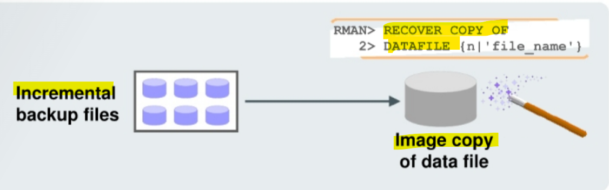

# Recovery - `Complete Recovery`: Using Image Copy

[Back](../../index.md)

- [Recovery - `Complete Recovery`: Using Image Copy](#recovery---complete-recovery-using-image-copy)
  - [Fast Recovery using `SWITCH` command](#fast-recovery-using-switch-command)
    - [Switch back to original location](#switch-back-to-original-location)
    - [Restoring Datafiles to a Nondefault Location Using `SET NEWNAME`](#restoring-datafiles-to-a-nondefault-location-using-set-newname)
  - [Applying `Incremental backups` to data file `Image copies`](#applying-incremental-backups-to-data-file-image-copies)

---

## Fast Recovery using `SWITCH` command

- `SWITCH` command:

  - **updates the names** of the files in the RMAN **repository**, but the database does **not rename** the files **at the operating system level**.

    - **Update the file names** for a `database`, `tablespace`, or `data file` to the **latest** `image copies` available for the specified files
    - **Update the file names** for `data files` and `temp files` for which you have issued a `SET NEWNAME` command

- **Prerequisites**:

  - RMAN must be **connected** to a target database.
  - When switching `tablespaces`, `data files`, or `temp files`, the files must be **offline**.
  - When switching the whole `database`, the database must **not be open**.

- **Steps**
  1. Take the `data file` **offline**.
  2. Usethe `SWITCH TO ... COPY` command to **point to** the `image copy` of the files.
  3. **Recover** the data files.
  4. Bring the data files **online**.
     - At this point, the database is usable, and the data files are recovered.

```sql
SWITCH DATAFILE 'filename' TO COPY;
```

---

### Switch back to original location

- Steps to put the `data files` **back into their original location**: 注意, 该步骤不同于上一节

  1. Use the `BACKUP AS COPY` command to create an `image copy` of the data files **in the original location**.
  2. Take the `data files` **offline**.
  3. Use the `SWITCH TO COPY` command to switch to the `copy you` made in step 1
  4. **Recover** the data files.
  5. Bring the data files **online**.

- 与上一节区别仅仅在于, 为保证转换后的文件还在原有路径, 将映像备份的保存在原有路径中. 则恢复时仅需将不工作的数据文件转换到原有路径的映像备份即可.

---

### Restoring Datafiles to a Nondefault Location Using `SET NEWNAME`

- If you **cannot restore** `data files` to their **default locations**, then you **must update** the `control file` to reflect the **new locations** of the `data files`. 当无法使用默认路径恢复数据文件时, 必须更新 cf

- `SET NEWNAME` command:

  - to specify the new file name
  - equivalent to using the SQL statement `ALTER DATABASE RENAME FILE`, to update the names of the data files in the control file.
  - Afterward, use `SWITCH DATAFILE ALL` command to update the `control file` to reflect the new names for all data files.
  - used **only inside** a `RUN` block

- Example:

```sql
RUN
{
    ALLOCATE CHANNEL devl DEVICE TYPE DISK;
    ALLOCATE CHANNEL dev2 DEVICE TYPE sbt;
    SQL "ALRER TABLESPACE users OFFLINE IMMEDIATE";
    SET NEWNAME FOR DATAFILE '/diskl/oradata/prod/users01l.dbf"'
                        TO '/disk2/users0l.dbf';
    RESTORE TABLESPACE users;
    SWITCH DATAFILE ALL;
    RECOVER TABLESPACE users;
    SQL "ALTER TABLESPACE users ONLINE";
}
```

- Instead of individual names, a more efficient way is to use the SET NEWNAME clause to **specify the default name format** for all `data files` in a named `tablespace` and all `data files` in the database.

  1. SET NEWNAME FOR DATAFILE and SET NEWNAME FOR TEMPFILE
  2. SET NEWNAME FOR TABLESPACE
  3. SET NEWNAME FOR DATABASE

  - The default name is used for `DUPLICATE`, `RESTORE`, and `SWITCH` commands in the RUN block.该默认名将被用于同一个代码中

---

## Applying `Incremental backups` to data file `Image copies`



- To recover `Image Copies` + `incremental backups`:

  - `Image copies` are updated with **all changes** up to the `incremental backup SCN`.
  - **reduces the time** required for media recovery.
  - no need to perform an `image copy` after the `incremental restoration`.

- Applying `incremental backups` to data file `image copies`:

  - **roll forward (recover)** the `image copy` to the **specified point in time**
    - **update** the `image copy` with **all changes** up through the `SCN` at which the `incremental backup` was taken.
  - the **resulting updated data file** just as a `full image copy` taken at that `SCN`, **without the overhead** of performing a `full image copy` of the database every day.

- **Benefits**:

  - **reduce the time** required for `media recovery` (using `archive logs`)减少恢复时间
    - because you need to apply `archive logs` **only since the last** `incremental backup`.
  - do not need to perform a `full image copy` **after** the `incremental restoration`.无需全备份

- Characteristics:

  - If the recovery process **fails** during the application of the `incremental backup file`, you **simply restart** the recovery process. 如果恢复操作出错, 仅需重启

    - RMAN **automatically** determines the **required** `incremental backup files` to apply, **from before** the `image data file copy` **until the time** at which you want to **stop** the recovery process. 自动适用自增备份

  - If there is **more than one** version of an `image copy` recorded in the RMAN catalog 如果有多个备份

    - RMAN **automatically** uses the **latest version** of the image copy. 自动适用最后一个

- RMAN **reports an error** if it **cannot merge** an `incremental backup file` with an `image copy`.

---

Example: continuously updated image copies(略, 查看 strategy)

---

[TOP](#recovery---complete-recovery-using-image-copy)
