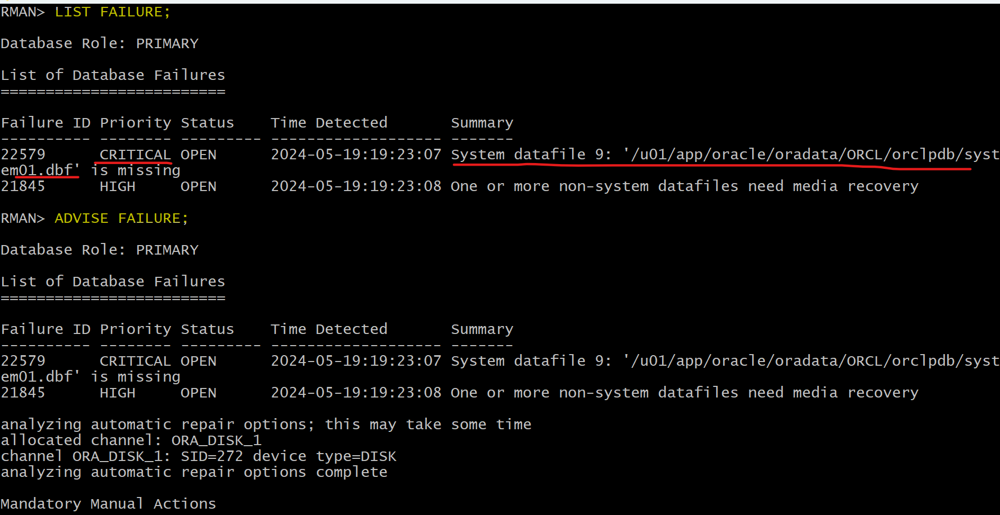
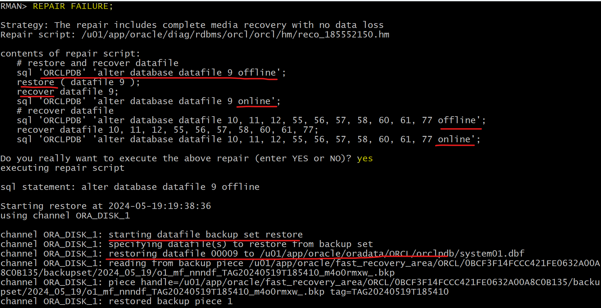

# Recovery - `Complete Recovery`: `ARCHIVELOG` Mode - PDB

[Back](../../index.md)

- [Recovery - `Complete Recovery`: `ARCHIVELOG` Mode - PDB](#recovery---complete-recovery-archivelog-mode---pdb)
  - [Recovering PDB `SYSTEM` or `UNDO` Tablespace](#recovering-pdb-system-or-undo-tablespace)
    - [Lab: Recover from the loss of `SYSTEM` datafile in PDB](#lab-recover-from-the-loss-of-system-datafile-in-pdb)
    - [Solution: Complete Recovery using RMAN](#solution-complete-recovery-using-rman)
    - [Solution: Complete Recovery using DRA](#solution-complete-recovery-using-dra)
  - [Non-`SYSTEM` Tablespace Recovery](#non-system-tablespace-recovery)
    - [Lab: Recover from the loss of non-critical datafile in PDB](#lab-recover-from-the-loss-of-non-critical-datafile-in-pdb)
      - [Solution: Complete Recovery using RMAN](#solution-complete-recovery-using-rman-1)
      - [Solution: Complete Recovery using DRA](#solution-complete-recovery-using-dra-1)
  - [`REPAIR` command:](#repair-command)
      - [Solution: Complete Recovery using the REPAIR Command](#solution-complete-recovery-using-the-repair-command)
  - [Recovering PDB `Tempfile`](#recovering-pdb-tempfile)

---

## Recovering PDB `SYSTEM` or `UNDO` Tablespace

- **Prerequisites**:

  - system privilege to alter `PLUGGABLE DATABASE`
  - the CDB in `ARCHIVELOG` mode.

- **Characteristics**:

  - The CDB and all other PDBs can be left open.

- **Step to recover `SYSTEM` or `UNDO` TBSP**

  1. Connect to the PDB.
  2. Shut down the PDB with the `ABORT` option if it is not automatically done.

  3. **Restore and recover** the PDB or the missing `tablespace` or the damaged `datafile`.

- **Features:**

  - Closing a PDB with the `ABORT` mode forcefully closes it without bringing down the entire CDB instance.关闭 pdb,而不是整个 CDB.
  - If the `datafile` that is missing or corrupted belongs to a PDB and more specifically to the `SYSTEM` or `UNDO` tablespace, 缺失关键文件时, 必须 ABORT 关闭.

    - the PDB **must be shut down** in `ABORT` mode.

  - A `PDB`, `tablespace`, or `datafile` **media recovery is required**.

    - Before the PDB can be reopened,

  - In case the `PDB` is the application **root** of an application container, **other** `datafiles` in the application PDBs **may have to be restored and recovered** as well. 如果 PDB 是根, 其他 df 需要恢复.

- **Example:**

```sql
-- close pdb
rman target "'sys@pdb_name'"
SHUTDOWN ABORT

-- restore and recover
RESTORE DATABASE;
RECOVER DATABASE;

-- open pdb
STARTUP
```

---

### Lab: Recover from the loss of `SYSTEM` datafile in PDB

- setup env lab

```sql
-- Create tbsp in pdb
alter session set container=orclpdb;

-- CLEANUP from previous run
DROP USER bar91 CASCADE;

DROP TABLESPACE bar91tbs INCLUDING CONTENTS AND DATAFILES;

-- Create tablespace
CREATE TABLESPACE bar91tbs
DATAFILE '/u01/app/oracle/oradata/ORCL/orclpdb/bar91tbs01.dbf' SIZE 10M
SEGMENT SPACE MANAGEMENT MANUAL;

-- Create user
CREATE USER bar91 IDENTIFIED BY pass4B91
DEFAULT TABLESPACE bar91tbs
QUOTA UNLIMITED ON bar91tbs;

GRANT CREATE SESSION TO bar91;

-- create table and populate
-- be sure table is at least 2 blocks long
CREATE TABLE bar91.barcopy
TABLESPACE bar91tbs
AS SELECT * FROM HR.EMPLOYEES;

INSERT INTO bar91.BARCOPY
SELECT * FROM bar91.BARCOPY;

INSERT INTO bar91.BARCOPY
SELECT * FROM bar91.BARCOPY;


rman target "'sys@orclpdb as sysdba'"
BACKUP PLUGGABLE DATABASE ORCLPDB;


sqlplus / as sysdba
alter session set container=orclpdb;
UPDATE bar91.BARCOPY SET salary = salary+1;
COMMIT;
```

- Remove the system of orclpdb

```sh
rm /u01/app/oracle/oradata/ORCL/orclpdb/system01.dbf
```

---

### Solution: Complete Recovery using RMAN

- Recover critical file in PDB

```sql
rman target sys@orclpdb
-- close pdb
SQL "ALTER PLUGGABLE DATABASE orclpdb CLOSE ABORT";

-- restore and recover df
RESTORE DATAFILE 9;
RECOVER DATAFILE 9;

-- open pdb
SQL "ALTER PLUGGABLE DATABASE orclpdb OPEN";
```


- Confirm datafile is restored

```sh
ls -al /u01/app/oracle/oradata/ORCL/orclpdb/system01.dbf
```

---

### Solution: Complete Recovery using DRA

- recreate loss of critical datafile

- Confirm failure in sqlplus

```sql
rman target "'/ as sysdba'"

ALTER PLUGGABLE DATABASE orclpdb CLOSE ABORT;

LIST FAILURE;
ADVISE FAILURE;
-- generate a script with all repair actions and comments.
REPAIR FAILURE PREVIEW;
-- repair database failures
REPAIR FAILURE;
-- will ask whether open the db
ALTER PLUGGABLE DATABASE orclpdb OPEN;
```





---

- Q:Which type of recovery is possible in this case?
  - A: A `complete recovery` is possible as long as you have **all available backups** required.
    - This means that you have a **backup** (backup set or image copy) of the missing data file and all `archive log files` required to recover the restored data file up to the current `SCN` of the PDB including all redo log files (one member in each group will be sufficient).
- Q: Which methods can you use to recover?
  - A: `RMAN` is the **best utility** to recover data.
    - You can use the `RESTORE` and `RECOVER` commands.
    - you can get help with the `LIST FAILURE` commands.
    - You can also use the simple `REPAIR` command.

---

## Non-`SYSTEM` Tablespace Recovery

- **Step to recover Non-`SYSTEM` TBSP**

  1. Connect to the PDB.
  2. Take the tablespace offline.
     - The datafile with the error is taken `OFFLINE IMMEDIATE`.
  3. Restore and recover datafile
     - `Media recovery` for that datafile is **required**

- **Features:**

  - If the datafile that is missing or corrupted belongs to a `PDB` and more specifically to any tablespace **other than** `SYSTEM` tablespace,
    - the PDB need **not be closed**.
  - **Other** PDBs are **not impacted**.
    - During that recovery time, users can work with other PDB tablespaces and within other PDBs.

---

### Lab: Recover from the loss of non-critical datafile in PDB

- Remove non-critical datafile

```sh
rm /u01/app/oracle/oradata/ORCL/orclpdb/bar91tbs01.dbf
```

#### Solution: Complete Recovery using RMAN

- Recover non-critical file in PDB

```sql
-- rman
rman target "'sys@orclpdb as sysdba'"
REPORT SCHEMA;
-- close pdb immediate
SHUTDOWN IMMEDIATE;

-- restore and recover
RESTORE DATABASE;
RECOVER DATABASE;

-- open pdb
STARTUP
```


---

#### Solution: Complete Recovery using DRA

```sql
rman target "'/ as sysdba'"

LIST FAILURE;
ADVISE FAILURE;
-- generate a script with all repair actions and comments.
REPAIR FAILURE PREVIEW;
-- repair database failures
REPAIR FAILURE;
-- will ask whether open the db
ALTER PLUGGABLE DATABASE orclpdb OPEN;

```


---

## `REPAIR` command:

- `REPAIR` command:

  - automatically takes a file offline, restores and recovers it, and then brings it back online again

  1. Automatically takes files offline (if applicable)
  2. Restores designated files
  3. Recovers designated files
  4. Automatically brings back online any files taken offline in step 1

- Example:

```sql
-- rman
CONNECT TARGET /
REPAIR REPAIR pdb_name:tbsp_name;
```

```sql
-- sqlplus
CONNECT system@sales_pdb
ALTER TABLESPACE tbs2 OFFLINE IMMEDIATE;

-- rman
CONNECT TARGET /
RESTORE TABLESPACE sales_pdb:tbs2;
RECOVER TABLESPACE sales_pdb:tbs2;

-- sqlplus
ALTER TABLESPACE tbs2 ONLINE;
```

---

#### Solution: Complete Recovery using the REPAIR Command

```sql
rman target "'/ as sysdba'"
REPORT SCHEMA;
-- close pdb immediate
ALTER PLUGGABLE DATABASE orclpdb CLOSE IMMEDIATE;
-- restores and recovers the data file.
REPAIR PLUGGABLE DATABASE ORCLPDB;
ALTER PLUGGABLE DATABASE orclpdb OPEN;
```


---

## Recovering PDB `Tempfile`

- Missing of a `tempfile` belonging to a `PDB` **temporary tablespace**

  - The PDB can open with a **missing temporary file**. PDB 可以打开.
  - lead to **failure of SQL statements** that require temporary space to execute. SQL 语句会执行失败.

- **Solution:**

  - Temporary files are automatically re-created **at PDB startup**. 自动恢复, 当 PDB 开启时
  - Manual re-creation is also possible.

- Can add or drop tempfile:

```sql
-- When connecting with PDB

-- add new tempfile
ALTER TABLESPACE temp ADD TEMPFILE
'/u0l/app/oracle/oradata/CDB1/HR_PDB/temp2_02.dbf"'
SIZE 20M;

--  drop missing tempfile
ALTER TABLESPACE temp DROP TEMPFILE
'/u0l/app/oracle/oradata/CDB1/HR_PDB/temp2_01.dbf';
```

---

[TOP](#recovery---complete-recovery-archivelog-mode---pdb)
