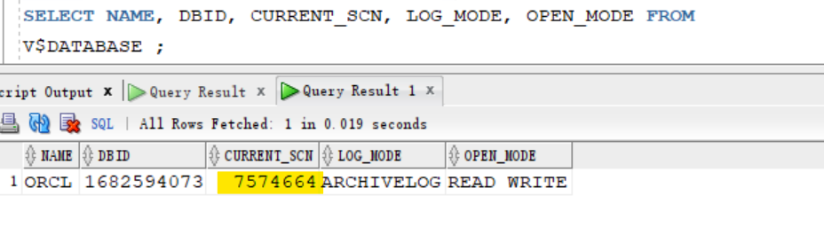

# Recovery - `Incomplete Recovery` (`DBPITR`)

[Back](../../index.md)

- [Recovery - `Incomplete Recovery` (`DBPITR`)](#recovery---incomplete-recovery-dbpitr)
  - [`Incomplete Recovery` (`DBPITR`)](#incomplete-recovery-dbpitr)
  - [Steps](#steps)
  - [Lab: Imcomplete Recovery](#lab-imcomplete-recovery)
    - [Connect to Catalog to resynchronization](#connect-to-catalog-to-resynchronization)
    - [Setup Environment](#setup-environment)
    - [Diagnosis](#diagnosis)
    - [Fail of Complete Recovery](#fail-of-complete-recovery)
    - [Determine the loss of DBPITR](#determine-the-loss-of-dbpitr)
    - [Incomplete Recovery](#incomplete-recovery)
    - [Update Recovery Catalog](#update-recovery-catalog)
    - [Clearup](#clearup)

---

## `Incomplete Recovery` (`DBPITR`)

- `Database point-in-time recovery (DBPITR)`(`Incomplete Recovery`):
  - To recover of an **entire database** to a specified **past target time**, SCN, or log sequence number. 整体恢复
  - To **migrate** a database to a **different platform** by creating a new database on the destination platform and performing a transport of **all the user** tablespaces, but **excluding the `SYSTEM` tablespace**迁移

---

## Steps

1. **Determine** the `target point` of the restore:

   - can be in terms of a **date and time**, an `SCN`, `restore point`, or `log sequence number`.
   - e.g., if you know that some bad transactions were submitted at 3:00 PM yesterday, then you can choose 2:59 PM yesterday as the target restore point time.

2. Set the `National Language Support (NLS)` OS environment variables so that the **time constants** you provide to RMAN are **formatted correctly**.

   - e.g.,

```sh
export NLS_LANG = american_america.us7ascii
export NLS DATE FORMAT = "yyyy-mm-dd:hh24:mi:ss"
```

- If you do not want to rely on the NLS parameters, you can set the time Using `SET` command:

```sql
-- set the time in a European format
set until time

"to_date('14.08.2018 21:59:00', 'dd.mm.yyyy hh24:mi:ss'")";
```

3. **Mount** the database.
   - If it is open, you have to shut it down first

```sql
shutdown immediate
startup mount
```

4. Prepare and execute a `RUN` block, using the `SET UNTIL`, `RESTORE`, and `RECOVER` commands.
   - e.g.,

```sql
RUN {
    SET UNTIL TIME '2018-08-14:21:59:00';
    RESTORE DATABASE;
    RECOVER DATABASE;
}
```

5. **Open** the database in `READ ONLY` mode and verify that the recovery point is correct.

```sql
SQL 'ALTER DATABASE OPEN READ ONLY';
```

6. If satisfied with the results of the recovery, **open** the database with the `RESETLOGS` option

```sql
ALTER DATABASE OPEN RESETLOGS;
```

---

## Lab: Imcomplete Recovery

### Connect to Catalog to resynchronization

- Connect to the target database and the recovery catalog and resynchronize the catalog with the database control file.

```sql
-- confirm rcat db is opened
sqlplus / as sysdba
SHOW PDBS

rman target / catalog rcowner@rcat
-- create a full backup
BACKUP DATABASE;
-- resynchronize the catalog with the database control file.
RESYNC CATALOG;
EXIT
```

---

### Setup Environment

- Backup pdb

```sql
rman target /
-- confirm that the control file is automatically backup
show all;
BACKUP PLUGGABLE DATABASE orclpdb;
```


- Create a new tablespace, a new user, and a table, and populates it.

```sh
# create directory for tbsp
mkdir -p /u01/backup/orcl/orclpdb
```

```sql
sqlplus / as sysdba

alter session set container=orclpdb;
show user
show con_name

-- CLEANUP from previous run
DROP USER bar CASCADE;
DROP TABLESPACE bartbs INCLUDING CONTENTS AND DATAFILES;

-- Create tablespace
CREATE TABLESPACE bartbs
DATAFILE '/u01/backup/orcl/orclpdb/bartbs.dbf' SIZE 10M REUSE
SEGMENT SPACE MANAGEMENT MANUAL;

-- Create user
CREATE USER BAR IDENTIFIED BY pass4BAR
DEFAULT TABLESPACE bartbs
QUOTA UNLIMITED ON bartbs;

GRANT CREATE SESSION TO BAR;

-- create table and populate
-- be sure table is at least 2 blocks long
CREATE TABLE BAR.barcopy
TABLESPACE bartbs
AS SELECT * FROM HR.EMPLOYEES;

INSERT INTO BAR.BARCOPY
SELECT * FROM BAR.BARCOPY;

INSERT INTO BAR.BARCOPY
SELECT * FROM BAR.BARCOPY;
```


- creates a backup of the tablespace

```sql
rman target "'sys@orclpdb as sysdba'"

RUN {
  ALLOCATE CHANNEL "ch1" DEVICE TYPE DISK FORMAT "/u01/backup/orcl/orclpdb/bartest%U";
  BACKUP AS COPY TAG 'BARTEST' TABLESPACE bartbs;
}

EXIT
```


- then updates the table.

```sql
sqlplus sys@orclpdb as sysdba

show con_name

UPDATE BAR.BARCOPY SET salary = salary+1;
COMMIT;
ALTER SYSTEM FLUSH BUFFER_CACHE;

EXIT
```


- Update table and switch log

```sql
sqlplus sys@orclpdb as sysdba


EXEC DBMS_LOCK.SLEEP(1.5);
alter session set container=cdb$root;
ALTER SYSTEM SWITCH LOGFILE;
alter session set container=orclpdb;
UPDATE BAR.BARCOPY SET salary = salary+1;
Commit;

EXEC DBMS_LOCK.SLEEP(1.5);
alter session set container=cdb$root;
ALTER SYSTEM SWITCH LOGFILE;
alter session set container=orclpdb;
UPDATE BAR.BARCOPY SET salary = salary+1;
Commit;

EXEC DBMS_LOCK.SLEEP(1.5);
alter session set container=cdb$root;
ALTER SYSTEM SWITCH LOGFILE;
alter session set container=orclpdb;
UPDATE BAR.BARCOPY SET salary = salary+1;
Commit;

EXEC DBMS_LOCK.SLEEP(1.5);
alter session set container=cdb$root;
ALTER SYSTEM SWITCH LOGFILE;
alter session set container=orclpdb;
UPDATE BAR.BARCOPY SET salary = salary+1;
Commit;

EXEC DBMS_LOCK.SLEEP(1.5);
alter session set container=cdb$root;
ALTER SYSTEM SWITCH LOGFILE;
alter session set container=orclpdb;
UPDATE BAR.BARCOPY SET salary = salary+1;
Commit;

EXEC DBMS_LOCK.SLEEP(1.5);
alter session set container=cdb$root;
ALTER SYSTEM SWITCH LOGFILE;
alter session set container=orclpdb;
UPDATE BAR.BARCOPY SET salary = salary+1;
Commit;

EXEC DBMS_LOCK.SLEEP(1.5);
alter session set container=cdb$root;
ALTER SYSTEM SWITCH LOGFILE;
alter session set container=orclpdb;
UPDATE BAR.BARCOPY SET salary = salary+1;
Commit;

EXEC DBMS_LOCK.SLEEP(1.5);
alter session set container=cdb$root;
ALTER SYSTEM SWITCH LOGFILE;
alter session set container=orclpdb;
UPDATE BAR.BARCOPY SET salary = salary+1;
Commit;
```


> The database has been update and switched log after a backup.

- Show the first row to indicate the table has been updated serveral times

```sql
connect sys/welcome@orclpdb as sysdba
select salary from BAR.BARCOPY
where rownum = 1;

connect / as sysdba
ALTER SYSTEM FLUSH BUFFER_CACHE;
```


- Find the newest archive log file where the redo is overwritten

```sql
select 'rm "'||name||'"'
from v$archived_log
where (sequence#, resetlogs_id) =
(select sequence# - 2, resetlogs_id from v$archived_log
where first_time = (select distinct (max(first_time)) from v$archived_log));
```


- Remove the newest archive log file

```sh
rm "/u01/app/oracle/fast_recovery_area/ORCL/archivelog/2024_05_23/o1_mf_1_8_m4ypzwdk_.arc"
```

- Shutdown abort

```sql
sqlplus / as sysdba
shutdown abort

exit
```

- remove datafile

```sh
rm -f /u01/backup/orcl/orclpdb/bartbs.dbf
```


---

### Diagnosis

- Connect to sqlplus and try to open pdb
  - it raises error, indicating the df is missing.

```sql
sqlplus / as sysdba
startup

show pdbs

-- try to open pdb
ALTER PLUGGABLE DATABASE orclpdb OPEN;
```


- Check the latest DBWR trace file for the error info

```sh
cd $ORACLE_BASE/diag/rdbms/orcl/orcl/trace
ls -1ltr *dbw*

tail -20 orcl_dbw0_29390.trc
```


---

- Use the RMAN `LIST FAILURE` command to find more information about the failure.
  - it indicates that it needs mannual actions.

```sql
rman target "'/ as sysbackup'"

LIST FAILURE;

ADVISE FAILURE;
```


---

### Fail of Complete Recovery

- Restore datafile

```sql
RESTORE DATAFILE 102;
```


- Recover datafile
  - fails, due to loss of archive log file with **sequence 8**
  - Complete recovery is not possible in this situation.

```sql
RECOVER DATAFILE 102;
```


---

### Determine the loss of DBPITR

- how much data will be lost.
  - Check the current log sequence
  - The current redo log file is **sequence number 12**.
  - The missing log number is **8**.
  - So all the data contained in log files **8** through **12** will be lost.

```sql
ARCHIVE LOG LIST
```


---

- Query the current SCN

```sql
-- query scn
SELECT NAME, DBID, CURRENT_SCN, LOG_MODE, OPEN_MODE FROM V$DATABASE;
-- if in cdb:
-- ORCL	1682594073	7675785	ARCHIVELOG	READ WRITE
-- if in pdb: the current_scn is 0.
-- ORCL	1682594073	0	ARCHIVELOG	MOUNTED
```


---

- Determine the starting SCN and start time of your missing log

  - it shows how far back they have to go to recover any transactions that have been lost.

```sql
-- The value in FIRST_TIME can be used to inform users how far back they have to go to recover any transactions that have been lost.
select sequence#, first_change#, first_time, status
from v$archived_log
where sequence# = 8
and name is not null;
-- 8	7571928	23-May-2024	A
```


---

### Incomplete Recovery

```sql
rman target /

shutdown immediate;
startup nomount;

-- restore control file
RESTORE CONTROLFILE FROM AUTOBACKUP;

-- Mount the database.
ALTER DATABASE MOUNT;

-- Restore the entire database from a backup that was taken before the missing archive log file with sequence
RESTORE DATABASE UNTIL SEQUENCE 8;
RECOVER DATABASE UNTIL SEQUENCE 8;

-- Open the database using the RESETLOGS option.
ALTER DATABASE OPEN RESETLOGS;

ALTER PLUGGABLE DATABASE orclpdb OPEN;
EXIT
```


---

- Confirm pdb is recovered and opened

```sql
sqlplus / as sysdba
show pdbs
```


- Confirm current SCN
  - in root
    - the current scn is `7675785` before recovery
    - the current scn is `7574664` after recovery
  - in pdb
    - the current scn is `0` before recovery
    - the current scn is `7575521` after recovery

```sql
SELECT NAME, DBID, CURRENT_SCN, LOG_MODE, OPEN_MODE FROM
V$DATABASE;
-- ORCL	1682594073	7574664	ARCHIVELOG	READ WRITE

ALTER SESSION SET CONTAINER=orclpdb;

SELECT NAME, DBID, CURRENT_SCN, LOG_MODE, OPEN_MODE FROM
V$DATABASE ;
-- ORCL	1682594073	7575521	ARCHIVELOG	READ WRITE
```



- Confirm the data in the table
  - Query the first row's salary after recovery
  - the return value has been change from 24009 to 24005, indicating the loss of data in between.

```sql
SELECT salary
FROM bar.barcopy
WHERE rownum = 1;
```


- Confirm in RMAN

```sql
rman target /
list failure;
exit
```


---

### Update Recovery Catalog

- crosscheck all archive logs connected to the recovery catalog.
  - new incarnation of database registered in recovery catalog
  - the older backups become obsolete,
  - Delete obsolete backups

```sql
rman target "'/ as sysbackup'" catalog rcowner@rcat

CROSSCHECK ARCHIVELOG ALL;
-- Delete obsolete backups
delete noprompt obsolete;
```


- Perform full database backup after recovery.
  - Incomplete recovery will create a new incarnation of the database and the older backups are obsolete, although there are certain cases where the older backups can be used.
  - A new incarnation of the database was created when the `RESETLOGS` command was executed.

```sql
BACKUP DATABASE PLUS ARCHIVELOG delete input;
exit;
```

---

### Clearup

- Drop user and tbsp

```sql
DROP USER bar CASCADE;
DROP TABLESPACE bartbs INCLUDING CONTENTS AND DATAFILES;
```

---

[TOP](#recovery---incomplete-recovery-dbpitr)
