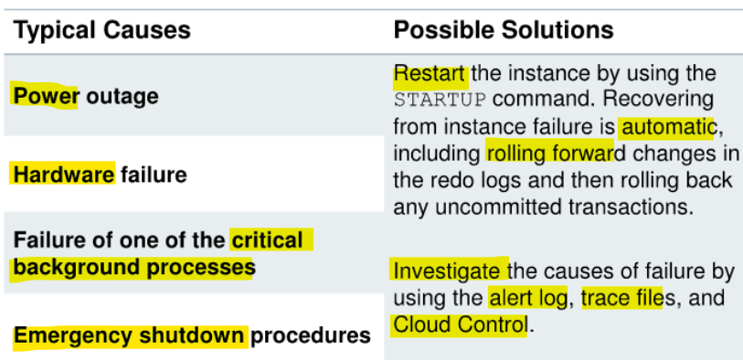
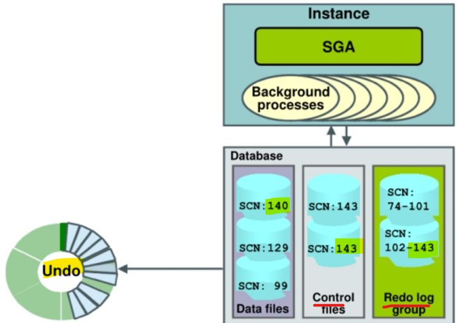

# Revovery - Instance Recovery

[Back](../../index.md)

- [Revovery - Instance Recovery](#revovery---instance-recovery)
  - [Instance Recovery](#instance-recovery)
    - [Instance Failure](#instance-failure)
    - [Instance Recovery](#instance-recovery-1)
    - [Phases of Instance Recovery](#phases-of-instance-recovery)

---

## Instance Recovery

### Instance Failure

- Typical Causes & Possible Solutions:

- `Instance failure`:

  - occurs when the database instance is **shut down before synchronizing** all database files.
  - can occur because of
    - hardware failure
    - software failure
    - the use of the emergency `SHUTDOWN ABORT` and `STARTUP FORCE` shutdown commands.

---

### Instance Recovery

- `Automatic instance or crash recovery`:

  - caused by attempts to **open** a database whose files are **not synchronized on shutdown**
  - Uses information stored in `redo log groups` **to synchronize files**
  - Involves two distinct operations:
    - `Rolling forward`: `Redo log changes` (both **committed and uncommitted**) are applied to data files.
    - `Rolling back`: Changes that are made but **not committed** are returned to their original
      state.

- `Instance Recovery` only needs the instance to be started normally.

---

### Phases of Instance Recovery

1. **Startup instance** (`data files` are out of sync)

   - The instance **mounts** the `control files` and then attempts to **open** the `data files`.

2. **Roll forward** (`redo`):

   - For an instance to open a data file, the `system change number (SCN)` contained in the `data file`'s **header** must **match** the current `SCN` that is stored in the database's `control files`.
   - If the numbers do **not match**, the instance **applies redo data** from the `online redo logs`, sequentially “redoing” transactions until the data files are up to date, to bring the database up to the state as of the time of failure.
   - includes **Committed and uncommitted** data in files

3. **Database opened**
   - After all `data files` have been **synchronized with** the `control files`, the database is opened, and users can log in.
4. **Roll back** (undo):

   - After the database has been opened, those **uncommitted** transactions are `rolled back`.
   - At the end of the rollback phase of instance recovery, the data files contain **only committed data**.

---

[TOP](#revovery---instance-recovery)
