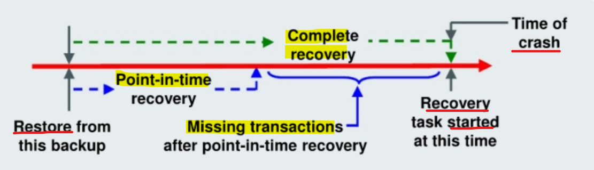
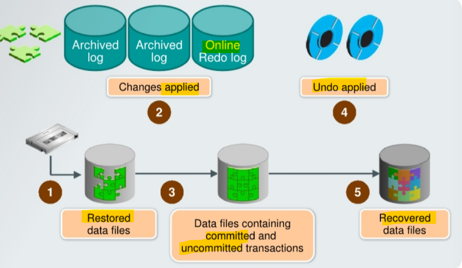
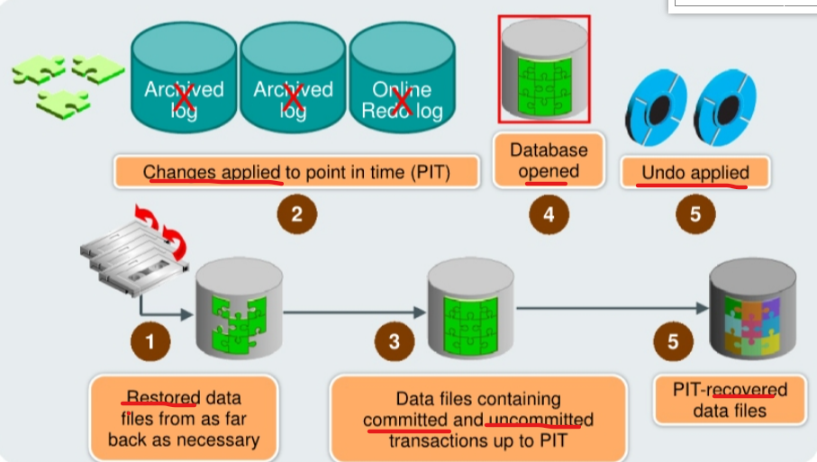

# Recovery - Media Failure

[Back](../../index.md)

- [Recovery - Media Failure](#recovery---media-failure)
  - [Media Failure](#media-failure)
  - [Media Recovery](#media-recovery)
    - [Complete Recovery Process](#complete-recovery-process)
    - [Point-in-Time Recovery Process](#point-in-time-recovery-process)
      - [VS `Flashback Database`](#vs-flashback-database)
  - [Recovery with the `RESETLOGS` Option](#recovery-with-the-resetlogs-option)

---

## Media Failure

- `media failure`:

  - any failure that results in the **loss or corruption** of one or more **database files**.
    - `data file`
    - `control file`
    - `redo log file`

- Typical **Causes**

  - Failure of disk drive
  - Failure of disk controller
  - Deletion or corruption of a file needed for database operation
  - Logical unit (LUN) in a storage array going offline

- Possible **Solutions**

  - 1. **Restore the affected file** from backup.
  - 2. Inform the database about a **new file location** (if necessary).
  - 3. **Recover** the file by applying redo information (if necessary).

---

## Media Recovery

- Recovery can have two kinds of scope:

  - `Complete recovery`:

    - Brings the database or tablespace **up to the point of failure**, including **all committed data changes** made up to the point of failure

  - `Incomplete or point-in-time recovery (PITR)`:
    - Brings the **database** or **tablespace** up to a **specified point in time in the past**, before the recovery operation was requested.
    - some transactions is missing
      - any data modifications done between the **recovery destination time** and the **present** are lost.
    - Recovering to a point in the past is a way to **remove the unwanted changes**.

---

### Complete Recovery Process

- steps in complete recovery:
  - 1. Damaged or missing files are **restored from a backup**.
  - 2. Changes from `incremental backups`, `archived redo log files`, and `online redo log files` are applied as necessary.
    - The `redo log changes` are applied to the `data files` **until the current `online log` is reached** and the most recent changes have been applied.
    - `rolling forward` / `cache recovery`: `Undo blocks` are **generated** during this entire process.
  - 3. The restored data files may now contain **committed and uncommitted** changes.
  - 4. `transaction recovery`: The `undo blocks` are used to `roll back` any **uncommitted changes**.
  - 5. The `data files` are now in a recovered state and are **consistent** with the other data files in the database.

---

### Point-in-Time Recovery Process

- `Incomplete recovery` / `database point-in-time recovery (DBPITR)`

  - uses a backup to produce a **noncurrent** version of the database.
  - do **not apply** all of the `redo` records generated after the most recent backup.

- Prerequisites:

  - A valid offline or online backup of **all** the `data files` made **before the recovery point**
  - All `archived logs` from the time of the backup **until the specified time of recovery**

- Steps
  - 1. **Restore** the `data files` from backup:
    - The backup that is used must be from **before your target recovery point**.
    - This entails copying files either by using **OS commands** or by using the `RMAN RESTORE` command.
  - 2. Use the `RECOVER` command:
    - **Apply** `redo` from the `archived redo log files`, including as many as necessary to **reach the restore point destination.**
  - 3. **State of over-recovery**:
    - Now the data files contain some **committed** and some **uncommitted** transactions because the redo can contain uncommitted data.
  - 4. Use the `ALTER DATABASE OPEN` command:
    - The database is opened before undo is applied. This is to provide higher availability.
  - 5. Apply **undo data**:
    - undo any uncommitted transactions.
  - 6. Process complete:

---

#### VS `Flashback Database`

- `Oracle Flashback Database` is the most efficient **alternative** to `DBPITR`.
- `Flashback`:
  - it operates at a **physical level** and **reverts** the current `data files` to their contents at a past
  - The result is like the result of a `DBPITR`, including `OPEN RESETLOGS`
  - typically faster:
    - it does **not require you to restore** data files and requires only limited application of redo compared to media recovery.

---

## Recovery with the `RESETLOGS` Option

- Issue: **Missing** `archive logs` for target recovery `SCN`
- Workflow:

  1. **Restore** backups.
  2. **Recover** as far forward as the unbroken series of archive logs allows.
  3. **Open** the database with the `RESETLOGS` option.
     - A new `database incarnation` is automatically **created** to avoid confusion when two different redo streams have the **same SCN**, but occurred at different times.

- Note: Changes **after** the last applied `archive log` are **lost**.

- When an `archived log` is missing, which contains transactions that occurred sometime between the time of **the backup you are restoring from** and **the target recovery SCN**: 缺失 archived log 时
  - PITR with RESETLOGS option is the only option to perform a recovery and discover
  - Without the missing log, you **have no record of the updates** to your `data files` during that period. 因为缺失 archive, 所以无法更新到恢复时点, 只能使用 PITR, 然后以 RESETLOGS 打开 db 来重置 scn.

---

[TOP](#recovery---media-failure)
