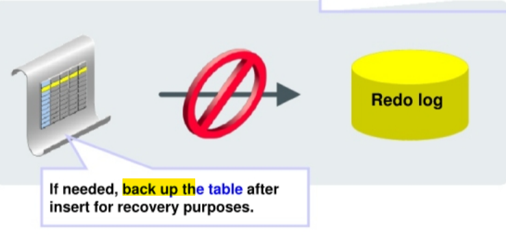

# Recovery - `NOLOGGING` Database Objects

[Back](../../index.md)

- [Recovery - `NOLOGGING` Database Objects](#recovery---nologging-database-objects)
  - [`NOLOGGING` Database Objects](#nologging-database-objects)

---

## `NOLOGGING` Database Objects

- When you create a table as `NOLOGGING`, **minimal redo data** is written to the redo stream to support
  the creation of the object.
  - This is useful for **making large inserts go faster**.



---

Example:

- the `SALES_COPY` table is created as a `NOLOGGING` table.
- When an insert is done with the `APPEND` hint, **no redo is generated** for that particular insert statement.
  - As a result, you **cannot recover** this transaction on the `SALES_HISTORY` table.
- If recovery is needed, make a **backup** of whatever tables you populate in this way, right afterward. 插入后备份.

```sql
CREATE TABLE sales_copy NOLOGGING;
INSERT /*+ APPEND */ INTO sales_copy
SELECT * FROM sales_history;
```

- If you perform `media recovery`, and there are `NOLOGGING` objects involved, they will be marked **logically corrupt** during the recovery process.
  - In this case, drop the `NOLOGGING` objects and re-create them. 因为没有 redo log, 所以会标记逻辑坏块. 只能移除该对象, 再重新创建.

---

[TOP](#recovery---nologging-database-objects)
