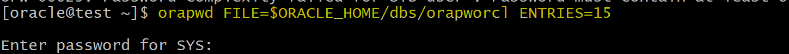

# Recovery - Re-creating Password File

[Back](../../index.md)

- [Recovery - Re-creating Password File](#recovery---re-creating-password-file)
  - [Re-creating a Password Authentication File](#re-creating-a-password-authentication-file)
    - [Oracle Password File](#oracle-password-file)
    - [Re-creating a Password File](#re-creating-a-password-file)
  - [Lab: Restoring the Password File](#lab-restoring-the-password-file)
    - [Setup Environment](#setup-environment)
    - [Restore password file](#restore-password-file)
    - [Clean up](#clean-up)

---

## Re-creating a Password Authentication File

### Oracle Password File

- `password file`:

  - allows **authentication of users** with **administrative privileges** (e.g., SYSDBA, SYSOPER) when connecting to an Oracle database remotely.
  - stores the **usernames** and **associated passwords** of these privileged users.
  - only used for high-specific privilege users (e.g., SYS, SYSBACKUP, SYSKM)

- **Location**:
  - UNIX: `$ORACLE_HOME/dbs`
  - Windows: `$ORACLE_HOME%\database`
- **File name**:

  - `orapw<ORACLE_SID>`
  - e.g., `orapwORCL`

- Parameter `REMOTE_LOGIN_PASSWORDFILE`:

  - specifies whether Oracle checks for a password file
  - Value:
    - `EXCLUSIVE`: password file can be used by **only one database**
    - `SHARED`: **One or more databases** can use the password file.
    - `NONE`: Oracle ignores any password file. Therefore, privileged users must be authenticated by the operating system.

- Creation and Management:

  - **created** and managed using the `orapwd` utility.
  - **Delete** the existing `password file` by using **operating system commands** and create a new password file by using the password utility.

- Adding Users to the Password File
  - using grant command with adminstrative privileges

```sql
CREATE USER admin_user IDENTIFIED BY admin_password;
GRANT SYSDBA TO admin_user;
```

- `V$PWFILE_USERS` view:

  - lists all users in the password file, and indicates whether the user has been granted the SYSDBA, SYSOPER, SYSASM, SYSBACKUP, SYSDG, and SYSKM privileges.

```sql
SELECT * FROM V$PWFILE_USERS;
```


---

- When connecting with `SYSDBA` privilege,
  - you are connecting as the `sys` **schema** and **not** the schema associated with your **username**.
- When connecting with `SYSOPER` privilege:

  - you are connected to the `PUBLIC` schema.

---

### Re-creating a Password File

- Typically, the `password file` is **not included in backups**

  - because, in almost all situations, it can be easily re-created.

- You should **not remove or modify** the `password file` if you have a database or instance **mounted** using `REMOTE_LOGIN_PASSWORDFILE`=`EXCLUSIVE` or `SHARED`.

  - If you do, you will be **unable to reconnect** remotely using the password file.

- Passwords are **case-sensitive**, so you must take that into consideration when **re-creating **the
  password file.
  - Also, if the **original** `password file` was created with the `ITGNORECASE=Y` option, then it must be re-created with the same option.

---

Steps for re-creating the password file:

1. Create the password file by using the password utility `orapwd`.

```sh
orapwd file=filename password=password entries=max users

# example
orapwd file=$ORACLE_HOME/dbs/orapwUl5 password=admin entries=20
```

> - There are no spaces around the “equal to” (=) character.
> - `filename`: the name of the password file (mandatory).
> - `password`: the password for `SYS` (optional).
>   - You are prompted for the password if you do not include the password argument.
> - `max_users`: the **maximum number of distinct users** allowed to connect as `SYSDBA` or `SYSOPER`.
>   - If you **exceed** this number, you must **create a new password file**.
>   - It is safer to have a **larger number**.

2. Connect to the database by using the password file created in step 1 and grant privileges as
   needed

```sql
CONNECT sys/admin AS SYSDBA
CREATE USER admin2 IDENTIFIED BY admin_password;
grant sysdba to admin2;
```

---

## Lab: Restoring the Password File

### Setup Environment

```sh
# copy pwd file to
cp $ORACLE_HOME/dbs/orapworcl /home/oracle/backup
# remove file
rm $ORACLE_HOME/dbs/orapworcl
# confirm file has been removed
ls $ORACLE_HOME/dbs/orapw*
```


- Try to login sqlplus

```sql
sqlplus sys@orclpdb as sysdba
```


---

### Restore password file

- Create a new password file by using the `orapwd` utility.

```sh
# view the description of the orapwd parameters.
orapwd

orapwd FILE=$ORACLE_HOME/dbs/orapworcl ENTRIES=15
```



- Confirm by loging in sqlplus
  - query

```sql
sqlplus sys@orclpdb as sysdba

-- view the users in pwf
SELECT * FROM V$PWFILE_USERS;
```


---

### Clean up

```sh
# remove the new created pwd file
rm $ORACLE_HOME/dbs/orapworcl
# copy back the old pwd file
cp /home/oracle/backup/orapworcl $ORACLE_HOME/dbs/orapworcl
# confirm file has been removed back
ls $ORACLE_HOME/dbs/orapw*
```

---

[TOP](#recovery---re-creating-password-file)
