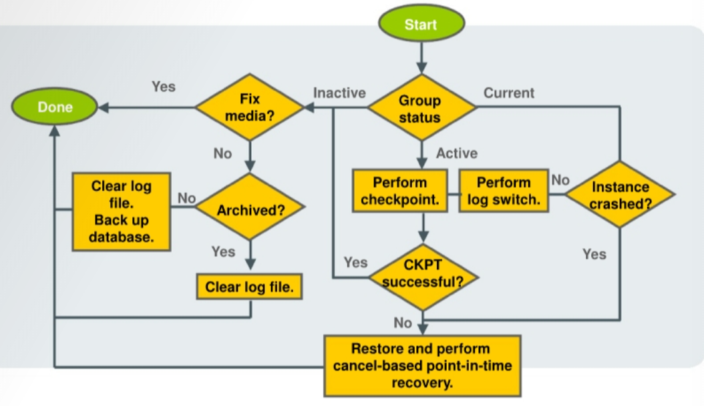
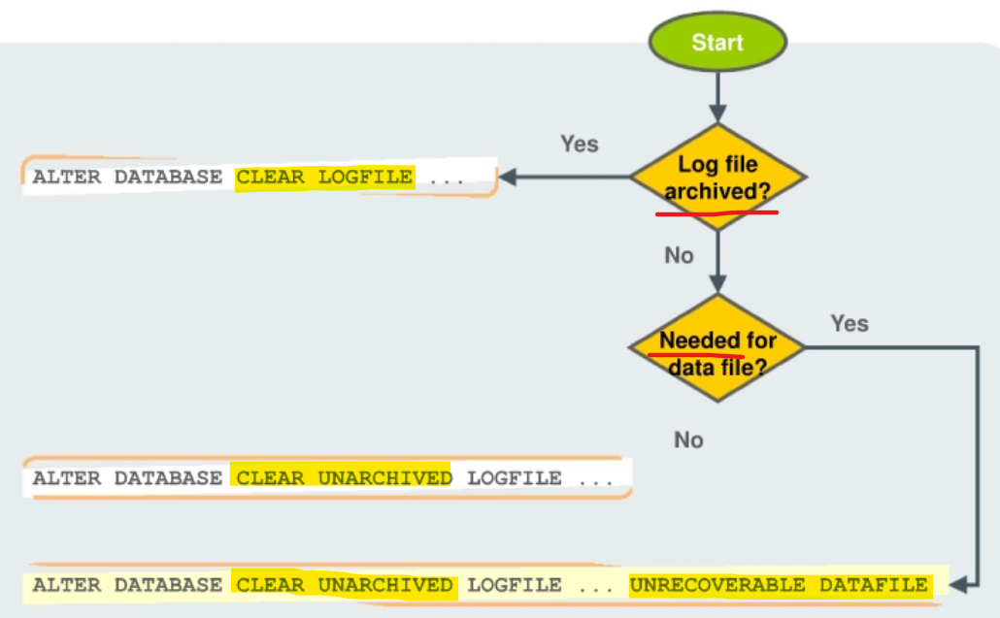

# Recovery - `Redo Log`

[Back](../../index.md)

- [Recovery - `Redo Log`](#recovery---redo-log)
  - [Recover from Loss of a `Redo Log File` 单一文件](#recover-from-loss-of-a-redo-log-file-单一文件)
  - [Recovering from the Loss of a `Redo Log Group` 一个组](#recovering-from-the-loss-of-a-redo-log-group-一个组)
    - [Log Group Status](#log-group-status)
    - [Recovery](#recovery)
  - [Clearing a Log File](#clearing-a-log-file)

---

## Recover from Loss of a `Redo Log File` 单一文件

- When **a member** of a `redo log file group` is lost and if the group still has **at least one member**:

  - **Normal operation** of the instance is **not affected**.不影响正常操作
  - You receive a message in the **alert log** notifying you that a member cannot be found.会收到警告

- **Solution**:

  1. Determine **whether there is a missing log file** by **examining** the `alert log`.
  2. Restore the missing file by first **dropping** the lost `redo log member`, Then add a new member to replace the lost redo log member.

     - `ALTER DATABASE DROP LOGFILE MEMBER '';`
     - `ALTER DATABASE ADD LOGFILE MEMBER '' TO GROUP n`

  - If the `media failure` is due to the **loss** of a `disk drive or controller`, **rename** the missing file.如果磁盘驱动问题, 需要重命名
  - If the group has already been **archived**, or if you are in `NOARCHIVELOG` mode, you may:如果是 noarchivelog, 可以清除组

    - choose to solve the problem by **clearing** the `log group` to **re-create** the missing file or files
    - can also **clear** the affected group **manually** with the following command `ALTER DATABASE CLEAR LOGFILE GROUP #`
    - To clear an **unarchived** log group, use the following command `ALTER DATABASE CLEAR UNARCHIVED LOGFILE GROUP #`

  - **Immediately** take a `full database backup` of the whole database.

---

## Recovering from the Loss of a `Redo Log Group` 一个组

### Log Group Status

- `Redo log groups` cycle through three different states as part of the normal running of the Oracle database:

  - `CURRENT`:

    - The `LGWR` process is **currently writing** `redo data` to it for any transactions going on in the database.
    - remains in this state **until** there is a **switch** to another log group.

  - `ACTIVE`:

    - It is **no longer being written** to
    - **remains** in this state during the time when a **checkpoint has not yet executed** that would write out to the `data files` all data changes that are represented in the redo log group.
    - still **contains** `redo data` that is required for instance **recovery**.

  - `INACTIVE`:
    - It is **no longer being written** to
    - it is **no longer required** for instance **recovery**.
    - free to become the **next** `CURRENT` log group.

---

### Recovery



- If you have **lost an entire** `redo log group`, then **all copies** of the `log files` for that group are **unusable** or **gone**. 所有 redo 文件都不可用

- When in the `INACTIVE` state:

  - If the problem is **temporary**, or you are able to **fix the media**,
    - then the database continues to **run normally**, and the group is **reused** when enough `log switch events` occur. 如果可以修复, 整个组可以重用
  - Otherwise, if the media cannot be fixed, you can **clear** the `log file`.如果不能修复,清除 log 文件
    - When you **clear** a log file, you are indicating that it **can be reused**.

- When in the `ACTIVE` state:

  - it is still needed for `instance recovery`. 无论当前是否正在写入, 只要在该状态都需要恢复.
  - If you are able to perform a **checkpoint**,
    - then the `log file group` is no longer needed for instance recovery, and you can proceed as if the group were in the `inactive` state. 如果可以对齐, 则组状态相当于 inactive.

- When in the `CURRENT` state:
  - may even see the `LGWR` process **fail** in this case.
    - If this happens, the instance crashes.
  - only option at this point is to **restore from backup**, perform **cancel-based** `point-in-time recovery`, and then open the database with the `RESETLOGS` option.

---

## Clearing a Log File



- Method to determine which log groups have been archived

```sql
SELECT GROUP#, STATUS, ARCHIVED FROM V$LOG;
```

- When you **clear** a `log file`, you are indicating that it can be **reused**.

- If the `redo log group` has **not** been **archived**,

  - it is possible that there are **backups** that **rely on** that `redo log` for recovery. 没有 archive 时, 意味着有备份依赖该组
  - you have decided to forgo 放弃 that recovery opportunity.
  - needs to **take another backup** right after you correct the redo log group problem; then **no longer need** that `redo log file`. 需要立即备份, 然后 log file 不能再用

- It is possible that the `redo log` is **required to recover** an offline data file.

- **Command**

```sql
-- If the log file has already been archived
ALTER DATABASE CLEAR LOGFILE GROUP <n>;

-- if not been archived and not needed
ALTER DATABASE CLEAR UNARCHIVED LOGFILE GROUP <n>

-- if not been archived and needed for data file
ALTER DATABASE CLEAR UNARCHIVED LOGFILE GROUP <n>
UNRECOVERABLE DATAFILE
```

---

[TOP](#recovery---redo-log)
