# Recovery - `Server Parameter File` & `Control File`

[Back](../../index.md)

- [Recovery - `Server Parameter File` \& `Control File`](#recovery---server-parameter-file--control-file)
  - [Recovery from Loss of `Server Parameter File`](#recovery-from-loss-of-server-parameter-file)
    - [Recover from current system: `FROM MEMORY`](#recover-from-current-system-from-memory)
    - [Restore from Autobackup](#restore-from-autobackup)
  - [Lab: Restore the parameter file](#lab-restore-the-parameter-file)
    - [Setup Environment](#setup-environment)
    - [Restore SPFile](#restore-spfile)
    - [Clean up](#clean-up)
  - [Recovery from Loss of `Control File`](#recovery-from-loss-of-control-file)
    - [Remain at least one `control file` copy](#remain-at-least-one-control-file-copy)
    - [Loss of All Control File Copies](#loss-of-all-control-file-copies)
      - [Restore from Autobackup](#restore-from-autobackup-1)
    - [Using `Recovery Catalog`](#using-recovery-catalog)
  - [Lab: Restore single loss of control file](#lab-restore-single-loss-of-control-file)
    - [Setup Environment](#setup-environment-1)
    - [Restore Control File](#restore-control-file)
    - [Clean up](#clean-up-1)
  - [Lab: Restore loss of all control files](#lab-restore-loss-of-all-control-files)
    - [Setup Environment](#setup-environment-2)
    - [Restore Control File](#restore-control-file-1)
    - [Clean up](#clean-up-2)
  - [Recover from loss of both `SPFILE` and `Control File`](#recover-from-loss-of-both-spfile-and-control-file)

---

## Recovery from Loss of `Server Parameter File`

### Recover from current system: `FROM MEMORY`

- `FROM MEMORY` clause:

  - creates a `text initialization parameter file (PFILE)` or `server parameter file (SPFILE)` by using the **current** system wide parameter settings.

- In a RAC environment, the created file **contains the parameter settings from each instance**. 包含每个实例的参数

- During instance **startup**, all parameter settings are **logged** in to the `alert.log` file.

  - The `alert.log` parameter dump text is written in **valid parameter syntax**.
    - This **facilitates cutting and pasting** of parameters into a separate file and then using it as a `PFILE` for a subsequent instance. 原理: 实例启动时, 参数以合规的语法记录在 log, 所以可以剪切和复制到新文件.
  - The name of the `PFILE` or `SPFILE` is written to `alert.log` at instance startup time.
    - In cases when an unknown client-side `PFILE` is used, the alert log indicates this as well.也会记录参数文件名, 所以可以在命令中加入文件名

- **Syntax:**

```sql
-------- Create PFILE --------

-- creates a PFILE from the default SPFILE used by the current instance
CREATE PFILE
FROM SPFILE;

-- creates a PFILE with a specified name from the default SPFILE:
CREATE PFILE='/u01/app/oracle/product/19.0.0/dbhome_1/dbs/initORCL_custom.ora'
FROM SPFILE;

-- creates a PFILE(for current instance) from a specified SPFILE
CREATE PFILE='/u01/app/oracle/product/19.0.0/dbhome_1/dbs/initORCL.ora'
FROM SPFILE='/u01/app/oracle/product/19.0.0/dbhome_1/dbs/spfileORCL.ora';

-- specifies both the input SPFILE and the output PFILE explicitly
CREATE PFILE='/u01/app/oracle/product/19.0.0/dbhome_1/dbs/initORCL_custom.ora'
FROM SPFILE='/u01/app/oracle/product/19.0.0/dbhome_1/dbs/spfileORCL.ora';

-- creates a PFILE based on the current parameter values in memory (the running instance's settings):
CREATE PFILE FROM MEMORY;


-------- Create SPFILE --------

-- Create SPFILE from default PFILE
CREATE SPFILE
FROM PFILE;

-- Create SPFILE from specified PFILE
CREATE SPFILE='/u01/app/oracle/product/19.0.0/dbhome_1/dbs/spfileORCL.ora'
FROM PFILE='/u01/app/oracle/product/19.0.0/dbhome_1/dbs/initORCL.ora';

-- Create SPFILE from memory
CREATE SPFILE
FROM MEMORY;

-- Create SPFILE with specified name from default PFILE
CREATE SPFILE='/u01/app/oracle/product/19.0.0/dbhome_1/dbs/spfileORCL_custom.ora'
FROM PFILE;

-- Create SPFILE with specified input PFILE and output SPFILE
CREATE SPFILE='/u01/app/oracle/product/19.0.0/dbhome_1/dbs/spfileORCL_custom.ora'
FROM PFILE='/u01/app/oracle/product/19.0.0/dbhome_1/dbs/initORCL.ora';
```

---

### Restore from Autobackup

- Scenario:

  - **lost** the `server parameter file` and **cannot** use the `FROM MEMORY` clause

- Solution:

  - restore it from the **autobackup**

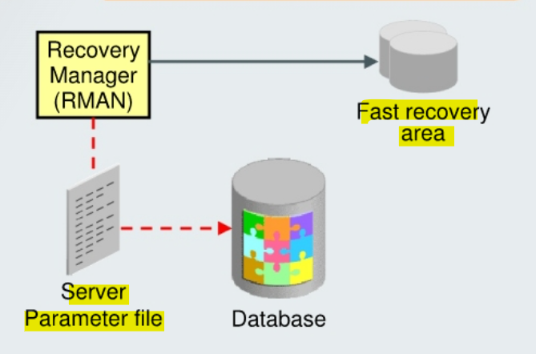

- **Syntax**:

```sql
-- Restore the SPFILE from auto backup
RESTORE SPFILE
FROM AUTOBACKUP

-- Restore the SPFILE from auto backup to a nondefault location
RESTORE SPFILE TO <file name>
FROM AUTOBACKUP

-- Restore the SPFILE from the fast recovery area
run {
    restore spfile from autobackup
    recovery area = '<flash recovery area destination>'
    db_name = '<db_name>';
}
```

- Example

```sql
STARTUP FORCE NOMOUNT;
RESTORE SPFILE FROM AUTOBACKUP;
STARTUP FORCE;
```

---

## Lab: Restore the parameter file

### Setup Environment

- Confirm auto backup control file configuration
  - Perform full backup

```sql
rman target /

-- clear configuration for the control file autobackup location on disk.
-- RMAN creates control file autobackups in the fast recovery area when no other destination is configured.
-- /u01/app/oracle/fast_recovery_area/ORCL/autobackup
CONFIGURE CONTROLFILE AUTOBACKUP FORMAT FOR DEVICE TYPE DISK CLEAR;
CONFIGURE CONTROLFILE AUTOBACKUP CLEAR;

-- confirm
show all;

BACKUP DATABASE;
```

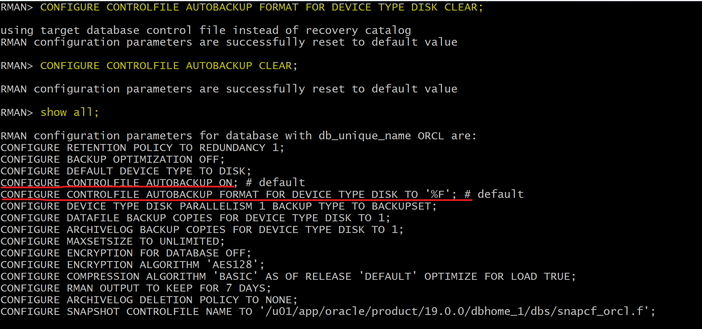

- Create user and tbsp

```sql
sqlplus / as sysdba

ALTER SESSION SET container=orclpdb;
show con_name

-- CLEANUP from previous run
DROP USER bar CASCADE;
DROP TABLESPACE bartbs INCLUDING CONTENTS AND DATAFILES;

-- Create tablespace
CREATE TABLESPACE bartbs
DATAFILE '/u01/app/oracle/oradata/ORCL/orclpdb/bartbs.dbf' SIZE 10M
SEGMENT SPACE MANAGEMENT MANUAL;

-- Create user
CREATE USER BAR IDENTIFIED BY pass4BAR
DEFAULT TABLESPACE bartbs
QUOTA UNLIMITED ON bartbs;

GRANT CREATE SESSION TO BAR;

-- create table and populate
-- be sure table is at least 2 blocks long
CREATE TABLE BAR.barcopy
TABLESPACE bartbs
AS SELECT * FROM HR.EMPLOYEES;

INSERT INTO BAR.BARCOPY
SELECT * FROM BAR.BARCOPY;

INSERT INTO BAR.BARCOPY
SELECT * FROM BAR.BARCOPY;
```

- Backup tbsp

```sql
-- Create backup of the bartbs tablespace
rman target "'sys@orclpdb as sysdba'"

BACKUP AS COPY TABLESPACE bartbs;
```

- Update the table

```sql
-- update the table
sqlplus / as sysdba

ALTER SESSION SET container=orclpdb;
UPDATE BAR.BARCOPY SET salary = salary+1;
COMMIT;
```

- Shutdown instance

```sql
sqlplus / as sysdba

shutdown abort
exit
```

- Remove PFile and SPFile

```sh
# copy the existing spfile
cp /u01/app/oracle/product/19.0.0/dbhome_1/dbs/spfileorcl.ora /home/oracle/backup/spfileorcl.ora

# remove spfile
rm -f /u01/app/oracle/product/19.0.0/dbhome_1/dbs/spfileorcl.ora

# remove pfile
if [ -e /u01/app/oracle/product/19.0.0/dbhome_1/dbs/initorcl.ora ]
then
	cp /u01/app/oracle/product/19.0.0/dbhome_1/dbs/initorcl.ora /home/oracle/backup/initorcl.ora
	rm -f /u01/app/oracle/product/19.0.0/dbhome_1/dbs/initorcl.ora
fi

# copy file back to oracle db
# cp /home/oracle/backup/initorcl.ora /u01/app/oracle/product/19.0.0/dbhome_1/dbs/initorcl.ora
# cp /home/oracle/backup/spfileorcl.ora /u01/app/oracle/product/19.0.0/dbhome_1/dbs/spfileorcl.ora
```

- Try to startup instance
  - Note: The database has been started with a dummy parameter file to allow the SPFILE to be restored.

```sql
rman target "'/ as sysbackup'"
startup
```

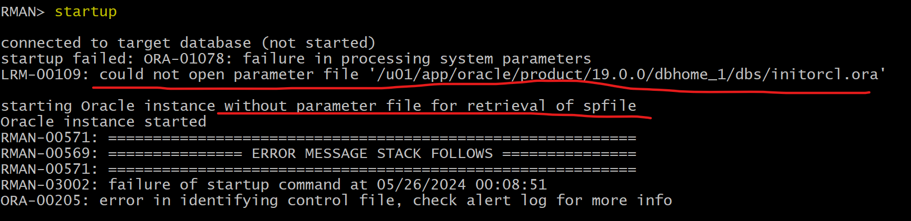

---

### Restore SPFile

- Restore the sPFILE.
  - use the `fast recovery area` and `DB_NAME` options to **specify where the autobackups can be found**.

```sql
rman target /

restore spfile from autobackup
recovery area '/u01/app/oracle/fast_recovery_area'
db_name 'orcl';
```

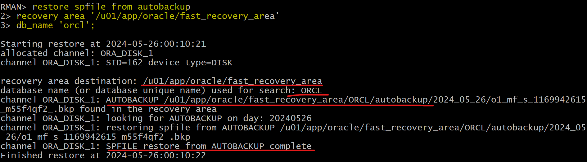

- re-startup instance

```sql
-- rman
shutdown

-- startup instance using the restored spfile
startup
```

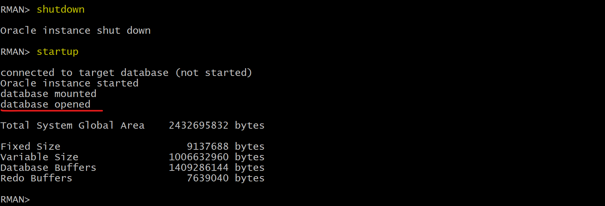

- Confirm instance can be opened.

```sql
sqlplus / as sysdba
alter session set container=orclpdb;
alter pluggable database open;

select * from BAR.BARCOPY;
```

- Backup after recovery

```sql
-- rman
-- confirm no failure
list failure;

BACKUP DATABASE PLUS ARCHIVELOG DELETE INPUT;
delete noprompt obsolete;
```

---

### Clean up

```sql
rman target "'sys@orclpdb as sysdba'"
delete NOPROMPT copy of tablespace bartbs;
exit;

sqlplus / as sysdba
ALTER SESSION SET container=orclpdb;

-- CLEANUP from previous run
DROP USER bar CASCADE;
DROP TABLESPACE bartbs INCLUDING CONTENTS AND DATAFILES;

EXIT;
```

---

## Recovery from Loss of `Control File`

- In general, the options for recovery from the loss of a control file **depend on the storage configuration** of the `control files` and on **whether at least one control file remains** or all have been lost. 总体而言, 基于存储设置和 cf 损失程度

---

### Remain at least one `control file` copy

- **Scenario:**
  - using `ASM` storage
- Solution:
  1. Put the database in `NOMOUNT` mode.
  2. Connect to RMAN and issue the `RESTORE CONTROLFILE` command to restore the `control file` **from an existing control file**

```sql
restore controlfile
from '+DATA/orcl/controlfile/current.260.695209463"';
```

- Solution:
  - can also use the ASMCMD cp command to restore the control file.

---

- **Scenario:**
  - `control files` are stored as **regular file system files**
- Solution:
  1. shutdown database,
  2. copy one of the remaining control files to the missing file's location.
- Solution:
  - if the media failure is due to the **loss of a disk drive or controller**
  - 1. **Copy** one of the remaining control files **to some other location**
  - 2. **update** the instance’s parameter file to **point to the new location**.
  - Alternatively, you can **delete the reference** to the missing control file from the initialization parameter file.

---

### Loss of All Control File Copies

- Scenario:
  - have a backup control file
- Solution:
  - depends on the status of the `online log files` and the `data files`:

| Online log status | Data file status:Current                              | Data file status:Backup                                |
| ----------------- | ----------------------------------------------------- | ------------------------------------------------------ |
| Available         | Restore backup cf, complete recovery,`OPEN RESETLOGS` | Restore backup cf, complete recovery, `OPEN RESETLOGS` |
| Unavailable       | Re-create cf,, `OPEN RESETLOGS`                       | Restore backup cf, `pitr`, `OPEN RESETLOGS`            |

---

- Scenario:
  - do not have a backup of the control file
  - but have a text file created with the `ALTER DATABASE BACKUP CONTROLFILE TO TRACE` command
- Solution:
  - use it to re-create the control file.

---

#### Restore from Autobackup

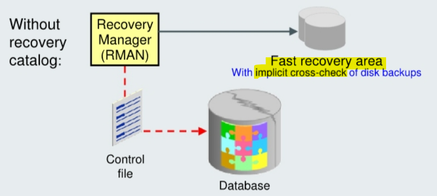

- The commands used for restoring your control file are the same, **whether or not** you are using a `fast recovery area`.

- If you are using a `fast recovery area`, RMAN implicitly **cross-checks** backups and image copies listed in the control file and catalogs any files in the fast recovery area that are not recorded in the restored control file, thereby improving the usefulness of the restored control file in the restoration of the rest of your database. 恢复的 CF 与 FRA 的备份可能有差异, 所以恢复 CF 时会交叉检查.

- `Tape backups` are **not** automatically **cross-checked** after the restoration of a control file.

  - After restoring the control file and mounting the database, you **must cross-check** the backups on tape.

- Example:

```sql
STARTUP NOMOUNT;
RESTORE CONTROLFILE FROM AUTOBACKUP;
ALTER DATABASE MOUNT;
-- must recover the database, because now have a backup control file that contains information about an older version of the database.
RECOVER DATABASE;
-- must specify RESETLOGS because the new control file represents a different instantiation of the database.
ALTER DATABASE OPEN RESETLOGS;
```

---

### Using `Recovery Catalog`

- Prerequisites:

  - target instance must be in the `NOMOUNT` state
  - RMAN must be **connected** to the `recovery catalog`

- No need to set the `DBID` or use the control file **autobackup** to restore the control file. 使用备份时, 需要表明 dbid; 使用 catalog 时, 不需要.

- The restored control file is written to all locations listed in the `CONTROL_FILES` initialization parameter. 恢复的 CF 会写到 target db 的这个参数指定的路径.

```sql
-- restore control file using catalog
RESTORE CONTROLFILE

-- restore the control file to a non-default location.
RESTORE CONTROLFILE... TO <destination>
```

- After you restore and mount the control file, you have the backup
  information necessary to restore and recover the database.

---

## Lab: Restore single loss of control file

### Setup Environment

- Confirm auto backup control file configuration
  - Perform full backup

```sql
rman target /

BACKUP DATABASE;
```

- Create user and tbsp

```sql
sqlplus / as sysdba

ALTER SESSION SET container=orclpdb;
show con_name

-- CLEANUP from previous run
DROP USER bar CASCADE;
DROP TABLESPACE bartbs INCLUDING CONTENTS AND DATAFILES;

-- Create tablespace
CREATE TABLESPACE bartbs
DATAFILE '/u01/app/oracle/oradata/ORCL/orclpdb/bartbs.dbf' SIZE 10M
SEGMENT SPACE MANAGEMENT MANUAL;

-- Create user
CREATE USER BAR IDENTIFIED BY pass4BAR
DEFAULT TABLESPACE bartbs
QUOTA UNLIMITED ON bartbs;

GRANT CREATE SESSION TO BAR;

-- create table and populate
-- be sure table is at least 2 blocks long
CREATE TABLE BAR.barcopy
TABLESPACE bartbs
AS SELECT * FROM HR.EMPLOYEES;

INSERT INTO BAR.BARCOPY
SELECT * FROM BAR.BARCOPY;

INSERT INTO BAR.BARCOPY
SELECT * FROM BAR.BARCOPY;
```

- Backup tbsp

```sql
-- Create backup of the bartbs tablespace
rman target "'sys@orclpdb as sysdba'"

BACKUP AS COPY TABLESPACE bartbs;
```

- Update the table

```sql
-- update the table
sqlplus / as sysdba

ALTER SESSION SET container=orclpdb;
UPDATE BAR.BARCOPY SET salary = salary+1;
COMMIT;
```

- Shutdown instance

```sql
sqlplus / as sysdba

shutdown abort
exit
```

- Remove Control File

```sh
if [ -e /u01/app/oracle/fast_recovery_area/ORCL/control02.ctl ]
then
  rm -f /u01/app/oracle/fast_recovery_area/ORCL/control02.ctl
fi

```

- Try to startup instance
  - Note: The database has been started with a dummy parameter file to allow the SPFILE to be restored.

```sql
sqlplus / as sysdba
startup
```

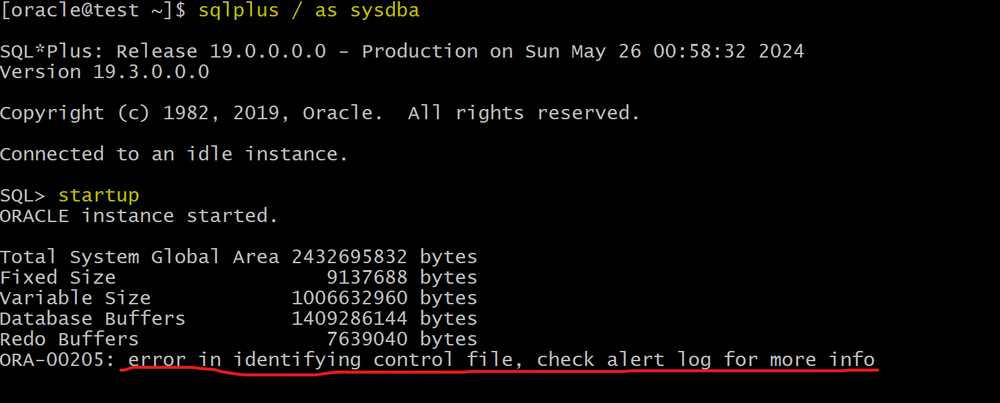

---

### Restore Control File

- Option: Use `adrci` to view the `alert log`

```sh
adrci

show home
set home home_str
# set home diag/rdbms/orcl/orcl

show alert -tail 20

exit
```

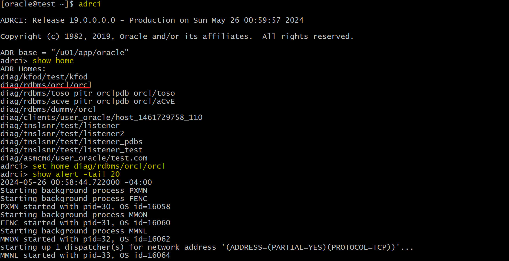
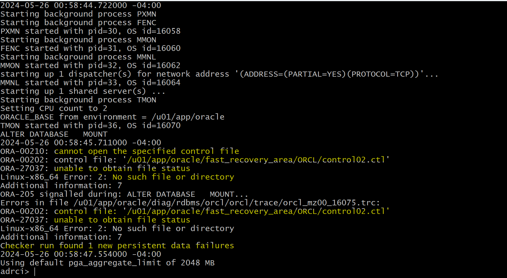

- Check the `Data Recovery Advisor` for a solution.

```sql
rman target "'/ as sysbackup'"

LIST FAILURE;
ADVISE FAILURE;
-- preview rman command line
REPAIR FAILURE PREVIEW;
REPAIR FAILURE;

-- confirm failure has been repaired
LIST FAILURE;
```

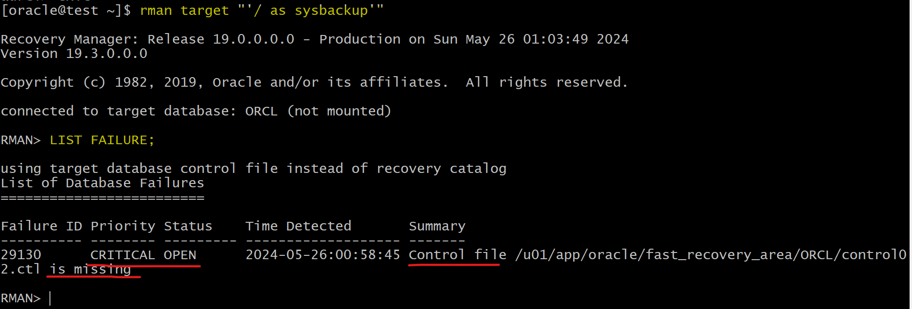

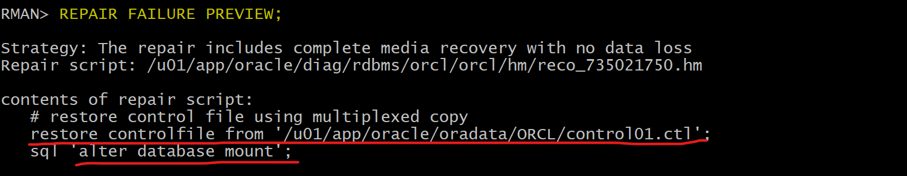

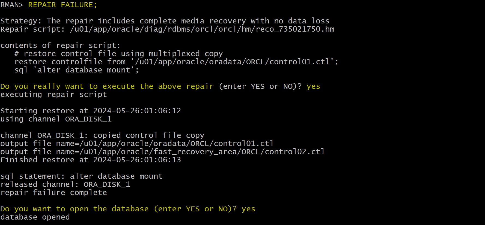

- Confirm the data by querying table

```sql
ALTER SESSION SET container=orclpdb;
alter pluggable database open;
select * from BAR.BARCOPY;
```

- Backup after recovery

```sql
-- rman
-- confirm no failure
list failure;

BACKUP DATABASE PLUS ARCHIVELOG DELETE INPUT;
delete noprompt obsolete;
exit
```

---

### Clean up

```sql
rman target "'sys@orclpdb as sysdba'"
delete NOPROMPT copy of tablespace bartbs;
exit;

sqlplus / as sysdba
ALTER SESSION SET container=orclpdb;

-- CLEANUP from previous run
DROP USER bar CASCADE;
DROP TABLESPACE bartbs INCLUDING CONTENTS AND DATAFILES;

EXIT;
```

---

## Lab: Restore loss of all control files

### Setup Environment

- Confirm auto backup control file configuration
  - Perform full backup

```sql
rman target /

BACKUP DATABASE;
```

- Create user and tbsp

```sql
sqlplus / as sysdba

ALTER SESSION SET container=orclpdb;
show con_name

-- CLEANUP from previous run
DROP USER bar CASCADE;
DROP TABLESPACE bartbs INCLUDING CONTENTS AND DATAFILES;

-- Create tablespace
CREATE TABLESPACE bartbs
DATAFILE '/u01/app/oracle/oradata/ORCL/orclpdb/bartbs.dbf' SIZE 10M
SEGMENT SPACE MANAGEMENT MANUAL;

-- Create user
CREATE USER BAR IDENTIFIED BY pass4BAR
DEFAULT TABLESPACE bartbs
QUOTA UNLIMITED ON bartbs;

GRANT CREATE SESSION TO BAR;

-- create table and populate
-- be sure table is at least 2 blocks long
CREATE TABLE BAR.barcopy
TABLESPACE bartbs
AS SELECT * FROM HR.EMPLOYEES;

INSERT INTO BAR.BARCOPY
SELECT * FROM BAR.BARCOPY;

INSERT INTO BAR.BARCOPY
SELECT * FROM BAR.BARCOPY;
```

- Backup tbsp

```sql
-- Create backup of the bartbs tablespace
rman target "'/ as sysdba'"

BACKUP AS COPY TABLESPACE orclpdb:bartbs;
```

- Update the table

```sql
-- update the table
sqlplus / as sysdba

ALTER SESSION SET container=orclpdb;
UPDATE BAR.BARCOPY SET salary = salary+1;
COMMIT;
```

- Shutdown instance

```sql
sqlplus / as sysdba

shutdown abort
exit
```

- Remove **all** Control File

```sh
# copy control01
cp /u01/app/oracle/oradata/ORCL/control01.ctl /home/oracle/backup
# remove control01
rm -f /u01/app/oracle/oradata/ORCL/control01.ctl

if [ -e /u01/app/oracle/fast_recovery_area/ORCL/control02.ctl ]
then
  # copy control02
	cp /u01/app/oracle/fast_recovery_area/ORCL/control02.ctl /home/oracle/backup
  # remove control02
	rm -f /u01/app/oracle/fast_recovery_area/ORCL/control02.ctl
fi

# confirm all control files are removed
ls /u01/app/oracle/oradata/ORCL/control01.ctl
ls /u01/app/oracle/fast_recovery_area/ORCL/control02.ctl
```

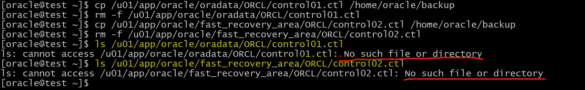

- Try to startup instance

```sql
sqlplus / as sysdba
startup
-- ORA-00205: error in identifying control file, check alert log for more info
```

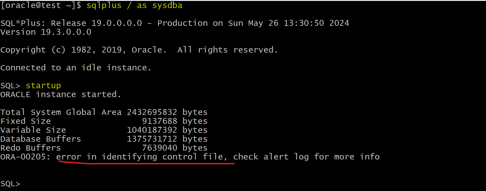

---

### Restore Control File

- Option: Use `adrci` to view the `alert log`

```sh
adrci

show home
set home home_str
# set home diag/rdbms/orcl/orcl

show alert -tail 30

exit
```

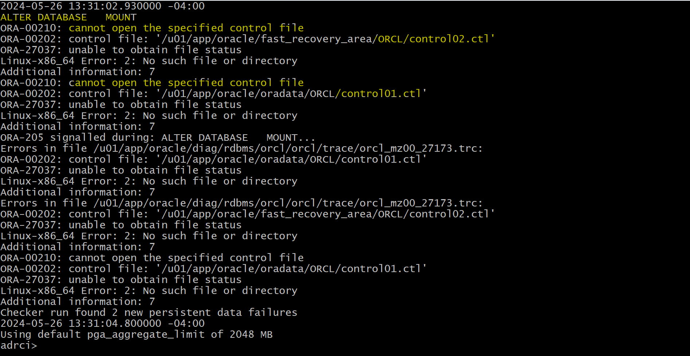

- Diagnose using `rda`

```sql
rman target "'/ as sysbackup'"

LIST FAILURE;
ADVISE FAILURE;
REPAIR FAILURE PREVIEW;
```

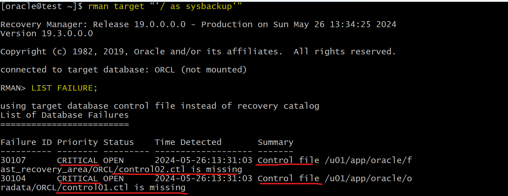


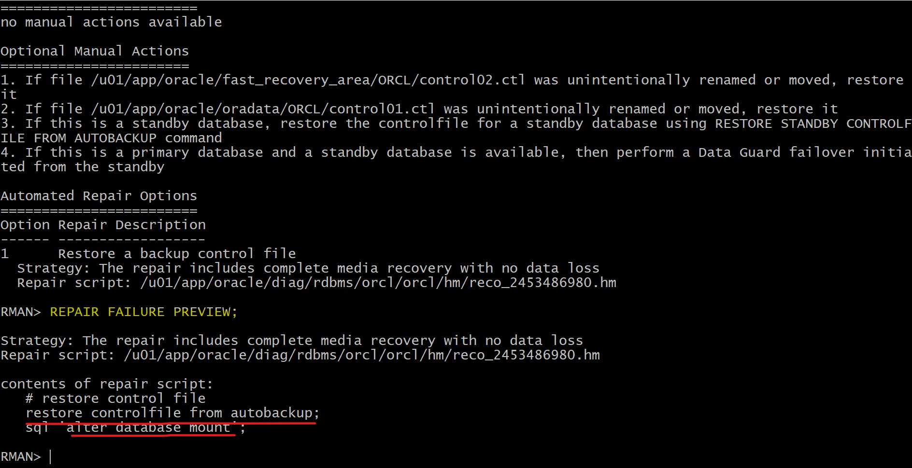

---

Option 1:

- use the automated recovery command `REPAIR FAILURE`.
- However, doing so introduces new failures, such that you would subsequently need to run these RMAN commands in a series, repeated as needed to correct the failures:

```sql
LIST FAILURE;
ADVISE FAILURE;
REPAIR FAILURE PREVIEW;
REPAIR FAILURE;
```

---

Option 2: Manually recover

- Recover control file

```sql
RESTORE CONTROLFILE FROM AUTOBACKUP;
ALTER DATABASE MOUNT;
```

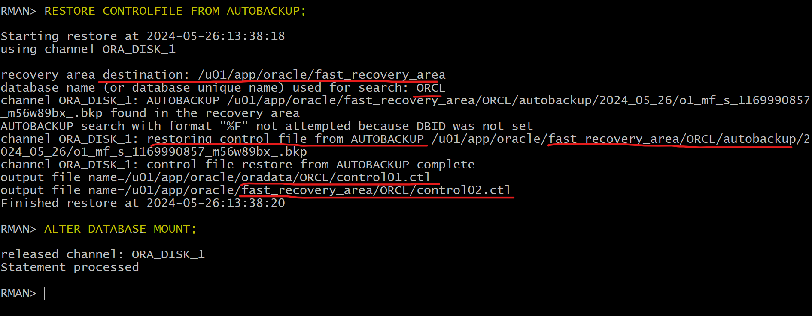

---

- Try to open
  - fails, because SCN in CF does not match with SCN in DF
- Attempt to open with the `RESETLOGS` option.
  - fails, because the SCN in the `control file` is older than the SCN in the `data files` and the data files have not been restored with the `UNTIL` cause.
  - The database needs to be recovered so that the control file can be synchronized with the data files.

```sql
ALTER DATABASE OPEN;
-- ORA-01589: must use RESETLOGS or NORESETLOGS option for database open
ALTER DATABASE OPEN RESETLOGS;
-- ORA-01194: file 1 needs more recovery to be consistent
-- ORA-01110: data file 1: '/u01/app/oracle/oradata/ORCL/system01.dbf'
```

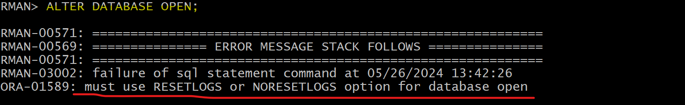
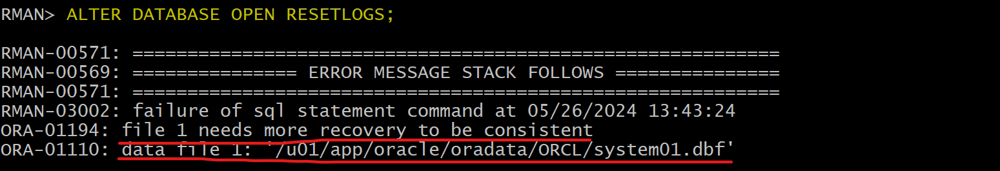

---

**Solution:**

- Recover database
  - All SCNs in DF, CF, and reset log are synchronized
- Open with resetlogs to create a new carnation to track synchronation among files.

```sql
RECOVER DATABASE;
ALTER DATABASE OPEN RESETLOGS;

-- confirm issue gets fixed
LIST FAILURE;
```

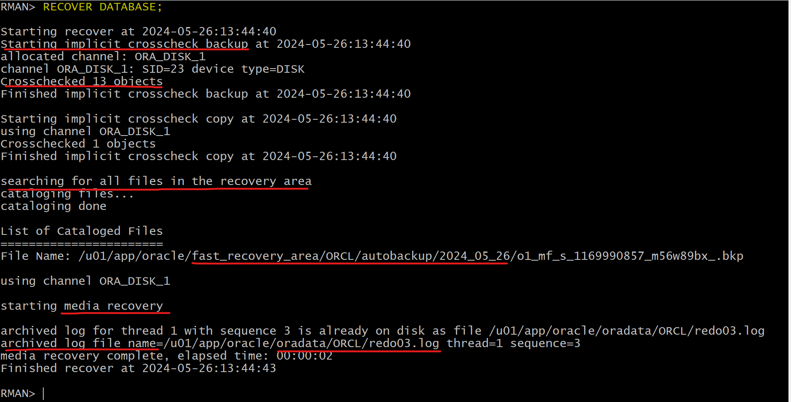
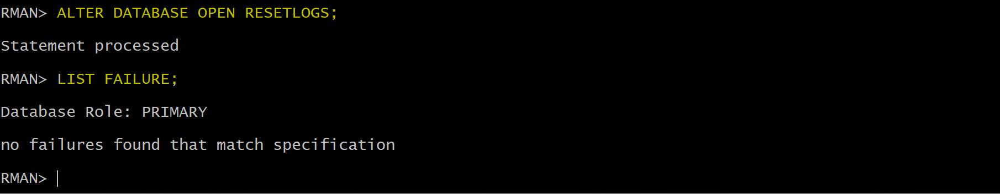

- Confirm the data by querying table

```sql
ALTER SESSION SET container=orclpdb;
alter pluggable database open;
select * from BAR.BARCOPY;
```

- Query incarnations

```sql
SELECT *
FROM V$DATABASE_INCARNATION;
```

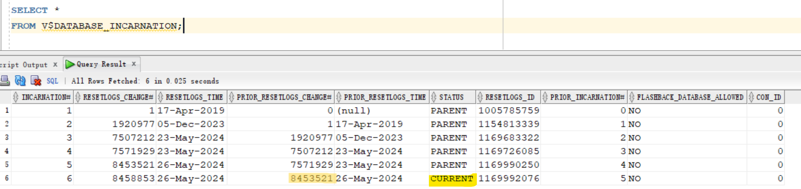

- Query current SCN

```sql
SELECT NAME, DBID, CURRENT_SCN, LOG_MODE, OPEN_MODE
FROM V$DATABASE ;
```

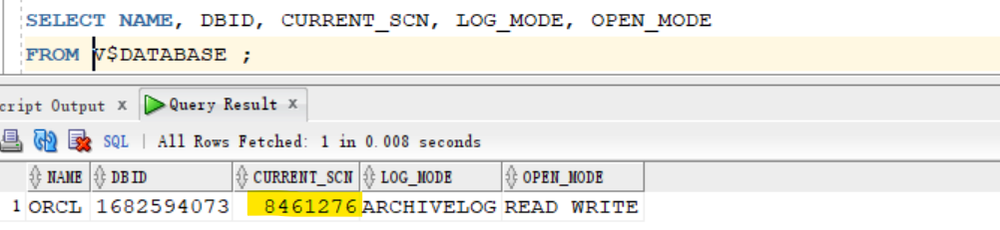

- Backup after recovery

```sql
-- rman
BACKUP DATABASE PLUS ARCHIVELOG DELETE INPUT;
delete noprompt obsolete;
exit
```

---

### Clean up

```sql
rman target "'/ as sysdba'"
delete NOPROMPT copy of tablespace orclpdb:bartbs;
exit;

sqlplus / as sysdba
ALTER SESSION SET container=orclpdb;

-- CLEANUP from previous run
DROP USER bar CASCADE;
DROP TABLESPACE bartbs INCLUDING CONTENTS AND DATAFILES;

EXIT;
```

---

## Recover from loss of both `SPFILE` and `Control File`

- Steps:

1. Set the `DBID` or use `recovery catalog`.
2. **Restore** the `SPFILE` from the **autobackup**.
3. **Start** the instance with the restored `SPFILE`.
4. **Restore** the `control file` from the **autobackup**.
5. **Mount** the database with the restored `control file`.
6. **Restore** and **recover** the database.
7. Open the database with the `RESETLOGS` option.

---
