# Recovery - `Table point-in-time recovery` (`TPITR`)

[Back](../../index.md)

- [Recovery - `Table point-in-time recovery` (`TPITR`)](#recovery---table-point-in-time-recovery-tpitr)
  - [`Table point-in-time recovery` (`TPITR`)](#table-point-in-time-recovery-tpitr)
  - [Steps](#steps)
  - [Lab: Recovering a Table from a Backup](#lab-recovering-a-table-from-a-backup)
    - [Check Configuration](#check-configuration)
    - [Option: Output RMAN to log file](#option-output-rman-to-log-file)
    - [Setup Environment](#setup-environment)
    - [Perform a level 0 backup](#perform-a-level-0-backup)
    - [Create test table](#create-test-table)
    - [Purge test table](#purge-test-table)
    - [Perform TPITR](#perform-tpitr)
    - [Clear up](#clear-up)

---

## `Table point-in-time recovery` (`TPITR`)

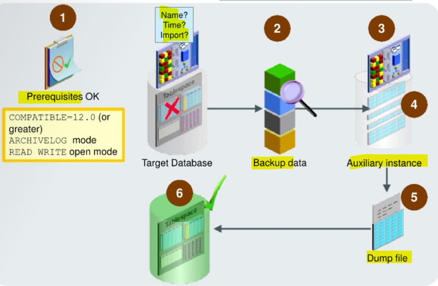

1. Specify `RECOVER` command with:

   - **Names of tables** or **table partitions** to be recovered
   - **Point in time** to which the tables or table partitions need to be recovered
   - **Whether** the recovered tables or table partitions must be **imported** into the target database

2. RMAN **determines** the `backup` based on your specification.
3. RMAN **creates** an `auxiliary instance`.
4. RMAN **recovers** your tables or table partitions, up to the specified point in time, into this `auxiliary instance`.
5. RMAN creates a `Data Pump` **export dump file** that contains the recovered objects.
6. RMAN **imports** the recovered objects into the `target database`.

- **Scenario** to recover tables and table partitions from RMAN backups:

  - to recovery a **small number** of tables
    - TSPITR is not the most effective solution because it moves **all** the objects in the tablespace to a specified point in time.
  - to recover a **tablespace** that is **not self-contained** to a particular point in time.

    - TSPITR can be used only if the tablespace is **self-contained**.

  - to recover tables that have been either **corrupted** or **deleted** with the `PURGE` option
    - so cannot use the `Flashback Drop` functionality.
  - the **flashback target time** or `SCN` is **beyond** the available undo
    - when enabled logging for a `Flashback Table`
  - to recover data that is lost after a `data definition language (DDL)` operation has **changed the structure of tables**.
    - **cannot** use `Flashback Table` to rewind a table to before the point of a structural change, such as a truncate table operation.

- Prerequisites

  - `target database` must be:
    - In `read/write` mode
    - In `ARCHIVELOG` mode

- Limitations:

  - **No** tables and table partitions **from**:
    - `sys` schema
    - `SYSTEM` and `SYSAUX` tablespaces
    - Standby databases

---

## Steps

1.  start an RMAN session with the `CONNECT TARGET` command.
2.  Enter the `RECOVER TABLE` command.
3.  RMAN **determines** the backup based on your specification.
4.  RMAN **creates** an `auxiliary instance`
    - Optionally, you can specify the location of the auxiliary instance files with the `AUXILIARY DESTINATION` or `SET NEWNAME` clauses.
    - `AUXILIARY DESTINATION` is the **recommended** clause, because if you use `SET NEWNAME` and you forget just one data file name, the recovery would not happen.
5.  RMAN **recovers** your tables or table partitions, up to the specified point in time, into this `auxiliary instance`.
6.  RMAN creates a `Data Pump` **export dump file** that contains the recovered objects. with the `DUMP FILE=name` and `DATAPUMP DESTINATION=<O0S path>`.
    - optionally **specify the name** of the `export dump file` (with the pump FILE clause, default OS-specific name) that is used to store the metadata from the source database.
    - can **specify the location** in which the export dump file is created with the `DATAPUMP DESTINATION` clause.
      - The location is typically the **path of the OS directory** that stores the `dump file`.
      - If **omitted**, the dump file is stored in the `AUXILIARY DESTINATION` location.
      - If that is not specified, then the dump file is stored in a default OS-specific location.
      - If a file with the name specified by `DUMP FILE` **exists** in the location in which the dump file must be created, then the export **fails**. 不会覆盖, 所以会出错
7.  RMAN **imports** the recovered objects into the target database
    - Use `NOTABLEIMPORT` clause not to import the recovered objects
      - if so, must **manually import** this dump file into your target database, when required, by using the `Data Pump Import` utility.
8.  Optionally, RMAN **renames** the recovered tables or table partitions with the `REMAP TABLE` and the `REMAP TABLESPACE` clauses.
    - If `REMAP` option is **not specified** and a table already **exists**, then the table recovery generates an **error**.
    - If `REMAP` option is **specified**, then the `indexes` and `constraints` are **not imported**.
      - You must **re-create dependent objects** yourself.
    - `REMAP TABLESPACE` clauses:
      - **import** the recovered objects into a `tablespace` that is different from the one in which the objects originally existed.
      - Only the tables or table partitions that are **being recovered** are remapped;
      - the **existing** objects are **not changed**. 只 remap 恢复的表,

---

## Lab: Recovering a Table from a Backup

### Check Configuration

- Check configuration before lab
  - Confirm that compatibility is set to 19. 0 or higher.
  - Confirm backup location and size.
  - Confirm that the database is in `ARCHIVELOG` mode.

```sql
show parameter compatible
-- NAME              TYPE    VALUE
-- ----------------- ------- ------
-- compatible        string  19.0.0
-- noncdb_compatible boolean FALSE

show parameter db_recovery_file_dest
-- NAME                       TYPE        VALUE
-- -------------------------- ----------- ----------------------------------
-- db_recovery_file_dest      string      /u01/app/oracle/fast_recovery_area
-- db_recovery_file_dest_size big integer 10G

ALTER SESSION SET container=cdb$root;
SELECT NAME, LOG_MODE, OPEN_MODE
FROM V$DATABASE;
-- ORCL	ARCHIVELOG	READ WRITE
```

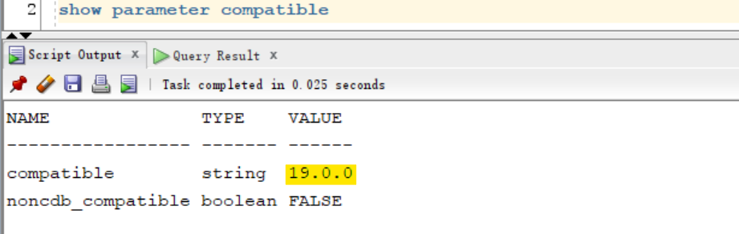
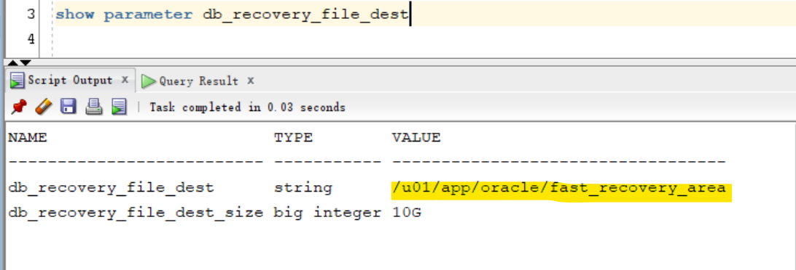
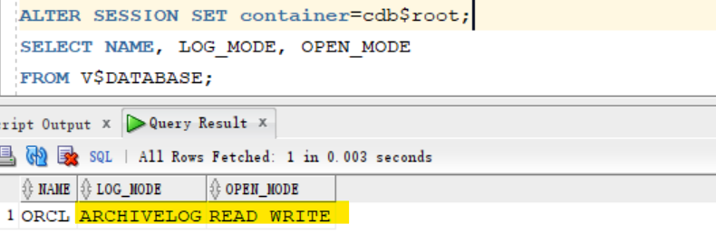

- Confirm or configure autobackup of the control file

```sql
rman target /
show CONTROLFILE AUTOBACKUP;
EXIT
```

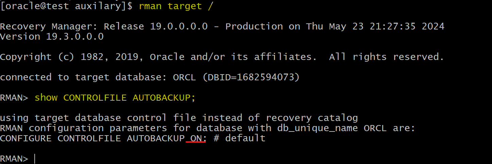

---

### Option: Output RMAN to log file

- can use the Linux `tee` command to output both to a log file and to standard output

```sh
rman target "'/ as sysbackup'" | tee /home/oracle/rman_16.log
```

---

### Setup Environment

- Create directory for Auxilary instance

```sh
mkdir -p /home/oracle/auxilary
```

- Creates a new tablespace and user

```sql
sqlplus / as sysdba

ALTER SESSION SET container=orclpdb;
show con_name

-- CLEANUP from previous run
DROP USER bar CASCADE;
DROP TABLESPACE bartbs INCLUDING CONTENTS AND DATAFILES;

-- Create tablespace
CREATE TABLESPACE bartbs
DATAFILE '/u01/app/oracle/oradata/ORCL/orclpdb/bartbs.dbf'
SIZE 10M REUSE SEGMENT SPACE MANAGEMENT MANUAL;

-- Create user
CREATE USER BAR IDENTIFIED BY pass4BAR
DEFAULT TABLESPACE bartbs
QUOTA UNLIMITED ON bartbs;

GRANT CREATE SESSION TO BAR;

-- create table and populate
-- be sure table is at least 2 blocks long
CREATE TABLE BAR.barcopy
TABLESPACE bartbs
AS SELECT * FROM HR.EMPLOYEES;

INSERT INTO BAR.BARCOPY
SELECT * FROM BAR.BARCOPY;

INSERT INTO BAR.BARCOPY
SELECT * FROM BAR.BARCOPY;

ALTER SESSION SET container=cdb$root;
ALTER SYSTEM SWITCH logfile;

ALTER SESSION SET container=orclpdb;
ALTER SYSTEM checkpoint;

-- confirm user and tbsp have been created
ALTER SESSION SET container=orclpdb;
SELECT TABLE_NAME, TABLESPACE_NAME, STATUS
FROM DBA_TABLES
WHERE OWNER = 'BAR';
-- BARCOPY	BARTBS	VALID
```

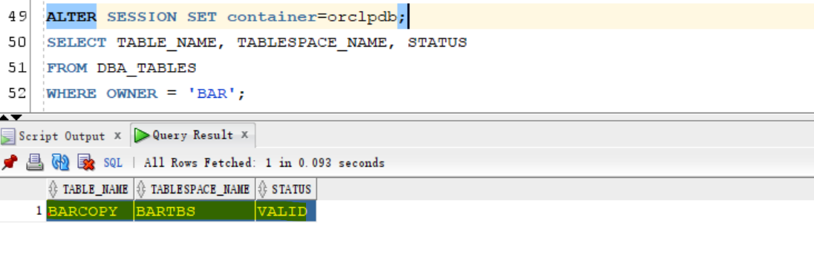

---

### Perform a level 0 backup

```sql
rman target /
backup incremental level 0 database plus archivelog;
```

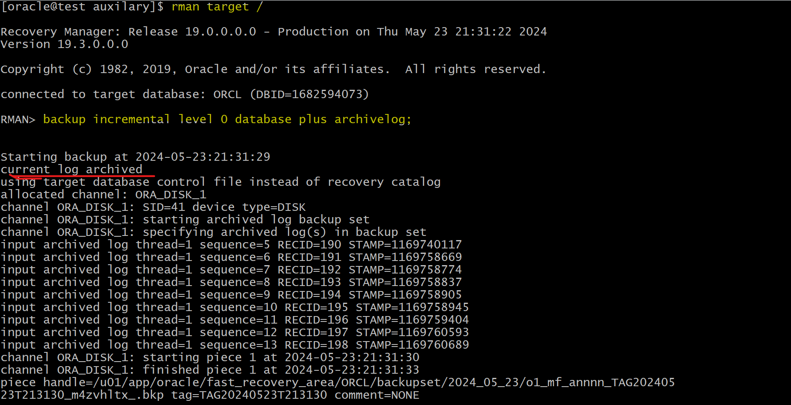

---

### Create test table

- create and populate a new table named `BAR.TEST` TABLE
  - Note the SCN after the commit.

```sql
ALTER SESSION SET container=orclpdb;
-- drop existing tb
DROP TABLE BAR.test_table;

-- create tb
CREATE TABLE BAR.test_table
(
  NUM number(8),
  NAME varchar2(25),
  NOW  date
);

-- insert data
INSERT INTO BAR.test_table VALUES (1,'First test row',sysdate);
INSERT INTO BAR.test_table VALUES (2,'Second test row',sysdate);
INSERT INTO BAR.test_table VALUES (3,'Third test row',NULL);
commit;

ALTER SESSION SET container=cdb$root;
ALTER SYSTEM SWITCH logfile;
ALTER SESSION SET container=orclpdb;
ALTER SYSTEM checkpoint;

-- get the SCN after commit
-- this scn will be used in TPITR
SELECT NAME, CURRENT_SCN
FROM V$DATABASE;
-- ORCL	7617425

-- confirm data
SELECT *
FROM BAR.TEST_TABLE;
-- First test row	23-May-2024
-- Second test row	23-May-2024
-- Third test row
```

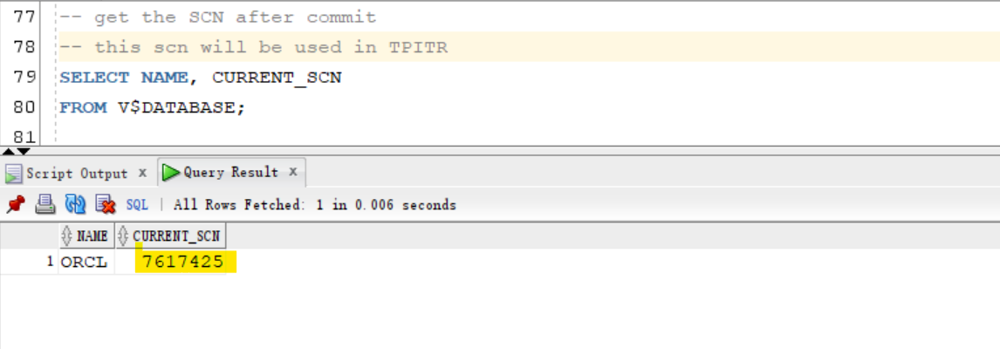

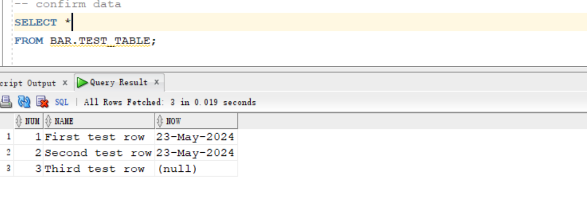

---

- perform a level 1 backup after creation of test table

```sql
rman target /
backup incremental level 1 database plus archivelog;
exit
```

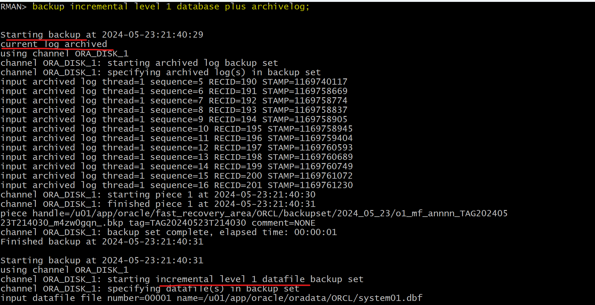

---

### Purge test table

```sql
-- Query scn before purging
SELECT NAME, CURRENT_SCN
FROM V$DATABASE;


-- purge test table
drop table BAR.test_table purge;

-- confirm purge of table
SELECT table_name
FROM dba_tables
WHERE owner = 'BAR';
-- BARCOPY

-- Query scn after purging
SELECT NAME, CURRENT_SCN
FROM V$DATABASE;
-- 7617692
```

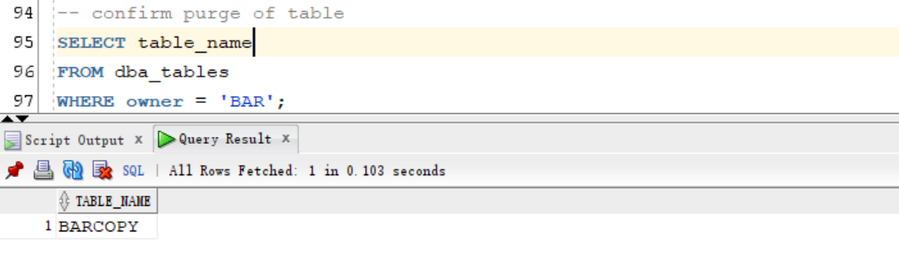

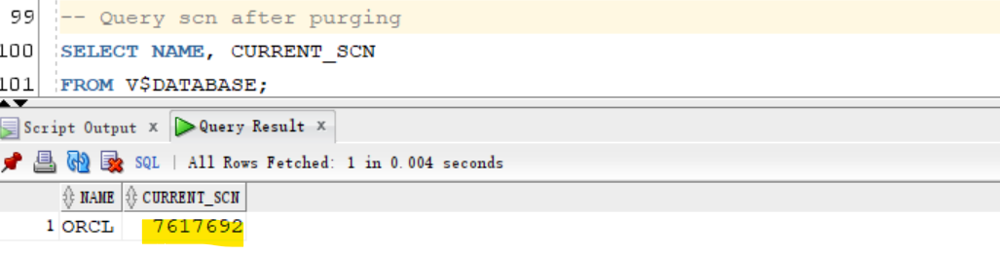

---

### Perform TPITR

- Confirm that the directory of the auxiliary destination is empty
  - The positive error prior to the `RECOVER` command confirms that the auxiliary destination is empty.

```sql
rman target /
HOST "ls /home/oracle/auxilary/*";
-- ls: cannot access /home/oracle/auxilary/*: No such file or directory
-- host command complete
-- RMAN-00571: ===========================================================
-- RMAN-00569: =============== ERROR MESSAGE STACK FOLLOWS ===============
-- RMAN-00571: ===========================================================
-- RMAN-06135: error executing host command: Additional information: 512
```

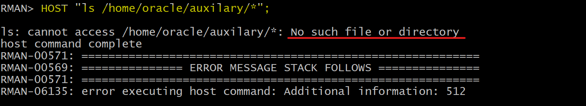

- TPITR
  - it will take some time to create instance

```sql
RECOVER TABLE BAR.TEST_TABLE OF PLUGGABLE DATABASE orclpdb
UNTIL SCN 7617425 -- replace the SCN after the commit.
AUXILIARY DESTINATION '/home/oracle/auxilary/';
```

> RMAN performs the following tasks:
> a. **Determines** the backup based on the SCN you provide
> b. **Creates** an auxiliary instance
> c. **Recovers** your tables or table partitions, up to the specified point in time, into this auxiliary instance
> d. **Creates** a Data Pump export **dump file** that contains the recovered objects
> e. **Imports** the recovered objects into the target database
> f. **Removes** the auxiliary instance

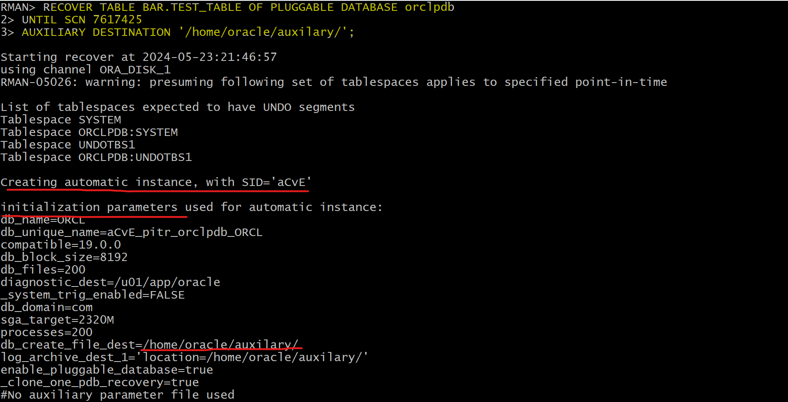
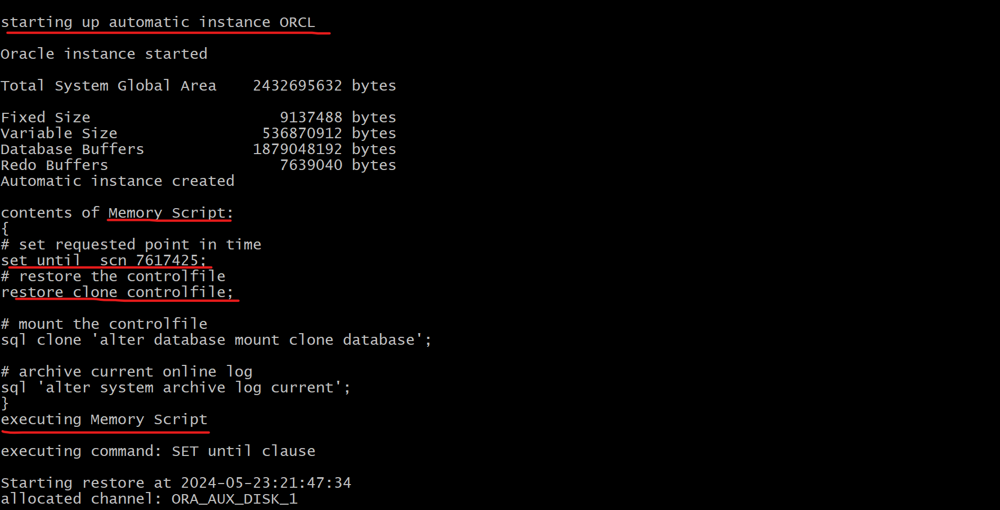
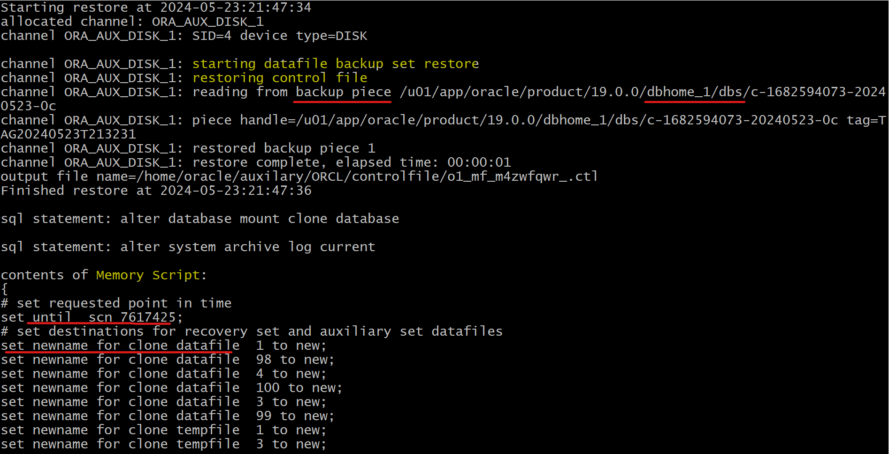
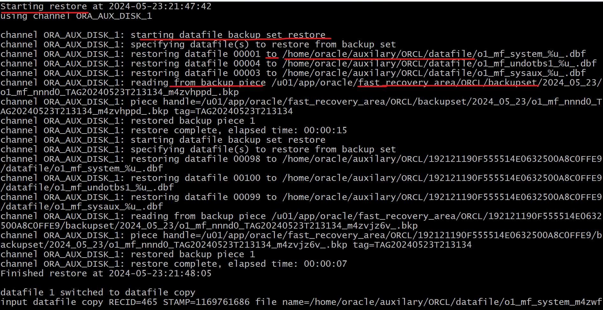
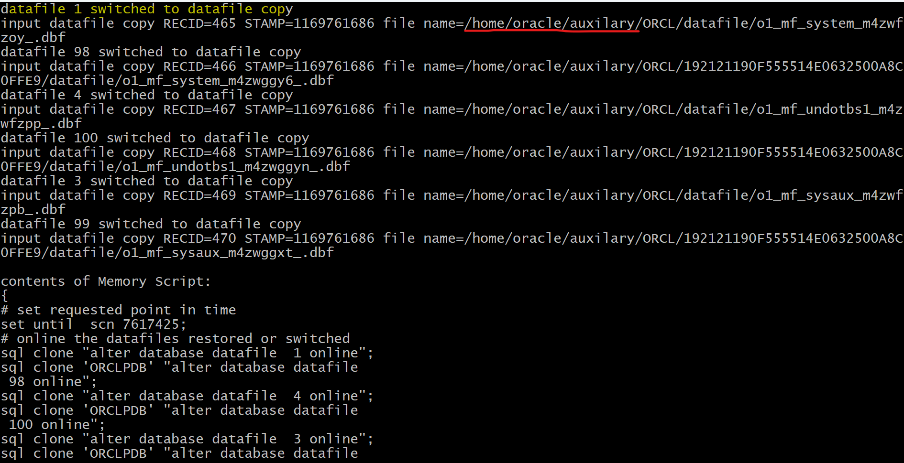
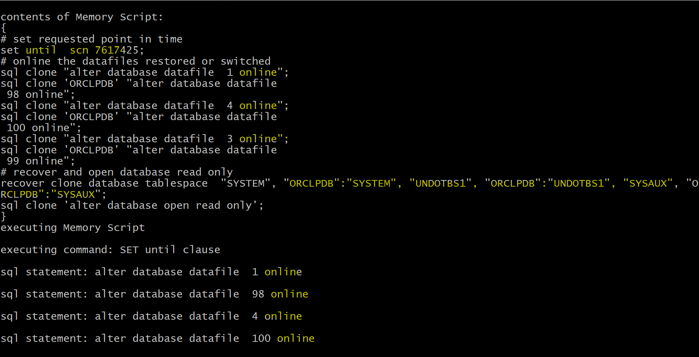
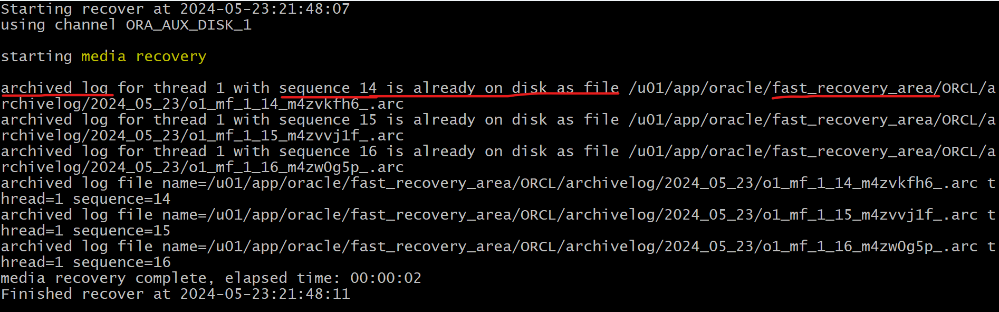
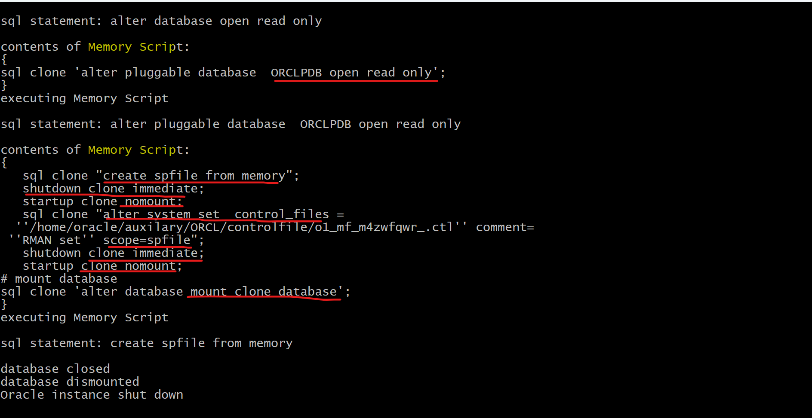
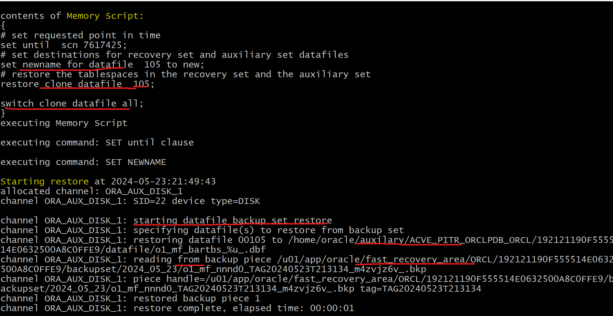
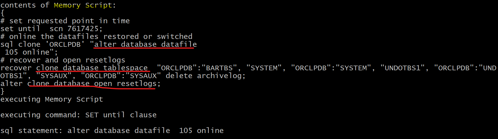
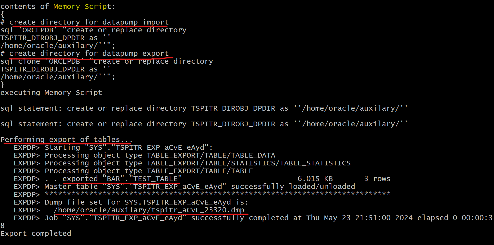
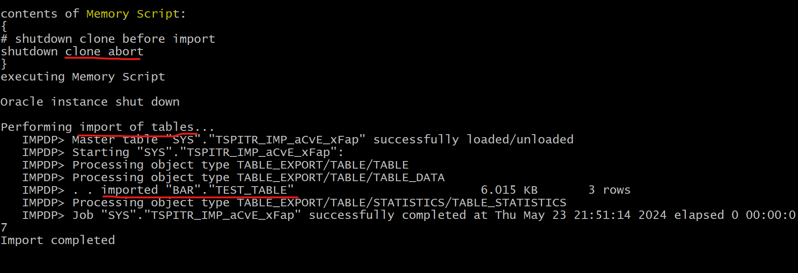
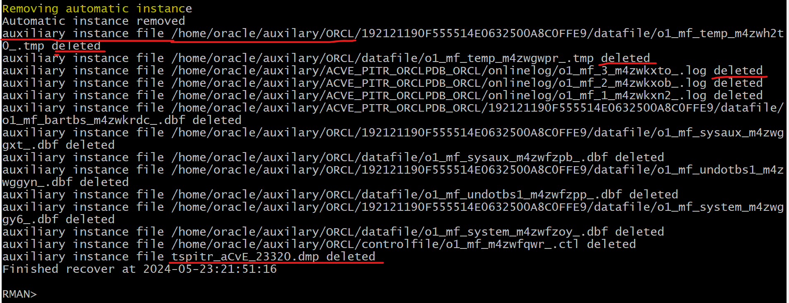

- Confirm the success of the recoery
  - The table is recovery after purging.
  - All rows of the test table are recovered.

```sql
SELECT *
FROM BAR.TEST_TABLE;
```

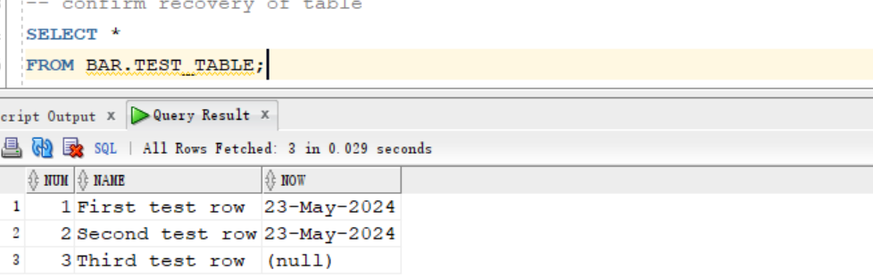

---

### Clear up

- Delete obsolete backup

```sql
delete noprompt obsolete;
```

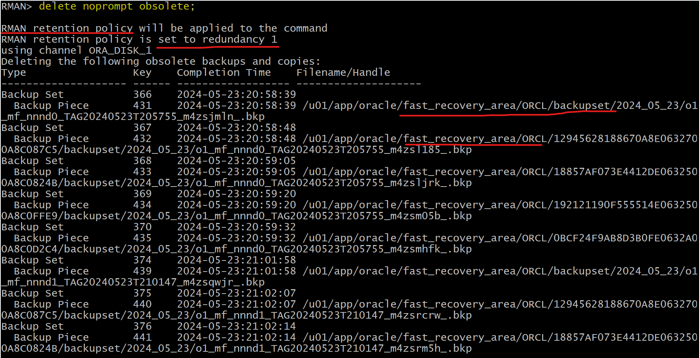

- Delete user and tbsp

```sql
sqlplus / as sysdba

ALTER SESSION SET container=orclpdb;

-- CLEANUP from previous run
DROP USER bar CASCADE;
DROP TABLESPACE bartbs INCLUDING CONTENTS AND DATAFILES;
```

- Remove files in auxilary destination

```sql
rm -rf /home/oracle/auxilary/*ORCL
```

---

[TOP](#recovery---table-point-in-time-recovery-tpitr)
