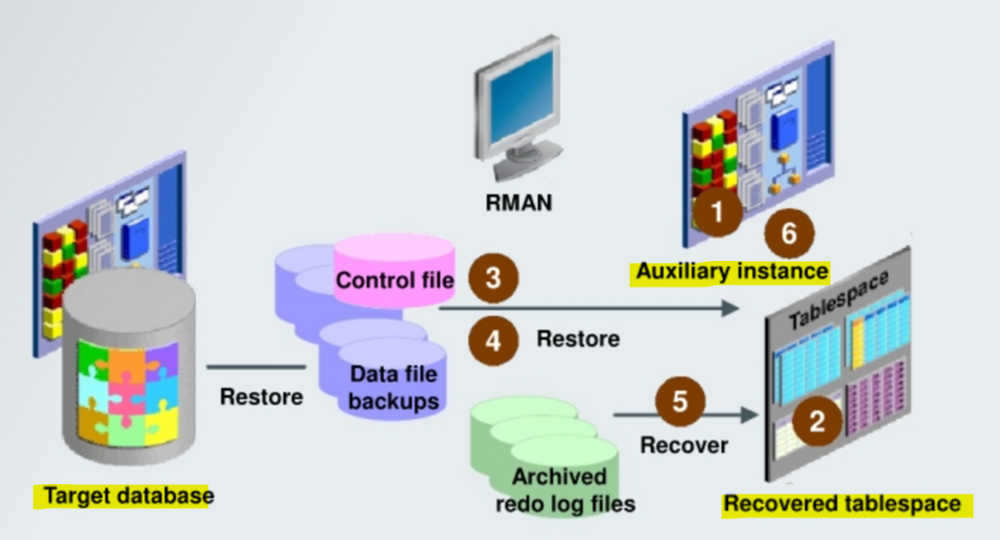
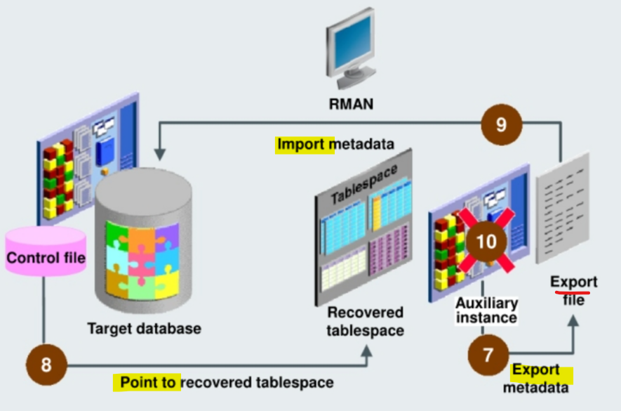

# Recovery - `Tablespace point-in-time recovery (TSPITR)`

[Back](../../index.md)

- [Recovery - `Tablespace point-in-time recovery (TSPITR)`](#recovery---tablespace-point-in-time-recovery-tspitr)
  - [`Tablespace point-in-time recovery (TSPITR)`](#tablespace-point-in-time-recovery-tspitr)
  - [Preparing for TSPITR](#preparing-for-tspitr)
    - [Determining the Correct Target Time](#determining-the-correct-target-time)
    - [Determining the Tablespaces for the Recovery Set](#determining-the-tablespaces-for-the-recovery-set)
    - [Identifying Objects That Will Be Lost](#identifying-objects-that-will-be-lost)
  - [`TSPITR` Options](#tspitr-options)
    - [Fully Automated TSPITR](#fully-automated-tspitr)
      - [Improving TSPITR Performance](#improving-tspitr-performance)
    - [TSPITR with an RMAN-Managed Auxiliary Instance](#tspitr-with-an-rman-managed-auxiliary-instance)
    - [TSPITR by Using Your Own Auxiliary Instance](#tspitr-by-using-your-own-auxiliary-instance)
  - [Troubleshooting RMAN TSPITR](#troubleshooting-rman-tspitr)

---

## `Tablespace point-in-time recovery (TSPITR)`

- **Architecture:**

  - `Target database`:
    - Contains the tablespace to be recovered
  - `Control file`:
    - Provides backup information to RMAN
  - `Backup sets`:
    - Come from the target database and are the source of the reconstructed tablespace
  - `Archived redo logs`:
    - Come from the target database and are the source of the reconstructed tablespace
  - `Auxiliary instance`:
    - Is the Oracle database **instance** used during the recovery process **to perform the recovery**





- **Steps to `TSPITR`:**

  1. Creates the `auxiliary instance`, starts it, and connects to it
  2. Takes the `tablespaces` that will be recovered **offline**
  3. **Restores** a backup `control file` from a point in time before the target time to the `auxiliary instance`
  4. **Restores** the `data files` from the `recovery set` and the `auxiliary set` to the `auxiliary instance`
  5. **Recovers** the restored data files to the specified time
  6. **Opens** the `auxiliary database` with the `RESETLOGS` option
  7. **Exports** the `dictionary metadata` about objects in the recovered tablespaces **to the** `target database`
  8. **Shuts down** the `auxiliary instance`.
     - Issues `SWITCH` commands on the `target database` so that the target database control file **points to** the `data files` in the `recovery set` that were recovered on the auxiliary instance.
  9. **Imports** the `dictionary metadata` from the auxiliary instance **to the target instance**
  10. **Deletes** all auxiliary set files

- **Situations for `TSPITR`:**

  - **recover data lost after** an erroneous `TRUNCATE TABLE` statement
  - **recover from logical corruption** of a **table**
  - **Undo** the effects of an **incorrect batch job** or another `data manipulation language (DML` statement that has **affected only a subset** of the database
  - **recover a `logical schema`** to a **different point** from the rest of the physical database
  - **recover a dropped** tablespace
  - Can be performed repeatedly to points-in-time **before** the tablespace was **brought online** **without requiring a recovery catalog**

- `TSPITR` uses **transportable tablespaces** and `Data Pump`.

---

## Preparing for TSPITR

- To prepare for TSPITR, perform the following steps:
  - Determine the correct `target time`.
  - Determine what additional tablespaces is needed in the `recovery set`.
  - Identify and **preserve objects** that will be **lost** after PITR.
    - should evaluate **what objects will be lost** as a result of the TSPITR operation and determine how you want to **preserve those objects**.

---

### Determining the Correct Target Time

- Tools to **investigate changes** to your database and to help determine the correct target time
  for TSPITR:

  - `Oracle Flashback Query`
  - `Oracle Flashback Transaction Query`
  - `Oracle Flashback Version Query`

- Recovery with a `recovery catalog`:

  - can perform **repeated** TSPITR operations **to different target times**.

- Recovery with a current `control file`:

  - The current `control file` does **not** contain a record of an **older incarnation** of the recovered `tablespace`.

    - **After** you perform `TSPITR` and bring a tablespace **online**, you **cannot** use any backup from a time **earlier than the moment** you brought the tablespace **online**.
    - **cannot make a second attempt** at `TSPITR` if you choose the wrong target time the first time 如果操作错误, 则不能恢复到重新上线之前

- If you can restore a backup `control file` from **before that time**: 除非能恢复 cf 到之前

  - can perform `incomplete recovery` of the whole database to any time **prior to or equal to** the time when you brought the tablespace **online**

- **Alternatives:**
  - With the `Flashback` tools and the **data still available as undo data**, it is usually much simpler to use the Flashback tools for undoing unwanted changes (rather than TSPITR).

---

### Determining the Tablespaces for the Recovery Set

- If objects in the tablespace that you are recovering have relationships with objects in other tablespaces, you can:

  - **Add** the tablespace that contains the related objects to the recovery set
  - **Suspend the relationship** for the duration of TSPITR
  - **Remove** the relationship

- Use the `DBMS_TTS.TRANSPORT_SET_CHECK` procedure to determine **whether** the tablespaces in the recovery set are **self-contained**.

- RMAN `TSPITR` **automatically** executes the `DBMS_TTS.TRANSPORT_SET_CHECK` procedure for the recovery set tablespaces and verifies that the query against `TRANSPORT_SET_VIOLATIONS` **returns no rows.**

  - If the query **returns rows**, RMAN **stops** `TSPITR` processing, and any tablespace containment violations **must be resolved before** TSPITR can proceed.

- Can execute the procedure and query the view as a precautionary measure:

```sql
DBMS_TTS.TRANSPORT_SET_CHECK ('USERS,EXAMPLE') ;
SELECT * FROM TRANSPORT_SET_VIOLATIONS;
```

---

### Identifying Objects That Will Be Lost

- Objects created in the tablespace **after** the target recovery time are **lost**.
- Query `TS_PITR_OBJECTS_TO_BE_DROPPED` to determine which objects will be lost after TSPITR.
- Use **Export before** TSPITR and **Import after** TSPTIR **to preserve and re-create** the lost objects.

- Example:
  - performing TSPITR for the **USERS** and **EXAMPLE** tablespaces to the target time of April 3, 2018, at 8:30:00 AM.
  - Issue the following query to determine whether there are any objects that will be lost after your TSPITR:

```sql
SELECT OWNER, NAME, TABLESPACE NAME,
TO_CHAR (CREATION TIME, 'YYYY-MM-DD:HH24:MI:SS')
FROM TS_PITR_OBJECTS_TO_ BE_ DROPPED
WHERE TABLESPACE NAME IN ('USERS', 'EXAMPLE')
AND CREATION TIME >
TO DATE ('2018-APR-03:08:30:00', 'YY-MON-DD:HH24:MI:SS')
ORDER BY TABLESPACE NAME, CREATION TIME;
```

---

## `TSPITR` Options

- **Fully automated** `TSPITR` (recommended method):

  - Specify an `auxiliary destination`.
  - **RMAN manages** all aspects of TSPITR.

- **Customized** `TSPITR` with an **automatic** `auxiliary instance`:

  - based on fully automated TSPITR.
  - **Customize** the location of files.
  - Specify initialization `parameters`.
  - Specify `channel` configurations.

- TSPITR using your **own** `auxiliary instance`:
  - Set up, start, stop, and clean up the `auxiliary instance` used in TSPITR.
  - can manage the TSPITR process

---

### Fully Automated TSPITR

- When you perform **fully automated TSPITR**, you must:

  - **Configure any channels** required for TSPITR on the target instance
  - Specify a **destination** for RMAN to use for the **auxiliary set of data files** and other **auxiliary instance files**

- **Steps:**

  1. **Configure channels** required for TSPITR on the target instance.
  2. Specify the `auxiliary destination` by using the `AUXILIARY DESTINATION` option.
  3. After TSPITR has completed, back up the recovered tablespaces and bring them online.

- **cannot** use `backups` of any tablespaces that participate in TSPITR taken **before** TSPITR after you perform TSPITR. 不能使用之前的备份

- **Example:**

```sql
CONNECT TARGET
RECOVER TABLESPACE users, example
-- assumes that
--      NLS_DATE_FORMAT is setto 'yyyy-mm-dd:hh24:mi:ss’
--      NLS_LANG is set to AMERICAN AMERICA.WE8BMSWIN1252.
UNTIL TIME '2018-06-29:08:00:00'
-- Specify the auxiliary destination
AUXILIARY DESTINATION '/u0l/app/oracle/oradata/aux';
```

---

#### Improving TSPITR Performance

- To improve TSPITR performance, use the **existing** `image copies` of the `recovery set` and `auxiliary set` `data files`

  - This technique enables RMAN to **skip restoring** the `data files` from a backup.

- Methods:
  - `CONFIGURE AUXNAME` command:
    - sets a **persistent alternative location** for an `auxiliary set` `data file` `image copy`.
  - `SET NEWNAME` command:
    - sets an **alternative location** for the duration of a RUN command.

```sql
RUN {
    SET NEWNAME FOR DATAFILE '$ORACLE_BASE/oradata/orcl/users0l.dbf'
        TO '/u0l/backup/users0l.dbf';
    RECOVER TABLESPACE users UNTIL SEQUENCE 1300 THREAD 1;
}
```

---

### TSPITR with an RMAN-Managed Auxiliary Instance

- To **customize** RMAN `TSPITR`, can use an **RMAN-managed** `auxiliary instance`:

  - **Rename or relocate** your `recovery set` `data files`.

    - Use `SET NEWNAME` to **rename** the `recovery set` `data files` so that they are not restored and recovered in their original locations.

  - **Specify a location** other than the `auxiliary destination` for some or all of the `auxiliary set` `data files`.

    - Use `SET NEWNAME` and `DB_FILE_NAME_CONVERT` to provide rules for converting `data file` names in the `target database` to `data file` names for the `auxiliary database`. 创建映射

  - Create `image copy` backups of your data files before TSPITR.
  - Use a **different channel** configuration for the `auxiliary instance`.
  - Specify different **initialization parameters** for your RMAN-managed `auxiliary instance`.

- **Improve performance:**
  - Use existing `image copies` of the `recovery set` and `auxiliary set` `data files` **on disk** rather than **restoring** them from `backup`

---

### TSPITR by Using Your Own Auxiliary Instance

- **Recommends**

  - you **allow RMAN to manage** the creation and destruction of the auxiliary instance used during RMAN TSPITR.让 rman 控制

- **Not recommended, but supported:**

  - using your own auxiliary instance

- To create an auxiliary instance:

  1.  Create an Oracle **password file** for the `auxiliary instance`.
  2.  Create an **initialization parameter file** for the `auxiliary instance`.
  3.  Verify Oracle **Net connectivity** to the `auxiliary instance`.

- To perform TSPITR with auxiliary instance:

  1. **Start** the auxiliary instance in `NOMOUNT` mode. 注意是 nomount
  2. **Connect** the `RMAN` client to the **target** and **auxiliary** instances.
  3. Execute the `RECOVER TABLESPACE` command.

---

## Troubleshooting RMAN TSPITR

- **File name conflicts:**

  - caused by:
    - the use of `SET NEWNAME`, `CONFIGURE AUXNAME`, and `DB_FILE_NAME_CONVERT` causes multiple files in the auxiliary or recovery sets to **have the same name**
  - soluted by:
    - specify **different values** for these parameters to eliminate the duplicate name.

- **RMAN cannot identify `tablespaces` with `undo segments`**:

  - Caused by:

    - During TSPITR, RMAN **needs information** about which `tablespaces` had `undo segments` at the TSPITR target time.

    - If using `recovery catalog`:
      - information is usually available in the `recovery catalog`
    - If using `Control file` or if the information is not found in the `recovery catalog`
      - RMAN proceeds, assuming that the set of `tablespaces` with `undo segments` **at the target time** is the **same as** the set of `tablespaces` with `undo segments` **at the present** 会假设 tbsp 在目标时间和当前都是相同.
      - If this assumption is not correct, the TSPITR operation fails and an error is reported.

  - Solution:
    - To prevent this from happening, **provide a list** of `tablespaces` with `undo segments` at the target time in the `UNDO TABLESPACE` clause.

- **Restarting manual auxiliary instance after TSPITR failure**:
  - If you are managing your own `auxiliary instance` and there is a **failure** in TSPITR, then **before** you can **retry** TSPITR, you **must shut down** the auxiliary instance, correct the problem, and put the auxiliary instance back in `NOMOUNT` mode. 使用自有实例并在恢复时失败, 需要关闭实例, 处理错误, 然后重新启动实例并处于 nomount 模式.

---

[TOP](#recovery---tablespace-point-in-time-recovery-tspitr)
