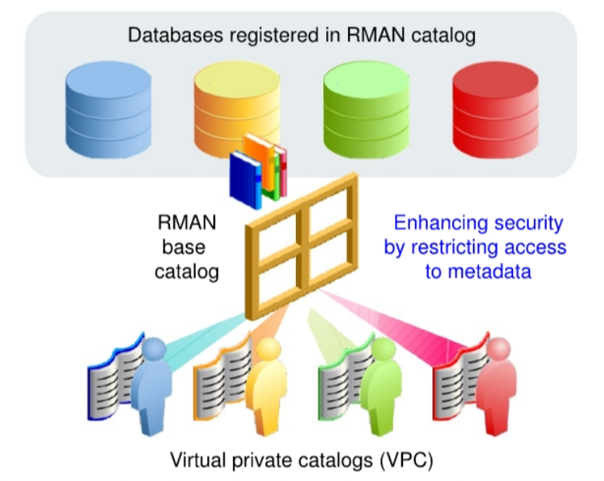

# Recovery - Virtual Private Catalogs

[Back](../../index.md)

# Creating and Using Virtual Private Catalogs



This feature allows a consolidation of RMAN repositories and maintains a separation of
responsibilities, which is a basic security requirement.

The RMAN catalog includes functionality to create virtual private RMAN catalogs (VPC) for groups of
databases and users. The RMAN recovery catalog is created and managed by using Oracle Virtual
Private Database (VPD), providing better performance and scalability when a large number of virtual
private catalogs are created.

The catalog owner can grant access to a registered database and grant the REGISTER privilege to
the virtual catalog owner. The virtual catalog owner can then connect to the catalog for a particular
target or register a target database. After this configuration, the VPC owner uses the virtual private
catalog just like a standard base catalog.

As the catalog owner, you can access all the registered database information in the catalog. You can
list all databases registered by using the SQL\*Plus command:
SELECT DISTINCT db_name FROM DBINC;
As the virtual catalog owner, you can see only the databases to which you have been granted
access.

---

## Creating a Virtual Private Catalog

1. Create the recovery catalog, tablespace, and catalog owner, as shown previously.

2. Create the owner of the Virtual Private Catalog (VPC).

3. Grant create session to VPC owner.

4. In RMAN, as the catalog owner, create the catalog.

5. In SQL\*Plus, as sysdba, execute dbmsrmanvpc.sql to enable VPD.

6. In RMAN, as the catalog owner, connect to the catalog and upgrade the catalog.

7. Grant privileges (access to the metadata/ability to register new target databases) to the
   VPC owner.

8. Register a database with a VPC and store backup metadata.
   A. Using RMAN, connect to the recovery catalog database as the VPC owner and
   connect to the database that you want to register as TARGET.
   B. Register the database with the VPC owner by using the REGISTER DATABASE
   command.
   C. Use the BACKUP command to back up the database and store metadata related to the
   backup in the VPC.

---

Virtual private catalogs are implemented through Oracle Virtual Private Database (VPD). Oracle
Virtual Private Database (VPD) provides an ability to create security policies to control database
access at the row and column level. Refer to Oracle Database Security Guide for detailed
information about Oracle VPD.

These steps work for non-CDB and PDB installations, the only difference is in the connection strings.
For a PDB installation, connect to the PDB instead of the CDB to perform the steps shown here.
Refer to Oracle Database Backup and Recovery User's Guide for additional information, including
syntax examples.

---

## Managing Virtual Private Catalogs

- If needed, revoke access to the metadata:
  ran REVOKE CATALOG FOR DATABASE prodl FROM vpcl;

- To drop a virtual private catalog:
  RMAN> DROP CATALOG;

---

To revoke access for a specific database, connect to the recovery catalog database as the recovery
catalog owner:

RMAN> REVOKE CATALOG FOR DATABASE prodl FROM vpcl;
To drop a virtual private catalog, connect to the recovery catalog database as the virtual private
catalog owner:

RMAN> DROP CATALOG;

---

## Upgrading Virtual Private Catalogs

1. Using SQL\*Plus, connect to the recovery catalog database as the sys user with the
   SYSDBA privilege.

2. Grant additional privileges to the RECOVERY CATALOG OWNER role by executing the
   SORACLE_HOME/rdbms/admin/dbmsrmansys.sql script.

3. Using RMAN, connect to the base recovery catalog and upgrade the catalog by using
   the UPGRADE CATALOG command.

4. Using SQL\*Plus, again connect to the recovery catalog database as the sys user with
   the SYSDBA privilege.

5. Upgrade the VPC schemas to the VPD model by executing the
   SORACLE_HOME/rdbms/admin/dbmsrmanvpc.sql script.

---

RMAN uses Oracle Virtual Private Database (VPD) to implement virtual private catalogs beginning
with Oracle Database 12c¢ Release 1 (12.1.0.2). If you have a recovery catalog and virtual private
catalogs using an earlier release, you must upgrade to VPD as described in the slide. Sample syntax
can be found in Oracle Database Backup and Recovery User's Guide.

---

## Lab: Enabling the Virtual Private Database (VPD) Functionality

RMAN uses the VPD functionality to implement virtual private catalogs. The VPD functionality is
not enabled by default when the RMAN base recovery catalog is created. You need to explicitly
enable the VPD model for a base recovery catalog by running the
$ORACLE_HOME/rdbms/admin/dbmsrmanvpc. sql script.

- Execute the SORACLE_HOME/rdbms/admin/dbmsrmanvpc. sql script to enable the VPD model for all the virtual private catalogs of the base catalog schema, RCATOWNER.

```sql
sqlplus sys@rcatpdb as sysdba

@$ORACLE_HOME/rdbms/admin/dbmsrmanvpc.sql -vpd rcatowner
```

- Upgrade the recovery catalog.

```sql
rman catalog rcatowner@rcatpdb
```

- Execute the UPGRADE CATALOG command. Be sure to enter the command a second
  time when prompted.

```sql
upgrade catalog;

upgrade catalog;

exit
```

---

## Lab: Creating a Virtual Private Catalog

- create a new user and create a virtual private catalog.

- Create a tablespace for virtual private catalog users.

```sql
sqlplus sys@rcatpdb as sysdba

CREATE TABLESPACE vpctbs DATAFILE
'/u0l/app/oracle/oradata/RCATCDB/rcatpdb/vpc0l.dbf' SIZE 5M REUSE;
```

- Create a new user who will own the virtual private catalog.

```sql
CREATE USER vpcowner IDENTIFIED BY <password>
DEFAULT TABLESPACE vpctbs
QUOTA UNLIMITED ON vpctbs;
```

- Grant the CREATE SESSION privilege to the new user who owns the virtual private catalog.

```sql
GRANT CREATE SESSION TO vpcowner;

exit
```

- Invoke RMAN and connect to the recovery catalog database as the base recovery catalog
  owner.

```sql
rman catalog rcatowner@rcatpdb

-- Grant access to the metadata for the ORCLPDE1 PDB to the virtual private catalog owner.
GRANT CATALOG FOR PLUGGABLE DATABASE orclpdbl TO vpcowner;

exit
```

---

## Lab: Backing Up a PDB

```sql
. oraenv
-- ORACLE_SID = [rcatcdb] ? orcledb

rman target sys@orclpdbl

CONNECT CATALOG vpcowner@rcatpdb;
```

- Perform a backup of the ORCLPDB1 PDB.

```sql
backup pluggable database orclpdbl;

-- List the backups in the virtual private catalog.
list backup;

exit
```

- Now connect as the recovery catalog owner and list the backups.

```sql
rman target "'/ as sysbackup'" catalog rcatowner(@rcatpdb

-- List the backups in the recovery catalog.
list backup;

exit
```
