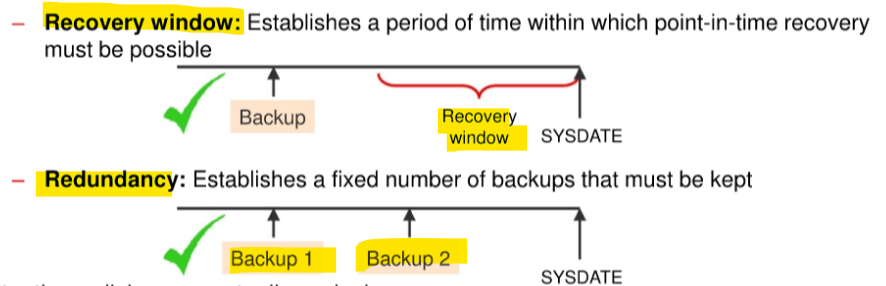
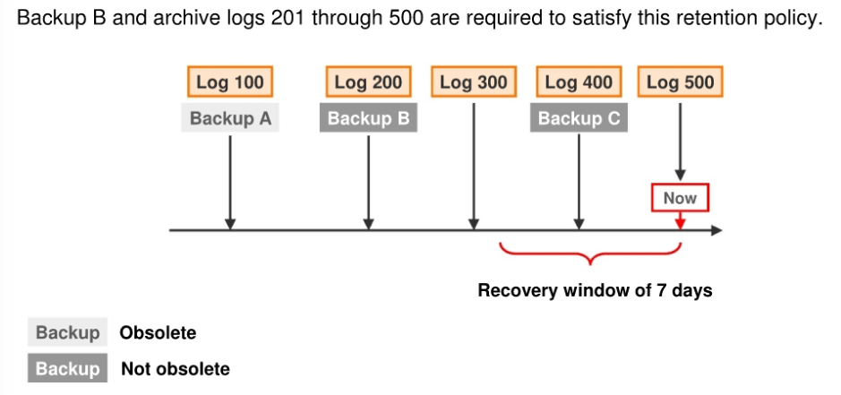
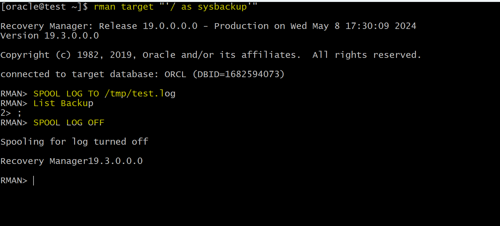

# DBA - Recovery Manager (RMAN)

[Back](../../index.md)

- [DBA - Recovery Manager (RMAN)](#dba---recovery-manager-rman)
  - [Commands](#commands)
  - [Oracle Recovery Manager (RMAN)](#oracle-recovery-manager-rman)
    - [Connecting to RMAN and a Target Database](#connecting-to-rman-and-a-target-database)
    - [Using SQL in RMAN](#using-sql-in-rman)
  - [Types of RMAN Commands](#types-of-rman-commands)
    - [Job commands](#job-commands)
  - [Configuring Persistent Settings for RMAN](#configuring-persistent-settings-for-rman)
    - [View all RMAN persistent settings](#view-all-rman-persistent-settings)
    - [Managing Persistent Settings](#managing-persistent-settings)
  - [Retention Policy](#retention-policy)
    - [Recovery Window Retention Policy](#recovery-window-retention-policy)
    - [Redundancy Retention Policy](#redundancy-retention-policy)
    - [Disabling the Retention Policy](#disabling-the-retention-policy)
    - [Example](#example)
  - [Lab](#lab)
    - [Backup Database](#backup-database)
    - [Setting the Date and Time Format for RMAN](#setting-the-date-and-time-format-for-rman)
    - [View RMAN Configuration](#view-rman-configuration)
    - [Backup Tablespace](#backup-tablespace)
    - [Direct the Output to a File](#direct-the-output-to-a-file)

---

## Commands

| RMAN Command                   | Description                                    |
| ------------------------------ | ---------------------------------------------- |
| `host 'clear screen';`         | Clear screen                                   |
| `host 'clear';`                | Clear screen                                   |
| `show all;`                    | List all persistent settings                   |
| `show <setting>;`              | Show a persistent setting                      |
| `configure <setting> <value>;` | Configure a persistent setting                 |
| `configure <setting> clear;`   | Set a persistent setting back to default       |
| `RESYNC CATALOG`               | Execute catalog resynchronization              |
| `BACKUP DATABASE`              | Backup the entire database                     |
| `ALLOCATE CHANNEL`             | Allocate a channel for executing a job command |

- Retention Policy

| RMAN Command                                                    | Description                                    |
| --------------------------------------------------------------- | ---------------------------------------------- |
| `CONFIGURE RETENTION POLICY TO RECOVERY WINDOW OF <days> DAYS;` | Configure the recovery window retention policy |
| `CONFIGURE RETENTION POLICY TO REDUNDANCY <copies>;`            | Configure the redundancy retention policy      |
| `CONFIGURE RETENTION POLICY TO NONE;`                           | Disable the retention policy                   |

---

## Oracle Recovery Manager (RMAN)

- `Oracle Recovery Manager (RMAN)`

  - is the core Oracle Database software component that **manages database backup, restore, and recovery processes**.
  - maintains configurable **backup and recovery policies** and **keeps historical records** of all database backup and recovery activities.
  - ensures
    - that **all files** required to successfully restore and recover a database **are included in complete database backups**.
    - **all data blocks** are verified to ensure that **corrupt blocks are not propagated** into the backup files.

- RMAN uses

  - the `fast recovery area` for **backups**.
  - Optionally, `Oracle Secure Backup`, so backups can be made to the **tape drive** and to the **cloud**. Backups can be performed to other designated locations, such as directly to disk.


- Intrinsic knowledge of **database file formats** and recovery procedures
  - Tablespace and data file recovery
  - Block validation
  - Online block-level recovery
  - Online, multistreamed backup
  - Unused block compression
  - Native encryption
- Integrated disk, tape, and cloud backup leveraging the `fast recovery area` and `Oracle Secure Backup`

---

### Connecting to RMAN and a Target Database

- In your Linux course environment, you have more than one local database.

  - `. oraenv` to **set your environment variables**.

- Invoke `RMAN` at the **operating system command line** and specify the appropriate options. Commonly used options are:

  - `target`: The **connect-string** for the `target database`
  - `catalog`: The **connect-string** for a `recovery catalog`
  - `nocatalog`: Specifies there is **no** `recovery catalog`.
    - the default.
  - `cmdfile`: The name of an `input command file`
  - `log`: The name of the `output message log file`

- The **RMAN invocation** `rman target /` connects to the **local database** as the `target`.

```sh
# call oraenv script to set environment vairable
. oraenv

# rman connect to the local db with the sYSBACKUP privilege.
rman target "'/ as sysbackup'"
```

---

### Using SQL in RMAN


- You can execute `SQL` commands and `PL/SQL` procedures from the RMAN command line.

  - The `SQL` keyword is optional, but you should use it **to eliminate ambiguity**, especially for a few commands that exist in **both** `RMAN` and `SQL` and have different uses.

  - The RMAN `DESCRIBE` command provides the functionality of the `SQL\*Plus DESCRIBE` command. You can use the abbreviated version `DESC` or the spelled-out `DESCRIBE` to list the column definitions of a table or view.
  - To access a table or view in another schema, you must have `SELECT` privileges on the object or connect in the `SYSDBA` mode.(sysdba 有全权限, 默认 sysbackup 没有 select any 权限)

---

## Types of RMAN Commands

- two basic types of RMAN commands: `stand-alone` and `job commands`.

  - `Stand-alone commands`
    - executed **at the RMAN prompt** and are generally self-contained.
  - `Job commands` - usually grouped and executed **sequentially inside a command block**.

    - If any command within the block **fails**, RMAN **ceases** processing; **no further** commands within the block are
      executed. The effects of any **already executed commands still remain**, though; they are not undone in any way.
    - e.g., `ALLOCATE CHANNEL`.
      - The **channel is allocated only for the execution of the job**, so it **cannot be issued as a stand-alone command**.不能单独执行

  - There are some commands that can be issued either at the prompt or within a `RUN` command block, such as `BACKUP DATABASE`.
    - If you issue stand-alone commands, RMAN allocates **any needed channels** by using the **automatic** channel allocation feature.

- You can execute `stand-alone` and `job commands` in **interactive mode or batch mode.** 两模式都可以

---

- RMAN commands are of the following types:

  - `Stand-alone command`:

    - Is executed individually at the `RMAN` prompt
    - **Cannot** appear as subcommands within `RUN`

  - `Job command`:
    - **Must** be within the braces of a `RUN` command
    - Is executed as a group

- Some commands can be executed as both types.

---

### Job commands

- Unlike stand-alone commands, job commands **must appear within the braces** of a `RUN` command.

  - Any configurations made within the run block apply within the **scope** of the block and **override** any previously made settings.

- e.g.:
  

- RMAN executes the `job commands` inside a `RUN` command block **sequentially**.
  - If any command within the block **fails**, RMAN ceases processing. **No further commands** within the block are executed.
  - When the **last command** within a RUN block completes, the Oracle database **releases any server-side resources** such as input/output (1/0) buffers or I/O slave processes allocated within the block.

---

## Configuring Persistent Settings for RMAN

- `Persistent configuration settings`

  - control many aspects of RMAN's behavior
  - always stored in the `control file` and in the `recovery catalog database` (if it exists).
  - have **default** values

- `CONFIGURE` command

  - used to configure persistent settings:

    - Configure **automatic channels**
    - Specify the **backup retention policy**
    - Specify the **number of backup copies** to be created
    - Set the default backup type to `BACKUPSET` or `COPY`
    - Limit the **size** of backup pieces
    - **Exempt a tablespace** from backup
    - Enable and disable **backup optimization**
    - Configure **automatic backups** of `control files`
    - Define the `archive log` **deletion policy**
    - Specify the **parallelism** for a device
    - Set the **encryption** and **compression** parameters to be used for backups

    - These settings are **in effect** for any RMAN **session** **until the configuration is cleared or changed.**一旦设置则长期有效直到被清除或修改

- `SET` command

  - used to change the configuration settings in an **RMAN job (or session)** just for the duration of the job (or session) with the.

---

### View all RMAN persistent settings

- to view all configuration settings

```sql
-- RMAN command to view all configuration settings
SHOW ALL;

-- sql command to display configuration settings that have been explicitly set.
SQL 'select * from V$RMAN_CONFIGURATION';
-- if no explicit settings, nothing returns.
```

- In the multitenant DB, each entry in `V$RMAN_CONFIGURATION` has a `con_id` value:
  - `0` means the configuration applies to the entire **CDB**,
  - `1` means it applies to the **root container** only, and any other value means that it applies to the **container ID** of the PDB only.


---

### Managing Persistent Settings

- `Parallelism`

  - the **number of streams of data** that can be used to **read** from and **write** to the device.
  - define the **number of channels** to be allocated when the device is used by RMAN.
    - e.g., if a media manager has **two** tape drives available, parallelism **2** would allow both tape drives to be used simultaneously for `BACKUP` commands using that media manager.
  - Parallelism for the **disk device type** is also useful, when you want to spread out a backup over **multiple** disks.
    - e.g.,

```sql
-- where <n> is the parallelism value.
CONFIGURE DEVICE TYPE <device> PARALLELISM <n>
```

---

- `SHOW` command

  - view the RMAN configuration settings.

```sql
SHOW CONTROLFILE AUTOBACKUP FORMAT;
SHOW EXCLUDE;
SHOW ALL;
```

- `SHOW AL`

  - only node-specific configurations and database configurations are displayed.

---

- `CONFIGURE` command + `CLEAR` option:
  - to reset any persistent setting to its default value

```sql
CONFIGURE BACKUP OPTIMIZATION CLEAR;
CONFIGURE MAXSETSIZE CLEAR;
CONFIGURE DEFAULT DEVICE TYPE CLEAR;
```

---

## Retention Policy

- `retention policy`

  - describes which **backups will be kept and for how long**.
  - can set the value of the retention policy by using the `RMAN` `CONFIGURE` command or `Enterprise Manager`.

- There are two types of retention policies:

  - `Recovery window`: Establishes a period of time within which `point-in-time recovery` must be possible
  - `Redundancy`: Establishes a fixed number of backups that must be kept

- Retention policies are **mutually exclusive**.



---

### Recovery Window Retention Policy

- `recovery window`

  - a period of time during which it will be possible to **discover logical errors** and** fix the affected objects** by doing a point-in-time recovery to just **before the error occurred**.

- `Recovery Window Retention Policy`
  - specified in number of days.
  - For each `data file`, there must always exist **at least one backup** that satisfies the following condition:
    - `SYSDATE`: `backup_checkpoint_time` >= `recovery_window`

```sql
-- where <days> is the size of the recovery window.
CONFIGURE RETENTION POLICY TO RECOVERY WINDOW OF <days> DAYS:
```

- If you are **not** using a `recovery catalog`, you should keep the `recovery window` time period **less than or equal to** the value of the `CONTROL_FILE_RECORD_KEEP_TIME` parameter to **prevent** the record of older backups from being **overwritten** in the control file.
- If you are using a `recovery catalog`, then make sure the value of `CONTROL_FILE_RECORD_KEEP_TIME` is greater than the time period between catalog resynchronizations.

- Resynchronizations happen when you:
  - Create a backup. In this case, the synchronization is done implicitly.
  - Execute the `RESYNC CATALOG` command.

---

### Redundancy Retention Policy

- `REDUNDANCY` option

  - Used to maintain a specific number of backups.
  - requires cataloging **a specified number of backups** before any backup is considered **obsolete**.
    - A backup is considered obsolete when **a newer version of the same file has been backed up**.新版本
  - Default: 1
    - only one backup of a file is maintained at a time.

- Command:

```sql
-- Replace <copies> with the desired number of copies to meet your policy requirements.
CONFIGURE RETENTION POLICY TO REDUNDANCY <copies>;
```

---

### Disabling the Retention Policy

- Disabling the Retention Policy if:

  - using a separate system outside of RMAN to back up your disk backups to tape.

- Consequences of disabling the retention policy:

  - RMAN will **never mark a backup as obsolete**.
    - Since RMAN won't need to decide when to remove a backup from disk (as another utility will manage that), it doesn't need to be configured for this decision.
  - RMAN will **retain** records of each backup **for the duration** specified by the `CONTROL_FILE_RECORD_KEEP_TIME` initialization parameter.

- Exceptions:

  - You can make a backup an exception to the retention policy by creating an `archival backup`.

- Command:

```sql
CONFIGURE RETENTION POLICY TO NONE;
```

---

### Example

- Case:

  - a retention policy requiring recovery capability for any point within the last seven days.



- Configuring policy:

```sql
CONFIGURE RETENTION POLICY TO RECOVERY WINDOW OF 7 DAYS;
```

- Q: for point-in-time recovery, which file is needed?

  - Some backups and logs are now obsolete because they are unnecessary for recovery within the seven-day window.
  - Based on the backups and archived log files available, only **Backup B** and **logs 201 through 500** are needed to recover to any point within the recovery window.
    - Backup A is not required because there is **a later backup** (Backup B) that was taken **before the recovery window**.
    - Backup C alone does not suffice because it **doesn't allow recovery to points** in time **at the beginning of the recovery window**.

- **Take away**
  - The **most recent backup** taken **before** the **start** of the `recovery window`, along with **all subsequent logs**, is necessary for complete recovery.

---

## Lab

### Backup Database

- The `DB_RECOVERY_FILE_DEST` parameter specifies the default location for the `fast recovery area`. - View the parameter value by logging in to SQL\*Plus and using the `SHOW PARAMETER` command.

```sql
-- in sqlplus
show parameter db_recovery_file_dest

-- in rman
BACKUP DATABASE;

```


> Include all datafiles of CDB and all PDBs, along with control file and parameter file will be backed up.
> By default, using backup set

- Confirm in the FRA


---

### Setting the Date and Time Format for RMAN

- Use the editor of your choice (vi, gedit) and add the following two lines to the end of the
  - `~oracle/.bashrc file`:
  - `export NLS_LANG=american_america.al32utf8`
  - `export NLS_DATE_FORMAT="yyyy-mm-dd:hh24:mi:ss"`

```sh
# edite bash script
vi ~oracle/.bashrc

# apply bash script to export env var
. ~oracle/.bashrc
```

- Login RMAN to list backups

```sql
list backup;
```

- By default, date format does not include the time of day information.


- After update the shell script


---

### View RMAN Configuration

```sql
-- Displays whether RMAN is configured to automatically back up the control file and server parameter file whenever a backup or copy operation is performed.
show controlfile autobackup;

-- Displays the retention policy settings for backups, which specify how long to keep backups and how they should be managed.
show retention policy;

-- Provides a summary report of the database schema, including information about the datafiles, tablespaces, and their sizes.
REPORT SCHEMA;

```


---

### Backup Tablespace

- Back up the `USERS` tablespace in both the CDB and PDB1.

```sql
BACKUP TABLESPACE users, PDB1:USERS;
```


---

### Direct the Output to a File

- Using `SPOOL LOG TO <file>`

- Create a file for logging

```sql
-- do not use ~ for home,
-- rman will create the file
SPOOL LOG TO /tmp/test.log
-- will not display
List Backup
-- stop directing output to the file.
SPOOL LOG OFF
```




---

[TOP](#dba---recovery-manager-rman)
