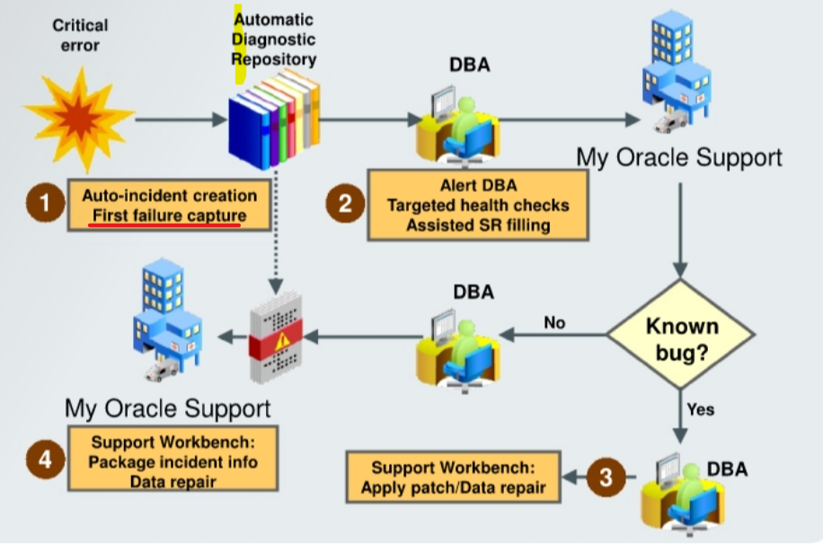

# DBA2 - Diagnosis

[Back](../../index.md)

- [DBA2 - Diagnosis](#dba2---diagnosis)
  - [Diagnosis](#diagnosis)
  - [Automatic Diagnostic Workflow](#automatic-diagnostic-workflow)

---

## Diagnosis

- Oracle tools for data repair include:

| Tools                   | Issue                                 |
| ----------------------- | ------------------------------------- |
| `RMAN`                  | physical media loss or corruptions    |
| `Flashback`             | logical errors                        |
| `Data Guard`            | physical problems                     |
| `Data Recovery Advisor` | Problem diagnosis - Incorrect choices |

- `Data Recovery Advisor`

  - provides **intelligent database problem identification** and may **reduce overall system downtime** by eliminating or reducing the amount of time a database administrator spends researching a problem.
  - reduces uncertainty and confusion, which may often occur during an outage.

---

## Automatic Diagnostic Workflow

- Typical workflow for a **diagnostic session** including `Oracle Support Services`:

1. Incident **causes an alert** to be raised in `Enterprise Manager (EM)`.
2. The DBA can view the alert via the `Cloud Control Alert` page.
3. The DBA can **drill down** to incident and problem details.
4. The DBA or `Oracle Support Services` can decide or ask for that information to be packaged and sent to `Oracle Support Services` via My Oracle Support. The DBA can add files to the data to be packaged automatically.

---

[TOP](#dba2---diagnosis)
