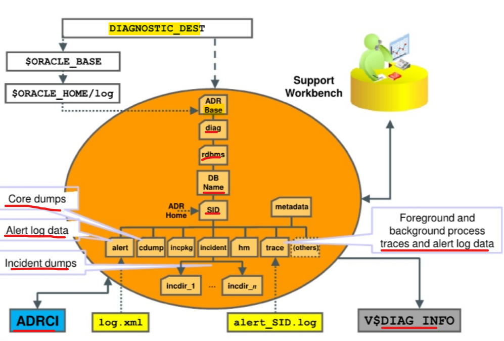

# Diagnosis - `Automatic Diagnostic Repository (ADR)`

[Back](../../index.md)

- [Diagnosis - `Automatic Diagnostic Repository (ADR)`](#diagnosis---automatic-diagnostic-repository-adr)
  - [Automatic Diagnostic Repository](#automatic-diagnostic-repository)
  - [ADR Command-Line Tool (ADRCI)](#adr-command-line-tool-adrci)
  - [Views](#views)

---

## Automatic Diagnostic Repository

- `Automatic Diagnostic Repository (ADR)`:

  - a special repository used by `Data Recovery Advisor`
  - a **file-based repository** for database **diagnostic data** such as traces, incident dumps and
    packages, the alert log, Health Monitor reports, core dumps, and more.
  - has a **unified directory structure** across **multiple** instances and multiple products-stored **outside of** any database.
    - available for problem diagnosis when the database is down.

- It is automatically maintained to **hold diagnostic information** about **critical** error events.

  - This information can be used by the `Data Recovery Advisor` and also to create incident packages for `Oracle Support Services`.

- Characteristics:

  - ADR store all diagnostic data for:
    - `Oracle Database server`, `Automatic Storage Management (ASM)`, `Cluster Ready Services (CRS)`,and **other Oracle products or components**
  - Each **instance** of each **product** stores diagnostic data **underneath its own ADR home directory**. 每个产品的每个实例都有其自己的 ADR,并存储各自的数据
    - e.g., in a `Real Application Clusters` environment with shared storage and `ASM`, each database instance and **each ASM instance** have a **home directory within the ADR**.
  - ADR's **unified directory structure**, consistent diagnostic data formats across products and instances, and a unified set of tools enable customers and Oracle Support to correlate and analyze diagnostic data across multiple instances.文件夹结构统一



- `DIAGNOSTIC_DEST` initialization parameter:
  - `ADR base` / ADR root directory
  - If this parameter is omitted or left null, it will be set upon startup as follows
    - If the environment variable `ORACLE_BASE` is set, `DIAGNOSTIC_DEST` = `$ORACLE_BASE`.
    - Otherwise, `DIAGNOSTIC_DEST` is set to `$ORACLE_HOME/log`.

---

## ADR Command-Line Tool (ADRCI)

- `ADR Command-Line Tool (ADRCI)`

  - a **command-line tool** that is part of the database fault diagnosability infrastructure.
  - enables you to:
    - View diagnostic data within the ADR
    - Package incident and problem information into a ZIP file for transmission to `Oracle Support`

- ADRCI can be used in:

  - interactive mode
  - scripts mode

- ADRCI can **execute scripts** of ADRCI commands.

```sh
# example adrci
adrci

# listing all open incidents stored in ADR.
show incident
```

- Security:

  - There is **no need to log** in to ADRCI, because the data in the ADR is not intended to be secure.
  - ADR data is secured **only by operating system permissions** on the ADR directories.

---

## Views

| View          | Description                       |
| ------------- | --------------------------------- |
| `V$DIAG_INFO` | lists all important ADR locations |
|               |                                   |

- Important location in View `V$DIAG_INFO`
  - `ADR Base`: Path of the ADR base
  - `ADR Home`: Path of the ADR home for the **current database instance**
    - Note: This is a path name. There is no official environment variable called ADR HOME.
  - `Diag Trace`: Location of the text **alert log** and background/foreground **process trace files**
  - `Diag Alert`: Location of an **XML version** of the alert log
  - `Diag Incident`: **Incident logs** are written here.
  - `Diag Cdump`: **Diagnostic core files** are written to this directory.
  - `Health Monitor`: Location of **logs from Health Monitor** runs
  - `Default Trace File`: Path to the **trace file** for your **session**. SQL trace files are written here.

---

[TOP](#diagnosis---automatic-diagnostic-repository-adr)
