# Diagnosis - Data Failure & `Data Recovery Advisor`

[Back](../../index.md)

- [Diagnosis - Data Failure \& `Data Recovery Advisor`](#diagnosis---data-failure--data-recovery-advisor)
  - [Data Failure](#data-failure)
  - [`Data Recovery Advisor`](#data-recovery-advisor)
    - [Listing Data Failures](#listing-data-failures)
    - [Advising on Repair](#advising-on-repair)
    - [Executing Repairs](#executing-repairs)
    - [Classifying and Closing Failures](#classifying-and-closing-failures)
    - [Views](#views)
  - [Lab: Diagnosing and Repairing Database Failure](#lab-diagnosing-and-repairing-database-failure)
    - [Setup environment](#setup-environment)
    - [Diagnosing Database Failure](#diagnosing-database-failure)
    - [Repairing Database Failure](#repairing-database-failure)
    - [Clean up](#clean-up)

---

## Data Failure

- `Data failures`
  - detected by checks, which are diagnostic procedures that **assess the health** of the database or its components.
- Each `check` can diagnose one or more failures, which are mapped to a repair.

  - Checks can be **reactive** or **proactive**.
    - When an error occurs in the database, `reactive checks` are **automatically executed**.
    - You can also initiate `proactive checks`, for example, by executing the `VALIDATE DATABASE` command.

- **Example** of Data Failure:

  - **Not accessible components**
    - e.g.,
      - **Missing** data files at the OS level
      - Incorrect access **permissions**
      - **Offline** tablespace and so on
  - **Physical corruptions**
    - e.g., block **checksum failures** or **invalid block** header field values
  - **Logical corruptions**
    - such as inconsistent dictionary, corrupt row piece, corrupt index entry, or corrupt transaction
  - **Inconsistencies**
    - such as control file is older or newer than the data files and online redo logs
  - **I/O failures**
    - such as a limit on the number of open files exceeded, channels inaccessible, network or I/O error

- The `Data Recovery Advisor` can analyze failures and suggest repair options for issues

---

## `Data Recovery Advisor`

- `Data Recovery Advisor`

  - automatically **gathers data failure information** when an error is encountered.
  - can proactively **check for failures**, detect and analyze data failures **before** a database process discovers the corruption and signals an error. 可以先于 db 发现并分析错误.

  - handles both cases: 处理致命错误和非致命错误
    - the one where you cannot start up the database (because some required database files are missing, inconsistent, or corrupted)
    - the one where file corruptions are discovered during run time.

- **Characteristics**:

  - Fast detection, analysis, and repair of failures
  - Minimizing disruptions for users
  - Down time and runtime failures

- **User interfaces:**
  - `EM` GUI interface (several paths)
  - `RMAN` command line

```sql
rman target / nocatalog
list failure all;
```

- **Supported Database Configurations**

  - **Single**-instance
  - **Not** `RAC`
  - Supporting failover to standby, but **not analysis and repair** of **standby** databases

---

- **Workflow with DRA:**

1. The `Health Monitor` automatically **executes checks** and **logs failures** and their symptoms as “findings” into the `ADR`.
2. The `Data Recovery Advisor` consolidates findings into failures. It **lists the results** of previously executed assessments with failure severity (critical or high).
3. When you ask for repair advice on a failure, the `Data Recovery Advisor` maps failures to automatic and manual repair options, checks basic feasibility, and presents you with the repair advice.
4. You can choose to **manually** execute a repair or request the `Data Recovery Advisor` to do it for you.


---

- **Command-Line Interface**

| RMAN Command     | Action                                                              |
| ---------------- | ------------------------------------------------------------------- |
| `LIST FAILURE`   | Lists previously executed failure assessment                        |
| `ADVISE FAILURE` | Displays recommended repair option                                  |
| `REPAIR FAILURE` | Repairs and closes failures (after ADVISE in the same RMAN session) |
| `CHANGE FAILURE` | Changes or closes one or more failures                              |

---

### Listing Data Failures

- `LIST FAILURE`:

  - lists previously executed failure assessment
  - Including newly diagnosed failures
  - Removing closed failures (by default)

- **Characteristics**:

  - Failures are uniquely identified by failure **numbers**.
  - Note that these numbers are **not consecutive**, so gaps between failure numbers have no significance.失败号码无顺序
  - If the **target instance** uses a `recovery catalog`, it can be in `STARTED` mode;
    - otherwise it must be in `MOUNTED` mode.
  - does **not** initiate checks to diagnose **new failures**;
    - it lists the results of **previously executed assessments**.
    - **Repeatedly** executing the this command **revalidates** all existing failures.
  - If the database diagnoses **new ones** (between command executions), they are **displayed**. 返回实时监控结果
  - If a user **manually fixes** failures, or if transient failures **disappear**, then the `Data Recovery Advisor` **removes** these failures from the output.人工修复或消失的失败会被移除

- **Syntax**:
  - `failnum`: Number of the failure to display repair options for
  - `ALL`: List failures of **all priorities.**
  - `CRITICAL`: List failures of `CRITICAL` priority and `OPEN` status.
    - These failures **require immediate attention**, because they make the whole database **unavailable** (for example, a missing `control file`).
  - `HIGH`: List failures of `HIGH` priority and `OPEN` status.
    - These failures make a database **partly unavailable** or **unrecoverable**, so they should be repaired quickly (for example, missing `archived redo logs`).
  - `LOW`: List failures of `Low` priority and `OPEN` status.
    - Failures of a low priority **can wait** until more important failures are fixed.
  - `CLOSED`: List only **closed** failures.
  - `EXCLUDE FAILURE`: **Exclude** the specified list of **failure numbers** from the list.
  - `DETAIL`: List failures by **expanding the consolidated failure**.
    - For example, if there are multiple block corruptions in a file, the DETAIL option lists each one of them.

```sql
LIST FAILURE
[ ALL | CRITICAL | HIGH | LOW | CLOSED | failnum[, failnum,..] ]
[ EXCLUDE FAILURE failnum[,failnum,..] ]
[ DETAIL J]
```

---

### Advising on Repair

- `ADVISE FAILURE`:

  - displays a recommended repair option for the specified failures and prints a summary of the input failure
    - If a new failure has been recorded in ADR since the last `LIST FAILURE` command, this command includes a `WARNING` **before** advising on all `CRITICAL` and `HIGH` failures. 新插入的失败会显示为警告
  - Displays a manual checklist
  - Lists a single **recommended** repair option
  - By default, advise on all the `CRITICAL` and `HIGH` priority failures that are recorded in `ADR`.

- Two general **repair options** are implemented:

  - `no-data-loss`
  - `data-loss repairs`.

- When the `Data Recovery Advisor` generates an automated repair option, it **generates a script** that shows you how RMAN plans to repair the failure. 会生成脚本

  - If you do not want the `Data Recovery Advisor` to automatically repair the failure, then you can use this script as a starting point for your manual repair.
  - The `operating system (OS)` **location** of the script is printed at the end of the command output.
  - You can examine this script, customize it (if needed), and also execute it manually if, for example, your audit trail requirements recommend such an action.

- Syntax:

```sql
ADVISE FAILURE
[ ALL | CRITICAL | HIGH | LOW | failnum[, failnum,..] ]
[ EXCLUDE FAILURE failnum [,failnum,..] ]
```

---

### Executing Repairs

- `REPAIR FAILURE` command:

  - **used after** an `ADVISE FAILURE` command in the same RMAN session.
  - By default, uses the single, recommended repair option of the **last** `ADVISE FAILURE` execution in the current session.仅仅针对当前的建议进行修复
    - During the **execution** of a repair, the output of the command indicates **what phase of the repair** is being executed.
  - If none exists, it initiates an implicit `ADVISE FAILURE` command. 如果没有失败, 则会自动触发 advise 命令
  - After completing the repair, the command **closes** the failure.

- `USING ADVISE OPTION` integer:

  - specify desired **repair option** by its **option number** (from the `ADVISE FAILURE` command );
  - this is not the failure number.

- You **cannot** run **multiple concurrent** repair sessions.

  - However, concurrent `REPAIR .. PREVIEW` sessions are allowed.

- Syntax:
  - `PREVIEW`:
    - Do not execute the repairs;
    - instead, display the previously generated RMAN **script** with all repair actions and comments.
  - `NOPROMPT`:
    - Do not ask for confirmation.

```sql
REPAIR FAILURE
[USING ADVISE OPTION integer]
[ { {NOPROMPT | PREVIEW}}...]
```

---

### Classifying and Closing Failures

- `CHANGE FAILURE` command:
  - **Changes** the failure **priority**
    - **except for `CRITICAL`**
  - **Closes** one or more failures
  - By default, the command asks the user to **confirm** a requested change.

```sql
CHANGE FAILURE
{ ALL | CRITICAL | HIGH | LOW | failnum[,failnum,..] }
[ EXCLUDE FAILURE failnum[,failnum,..] ]
{ PRIORITY {CRITICAL | HIGH | LOW} | cLose } -- Change status of the failure(s) to closed.
[ NoproMPT ] -- Do not ask user for a confirmation.
```

- It is an **error** to change the priority level of `CRITICAL`.
- A failure priority can be changed:

  - from `HIGH` to `Low`
  - from `LOW` to `HIGH`
  - e.g.:
    - if a **block corruption** has `HIGH` priority, you may want to **temporarily** change it to `Low` if the block is in a **little-used tablespace**.

- Closing failures
  - implicitly when repaired
  - explicitly when using `CHANGE`
  - it involves a **re-evaluation** of all other open failures, because some of them may become irrelevant as the result of the closure of the failure.关闭失败会重新评估其他失败.

---

### Views

- Views:
  - `V$IR_FAILURE`: List of all failures, **including closed ones** (result of the `LIST FAILURE` command)
  - `V$IR_MANUAL_CHECKLIST`: List of manual advice (result of the `ADVISE FAILURE` command)
  - `V$IR_REPAIR`: List of repairs (result of the `ADVISE FAILURE` command)
  - `V$IR_FAILURE_SET`: Cross-reference of failure and advice identifiers

---

## Lab: Diagnosing and Repairing Database Failure

### Setup environment

- create tbsp

```sql
-- start a connectionless command-line session.
-- establishes no initial connection to Oracle Database.
sqlplus /nolog
connect / as sysdba

alter session set container=orclpdb;

-- CLEANUP from previous run
DROP USER bar91 CASCADE;
DROP TABLESPACE bar91tbs INCLUDING CONTENTS AND DATAFILES;


-- Create tablespace
CREATE TABLESPACE bar91tbs
DATAFILE '/u01/app/oracle/oradata/ORCL/orclpdb/bar91tbs01.dbf' SIZE 10M
SEGMENT SPACE MANAGEMENT MANUAL;

-- Create user
CREATE USER bar91 IDENTIFIED BY pass4B91
DEFAULT TABLESPACE bar91tbs
QUOTA UNLIMITED ON bar91tbs;

GRANT CREATE SESSION TO bar91;

-- create table and populate
-- be sure table is at least 2 blocks long
CREATE TABLE bar91.barcopy
TABLESPACE bar91tbs
AS SELECT * FROM HR.EMPLOYEES;

INSERT INTO bar91.BARCOPY
SELECT * FROM bar91.BARCOPY;

INSERT INTO bar91.BARCOPY
SELECT * FROM bar91.BARCOPY;

SELECT * FROM bar91.BARCOPY;
```

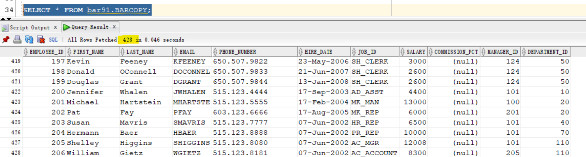

---

- Create backup of the bar\*tbs tablespace

```sql
rman target "'sys@orclpdb as sysdba'"

-- backup tbsp
BACKUP AS COPY TABLESPACE bar91tbs;
```

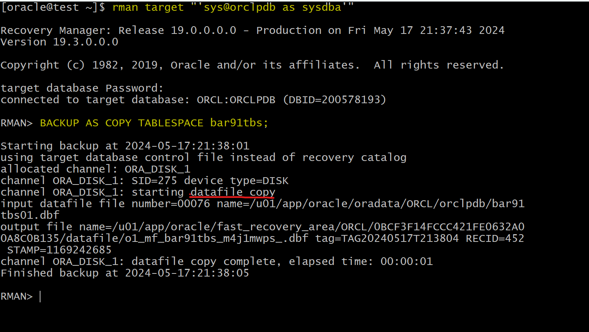

---

- Update table

```sql
sqlplus -S /nolog

connect / as sysdba
alter session set container=orclpdb;
UPDATE bar91.BARCOPY SET salary = salary+1;
COMMIT;
```

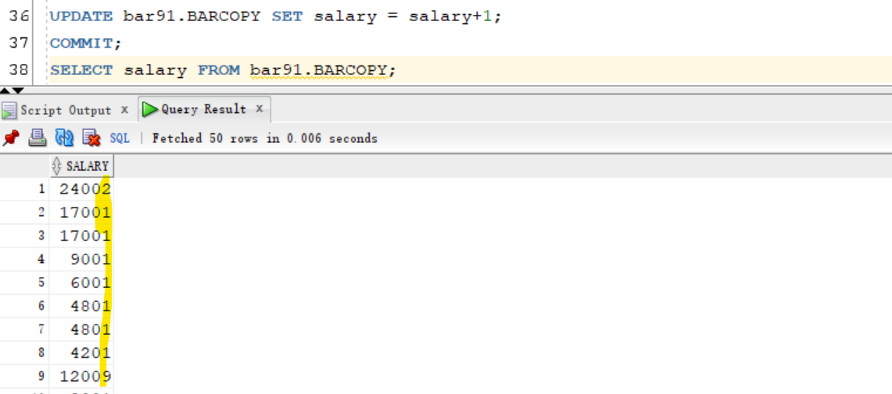

---

- Shutdown abort

```sql
sqlplus / as sysdba
shutdown abort
exit
```

- Remove tbsp

```sh
rm /u01/app/oracle/oradata/ORCL/orclpdb/bar91tbs01.dbf
```

---

### Diagnosing Database Failure

- Open instance

```sql
sqlplus / as sysdba
startup

-- try to orclpdb open
show pdbs
alter pluggable database orclpdb open;
-- fails because df is missing
```

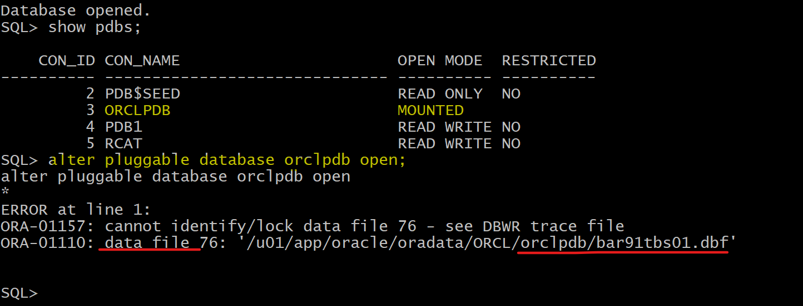

---

### Repairing Database Failure

- Use the `Data Recovery Advisor` to list the database failure.

```sql
rman target "'/ as sysbackup'"
LIST FAILURE;
```

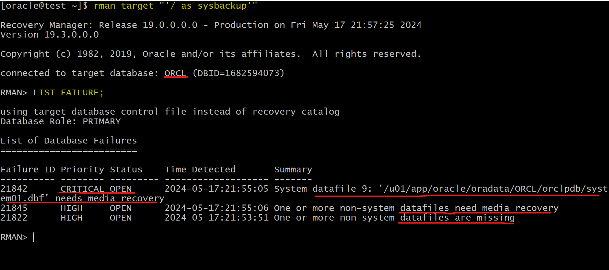

---

- Use the `Data Recovery Advisor` to obtain advice on how to repair the failure

```sql
ADVISE FAILURE;
```

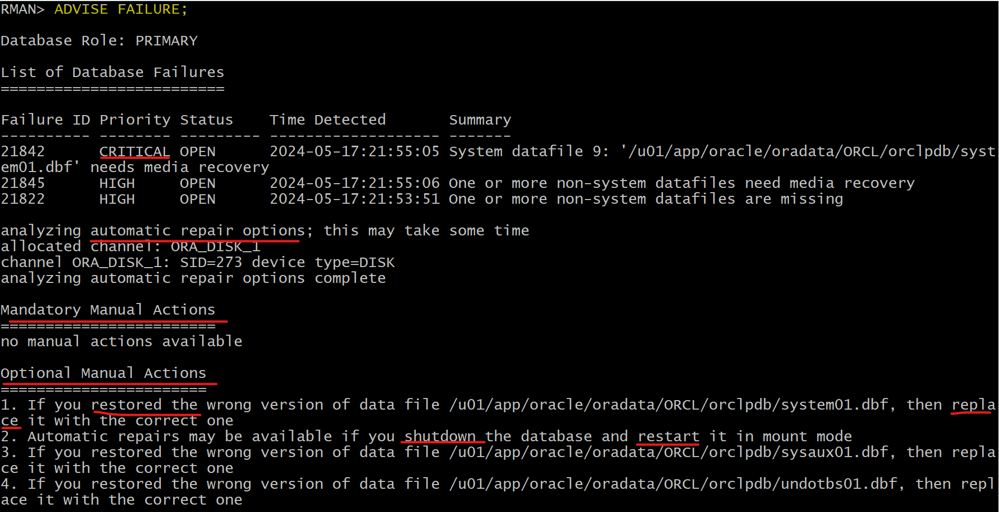

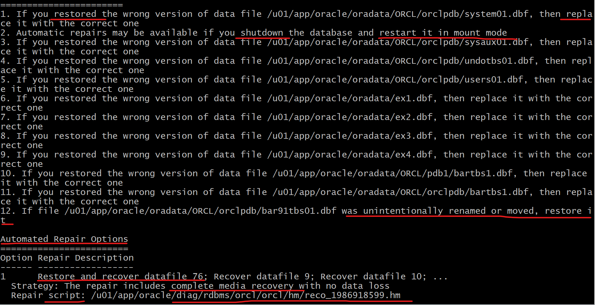

- Use the Data Recovery Advisor to repair the failure.

```sql
repair failure;

-- open orclpdb in rman
alter pluggable database orclpdb open;
```

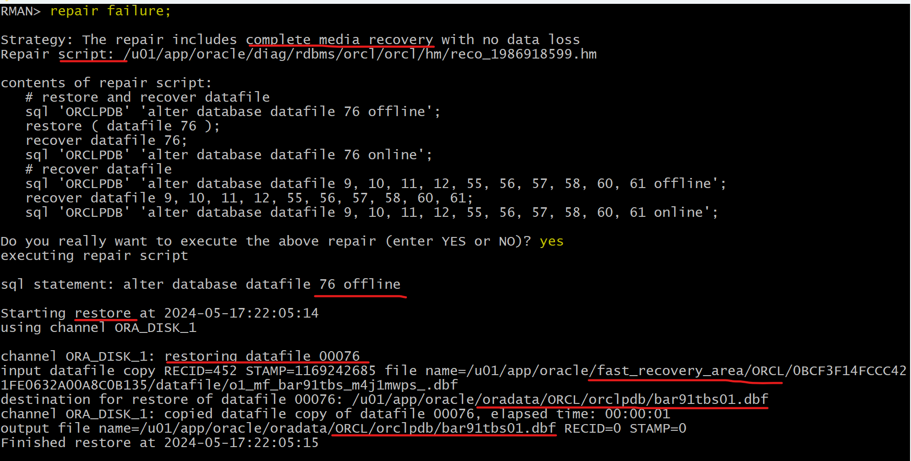

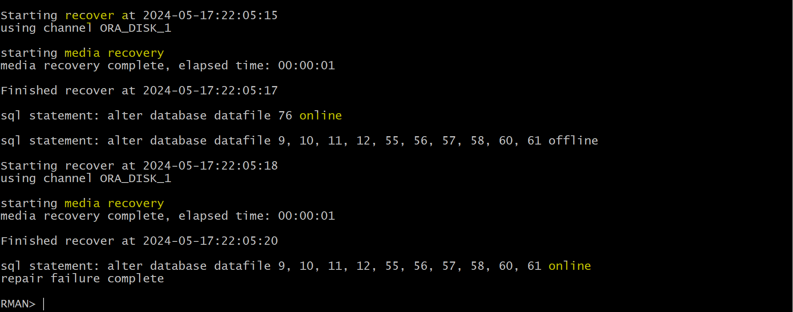

- Confirm pdb can be opened

```sql
sqlplus / as sysdba
show PDBS
```

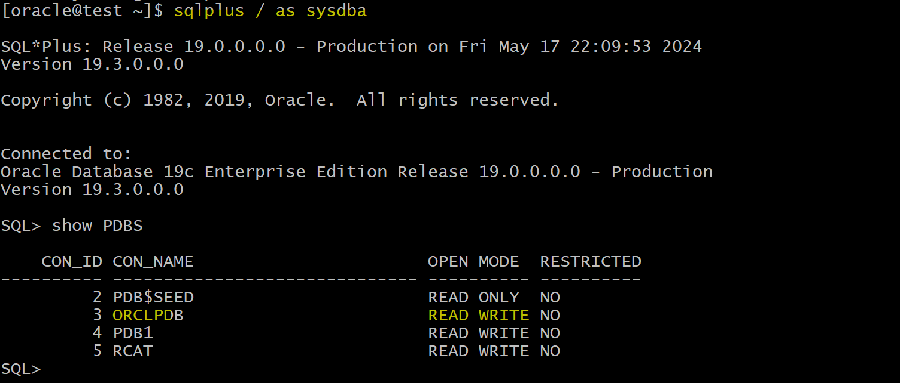

- Confirm table data
  - all data has been restored.

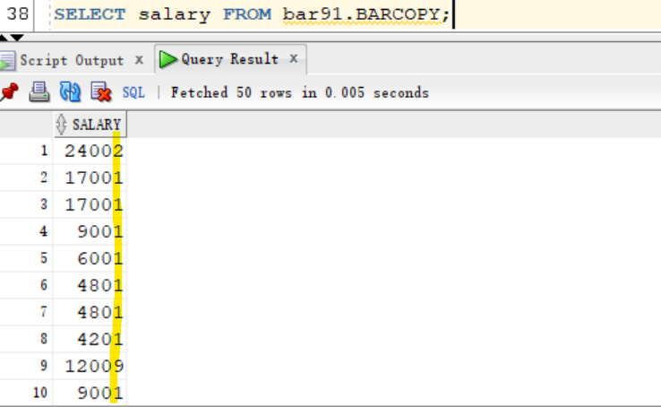

---

### Clean up

- Delete tbsp and backup

```sql
rman target "'sys@orclpdb as sysdba'"
-- delete tbsp
delete NOPROMPT copy of tablespace bar91tbs;
exit;
```

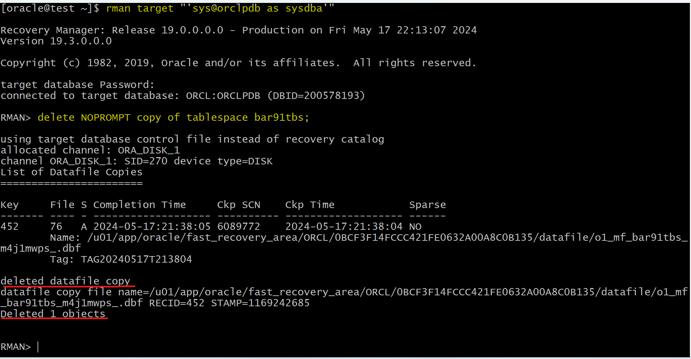

```sql
sqlplus sys@orclpdb as sysdba
show con_name

-- CLEANUP from previous run
DROP USER bar91 CASCADE;
DROP TABLESPACE bar91tbs INCLUDING CONTENTS AND DATAFILES;
```

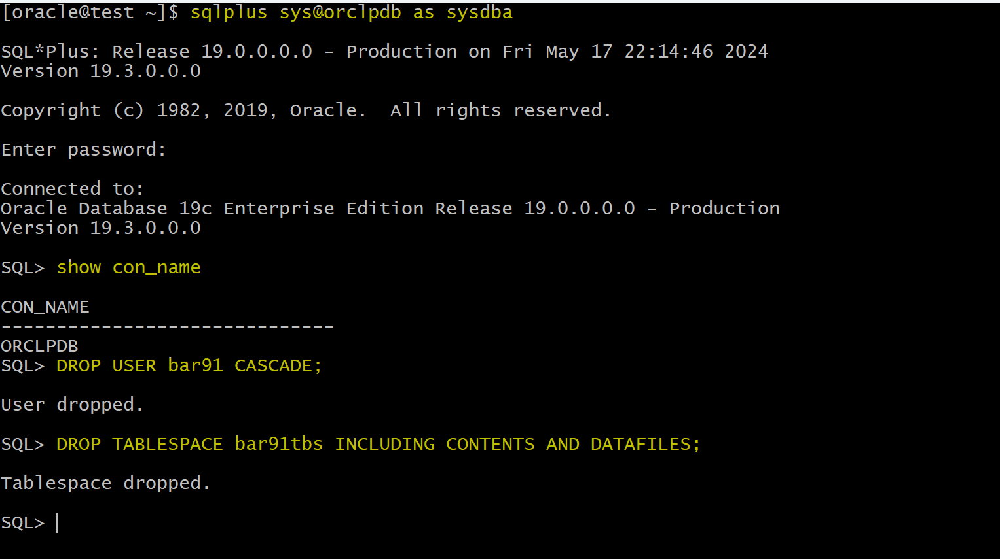

---

[TOP](#diagnosis---data-recovery-advisor)
