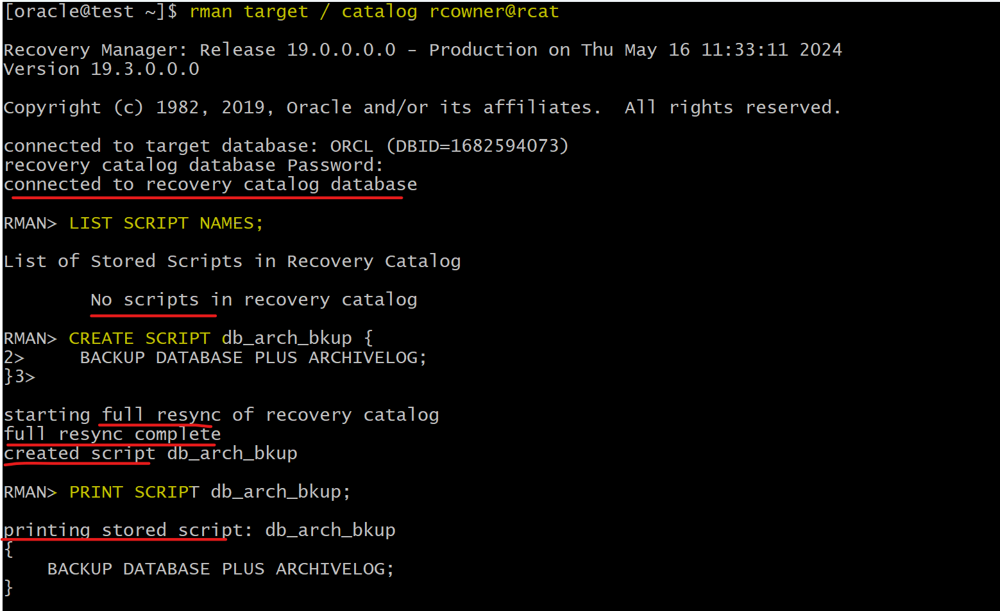
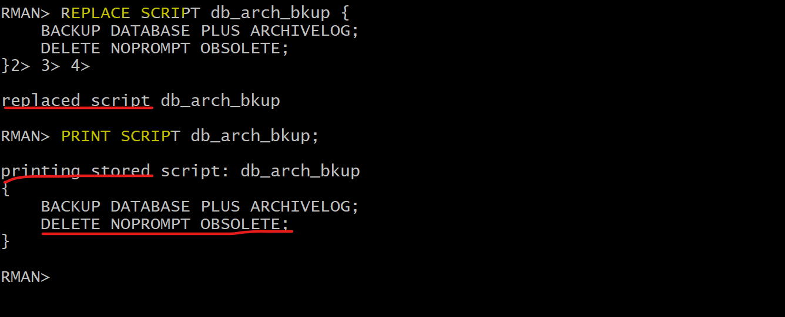
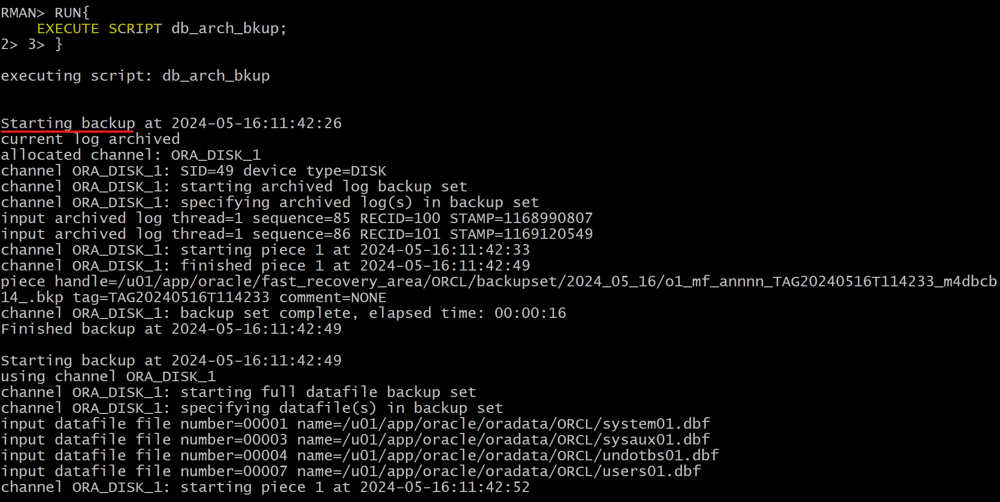
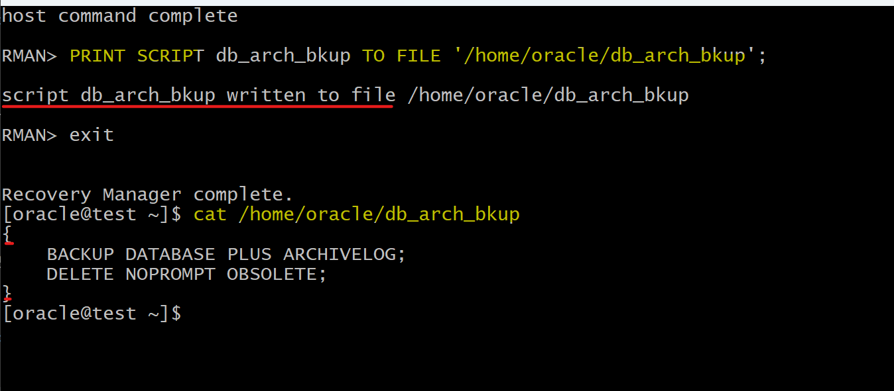
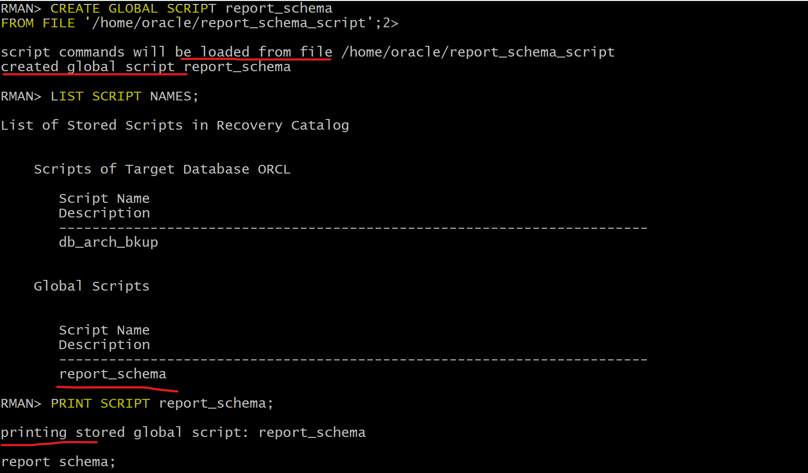
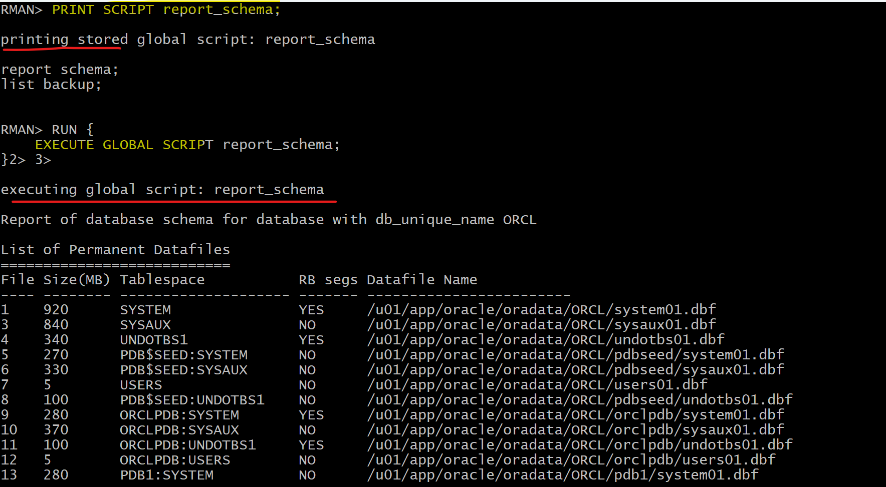
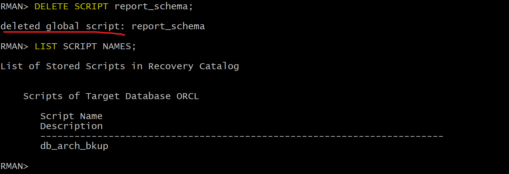

# RMAN - Stored Script

[Back](../../index.md)

- [RMAN - Stored Script](#rman---stored-script)
  - [Stored Script](#stored-script)
    - [Creating RMAN-Stored Scripts](#creating-rman-stored-scripts)
    - [Executing RMAN Stored Scripts](#executing-rman-stored-scripts)
    - [Maintaining RMAN Stored Scripts](#maintaining-rman-stored-scripts)
  - [Lab](#lab)
    - [Creating a Stored Script](#creating-a-stored-script)
    - [Modify a Stored Script](#modify-a-stored-script)
    - [Executing a Stored Script](#executing-a-stored-script)
    - [Exporting a script to a file](#exporting-a-script-to-a-file)
    - [Creating a script from a file](#creating-a-script-from-a-file)

---

## Stored Script

- `Stored scripts`:

  - An alternative to command files
  - Available to any `RMAN client` that can connect to the `target database` and `recovery catalog`

- `command files` vs `stored scripts`:

  - `command files` are **available only on the system** on which they are stored
  - `stored script` is **always available to any RMAN client** that can connect to the `target database` and `recovery catalog`.

- Types of stored scripts
  - `local stored script`:
    - associated with the `target database` to which RMAN is connected when the script is **created** and can be **executed only when you are connected** to that `target database`.
  - `global stored script`:
    - can be executed against **any database** registered in the `recovery catalog,` if the RMAN client is connected to the `recovery catalog` and a target database.

---

### Creating RMAN-Stored Scripts

- Prerequisites:

  - Connect to the desired target database and the recovery catalog

- Syntax:

```sql
-- local script
CREATE SCRIPT script_name {
    <RMAN commands>
};
-- Created local script from a text file
CREATE SCRIPT script_name
FROM FILE 'file_name';

-- global script
CREATE GLOBAL SCRIPT script_name {
    <RMAN commands>
};
-- Created local script from a text file
CREATE GLOBAL SCRIPT script_name
FROM FILE 'file_name';
```

---

### Executing RMAN Stored Scripts

- Prerequisites:

  - Connect to the desired target database and the recovery catalog

- Syntax:

```sql
-- Executing a lcoal script:
RUN {
    EXECUTE SCRIPT script_name;
}

-- Executing a global script:
RUN {
    EXECUTE GLOBAL SCRIPT script_name;
}
```

- If an RMAN command in the script **fails**, subsequent RMAN commands in the script **do not execute**.

- Channels:
  - When you execute the script, it uses the **automatic channels configured** at the time.
  - to override the configured channels:

```sql
-- define 3 channels for the script
RUN {
    ALLOCATE CHANNEL chl DEVICE TYPE DISK;
    ALLOCATE CHANNEL ch2 DEVICE TYPE DISK;
    ALLOCATE CHANNEL ch3 DEVICE TYPE DISK;

    EXECUTE SCRIPT full_backup;
}
```

---

### Maintaining RMAN Stored Scripts

- Prerequisites:

  - Connect to the desired target database and the recovery catalog

- Syntax:

```sql
-- Displaying a script:
PRINT SCRIPT script_name;           -- local
PRINT GLOBAL SCRIPT script_name;    -- global

-- Sending the contents of a script to a file:
PRINT SCRIPT script_name TO FILE 'file_name';           -- local
PRINT GLOBAL SCRIPT script_name TO FILE 'file_name';    -- global

-- displays the names of all stored scripts, both global and local,
-- that can be executed for the target database to which you are currently connected.
LIST SCRIPT_NAMES;          -- local
LIST GLOBAL SCRIPT_NAMES;   -- global

-- Updating a script:
-- local
REPLACE SCRIPT script_name {
    <RMAN commands>;
}
-- global
REPLACE GLOBAL SCRIPT script_name {
    <RMAN commands>;
}

-- Updating a script from a file:
REPLACE SCRIPT script_name FROM FILE 'file_name';
REPLACE GLOBAL SCRIPT script_name FROM FILE 'file_name';

-- Deleting a script:
DELETE SCRIPT script_name;
```

---

## Lab

### Creating a Stored Script

```sql
-- connect
rman target / catalog rcowner@rcat

LIST SCRIPT NAMES;

-- Create a local script named db_arch_bkup to perform a database backup, including the archived log files.
CREATE SCRIPT db_arch_bkup {
    BACKUP DATABASE PLUS ARCHIVELOG;
}

-- List the contents of the script you created.
PRINT SCRIPT db_arch_bkup;
```



---

### Modify a Stored Script

```sql
-- Modify the db_arch_bu script so that it also deletes obsolete archived log files.
REPLACE SCRIPT db_arch_bkup {
    BACKUP DATABASE PLUS ARCHIVELOG;
    DELETE NOPROMPT OBSOLETE;
}

-- print the contents of the modified script.
PRINT SCRIPT db_arch_bkup;
```



---

### Executing a Stored Script

```sql
-- execute
RUN{
    EXECUTE SCRIPT db_arch_bkup;
}

-- confirm
LIST BACKUP;
```



---

### Exporting a script to a file

```sql
PRINT SCRIPT db_arch_bkup TO FILE '/home/oracle/db_arch_bkup';
```



---

### Creating a script from a file

- define a file

```sh
vi /home/oracle/report_schema_script
# it is fine with cruely bracket
#{
#   report schema;
#   list backup;
#}

# or without is fine
# report schema;
#   list backup;
```

- Create from file

```sql
-- create
CREATE GLOBAL SCRIPT report_schema
FROM FILE '/home/oracle/report_schema_script';

-- replace
-- REPLACE GLOBAL SCRIPT report_schema
-- FROM FILE '/home/oracle/report_schema_script';

-- confirm
LIST SCRIPT NAMES;
PRINT SCRIPT report_schema;
```



- execute

```sql
-- execute
RUN {
    EXECUTE GLOBAL SCRIPT report_schema;
}
```



- delete

```sql
-- delete script
DELETE SCRIPT report_schema;
-- confirm
LIST SCRIPT NAMES;
```



---

[TOP](#rman---stored-script)
