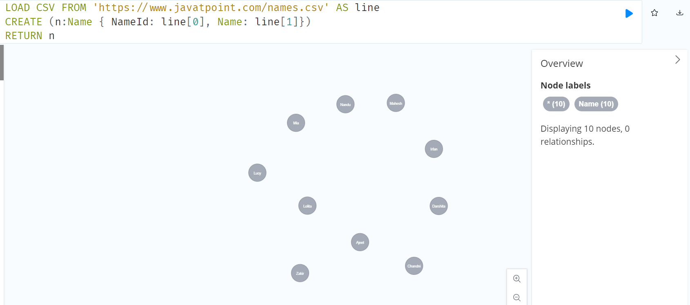

# Cypher - Import data from CSV

[Back](../index.md)

- [Cypher - Import data from CSV](#cypher---import-data-from-csv)
  - [Load CSV](#load-csv)
    - [Load a CSV file from a local](#load-a-csv-file-from-a-local)
  - [Load CSV from](#load-csv-from)

---

## Load CSV

| Syntax                       | Description |
| ---------------------------- | ----------- |
| `LOAD CSV WITH HEADERS FROM` | Local       |
| `LOAD CSV FROM`              | HTTP        |

---

### Load a CSV file from a local


```cypher
LOAD CSV WITH HEADERS FROM "file:///account.csv" AS accnode
CREATE(
    :ACCOUNT{
        ACCOUNT_ID: accnode.ACCOUNT_ID,
        AVAIL_BALANCE: TOINTEGER(accnode.AVAIL_BALANCE),
        CLOSE_DATE: accnode.CLOSE_DATE,
        LAST_ACTIVITY_DATE: accnode.LAST_ACTIVITY_DATE,
        OPEN_DATE: accnode.OPEN_DATE,
        PENDING_BALANCE: TOINTEGER (accnode.PENDING_BALANCE),
        STATUS: accnode.STATUS,
        CUST_ID: accnode.CUST_ID,
        OPEN_BRANCH_ID: accnode.OPEN_BRANCH_ID,
        OPEN_EMP_ID: accnode.OPEN_EMP_ID,
        PRODUCT_CD:accnode.PRODUCT_CD
        }
)
```

---

## Load CSV from

```cypher
LOAD CSV FROM 'https://www.javatpoint.com/names.csv' AS line
CREATE (n:Name { NameId: line[0], Name: line[1]})
RETURN n
```

---


