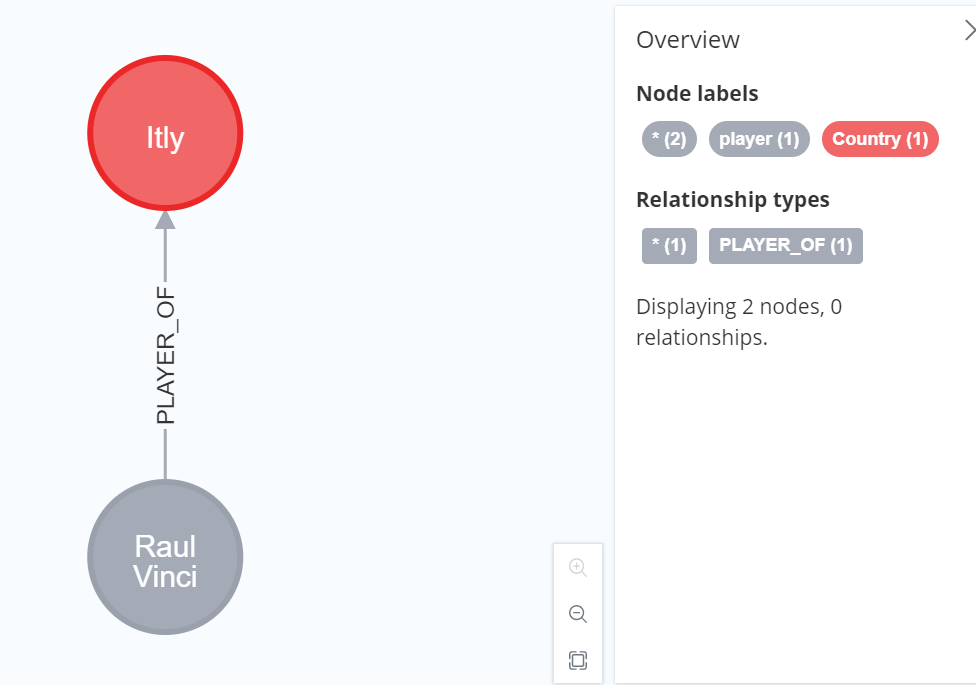
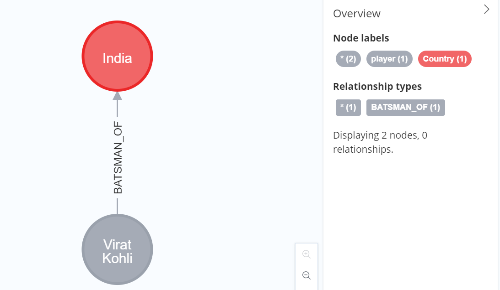
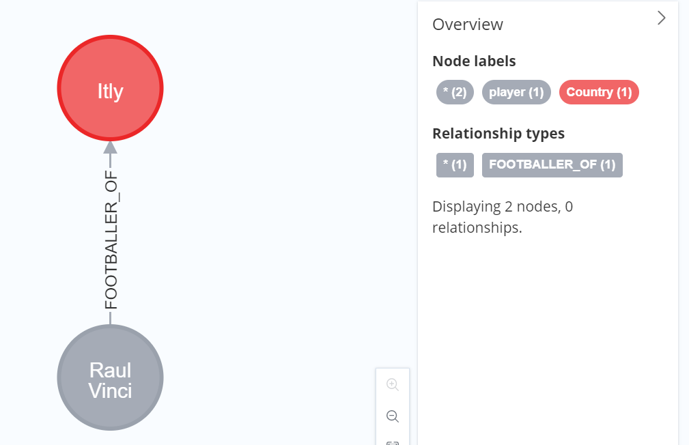

# Cypher - Create Relationship

[Back](../index.md)

- [Cypher - Create Relationship](#cypher---create-relationship)
  - [Creating Relationship](#creating-relationship)
  - [Create a Relationship between existing Nodes](#create-a-relationship-between-existing-nodes)
  - [Create a Relationship with Label and Properties](#create-a-relationship-with-label-and-properties)
  - [Creating a complete path](#creating-a-complete-path)

---

## Creating Relationship

| Syntax                                        | Description            |
| --------------------------------------------- | ---------------------- |
| `CREATE (node1)-[:RelationshipType]->(node2)` | Creating Relationships |

- square braces `[ ]`:
  - specify relationship
  - placed between hyphen `-` and arrow `->`

---

- Example

```cypher
CREATE (Raul:player{name: "Raul Vinci", YOB: 1973, POB: "Milan"})
CREATE (It:Country {name: "Itly"})
CREATE (Raul)-[r:PLAYER_OF]->(It)
RETURN Raul, It
```



---

## Create a Relationship between existing Nodes

- Syntax:

```cypher
MATCH (a:LabeofNode1), (b:LabeofNode2)
WHERE a.name = "nameofnode1" AND b.name = " nameofnode2"
CREATE (a)-[: Relation]->(b)
RETURN a,b
```

- Example

```cypher
CREATE (Raul:player{name: "Raul Vinci", YOB: 1973, POB: "Milan"})
CREATE (It:Country {name: "Itly"})

MATCH (a:player), (b:Country) WHERE a.name = "Raul Vinci" AND b.name = "Itly"
CREATE (a)-[r: FOOTBALLER_OF]->(b)
RETURN a,b
```


![]

---

## Create a Relationship with Label and Properties

```cypher
CREATE (node1)-[label:Rel_Type {key1:value1, key2:value2, . . . n}]-> (node2)
```

- Example

```cypher
CREATE (Kohli:player{name: "Virat Kohli", YOB: 1988, POB: "Delhi"});
CREATE (Ind:Country {name: "India"});

MATCH (a:player), (b:Country) WHERE a.name = "Virat Kohli" AND b.name = "India"
CREATE (a)-[r:BATSMAN_OF {Matches:5, Avg:90.75}]->(b)
RETURN a,b;
```


---

## Creating a complete path

- Syntax:

```cypher
CREATE p = (Node1 {properties})-[:Relationship_Type]->
(Node2 {properties})[:Relationship_Type]->(Node3 {properties})
RETURN p
```

---

- Example:

```cypher
CREATE p = (Kohli {name:"Virat Kohli"})-[:TOPSCORRER_OF]->
(Ind {name: "India"})-[: WINNER_OF]->(Node3 {CT: "Champions_Trophy"})
RETURN p
```



---

[TOP](#cypher---create-relationship)
