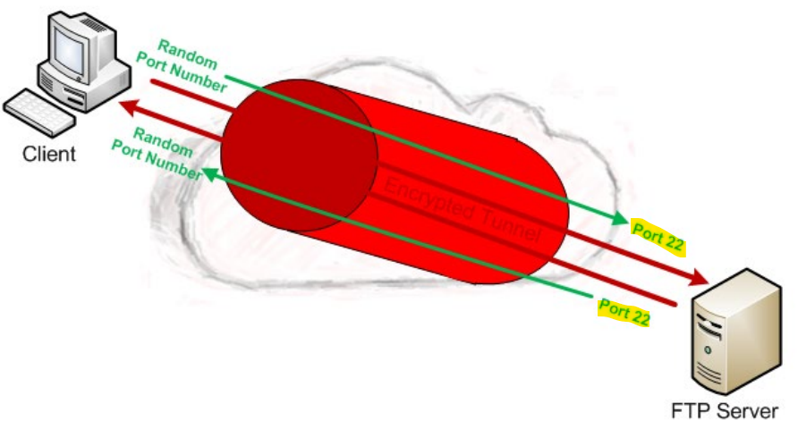

# Network App Layer: SFTP

[Back](../../index.md)

- [Network App Layer: SFTP](#network-app-layer-sftp)
  - [SFTP](#sftp)
    - [FTP vs SFTP](#ftp-vs-sftp)
    - [Operations](#operations)
  - [Summary](#summary)

---

## SFTP

- `SFTP`

  - two SFTP acronyms:

    - `Secure File Transfer Protocol`
      - an **unsecured, lightweight version** of `File Transfer Protocol (FTP)`
      - Based on `Transmission Control Protocol`
      - port number: `115`.
      - SFTP has a set of `11` commands.
      - **not** as **accepted widely** on the Internet.
      - **features**
        - user access control
        - file transfers
        - directory listing
        - directory changing
        - file renaming
        - deleting.
      - vs `Trivial FTP (TFTP)`
        - an **intermediate complexity level** between `TFTP` and `FTP`.
      - vs `Secure Shell FTP`
        - sometimes confused
    - `Secure File Transfer protocol (SSH FTP)`
      - aka `SSH File Transfer Protocol`
      - a secure version of `File Transfer Protocol (FTP)`
      - facilitates data **access** and data **transfer** over a `Secure Shell (SSH)` data stream.
        - part of the `SSH Protocol`.

---

### FTP vs SFTP

- overview is the **same**
  - used to exchange file over a network/Internet
  - Based on a `client/server architecture`
  - over `TCP`
- the difference:

  - the communications are **sent through an encrypted tunnel** between the `client` and `server`, on TCP Port `22`.

- SFTP was designed by the `Internet Engineering Task Force (IETF)`
  - An **extended version** of `SSH 2.0`
    - **File transfer** over SSH and use with `Transport Layer Security (TLS)`(both asymmetric and symmetric encryption) and `VPN` applications
  - Both the commands and data are encrypted in order to prevent passwords and other sensitive information from being transferred over the network.
  - SFTP **requires** that the `client` user must be **authenticated** by the `server` and the data transfer must take place over a `secure channel (SSH)`.

---

### Operations

- `SSH` uses port `22`, and `TCP` as seen here with the classic `SYN`, `SYN/ACK`, `ACK`

- `Client` and `Server` **select** to use `SSH`

- `Client` and `Server` start to **exchange keys**

- `Client` and `Server` **finish key exchange** and start **building new keys**

- `Client` and `Server` **finish** creating the **new keys**

- `Client` and `Server` exchange **encrypted packets**

- All packets from this point on are **fully encrypted**.
  - The operation is the **same** as **in regular FTP**, but everything is encrypted.

---

## Summary

- SFTP: Simple File Transfer Protocol
  - 115/tcp
- SFTP: SSH FTP
  - Secure FTP
  - part of the `SSH Protocol`
  - 22/tcp
