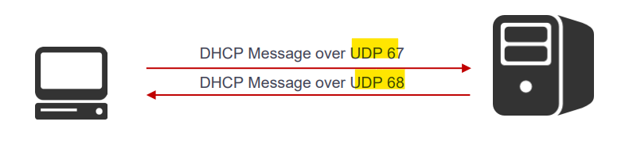
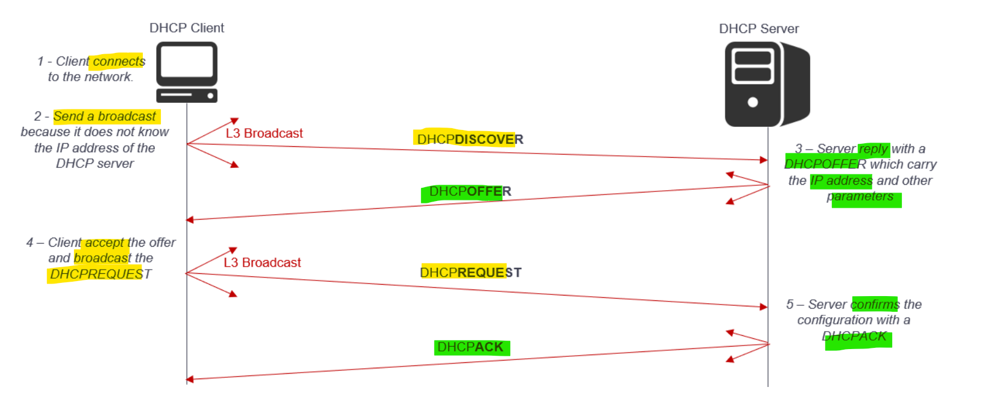
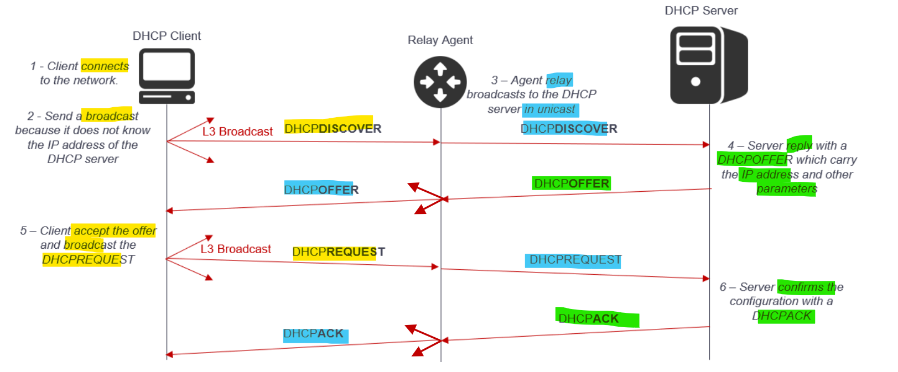
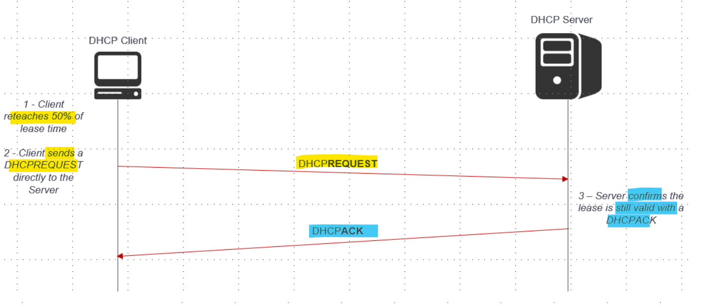
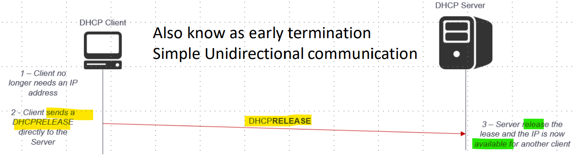
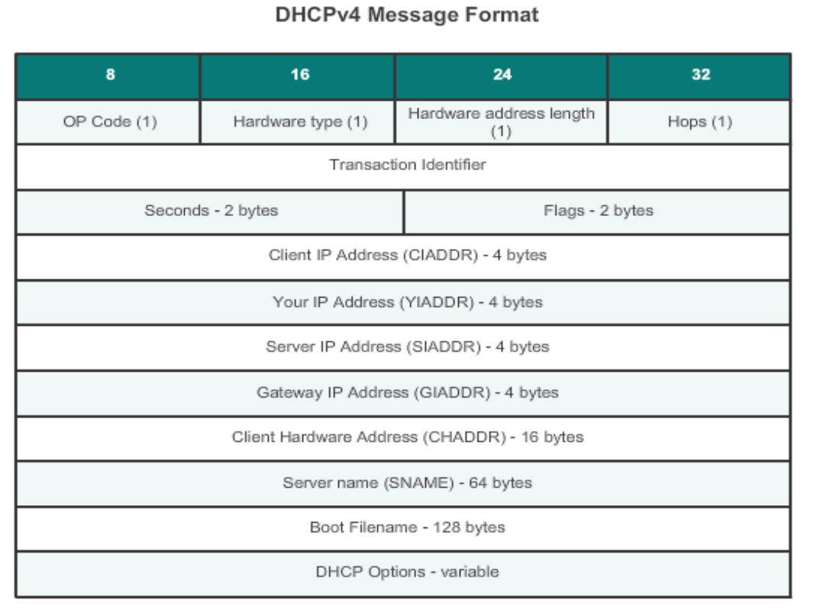

# Network - App Layer: DHCP

[Back](../../index.md)

- [Network - App Layer: DHCP](#network---app-layer-dhcp)
  - [DHCP – Overview](#dhcp--overview)
    - [Architecture](#architecture)
    - [Operations](#operations)
    - [Message Structure](#message-structure)
    - [Options](#options)
    - [Stateless Address Autoconfiguration](#stateless-address-autoconfiguration)
  - [Summary](#summary)

---

## DHCP – Overview

- `Dynamic Host Configuration Protocol (DHCP)`

  - a network protocol that **automatically assigns** IP addresses and other configuration information to devices on a network.
  - Used for dynamic host configuration

- Layer 7: Application protocol
- Layer 4: `UDP`
- Port:
  - `67` for connections to **server**
  - `68` for connections to **clients**
- `client-server` model

---

### Architecture

- `DHCP` temporarily **binds configuration parameters** to `DHCP client` (IP addresses, DNS servers, Default gateway…)
- It was originally designed to provide **temporary addresses**
- DHCP is well adapted to situation where hosts **move** from one **location** to another or are **routinely connected and disconnected**
- DHCP is used to **simplify the installation** and maintenance of network hosts
- The DHCP architecture is composed of

  - `DHCP clients`
  - `DHCP servers`
  - `DHCP relay agents` (optional)

- Terminology

- **DHCP Databases**
  - DHCP servers uses 2 databases
    - One acquires IP addresses **manually** and **bind them permanently to MAC addresses**.
    - The other contains 1 or more **pool of IP addresses** that are **dynamically assigned** to clients on `FCFS` basis.
      - When a host no longer need the IP address, it is **released**.
- `DHCP Lease`
  - **Server** issue a **lease for a dynamic IP** address that **expires** at the end of the lease
  - At **half** the lease time, the **client** **renew** the lease time.
  - Once the lease has **expired** the client must either **stop using** the IP address or **acquire a new** IP address.
    - If more than 1 DHCP **server** is used, **each must offer** an IP address. The client **selects** the best offer.
- `Manual lease`
  - Network manager **explicitly assigns** all IP addresses
- `Automatic lease`
  - DHCP server **permanently assigns** specific IP address and **dynamically** assigns the rest
- `Dynamic lease`

  - DHCP server **dynamically assigns** IP addresses for a specific **period** of time when permanent address is not required

- Six **states** are used in DHCP
  1. INITIALIZATION
  2. SELECTION
  3. REQUEST
  4. BOUND
  5. RENEW
  6. REBIND
- Note:

  - 1 to 4 are used to initialize an IP address
  - 1, 4, 5 and 6 are used to rebind, renew or release an IP address

- These 6 stares are used to perform essentially 3 processes
  - Discovery
  - Renewal
  - Release

---

### Operations

- **Discovery (without relay agent)**

- **Discovery (with relay agent)**

---

- **States throughout the Discovery Process**

| Action                         | State            |
| ------------------------------ | ---------------- |
| client **joining** the network | `INITIALIZATION` |
| client sends a `DHCPDISCOVER`  | `SELECTION`      |
| client sends a `DHCPREQUEST`   | `REQUEST`        |
| server sends a `DHCPACK`       | `BOUND`          |

---

- **States throughout the Renewal Process**

| Action                       | State            |
| ---------------------------- | ---------------- |
| client lease **reaches 50%** | `BOUND`          |
| client sends a `DHCPREQUEST` | `RENEWING`       |
| client lease **reaches 75%** | `REBINDING`      |
| server sends a `DHCPACK`     | `BOUND`          |
| server sends a `DHCPNACK`    | `INITIALIZATION` |

---

- **States throughout the Release Process**

| Action                       | State            |
| ---------------------------- | ---------------- |
| client decides to **leave**  | `BOUND`          |
| client sends a `DHCPRELEASE` | `INITIALIZATION` |

---

### Message Structure

- `op`: Message op code / message type
  - 1 = `BOOTREQUEST`
  - 2 = `BOOTREPLY`
- `htype`: Hardware address type
  - Example: `1` for **Ethernet**
- `hlen`: Hardware address length
  - Example: **6** for # of octets (MAC address)
- `hops`: Client sets to zero
  - optionally used by relay agents when booting via a relay agent
- `xid`: Transaction ID
  - Random number chosen by the client, used by the client and server to associate messages and responses between a client and a server.
- `secs`: Filled in by client
  - Seconds elapsed since client began address acquisition or renewal process
- `flags`: 1st bit is the Broadcast flag
  - The rest Must Be Zero
- `ciaddr`: Client IP address
  - Only filled in if client is in `BOUND`, `RENEW` or `REBINDING` state and can respond to ARP requests
- `yiaddr`: Client IP address
  - “y” stands for Your
- `siaddr`: DHCP Server address
  - returned in `DHCPOFFER`, `DHCPACK` by server
- `giaddr`: Gateway address
- `chaddr`: Client hardware address (MAC)
- `sname`: Optional server host name
- `file`: Boot file name
- `options`: Optional parameters field (There are > 100 options)

---

### Options

common DHCP options:

| Code | Description                       |
| ---- | --------------------------------- |
| -    | -                                 |
| 1    | Subnet Mask                       |
| 3    | Router (Default Gateway)          |
| 4    | Time Server                       |
| 5    | Name Server                       |
| 6    | DNS Server(s)                     |
| 15   | DNS domain name                   |
| 43   | Vendor Specific Information       |
| 44   | WINS server (NetBIOS name server) |
| 46   | NetBIOS Node Type                 |
| 150  | TFTP Server address               |

---

### Stateless Address Autoconfiguration

- `StateLess Address AutoConfiguration (SLAAC)`
  - a method in which a device can obtain an **IPv6** **global unicast address** without the services of a `DHCPv6` server.
- Uses one of three methods
  - `SLAAC (Stateless Address Autoconfiguration)`
  - **Stateless** (`SLAAC` + `DHCPv6` server)
  - **Stateful** (`DHCPv6` server only)

---

## Summary

- DHCP

  - automatically assigns
  - To server: 67/udp
  - To client: 68/udp

- DHCP Databases
  - Manually, permanent mac
  - Dynamically, pool of ip
- Renew: helf lease
- Expire: new ip

- Discovery-offer-request-ack
- Discovery state
  - INITIALIZATION-SELECTION(DHCPDISCOVER)-REQUEST(DHCPREQUEST)-BOUND(DHCPACK)
- Renewal
  - BOUND(half)-RENEWING(DHCPREQUEST)-REBINDING(75%)-BOUND(DHCPACK)-INITIALIZATION(DHCPNACK)
- Release

  - BOUND(leave)-INITIALIZATION(DHCPRELEASE)

- `SLAAC` (**Stateless** Address Autoconfiguration)
- **Stateless** (SLAAC + DHCPv6 server)
- **Stateful** (DHCPv6 server)
