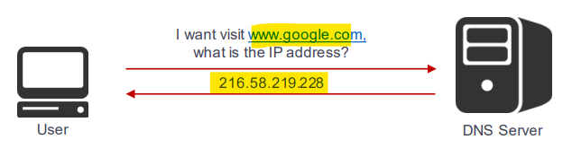
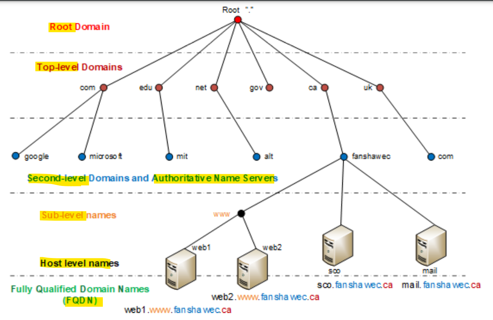

# Network - App Layer: DNS

[Back](../../index.md)

- [Network - App Layer: DNS](#network---app-layer-dns)
  - [DNS](#dns)
    - [Terminology](#terminology)
    - [Hierarchy](#hierarchy)
    - [Operation](#operation)
    - [Message Format](#message-format)
  - [Summary](#summary)

---

## DNS

- `Domain Name System(DNS)`
  - a protocol that **translates** domain names **into IP addresses**.

---

### Terminology

- `Hostnames`
  - Each host name is made up of a **sequence of labels** separated by periods
    - **Each** label can be up to **63 characters**
    - The **total** name can be at the most **255 characters**
  - Examples
    - fanshawec.ca
    - Servicecanada.gc.ca
    - mess.gouv.qc.ca
- `Domain Name`
  - A domain is a **subtree** of the **world wide naming tree**
  - The domain name for a host is the sequence of labels from the **host** to the **top of the worldwide naming tree**
- `Top level domains`
  - .com, .edu, .ca, .net, .org…
  - Countries each have a top level domain (ca, fr, ru, ng, co, il, sa, in)
  - New top level domains include: .biz, .coop, .name, .pro, .info...
  - Official list from IANA: https://www.iana.org/domains/root/db
- `Distributed Database`

  - The organization that owns a domain name is responsible for running a DNS server that can provide the **mapping between hostnames within the domain to IP addresses**
  - Example:
    - Let’s say we have a domain at Fanshawe called “fanshawe”
    - A server would be responsible for everything within the fanshawe.edu domain

- `DNS Client`
  - A DNS client is called a **resolver**
  - A DNS client is a **piece of software**
  - It uses a functions called `getByName(host)` to request IP addresses from the DNS server
- Most UNIX/Linux workstations have the `/etc/resolv.conf` file that contains the **local domain** and the **addresses of DNS servers** for that domain
- On Windows, the file is called, `C:\Windows\System32\Drivers\etc\hosts`

- `NSLookUP (name Server Look Up)`

  - Nslookup is an interactive resolver that allows a user to **communicate directly with a DNS server**
  - Nslookup is available on UNIX and Windows workstations

- `DNS Server`
  - Servers **handle** requests for their domain **directly**
  - Servers handle requests for **other domains** by **contacting remote DNS servers**
  - Server **cache** external mappings
  - Most common DNS server used
    - **BIND** on UNIX/Linux
    - **DNS server** on Windows Server
- `Records` / `Resource Record (RR)`
  - Record that contains mapping name to IP (Most common)
  - Examples:
    - `A`: Returns a 32bits **IPv4** address used to map hostnames
    - `AAAA`: Returns a 128bits **IPv6** address
    - Full list by IANA: http://www.iana.org/assignments/dnsparameters/dns-parameters.xhtml
- `Authoritative Record`
  - Record that **come from the authority** that manages the records (**non cached record**)

---

### Hierarchy

- Tree data structure
- Each node has a **label** and 0 or more `Resource Records`
- The tree sub-divides into `zones` beginning at the `root zone`
- A DNS zone may consists of only 1 domain or may consist of many domains and sub-domains

| Hierarchy                                      | Example                |
| ---------------------------------------------- | ---------------------- |
| Root Domain                                    | root: `.`              |
| Top-level Domain                               | `com`, `edu`           |
| Second-level Domain, Authoritative Name Server | `google`, `fanshawe`   |
| Sub-level names                                | `www`                  |
| Host level names                               | `web1` ,`mail`         |
| Full Qualified Domain Names(FQDN)              | `web1.www.fanshawe.ca` |

---

### Operation

- `DNS Request`

  - The request is sent by the resolver on `UDP` `53`
  - Short and sweet message

- `DNS Response`
  - Each answer has these fields
  - `Domain Name`
    - The domain name for which the query was sent
  - `Type`
    - Specifies the **type** of the data included in the record
  - `Class`
    - Specifies the data’s classes
  - `Time To Live (TTL)`
    - Number of seconds this record can be cached
  - `Data Length`
    - Specifies the count of octets in the response data field
  - `Resource Data`
    - This contains the results of the binding data

---

### Message Format

- **DNS Header**
- `ID`
  - A16 bit identifier assigned by the program that generates any kind of query. This identifier is copied the corresponding reply and can be used by the requester to match up replies to outstanding queries.
- `QR (Query)`
  - A one bit field that specifies whether this message is a query (0), or a response (1)
- `OPCODE`
  - A four bit field that specifies kind of query in this message.
  - This value is set by the originator of a query and copied into the response.
  - The values are:
    - 0 a standard query (QUERY)
    - 1 an inverse query (IQUERY)
    - 2 a server status request (STATUS)
    - 3-15 reserved for future use
- `Authoritative Answer(AA)`
  - this bit is valid in responses, and specifies that the responding name server is an authority for the domain name in question section.
- `TrunCation(TC)`
  - specifies that this messagewas truncated due to length greater than that permitted on the transmission channel
- `Recursion Desired(RD)`
  - this bit may be set in a query and is copied into the response.
  - If RD is set, it directsthe name serverto pursue the query recursively.Recursive query supportis optional
- `Recursion Available(RA)`
  - this bit is set or cleared in a response, and denotes whether recursive query support is available in the name server
- `Z`

  - Reserved for future use. Must be zero in all queries and responses

- `RCODE (Reply Code)`

  - Response code - this 4 bit field is set as part of responses.
  - The values have the following interpretation
    - `0` No error condition
    - `1` Format error
      - The name server was unable to interpret the query
    - `2` Server failure
      - The name server was unable to process this query due to a problem with the name server3 Name Error - Meaningful only for responses from an authoritative name server, this code signifies that the domain name referenced in the query does not exist
    - `4` Not Implemented
      - The name server does not support the requested kind of query
    - `5` Refused
      - The name server refuses to perform the specified operation for policy reasons. For example, a name server may not wish to provide the information to the particular requester, or a name server may not wish to perform a particular operation for particular data
    - `6-15` Reserved for future use

- `QDCOUNT`
  - an unsigned 16 bit integer specifying the number of entries in the question section
- `ANCOUNT`
  - an unsigned 16 bit integer specifying the number of resource records in the answer section
- `NSCOUNT`
  - an unsigned 16 bit integer specifying the number of name server resource records in the authority records section.
- `ARCOUNT`
  - an unsigned 16 bit integer specifying the number of resource records in the additional records section

---

## Summary

- DNS
  - 53/udp
  - 53/tcp
- Hostnames
  - Each label 63
  - Total 255
- Top level domains
  - .com
  - .ca
- Distributed Database
  - Provide mapping
- DNS Server
  - Handle resolve
- Tool: nslookup
- Records / Resource Record (RR): Record
- Authoritative Record: Record that come from the authority

- Hierarchy
  Root Domain
  Top-level Domain
  Second-level Domain, Authoritative Name Server
  Sub-level names
  Host level names
  Full Qualified Domain Names(FQDN)
