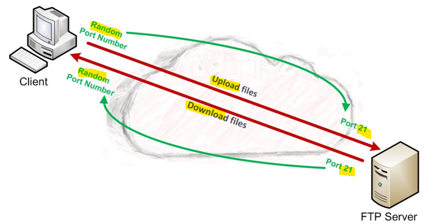
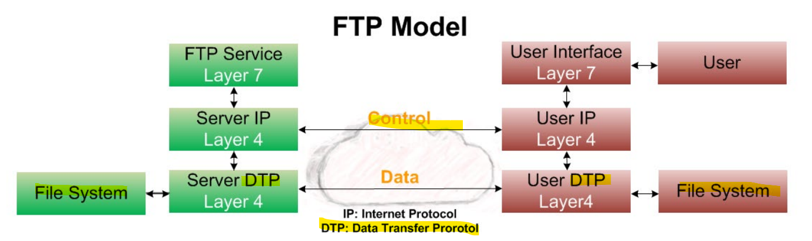
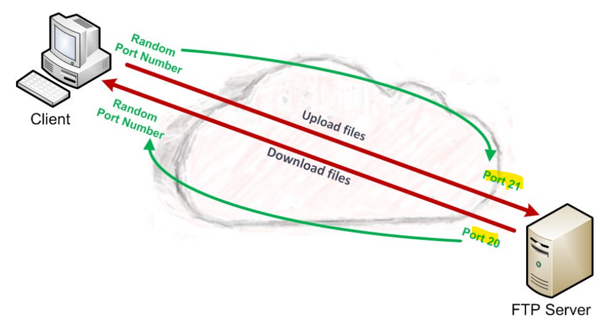
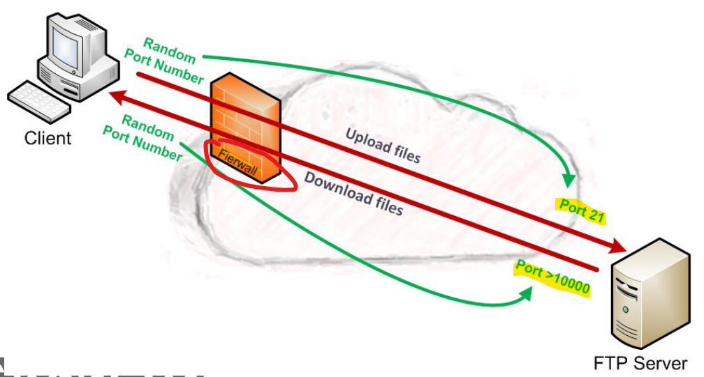

# Network App Layer: FTP

[Back](../../index.md)

- [Network App Layer: FTP](#network-app-layer-ftp)
  - [FTP](#ftp)
    - [FTP Model](#ftp-model)
      - [Active Mode](#active-mode)
      - [Passive Mode - `PASV`](#passive-mode---pasv)
      - [Actvie vs Passive mode](#actvie-vs-passive-mode)
    - [Data Transfer](#data-transfer)
    - [Block Header](#block-header)
    - [Commands / Responses](#commands--responses)
      - [Service Commands](#service-commands)
      - [Codes](#codes)
  - [Summary](#summary)

---

## FTP

- `FTP`
  - `File Transfer Protocol`
- Simple way to **exchange file** over a network
- Often used to exchange file over internet
  - For example:
    - a webmaster would use FTP to **upload** new content on a website
- Based on a **client/server architecture**
- Communications is over `TCP` Port `21`

---

### FTP Model

- Only **one transfer** can happen at once, only **one `data connection`** (originally this was true, some newer versions of applications like FileZilla, can open **multiple data connections**)
- The transfer can happen **in ether direction**
- The `data connection` does **not need to exist** all of the time

- **Two** channels are **opened**
  - **Control channel**
    - The channel is used to **setup** `data connections`
    - **Stays opened** for the **entire session**
    - Typically using `TCP` port `21`
  - **Data channel**
    - Used to **transfer** a specific file (or other operations)
    - **Only stays opened** of the duration of the file **transfer**
    - Typically using `TCP` port `20` (**Active Mode**)

---

#### Active Mode

- The **server** opens a `data connection` to the client from port `20` to a **high range of ports** on the **client** machine
  - 服务器端打开数据连接
  - 服务器端： 20， 客户端：随机端口
- All **data is passed** over this **connection**
  The server initiates the connection to the client by making a connection to a random high port on the client. This can cause issues with client firewalls, which may block the connection.

---

#### Passive Mode - `PASV`

- Because of the use of **Firewalls…**. The `Passive Mode` has to be implemented. The server **cannot** open a **random port number** back through the firewall to the client as is done in the `active mode`.
  - The `client` asks the server (using a `PASV` command) to establish a connection to a **port #** > `10000`
  - The `server` **binds this port** to the current connection
  - The `client` **opens this bound port** for the `data connection`
  - For each request the client makes, a **different port** will be used

---

#### Actvie vs Passive mode

|                        | Active           | Passive          |
| ---------------------- | ---------------- | ---------------- |
| Control channel port   | `21`             | `21`             |
| Data channel initiated | by server        | by client        |
| server port            | `20`             | >`10000`         |
| Client port            | random high port | random high port |

---

### Data Transfer

- `Stream`

  - Data is sent as a **continuous stream**, relieving FTP from doing any processing.
  - **All processing** is done by `TCP` TCP 协议处理数据， FTP 不处理
  - **No** `End-of-file indicator` is needed

- `Block`

  - The file is transmitted as a series of **data blocks** preceded by 1 or more **headers**

- `Compressed`
  - Data is **compressed** using a simple **algorithm**

---

### Block Header

- `Descriptor` field
  - 8 bits
  - `EOF(End Of File)`: Last block in the file
  - `EOR(End of Record)`: Last block in the record

| Code  | Desc                                      |
| ----- | ----------------------------------------- |
| `128` | End of data block is `EOR(end of record)` |
| `64`  | End of data block is `EOF(end of FILE)`   |
| `32`  | Suspected **errors** in data block        |
| `16`  | Data block is a **restart marker**        |

- `Byte Count` field

  - 16 bits
  - **Total length** of the data block in bytes

---

### Commands / Responses

- 3 different types of commands

  - **Access control** commands
    - Specify **access control identifiers**
  - **Transfer parameters** commands
    - Specify data transfer parameters
  - **FTP service** commands
    - Define the file transfer or the file system function **requested by the user**

- In these three command types, there are between 50 - 65 commands depending on the RFC version that the application you are using complies with.

---

#### Service Commands

- `USER`
  - Character string allowing a **user** to be **identified**
- `PASS`
  - Character string specifying the user’s **password**
- `CWD`
  - **Change** Working Directory
  - Enables the current directory to be changed
- `CDUP`
  - Change to **Parent** Directory
  - Allow to go back to the previous directory
- `QUIT`

  - Allow the current **session** to be **terminated**

- `PORT`
  - Character string allowing the **port number** used to be **specified**
- `PASV`
  - Making it possible to **indicate to the DTP server to stand by for a connection** on a specific port chosen randomly
- `TYPE`
  - Specify the **type of format** in which the data will be sent
- `STRU`
  - **Telnet** character specifying the **file structure**
    - `F`: file
    - `R`: record
    - `P`: page
- `MODE`

  - **Telnet** character specifying the data **transfer method**
    - `S`: stream
    - `B`: block
    - `C`: compressed

- `RETR`
  - **Retrieve**
  - **Asks** the server DTP for a **copy of the file** specified in the parameters
- `STOR`
  - Store
  - **Asks** the server DTP to **accept** the data **sent** over the data channel
- `STOU`
  - Same of `STOR` but **creates a new file** where the **name is unique**
- `APPE`
  - Append
  - The data is **concatenated into the file** specified as the parameter
- `ALLO`
  - Allocate
  - Asks the server to **plan for a storage space** big enough to hold the file specified as the parameter
- `REST`
  - Restart
  - Enables a transfer to be **restarted** from where it **has been stopped**
- `RNFR`

  - Rename From
  - Enables a **file** to be **renamed** (specify the **old name**)

- `RNTO`
  - Rename To
  - Enables a file to be **renamed** (specify the **new name**)
- `ABOR`
  - Abort
  - Tell the server to **abandon all transfers**
- `DELE`
  - Delete
  - Allows a file to be **deleted** (file name specified as a parameter)
- `RMD`
  - Remove Directory
  - Enables a **directory** to be **removed**
- `MKD`
  - Make Directory
  - Enables a **directory** to be **created**
- `PWD`
  - Print Working Directory
  - Makes it possible to resend the complete **current path**
- `LIST`
  - **List** the files and directories available in the current working directory
- `HELP`
  - Displays **all the commands** understood by the server

---

#### Codes

- `FTP responses` make it possible to ensure **synchronization** between the **client** and the and **server**

  - For each **command sent** by the `client`, a **response** will be sent from the `server`
  - The code retuned **indicates** the way in which the command has been **processed**

- FTP reply codes

  - a three-digit value.
  - The **first digit** is used to indicate one of `3` possible outcomes

    - `2yz`: **Success** reply
    - `4yz` or `5yz`: **Failure** reply
    - `1yz` or `3yz`: **Error** or **Incomplete** reply

  - The **second digit** defines the kind of **error**:
    - `x0z`: **syntax** errors
    - `x1z`: requests for **information**
    - `x2z`: **Connections**. Replies referring to the **control and data connections**.
    - `x3z`: **Authentication and accounting**. Replies for the **login process** and accounting procedures.
    - `x4z`: **Not defined**.
    - `x5z`: **File system**. These replies relay status codes from the server file system.
  - The **third digit** of the reply code is used to **provide additional detail** for each of the categories defined by the second digit

---

## Summary

- FTP:
- Control Channel:
  - setup data connections
  - Stays opened
  - 21/tcp
- Data Channel
  - Only stays opened when transfer
  - 20 /tcp (Active Mode)
- **Active Mode**
  - The **server opens** a data connection
  - 20/tcp
  - server initiates the connection to the client
  - Might block by firewall
- **Passive Mode - PASV**
  - Client initialize -> server 21/tcp
  - server hight port >1000/tcp -> client
- transfer method
  - stream
  - block
  - compressed
