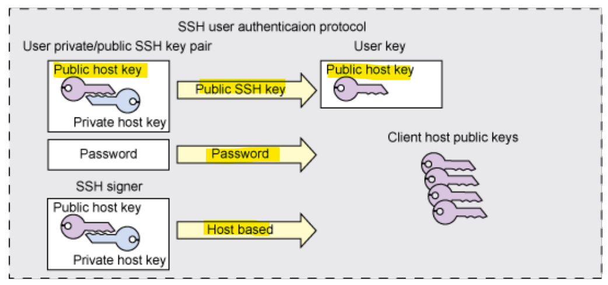

# Network - App Layer: SSH

[Back](../../index.md)

- [Network - App Layer: SSH](#network---app-layer-ssh)
  - [SSH](#ssh)
    - [General Operation](#general-operation)

---

## SSH

- Securing data that flows between a client and a server.
- Work on `TCP` over port `22`.

- **Enhancements**
- `SSHv2`
  - Stronger **integrity check** using message authentication codes
  - `Diffie-Hellman` key exchange
  - Removes the need for a server key
- SSHv2 on Cisco IOS
  - Use the command “`ip ssh version 2`” to use only SSHv2 on a Cisco IOS device
  - By default both SSHv1 and SSHv2 are used (SSHv1.99)
  - Use the command “`show ip ssh`” to display ssh information

### General Operation

- When a client connects to a server, it needs to be **verified** so the transaction can be considered secured.
- A **exchange** of cryptographic **key** is performed to authenticate the client.
  - SSH uses **asymmetric** encryption keys
- After the server successfully **authenticate** the client, a **tunneled connection** is established.
- SSH provides an **encrypted file transfer** between the client and server.

---

- Ssh

  - 22/tcp

- SSHv2
  - integrity check
  - asymmetric
