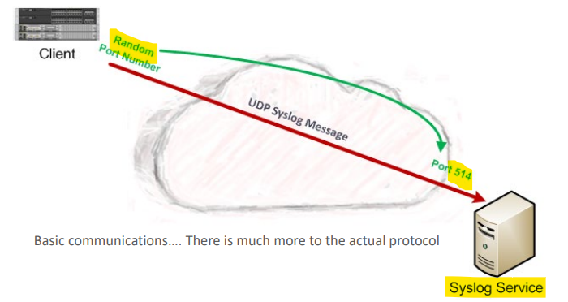
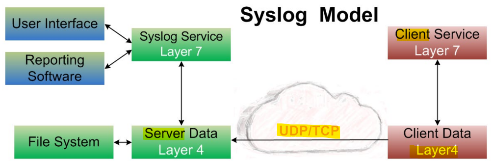
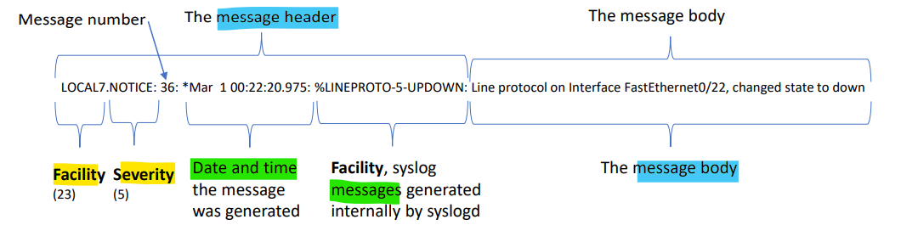
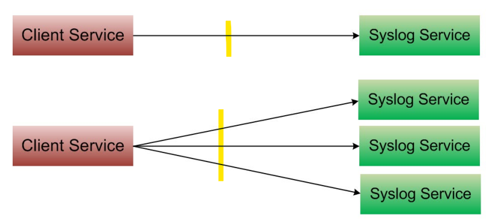
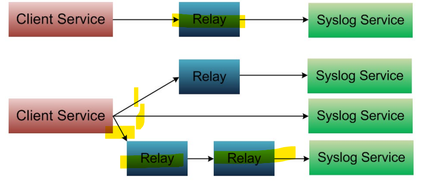

# Network - App Layer: Syslog

[Back](../../index.md)

- [Network - App Layer: Syslog](#network---app-layer-syslog)
  - [Syslog](#syslog)
    - [Model](#model)
    - [Message components](#message-components)
    - [Logging](#logging)
    - [Network protocol](#network-protocol)
    - [Kiwi Syslog tool](#kiwi-syslog-tool)
  - [Summary](#summary)

---

## Syslog

- `Syslog`
  - a standardized protocol that allows systems to **send log messages** to a **central location** for storage and analysis
- It allows **separation** of function for the software
  - that **generates** messages,
  - the system that **stores** them,
  - and the software that **reports and analyzes** them
- Each message is labeled with a **facility code**, indicating the **software type** generating the message, and assigned a **severity label**
- A wide variety of **devices**, such as
  - Printers, Routers, Switches, Servers, Firewalls, ect...
  - across many **platforms** use the syslog standard.

- This permits the **consolidation of logging data** from **different types of systems** in a **central repository**
  - Implementations of syslog exist for many operating systems.
- Normally a `UDP` protocol on port `514` (default)
  - Can be a `TCP` protocol on port `514` (See “Network protocol” section below)
  - Can be a `TLS` over `TCP` protocol on port `6514` (default)
- Some tools will also receive `SNMP` traps on ports `162` (IPv4) and `163` (IPv6) (defaults)

---

- `Client (sender)`
  - Where the message is generated
- `Service (receiver)`
  - Where the message is sent / recorded / added to a Database
- `User GUI / Analyzer`
  - Can be run on the same system with the service or can be run on other systems (client server app)
  - GUI for configuration
  - Analyzer for monitoring and reporting

---

### Model

- `Client`
  - usually is **part of the OS**, but can be an application that is added on at a later time
  - Generates the messages
- `Server/Service (Receiver)`
  - can be part of the OS, but is usually a application added to a system
  - Receives and stores the messages
- `User Interface`
  - For configuration
- `Reporting software`
  - For analyzing and generating reports
  - For analyzing and generating **near real time** alerting

---

### Message components

- The information provided by the originator of a syslog message includes the **facility code** and the **severity level**
- The **syslog software** adds information to the information **header** before passing the entry to the syslog receiver.

  - Such components include an **originator process ID**, a **timestamp**, and the **hostname** or **IP address** of the device.

- `Facility Code`
  - used to specify the **type of program** that is logging the message.
  - Messages with **different** facilities may be **handled differently**.
  - The list of facilities available is defined by the standard
- The **mapping** between facility code and keyword is **not uniform** between **operating systems** and different syslog **implementations**

- `severity levels`
  - The meaning of severity levels other than **Emergency** and **Debug** are relative to the application.

---

- **Syslog message size limits** are dictated by the **syslog transport mapping** in use.
  - There is **no upper limit** per se.
- Each **transport mapping** defines the `minimum maximum`
  - the `minimum maximum` MUST be **at least** **480 octets** in length
- Any receiver MUST be able to accept messages of **up to** and including **480 octets** in length
- All transport receiver **implementations**
  - SHOULD be **able to accept** messages of up to and including **2048 octets** in length
  - Transport receivers **MAY** receive messages **larger than 2048 octets** in length
- If a receiver, receives a message with a length **larger than it supports**
  - It **SHOULD truncate** the payload (truncation MUST occur at the end of the message)
  - Alternatively, it MAY **discard** the message

---

### Logging

- The messages may be directed to various **destinations**
  - Can some times be tuned by facility and severity

- including

  - Console
  - Files
  - Remote syslog servers
  - Or relays.

- Most implementations provide
  - **Command line** utility, often called `client/logger`,
  - As well as a link **library**, to send messages to the log
- Some implementations include **reporting** programs
  - For **filtering** and **displaying** of syslog messages.

---

### Network protocol

- When operating over a network, syslog implements a **client-server application structure** where the `server` **listens** (receives) on a well-known or registered **port** for protocol requests from `clients`.
- Historically the most common **Transport Layer protocol** for network logging has been
  - `User Datagram Protocol (UDP)`, with the server listening on port `514`.
- As UDP lacks **acknowledgment** and **congestion control mechanisms**, Some have started using `TCP` for the communications protocol, but there is **no IANA assigned or consistent** use of ports for Syslog over TCP, so most successful implementations have used `Transport Control Protocol (TCP)`, with the server listening on port `514`.
- Continuing along with this thought process, up to now all communication have been in “**Plain Text**”, so support for Transport Layer **Security** was implemented
  - `TLS` over `TCP`, with the server listening on port `6514`.

---

### Kiwi Syslog tool

- `Kiwi Syslog`
  - Is a commonly used tool
  - A free ware version for testing (Limited features)
  - A payed for version for all the reporting features
- By no means the only tool
  - Loggy
  - Syslog Watcher
  - Nagios
  - Aonaware
  - Syslog Collector
  - Zeppelin
  - …….and many more

---

## Summary

- Syslog: send log
  - facility code + severity label
  - variety of devices, platforms
- Default: 514/udp
- Can: **514/TCP**, **6514/TLS TCP**
- transport mapping: 480 octets
- Dest:
  Console
  Files
  Remote syslog servers
  Or relays.
- Tool: Kiwi Syslog tool
