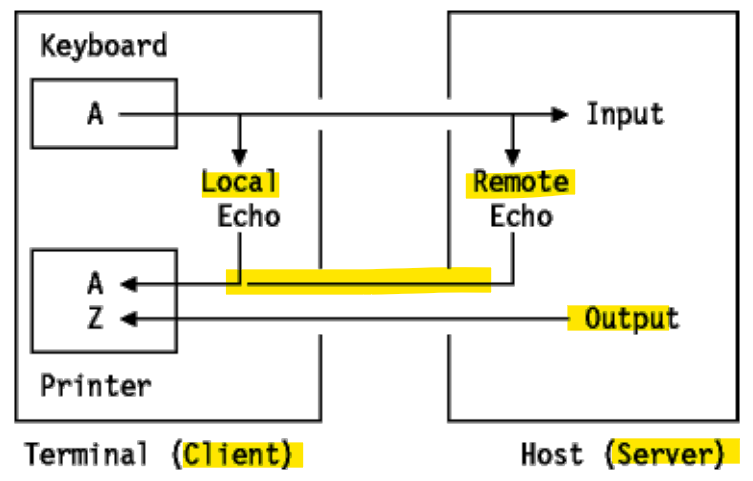
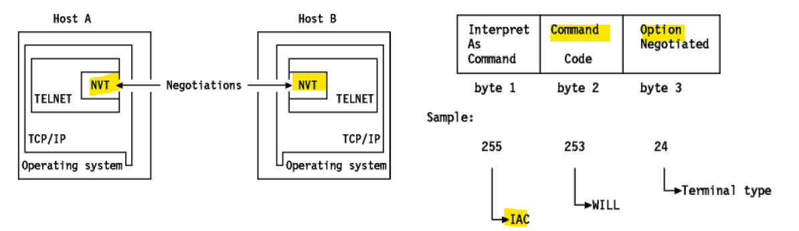

# Network - App Layer: Telnet

[Back](../../index.md)

- [Network - App Layer: Telnet](#network---app-layer-telnet)
  - [Telnet](#telnet)
    - [How it works](#how-it-works)
    - [NVT](#nvt)
  - [Summary](#summary)

## Telnet

- `Telnet`

  - allows a user at one site to **establish a `TCP` connection** to a login server or terminal server at another site.

- Port: `23`

- **No security** options are available with Telnet
- All communications are transferred in clear text
- It is safer to use protocol which allow encryption like SSH

### How it works

- A connection is established between the client and the server
  - `telnet <ip-addresss>`
- The **client** program **accepts keystrokes** from the user and **relays** them, generally **one character at a time**, to the TELNET **server**/service.
- The **server** on the destination machine **accepts the characters** sent to it by the client, and passes them to a terminal server.

---

### NVT

- The `Network Virtual Terminal (NVT)` has a “Display" (and /or “printer”) and a "**keyboard”**

  - The keyboard produces outgoing data, which is sent over the TELNET connection. The printer receives the incoming data.

- The basic **characteristics** of an `NVT`, unless they are modified by mutually agreed options are:

  - The data representation is **7-bit ASCII** transmitted in **8-bit bytes**
  - The NVT is a **half-duplex** device operating in a **line-buffered mode**
  - The NVT provides a local echo function
  - All of these may be negotiated by the two hosts.

- Negotiations occurs between the 2 `NVT`.
  - Additional options can be negotiated to extend the capabilities of the NVT to reflect more accurately the capabilities of the real hardware in use.
- Commands start with a special character called the `Interpret as Command escape character (IAC)`.
  - The **IAC** code is `255`
  - If IAC is followed by any other code - the TELNET layer interprets this as a command
- Background commands (not accessible by users)
- 2 to 3bytes sequences.
  - If this command deals with option negotiation, the command will have a third byte to show the code for the referenced option.

---

## Summary

- Telnet
  - 23/tcp
  - No secure
  - Keystroke replay per character
- Network Virtual Terminal (NVT)
- a Display
