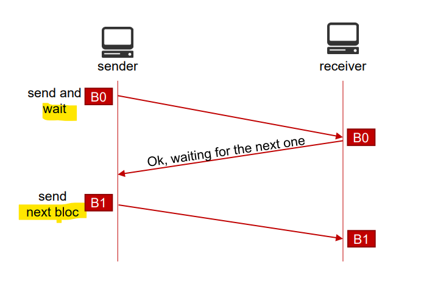

# Network - Fundamental

[Back](../index.md)

- [Network - Fundamental](#network---fundamental)
  - [Protocol](#protocol)
    - [Integrity Control](#integrity-control)
      - [Error Detection](#error-detection)
    - [Exchange Control](#exchange-control)
    - [Flow Control](#flow-control)
  - [Signaling](#signaling)
  - [Measure the efficiency of a protocol](#measure-the-efficiency-of-a-protocol)
  - [Standards](#standards)
    - [Network Protocols](#network-protocols)
    - [Organizations Defining Network Protocols](#organizations-defining-network-protocols)
  - [Troubleshoot: Physical Layer](#troubleshoot-physical-layer)
    - [Wired Network](#wired-network)
    - [Wireless](#wireless)
  - [Troubleshoot: Data Link](#troubleshoot-data-link)
  - [Troubleshoot: Network (IP) Layer](#troubleshoot-network-ip-layer)
  - [Summary](#summary)

---

## Protocol

- `Protocol`

  - A set of **rules governing the exchange** or transmission of data between devices

- Roles of a protocol
  - While data is being exchanged over a network, the transfer protocol must:
    - Ensure that data **blocks** are being **delimited**;
    - Ensure the **integrity control** of the received data;
    - Ensure the **organization** and control of the exchange.
- We distinguish 2 main types of network protoc ols:
  - `Connection-oriented protocols`. (TCP)
  - `Connectionless protocols`. (UDP)

---

### Integrity Control

- Check if the data has not been **altered** during the transmission.

  - Data can be altered **by human**.
    - **Attacks** (man-in-the-middle,…)
  - Data can be altered by **physics**.
    - Electromagnetic **radiation**.
    - **Noise**
    - Bit **synchronization**.

- `Bit Error Rate (BER)`.
  - Ratio of **errors** bits to **total** bits received.
  - **High** BER = **lots** of interference on the transmission link

---

#### Error Detection

- Multiple **error detections techniques** exists:

  - **Repetition code**:
    - the data is **transmitted twice**, if both sequences don’t match on the receiver end, the sequence is retransmitted.
  - **Parity Check**:奇偶检验
    - a **parity (even or odd)** is set between the sender and receiver.
    - The number of **“1” is counted by the receiver** and compared to the parity set.
  - **Checksums**:校验和
    - the **sender** **calculate the checksum** (using algorithm) of the data and transmits the checksum along the data.
    - The **receiver** calculate the checksum from the data received and **compare it to the checksum** received from sender.
  - **Cyclic Redundancy Check (CRC):**

    - **Binary division** of the data sent and calculation of the **remainder** (or CRC).
    - The **remainder** is added to the data bits before transmission (Actual data + remainder = codewords).
    - codewords = Actual Data + CRC

---

- Error correction can be done in 2 ways.
  - `Backward Error Correction`
    - When the receiver detects an error, it requests a **retransmission**.
  - `Forward Error Correction`
    - When the receiver detects an error, it **executes error-correcting code** to try to recover some of the error.
    - Sparse Codes.
    - **Horizontal** and **vertical** parity check.
    - Hamming code.
    - Reed-Solomon Code.

---

### Exchange Control

- Use of `acknowledgment (ACK)`
- **Receiver** `ACKnowledgment` of the data and the **next** packet is sent.

- **No** `ACKnowledgment` of the data, there is a **time out** and a **re-transmission** of the data.

---

- Use of counters to avoid data duplication
  - `Seq` and, `Ack` **Numbers**.
  - Keep **track of the order** of the packets.
  - Uses the **amount** o data sent to help with the checking that correct data has been received

---

### Flow Control

- Adaptive 自适应 flow of data according to the **receiver capabilities**.
  - The sender doesn’t send more data than what the receiver can accept.

---

- The capacity of data sent can **dynamically be adjusted** using `windows`
  - The receiver **informs** the sender about **its receiving capabilities**
  - The sender **adjusts the amount** of data that it sends

---

## Signaling

- `Signaling`
  - Used to manage and **control a transmission**
    - `In-band signaling`
      - Using the **same** channel used to transfer the actual data
      - Signaling information are usually sent using **same sequence format**.
    - `Out-band signaling`
      - The signaling information is sent using **another** channel
        - 1 channel is used to send data
        - 1 channel is used for signaling

---

## Measure the efficiency of a protocol

- `Overhead`:
  - data transmitted that is **not actual** data.
  - The **less** overhead a protocol has, the **more** efficient it is

---

## Standards

- Why do we need standards
  - **Interoperability** 互操作性 between devices from **different vendors**.
  - Provide a **guidance** and **simplifies** product **development**.
  - Ensure that the protocol is **secured**.
  - Make it **easier to compare** products/devices.

---

### Network Protocols

- Most network protocols are defined by **formal standards**.
  - Developed by an **official standard organization** or **government** body.
    - Example: `Ethernet IEEE 802.3`, IP, TCP, HTTP, OSPF, RIP.
  - Can be used by **different vendors** as long as they respect the standards (Ensure interoperability).
- Some network protocols are **proprietary**.
  - Developed by **a specific vendor**.
    - Example: Cisco’s IGRP, and EIGRP, or IBM’s SNA, SAA.
  - Can **only** be used by this specific vendor’s products.

---

- Life Cycle
  - **Draft**
    - The protocol is **submitted** to a group of engineer **for validation**.
  - **Standard**
    - The protocol has been **approved** and is **published** as a standard.
  - **Amendment**
    - Some features are **added** to the standard.

---

### Organizations Defining Network Protocols

- `Internet Engineering Task Force (IETF)`

  - Open community of engineers working on the evolution of Internet.
  - Issues Request For Comments (RFC) to publish standards related to the a protocol.

- `Institute of Electrical and Electronics Engineers (IEEE)`
  - Professional society developing standards.
  - Known for its standards for LANs.

---

## Troubleshoot: Physical Layer

### Wired Network

- Medium

  - Ethernet Cable
  - Fiber Cable
  - HDMI Cable
  - Token Ring Cable
  - Ethernet over Power Line / Mains
  - ATM / MPLS / HDLC / Sonet, Interconnects

- Common Issue
  - Broken cable
    - Stepped on
    - Rolled over
    - Caught in doors
  - Broken clips
  - Not pushed into devices fully
  - Odd connections
  - Idiot lights
    - On
    - Off
    - Flashing
  - Ethernet over mains, all on the same powerline phase
  - External providers, devices working?
- Troubleshoot:

  - Use testers on cables
  - Diagnostics tools (ping, Telnet, ect)

---

### Wireless

- Medium

  - 802.11 Wireless
  - Bluetooth Wireless

- Troubleshoot:
  - Bluetooth Paired?
  - Wi-Fi security setup correctly

---

## Troubleshoot: Data Link

- Harder to see the problem with out some tools
  - If not in MAC address table A broadcast is done
- Tools like `Wireshark`

---

## Troubleshoot: Network (IP) Layer

- Harder to see the problem with out some tools.
- Consists of more then item to make a connection.

  - IP Address
  - Subnet Mask
  - Default Gateway
  - DNS Server

- Get Configuration:
  - `IPconfig`/`IFconfig`
- Test Connection:
  - `Ping`
- Routing
  - `Traceroute`
    - debugging and testing routes and paths between devices
    - `-d`: NOT resolve IP addresses to domain names
    - `–h` to limit the number of hopes (default is 30)
    - returns the **Min**, **Max**, and **average times** it takes to each device in the chain, this can point out slow or overloaded devices.

---

## Summary

- Integrity Control
  - Detection
    - Repetition code
    - Parity Check:奇偶检验
    - Checksums:校验和
    - Cyclic Redundancy Check (CRC):remainder
  - correction
    - **Backward** Error Correction: **retransmission**
    - **Forward** Error Correction: try to recover
- Exchange Control
  - Receiver **ACKnowledgment**
  - time out and a re-transmission
  - Seq and, Ack Numbers: **rack of the order**
  - **amount** of data, to **check error**
- Flow Control

  - Adaptive to the **receiver capabilities**.
  - **Windows**: dynamically be adjusted

- Signaling

  - control a transmission
  - In-band signaling: same channel transfering data
  - Out-band signaling: another channel

- Overhead
  - less overhead, more efficient
