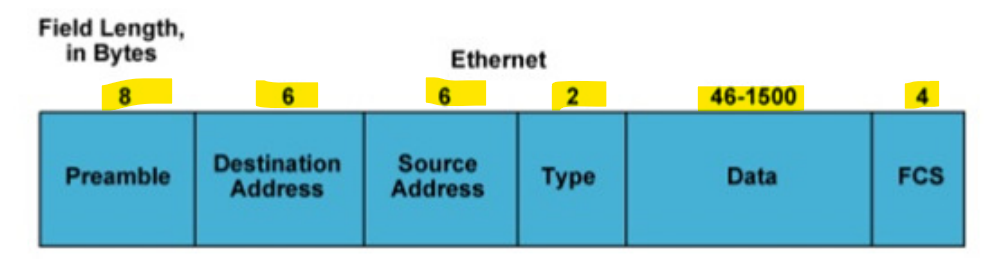
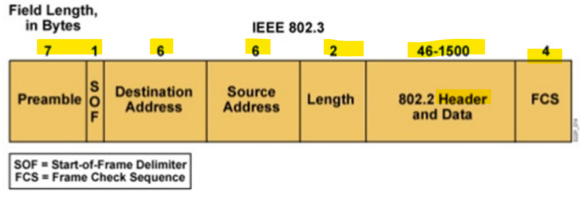

# Network - Layer 2: Ethernet & Wifi

[Back](../../index.md)

- [Network - Layer 2: Ethernet \& Wifi](#network---layer-2-ethernet--wifi)
  - [IEEE 802.3 (Ethernet)](#ieee-8023-ethernet)
    - [Access Method](#access-method)
    - [Ethernet frame](#ethernet-frame)
  - [IEEE 802.11 (Wi-Fi)](#ieee-80211-wi-fi)
    - [Access Method](#access-method-1)
    - [OSI model](#osi-model)
    - [Type of Frames](#type-of-frames)
  - [Summary](#summary)

---

## IEEE 802.3 (Ethernet)

### Access Method

- `Carrier Sense Multiple Access / Collision Detection (CSMA/CD)`

  - Collision: two or more stations **transmitting at the same time** on the medium
  - `CSMA/CD` prevents and control collision when they occur

- Method of **collision detection** has been put in place
  - Tell the other stations to **hold off** transmission until the problem is sorted
  - If a collision is detected, a **jamming signal** is sent to all stations connected to the medium so they won't send data for a random amount of time

---

### Ethernet frame

- There are several **types** of `Ethernet frames` but the most commonly used are the:

- Ethernet Type II

- IEEE 802.3

---

- Frame structure
- **Preamble**前言
  - 7 bytes sequence of 10101010
  - Used by the received to establish **bit synchronization**
- **Start Frame Delimiter (SFD)**
  - 1 byte sequence of 10101011
  - Flag indicating the **start** of a frame
- **MAC Addresses**
  - 6 bytes
  - Unique address per Network **Interface Card**
  - Frames are received by **all adapters**
  - are **dropped** if **destination** address does **not** match
- **Type (Ethernet Type II)**
  - Indicates the **upper layer protocol** used in the payload (Ex: "0x0800" for IP)
- **Length (IEEE 802.3)**

  - Indicates the **number of bytes** of data carried in the Pavload / Data

- **Data / Payload**
  - Minimum of **`64` bytes** and maximum of **1500** bytes
  - If data is < 64 bytes, padding is added
- **Frame Control Sequence**
  - Uses a CRC-32 polynomial code
  - If **error** is detected, the frame is **dropped**

---

## IEEE 802.11 (Wi-Fi)

### Access Method

- **Radio Frequency** is the **medium** used for `802.11` communications

- `Half Duplex` communications

  - **Only 1** station **can transmit** at a time
  - No way to know if another station is about to transmit
  - No way to know if a collision occurred

- `Carrier Sense Multiple Access / Collision Detection (CSMA/CD)`
  - Avoid collision making sure that the **medium is free before transmitting**
  - 3 methods are used before accessing the medium
    - **Network Allocation Vector**
    - and **Back-off timer**
    - **Clear Channel Assessment**

---

### OSI model

- Layer 1 PPDU Frame

  - `PPDU`
    - `PLCP Protocol Data Unit`
    - Layer 1 frame
    - Composed of a **Preamble**, a **header** and a **PSDU** (payload)

- Layer 2 MPDU
  - `MPDU`
    - `MAC Protocol Data Unit`
    - Layer 2 frame
    - Composed of a **header**, a **MSDU (payload)** and a **Frame Check Sequence**

---

### Type of Frames

- **Management Frames (Type = 0)**

  - Used to **manage** the Wi-Fi network (**Connections**, **disconnections**, **broadcast** ...)
  - Management MPDU does **not** carry any MSDU
  - Management frames are **not encrypted**

- **Control Frames (Type = 1)**
  - Used to **control** the **medium access** and data **transmission**
  - Control frames do not have any payload and are not encrypted
- **Data Frames (Type = 2)**
  - Used to **carry data**
  - Can have a **encrypted** MSDU (payload)

---

## Summary

- **IEEE 802.3 (Ethernet)**

  - Access
    - `CSMA/CD` prevents and control collision
    - `Frame`: logical groups of information
    - Type of Frame
      - **Ethernet Type II**
      - **IEEE 802.3**
  - Frame structure
    - `Start Frame Delimiter (SFD)`:
      - IEEE 802.3
      - Flag indicating the **start**, 1byte
    - `MAC Addresses`: 6 bytes
    - `Data/payload`: 64-**1500**
    - `Frame Control Sequence: FCS`: 4 bytes

- **IEEE 802.11 (Wi-Fi)**
  - Access Method
    - Radio Frequency
    - Half Duplex: Only 1 station can transmit at a tim
    - (CSMA/CD): Avoid collision
