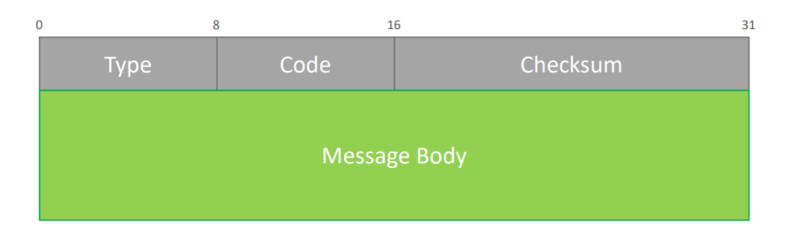
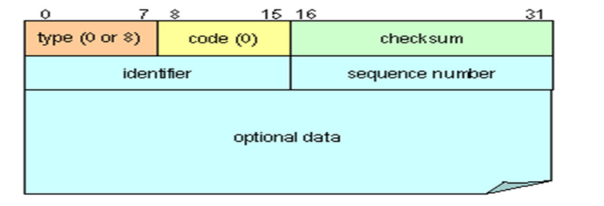

# Network - Lay3: ICMP

[Back](../../index.md)

- [Network - Lay3: ICMP](#network---lay3-icmp)
  - [Internet Control Message Protocol](#internet-control-message-protocol)
    - [Message Format](#message-format)
    - [Echo Request/Reply Message - 8/0](#echo-requestreply-message---80)
      - [Destination Unreachable Message - 6](#destination-unreachable-message---6)
      - [Time Exceeded Message - 11](#time-exceeded-message---11)
  - [Summary](#summary)

---

## Internet Control Message Protocol

- The `Internet Control Message Protocol (ICMP)` was created at the **same time** as the `Internet Protocol (IP)`
- Why was ICMP created?
  - Since `IP` uses a **connectionless**, **unreliable** and **unacknowledged** method to deliver datagram, a protocol was needed to assist in case of problems
- What is the main responsibility of ICMP
  - Provides support to IP in the form of ICMP message allowing different type of **communication to occur between IP devices**
- ICMP is a **layer 3** protocol encapsulated in IP datagrams

---

### Message Format

- ICMP **header** is `32 bits` long (`4 bytes`)
- ICMP message is encapsulated into a IP datagram

- Each ICMP message has a **Type**
  - Defined in the **header** by a `8-bit` field
  - A separate set of type values is maintained for each ICMPv4 and ICMPv6
- Each ICMP message has a **Code**
  - Identifies the "**subtype**" of message within each IMCP message Type value
  - General **purpose** of each kind of ICMP message

---

### Echo Request/Reply Message - 8/0

- **Type**

  - Echo **request** type is `8`
  - Echo **reply** type is `0`

- **Code**

  - Is always set to **0**

- **Identifier**

  - Set in the request and echoed back in the reply to be able to keep different set of requests and replies together

- **Sequence Number**

  - Sequence number for each host. Start at 1 and gets incremented by 1 for each packet

- **Data**
  - The data fields is generally **empty**

---

#### Destination Unreachable Message - 6

- Type is always `6`
- There are 16 different codes used (from 0 to 15). Some examples bellow:
  - Code 0: Network unreachable
  - Code 1: Host unreachable
  - Code 2: Protocol unreachable
  - Code 3: Port unreachable
  - Code 4: Fragmentation needed and DF set
  - Code 5: Source route failed
  - Code 6: Destination network unknown
  - Code 7: Destination host unknown
- **Data**
  - Contains the **full IP header** and 64bits of the **original IP data datagram**

---

#### Time Exceeded Message - 11

- If the `TTL` of an IP packet reaches **0**, it must be **discarded** and an Time Exceeded ICMP message is sent back to the source
- Time Exceeded Message details
  - Type is always **11**
  - There is 2 code available
    - Code 0: TTL = 0 during transit
    - Code 1: TTL = 0 during reassembly
- Data
  - Contains the **full IP header** and 64bits of the **original IP data datagram**

---

- When is ICMP used?

- The ICMP protocol is usually used to **troubleshoot IP network connectivity**

- Applications that uses ICMP
  - `Ping`
    - Uses the "Echo request" and "Echo reply" ICMP messages
  - `Traceroute`
    - Uses the "Echo request", "ICMP Time Exceeded" and "Echo reply" ICMP messages
    - Use for `Denial of Service`
  - **Ping of death or PoD**
    - Sending millions of **oversized echo** request to a host causing it to crash
  - **Smurf attack**
    - Send a lot of ICMP echo requests to the **broadcast address** and all stations will answer with ICMP echo request bringing the station down Used for Network Scan Find out if ports are opened or closed without scanning ports
  - **Man-in-the-middle attack**
  - **ICMP Redirect**
    - Send messages to various gateway to **redirect** traffic

---

## Summary

- `ICMP`
  - **Type**:Request 8/reply 0/Unreachable 6 / TTL Exceeded 11
  - **Sequence Number**: incremented by 1 for each packet
  - **Data**:Generally empty
- Tool:
  - `Ping`
  - `traceroute`
- Attack:
  - Death of Ping: **oversized** requet
  - Smurf: broadcast address
  - Man-in-middle
  - ICMP redirect: various **gw**
