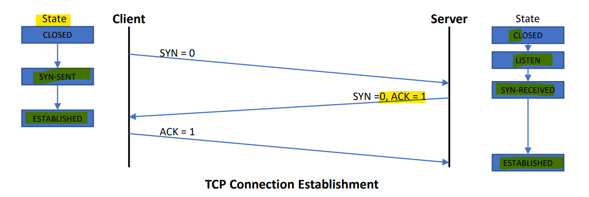

# Network - Layer4: TCP

[Back](../../index.md)

- [Network - Layer4: TCP](#network---layer4-tcp)
  - [TCP– General Presentation](#tcp-general-presentation)
    - [Basic TCP Mechanisms](#basic-tcp-mechanisms)
      - [Transport Connection](#transport-connection)
      - [Multiplexing](#multiplexing)
        - [TCP ports](#tcp-ports)
        - [State Diagram](#state-diagram)
      - [Establishment of the transport connection](#establishment-of-the-transport-connection)
        - [Connection Establishment](#connection-establishment)
        - [Connection Termination](#connection-termination)
      - [Mechanisms of Exchange Management](#mechanisms-of-exchange-management)
        - [ISN (Initial Sequence Number)](#isn-initial-sequence-number)
        - [ACK (Acknowledgment Management)](#ack-acknowledgment-management)
        - [Controlled Delay Management](#controlled-delay-management)
    - [TCP Segment](#tcp-segment)
  - [Advanced Mechanisms](#advanced-mechanisms)
    - [Error Control](#error-control)
    - [Data Retention](#data-retention)
    - [Flow Control](#flow-control)
    - [Congestion Control](#congestion-control)
  - [TCP SYN and Window Size Numbers](#tcp-syn-and-window-size-numbers)
  - [TCP vs. IP](#tcp-vs-ip)
  - [Summary](#summary)

---

## TCP– General Presentation

- `Layer 4` protocol = **transport** protocol

  - **Connection-oriented** transport protocol
  - Main features of TCP
    - **Guarantees the delivery** of data in **sequence**
    - Controls the **integrity** of the data
    - Organizes the **error recovery** process
    - Controls the **flows end to end**

- `TCP` for the `layer 4` specifications and `IP` for the `layer 3` specifications hence `TCP/IP`

---

### Basic TCP Mechanisms

- Here are the basic TCP mechanisms
  - Concept of `transport connection`
  - Concept of transport connection `multiplexing`
  - **Establishment** of the transport connection
  - Mechanism of **exchange management**

#### Transport Connection

- `transport connection`
  - is a **virtual link** between 2 **applications** over the network
- TCP identifies a transport connection using
  - Source & Destination `Port Number` (ID of the **applications**)
  - Source & Destination `IP addresses` (ID of the **systems/devices**)
  - Transport **Protocol** used (TCP in our case)

#### Multiplexing

- **One** system/device is able to handle **multiple applications**
- This means multiple transport connections
- Applications are identified using **ports numbers**

---

##### TCP ports

- Well known ports
- All ports with a number going from 0 to 1,024
- Linked to specifics applications

  - 20: FTP Data (File Transfer Protocol)
  - 21: FTP Control
  - 22: SSH
  - 23: Telnet
  - 25: SMTP (Simple Mail Transport Protocol)
  - 80: HTTP (Hypertext Transfer Protocol)
  - 123: NTP (Network Time Protocol)
  - 443: HTTPS (HTTP over TLS/SSL)

- **Registered** ports

  - Used because the 1,024 well known ports were fully assigned
  - Assigned by `IANA` for **specific services/applications**
  - Registered port numbers ranges from `1,024 `to `49,151`

- **Dynamic** ports
  - Port **allocated dynamically** to the **source** of the TCP connection **to identify the client side** of the connection
  - Dynamic port numbers ranges from `49,152` to `65,535`

---

##### State Diagram

- The State Diagram is the “life stages” of a TCP connection
- Stations will go through different states to establish the connection and to end the connection

---

#### Establishment of the transport connection

##### Connection Establishment

- TCP three-step handshake (also maybe know as a 3-way-handsake)
  - Client state:
    - closed > SYN-SENT > ESTABLISHED(ack=1)
  - Server state:
    - CLOSED > LISTEN > SYN-RECEIVED(syn=0) > ESTABLISHED

##### Connection Termination

- Client state:
  - ESTABLISHED > FIN-WAIT-1 (FIN=0 sent) > FIN-WAIT-2(ACK=1 recieved) > TIME-WAIT (ACK=1 recieved) > CLOSED
- Server state:
  - ESTABLISHED > CLOSE-WAIT (FIN=0 recieved) > LAST-ACK (ACK=1 send) > CLOSED

---

#### Mechanisms of Exchange Management

- `Initial Sequence Number`
  - **Identify** each TCP **segment**
- **Acknowledgement** Management
  - Possibility of sending ACK along with Data in the **same** TCP **segment**
- Controlled **Delay** Management
  - Dynamic **adjustment** of the RTO

---

##### ISN (Initial Sequence Number)

- `ISN (Initial Sequence Number)`
  - The ISN number **identify** a **connection** (`32 bits` long)
  - Within a connection, each **segment** is identified using the **Offset field** (4 bits long)
    - ISN is used to **separate each connections** so there is no conflict

##### ACK (Acknowledgment Management)

- The management of ACK is **optimized** on TCP
  - ACK can be **delayed** in order to be send **within a TCP data segment**
  - This **delay** is usually between **200ms to 500ms**
- TCP acknowledge **only data received correctly**
  - If **delays** occurs, TCP ask for the **retransmission** of the sequence
  - The “Fast retransmit” mechanism allow to retransmit delayed sequence faster

##### Controlled Delay Management

- The `Retransmission Time Out (RTO)` is used by protocol to **evaluate** when to **ask for retransmission**
- TCP uses a **dynamic** RTO in order to adapt to any type of under layer networks used
- RTO is calculated using a specific algorithm taking into consideration the `Round Trip Time (RTT)`
- TCP uses dynamic RTO to make the protocol as efficient as possible regardless of what under layer protocol is used

---

### TCP Segment

- **Source Port**
  - The source port number (**16 bits**)
- **Destination Port**
  - The destination port number (**16 bits**)
- **Sequence Number**
  - Initial and random number. The Initial Sequence Number (ISN) is calculated for each systems at the establishment of the connection. The sequence number of the first data octet in this segment. (32 bits)
- **Acknowledgment Number**
  - Indicate the number of the **next expected sequence number** (32 bits)
- **Header Length**
  - The number of 32 bit works in the TCP header.
  - Indicates where the **data begins**
- **Unused**
  - 6 bits reserved for future used (must be 0)

---

- **Control Bits** (1bit each, total of 6 bits)
  - **URG**: Urgent pointer field significant
  - **ACK**: Acknowledgment field significant
  - **PSH**: Push Function
  - **Ask**: the sender to send the data already ready to be sent
  - **RST**: Reset the connection following an unexpected behavior on the network
  - **SYN**: **Synchronize sequence number**
  - **FIN**: **No more data** from sender
- **Receive Window**
  - The number of octet which the **sender** is willing to **accept** (16 bits)
  - This window can change throughout a TCP connection according to the capacity of the receiver (flow control)
- **Internet Checksum**
  - Checksum calculated from the full TCP sequence **including the header** (16 bits)
- **Urgent Data Pointer**
  - Point to the last urgent octet of the data field (16 bits)
  - Data treated in priority by the receiver
- **Options**
  - Variable length
  - Padding is added if necessary

---

## Advanced Mechanisms

- Error Control
- Data retention
- Flow Control
- Congestion Control

---

### Error Control

- **Goals**
  - Make sure that data has **not been altered** while being transferred (Maintain Integrity)
  - Make sure that the data is sent to the **right destination**
- How does it work
  - TCP **adds a pseudo-header** containing IP information (IP destination address, IP source address...)
  - **Checksum** is calculated including these information before sending the TCP sequence
  - The **receiver** does the same calculation using its IP address

---

### Data Retention

- To optimized the transmission, TCP waits for the **buffer to be full** before transmitting

- **Segments** are being **transmitted** once:
  - The **buffer** become **full**
  - The **PUSH** field is set to **1**
- This reduces **overhead** and make the protocol more **efficient**

---

### Flow Control

- **Definition**
  - Control the sender **emission rate** according to the receiver’s receiving **capacity**
- **Usage of dynamic windows**
  - The **size of the window** (**amount** of data to send) is being **adjusted dynamically** all along the transmission

---

### Congestion Control

- Definition
  - Control the sender emission rate according to the **lower layer physical** network **capacity**
- Every time a **segment is lost**, TCP **reduces** the amount of data sent (by reducing its **window**)
- Communications starts with a windows of 1 and go up every new ACK received.
- The goal is to **reach the largest window possibly** handle by the lower layer physical later

---

## TCP SYN and Window Size Numbers

- Each connection **starts** with a `Sequence number (SYN)`
- The SYN is **incremented** by one in the “`SYN – SYN-ACK – ACK`” from the startup of the connection (seen in slide 7)

---

- Window sizes are set **large** to start to keep the MTUs full (full `1500` Byte MTU are more efficient)
- Window size will get larger or smaller **depending on the network conditions** between the system involved

---

- The `window` **size** determines the **number of bytes** sent **before** an acknowledgment is expected.
  - The `acknowledgement number` is the number of the **next expected byte**.

---

## TCP vs. IP

- More on IP and this comparison next week
- In the mean time…
- IP and TCP are **working together** and are designed to be complementary

| Internet Protocol | Transport Control Protocol                      |
| ----------------- | ----------------------------------------------- |
| Layer 3 Protocol  | Layer 4 Protocol                                |
| Connectionless    | Connection Oriented                             |
| No Acknowledgment | Usage of Acknowledgment                         |
| Best Effort       | Error Control, Flow Control, Congestion Control |

---

## Summary

- `Transmission Control Protocol(TCP)`
- **transport connection**

  - Virtual link between 2 manchine
  - Tcp + Ip + port

- Multiplexing
  - One device handle multiple apps/ connections
- Port

  - **Registered** ports:services/applications `1,024` to `49,151`
  - **Dynamic** ports: dynamically source `49,152` to `65,535`

- Establishment
  - Syn=0-syn=0,ack=1-ack=1
- Termination

  - Fin=0-ACK=1|Fin=0-ACK=1

- Segment
  - Port
  - Sequence Number
  - Acknowledgment Number
  - Control Bits
    - ACK: Acknowledgment
    - SYN: Synchronize sequence number
    - FIN: No more data from sender
- Advanced
  - Error Control
    - Maintain Integrity+right destination
    - adds a pseudo-header + Checksum
  - Data Retention
    - waits for the buffer to be full
    - reduces overhead,more efficient
  - Flow Control
    - Usage of dynamic windows
  - Congestion Control
    - according to the lower layer
    - reach the largest window possibly
